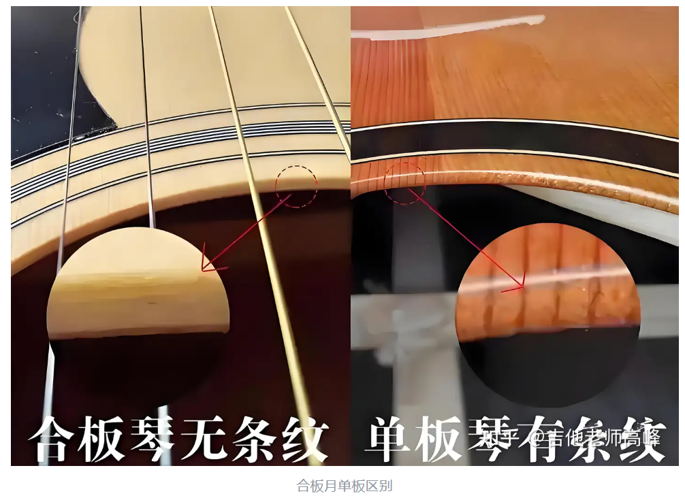
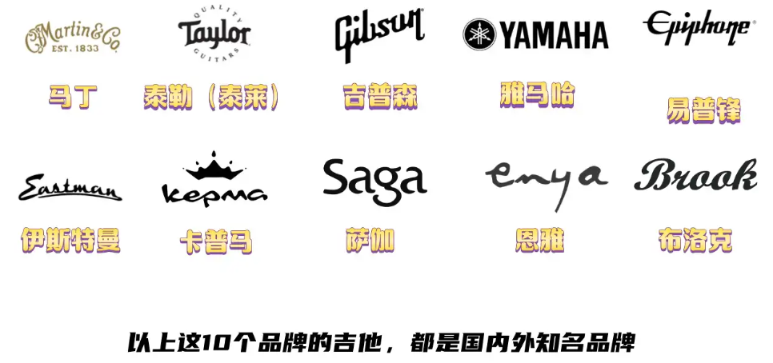

- [吉他的分类](#吉他的分类)
  - [原声吉他（民谣吉他）](#原声吉他民谣吉他)
  - [电吉他](#电吉他)
  - [古典吉他](#古典吉他)
- [吉他的桶型和尺寸](#吉他的桶型和尺寸)
  - [桶型](#桶型)
    - [D](#d)
    - [DC](#dc)
    - [GA](#ga)
    - [OM](#om)
    - [SJ](#sj)
  - [尺寸](#尺寸)
- [吉他木材](#吉他木材)
  - [面板材料](#面板材料)
    - [云杉](#云杉)
      - [西提卡](#西提卡)
      - [阿迪朗达克](#阿迪朗达克)
      - [英格曼](#英格曼)
      - [欧洲云杉/德国云杉](#欧洲云杉德国云杉)
    - [桃花芯](#桃花芯)
    - [相思木](#相思木)
  - [背侧板材料](#背侧板材料)
    - [玫瑰木](#玫瑰木)
      - [巴西玫瑰木](#巴西玫瑰木)
      - [马达加斯加玫瑰木 和 可可波罗玫瑰木](#马达加斯加玫瑰木-和-可可波罗玫瑰木)
      - [印度玫瑰木](#印度玫瑰木)
    - [虎纹枫木](#虎纹枫木)
    - [市面上的搭配](#市面上的搭配)
  - [等级分类](#等级分类)
    - [合板](#合板)
    - [面单](#面单)
    - [全单](#全单)
    - [合板和实木板具体区别](#合板和实木板具体区别)
- [电箱吉他](#电箱吉他)
- [产地](#产地)
  - [产地和价格的联系](#产地和价格的联系)
- [价格](#价格)
  - [1000 单板吉他](#1000-单板吉他)
    - [1001 卡普马 F0B](#1001-卡普马-f0b)
    - [860 恩雅 X1ProMax](#860-恩雅-x1promax)
    - [894 布洛克 v12](#894-布洛克-v12)
    - [828 SAGA SF700](#828-saga-sf700)
    - [878 SAGA SF700 Pro](#878-saga-sf700-pro)
  - [1500 单板吉他](#1500-单板吉他)
    - [1198 伊瑞斯星月](#1198-伊瑞斯星月)
    - [1240 SAGA SF 830](#1240-saga-sf-830)
    - [1250 布洛克 S25](#1250-布洛克-s25)
    - [1426 楚门 150](#1426-楚门-150)
    - [1599 卡普马 F0Pro](#1599-卡普马-f0pro)
    - [1337 泰玛 TG5pro](#1337-泰玛-tg5pro)
    - [1518 麦杰克 繁星变色龙](#1518-麦杰克-繁星变色龙)
    - [1623 麦杰克茉莉 C1](#1623-麦杰克茉莉-c1)
  - [2200 不一定单板](#2200-不一定单板)
    - [1630 ENYA 恩雅 V1](#1630-enya-恩雅-v1)
    - [1574 雅马哈 FG 800](#1574-雅马哈-fg-800)
    - [2064 楚门 280](#2064-楚门-280)
    - [1925 卡普马 F1](#1925-卡普马-f1)
- [大品牌 + 手感好](#大品牌--手感好)
- [购买渠道](#购买渠道)
  - [线上](#线上)
  - [线下](#线下)
- [初学推荐](#初学推荐)

# 吉他的分类

吉他分为原声吉他（民谣吉他）、电吉他和古典吉他

初学者一般都是从 原声吉他 开始

## 原声吉他（民谣吉他）

在国内为什么很多人喜欢叫民谣吉他，主要是因为吉他这种西洋乐器在传入中国后，最早期的一批吉他爱好者们接触到的大多数是用吉他来演奏一些民谣歌曲，所以就叫他民谣吉他。

## 电吉他

再介绍一下电吉他，它和民谣吉他的区别，简单来说就是箱体没有共鸣腔，声音依赖琴体上的拾音器，通过导线连接到音箱才能发出电吉他的声音。

## 古典吉他

古典吉他和原声吉他外观上的区别主要是镂空的琴头，采用的是尼龙的琴弦以及更宽的指板。

# 吉他的桶型和尺寸

## 桶型

我们最常见的吉他桶型分别是 D 桶型、GA 桶型和 OM 桶型 这三个

D 桶型吉他最具有代表性的是马丁的 D28
GA 桶型吉他最具有代表性的是泰勒的 914
OM 桶型吉他最具有代表性的是马丁的 OM28

D 桶型圆角和缺角：新手不需要计较，看哪个外观舒服就哪个，音色真的就一丁点区别，完全可以忽略。比较推荐选缺角，后期弹奏高把位方便一点
GA 筒一般是和缺角一起出现的。例如：泰勒的 914CE 中的 C，代表的就是缺角 Cut way 的意思。

- D 桶型偏向于弹唱，扫弦音色好听，指弹独奏分解音色不如 GA 桶型，女生，建议身高 I65 以上，才选 D 桶型，男生 l60 开始可选 D 桶型
- GA 桶型偏同于指弹独奏，指弹独奏分解好听，扫弦音色不如 D 桶型，中间腰身比 D 桶型小，整体显小，女生用，抱着不显大
- OM 桶型和 A 桶型：40 寸的音色共鸣不如 41 寸，会有一些压缩，但不会非常多。A 桶型，是偏小的 40 寸，说它是 39 寸也可以，身高 l52~l58 选它抱着很舒服

### D

D 桶型的高频、中频、低频，三频比较均衡，适合弹奏的音乐风格也更丰富一些

### DC

相对于 D 桶型，增加了 缺角（Cutaway）

### GA

GA 桶型除了缺角以外，共鸣箱的箱体也会比 D 桶型薄一点，所以低频会弱一些，中高频呢就比较清晰，玩指弹的琴友会更喜欢

### OM

OM 桶型的高频会更突出，一般会用来演奏 blues 风格的音乐

### SJ

Jumbo 和 Small Jumbo

因为共鸣腔更大，共振更好，低频下潜更深，就像个低音炮一样，所以更适合扫弦弹唱

## 尺寸

在我们日常选购吉他时，最常见的吉他尺寸有三种，分别是：36 英寸（93cm）、40 英寸 (100cm)、41 英寸 (104cm)

如果追求音色：
125cm~152cm: 选 36 寸
152cm~160cm: 选 40 寸 A 桶型或者 0M 桶型
160cm~165cm: 女生选 41 寸 GA 桶型，男生 D 和 GA 都行
165cm~190cm: 41 寸随便选

●如果追求舒适度：
l25cm~152cm: 选 36 寸
l52cm~158cm: 女生选 40 寸 A 桶型
l56cm~l65cm: 女生选 40 寸 0M 桶型
l60cm~l65cm: 女生选 40 寸 0M 或者 A 桶型（次选），男生可选 41 寸
l65cm~l90cm: 41 寸随便选

新手入门，舒适度优先，可以先舍弃一点点音色，以后换琴再选大尺寸。

尺寸只要不是大非常多，弹几天，都是会适应的，并不是什么问题

# 吉他木材

吉他按照木材等级来划分，主要分为合板吉他、面单吉他、全单吉他。

合板吉他最便宜，面单其次，全单吉他最贵。

## 面板材料

吉他的面板材料主要分为云杉、桃花芯、相思木和红松。

红松木材的吉他主要用于古典吉他，这里我就不多介绍了。主要跟大家介绍云杉、桃花芯和相思木。

### 云杉

我们从云杉开始介绍，云杉是所有具备声学价值木材中使用量最大且最广泛的。无论是钢琴的硬板小提琴或是吉他的面板基本都是使用云杉木作为首选。

而云杉家族中又有上百种不同品种的云杉，除去被国家保护的珍稀动植物级别的，且具备声学价值云杉品种大概还剩下十几种，比较常见的云杉木有有阿迪朗达克云杉、德国云杉、西提卡云杉、瑞士云杉、英格曼云杉等等。

#### 西提卡

我们平时说的云杉木默认的一般就是西提卡云杉，这个世界上绝大多数的经典吉他，大多都是使用西提卡云杉来制作的。比较均衡，都可以弹。

#### 阿迪朗达克

产地在美国纽约东北部的阿迪朗达克山脉，禁止砍伐！只有因为天灾自然倒下的才能买卖拍卖，也因此它的价格非常昂贵，目前只会用在各大品牌的顶级琴限量琴上

#### 英格曼

和西提卡云杉的产地差不多，西提卡偏硬偏脆，英格曼偏软一点

适合温柔的曲子，不适合强力扫弦

#### 欧洲云杉/德国云杉

高端手工吉他才会使用

声音通透，越弾越亮，可塑性强

### 桃花芯

桃花心木面板的吉他往往背侧板也同样是桃花芯木，我们一般简称全桃花芯木吉他。

全桃花芯木吉他，相对于云杉做面板的吉他算是主流中的非主流了，最具代表性的就是马丁的 15 系列吉他

### 相思木

下面再来介绍一下相思木面板吉他，用作吉他的相思木往往都是精选带有丰富影纹的木料相思木的吉他相对比较贵，因为需要挑选相思木中相对华丽的部分，物以稀为贵。

感觉相思木吉他的音色取向与桃花芯木比较相似，但是它的音色远不如它的外表来的华丽，哪怕我每天不弹，看着它的华丽外表，也会让人赏心悦目。

面板采用相思木材料的吉他，往往背侧板也同样是相思木。

## 背侧板材料

介绍完吉他面板材料后，我再来介绍一下吉他的背侧板。吉他背侧板材料主要分为玫瑰木、枫木、相思木、桃花芯木。

在吉他制作中与云杉木吉地位相同的玫瑰木是作为背侧板的主流木材。玫瑰木也分为很多种，有巴西玫瑰木、马达加斯加玫瑰木、可可菠萝玫瑰木、桑托斯玫瑰木、印度玫瑰木*等。

### 玫瑰木

我们今天主要介绍的是吉他里使用量最大的印度玫瑰木，现在国内外有很多的吉他品牌他们各自产品线中的标杆产品，绝大多数都是西提卡云杉木+印度玫瑰木的配置。

例如：“马丁的 D28、D45、泰勒的 414、914”等等都采用云杉木+印度玫瑰木的配置。

#### 巴西玫瑰木

公认的顶级背侧板材料，共振非常强

但是由于过度采伐，巴西玫瑰木呢已经成为濒危物种，已经被禁止开采，并且禁运禁止交易，也因此价格非常昂贵，极具收藏价值

所以一把全新的阿迪朗达克云杉面板加上巴西玫瑰木背侧版的吉他，价格都是六位数起步，二手的老琴价格也都接近于10万

#### 马达加斯加玫瑰木 和 可可波罗玫瑰木

也都是濒危物种，用在高端和限量上

#### 印度玫瑰木

亲民材料，是高端之下第一名，其次桃花芯，再次沙比利

### 虎纹枫木

虎纹枫木背侧板在吉普森吉他用得比较多，他的标杆产品就是主打的全虎纹枫木配置。比如：吉普森 SJ200 采用的就是云杉木+枫木的配置。

枫木背侧板的吉他音色明亮、干净、通透，适合演奏抒情、流行等类型的音乐。它的声音富有回响，能够在弹奏时清晰地反馈每个音符的细节和差别。

枫木吉他的音色特点就是中高音非常突出，非常适合在演唱会使用。像赵雷、许巍演唱会，大多数使用的吉他都是吉普森。

### 市面上的搭配

标杆产品，绝大多数都是西提卡云杉木+印度玫瑰木的配置

很多大品牌的次旗舰产品也就中低端吉他往往都是云杉木+桃花芯的配置。

由于这些年来通货膨胀，物价上涨等原因。导致木材价格大幅上涨。所以，以进口品牌为首的很多吉他生产商，都开始用一些声学特性相似但价格更低廉的材料来作为替代。很多吉他生产商会使用古伊松木来替代印度玫瑰木，莎比利来替代桃花芯。

比如：马丁公路系列 D10E、泰勒的 GS Mini 等等

## 等级分类

主要分为合板吉他、面单吉他、全单吉他。合板吉他最便宜，面单其次，全单吉他最贵。

合板与单板怎么区分，合板吉他没有条纹，单板吉他有明显的条纹

### 合板

三合板吉他是吉他等级中最低的，也是最便宜的。这里的合板吉他代表的是胶合板也称为三合板，简单介绍一下三合板的制作过程。就是用多块薄木板使用胶水粘合在一起的吉他木板，我们称为三合板。

三合板吉他面板和背侧板都是采用三合板制作，配置最低，音色最差。

三合板吉他中比较有代表性的吉他有雅马哈的 F310、600、卡普马的 D1C。

### 面单

面单吉他是吉他等级中等，价格适中，初学者买的最多的吉他。这里的面单吉他是指面板采用一整块实木板制作，背侧板还是采用三合板制作的吉他，称为面单吉他。

面单吉他中比较有代表性的吉他有雅马哈的 FG800、SAGA700、泰勒 214 等等。

### 全单

全单吉他是吉他等级中最高的，也是最贵的。这里的全单吉他代表的是面板采用一整块实木板制作，背侧板也是实木板制作的吉他。

全单吉他中比较有代表性的吉他有雅马哈的 LL16、马丁 D45 等等。

### 合板和实木板具体区别

实木板与三合板由于生产原理不同，以至于它们的物理特性与声学特性有很大大的差别。

单板振动传递不变：单板是指一整块实木，能迅速，地将来自于弦的振动，完整地传递于共鸣箱，让我们听到原始自然沁人心脾的声音。
合板振动传递削弱：合板是由多块不同的木材压合而成，振动在多层木屑之间传递有很大程度损耗，到达共鸣箱已经大量削弱，且常伴有杂音，竞色不如单板。

# 电箱吉他

电箱吉他就是在木吉他的基础上额外加装了一个拾音器，来拾取吉他的震动并且转化为电信号，将电信号通过连接线传递到吉他音箱，通过音箱放大电信号，我们听到音响里的吉他声就是耳朵听到的吉他声。

初学者的第一把吉他，我个人建议买原声吉他就好了，没必要买电箱吉他。因为初学者刚开始学琴，肯定没有户外弹琴或者演出的需求，没必要花更多的钱买一支电箱吉他。而且拾音器是电子元件，买太便宜的容易坏，还发挥不出吉他的音色。所以，初学者不太建议买带电箱的吉他。

# 产地

吉他主要分为国产和进口，现在初学者第一支吉他应该是买国产的居多，至少我的学员我一般都是推荐他第一支练习用琴买国产的大品牌，因为性价比高，价格便宜，手感和音色都不错。

这里我们要明确一点，进口的吉他不一定就比国产的好，现在国产吉他也在崛起。所以，我个人还是建议第一把吉他以国产为主。如果你要买贵的，肯定是以美产为主。

下面我给大家介绍一下吉他的产地分布，可分为美产、国产、印尼产、墨西哥产、日产和欧洲产。如果我们只从声音品质来看，我们做个排序，美产>欧洲产与日产>墨西哥产>国产>印尼产。

## 产地和价格的联系

美产的吉他价格是最贵的，像马丁、泰勒顶级的吉他都是美产的。但也有一部分稍便宜的吉他，万把块钱的吉他是墨西哥产的。其次是欧洲产和日产的吉他，一般价格都在 1 万元以上。墨西哥产的吉他价格一般再四五千元人民币起步。国产和印尼产的吉他价格都比较便宜，从几百块钱到上万块钱的吉他都有。像雅马哈的低端产品，比如 F310、F600 都是印尼产的。

如果你预算在万元以内，我建议优先考虑国产；如果你预算在万元以上，我建议优先考虑美产。

# 价格

如果你的预算在 1000 元以内，大概只能购买大品牌的合板琴或者国产的面单琴；如果你预算在 1000 元-1500 元以内，可以买到云杉搭配沙比利或者那都木的面单琴；如果你的预算到了 1500 元左右，则可以选到云山桃花芯的入门面单；如果你的预算在 2200 元左右，可以买到工艺水准较高的桃花芯面单；预算到了 2500 元以上，则可以买到云山玫瑰木的入门面单；预算到 3800 元左右，这个价位可以买到顶级的玫瑰木面单；预算超过 4000 元，则建议可以考虑其他表面更华丽的稀有材料面单或者直接到桃花芯的全单。往往桃花芯全单的价格在 3500 元起步。预算 5000 元-5800 元之间，则可以买到国内品质最好的桃花芯全单；预算 5000 元起步，则可以买到玫瑰木全单，国产的玫瑰木全单，其实有些品牌，已经把价格抬到了 1 万五到 2 万了，个人建议是最高买到 7500 元左右，再高的话，就可以考虑稀有材料的全单了。

最后如果你的预算破万，那就直接购买泰勒、吉普森或者马丁吧。这里我就不做具体的型号推荐了，因为第一把吉他没必要买这么贵的。

低于 600 元的吉他就不要购买了，600 元是最低限了。因为一把合格的吉他从选材到制作是非常复杂的一个过程，对工艺的要求比较高，自然成本就会很高。所以，千万不要买低于 600 元的吉他。太便宜的吉他我只能说是使用家具生产线生产出来的，音准都成问题，作为摆件和玩具还可以，根本称不上吉他。

在吉他行业里有一个词就是形容劣质吉他的，被广大亲友俗称为：“烧火棍”。

面板 + 背侧 + 琴弦

## 1000 单板吉他

### 1001 卡普马 F0B

云杉木 + 桃花心木合板 + 012-053 磷铜 + 哑光

很标准的一款！

### 860 恩雅 X1ProMax

西提卡云杉木 + 玫瑰木 HPL + 美产 Elixir （伊利克斯） + 细腻哑光

美产琴弦 Elixir 很加分！低价泰勒！

### 894 布洛克 v12

A 级云杉 + 胡桃木 + 布洛克镀膜琴弦 + 哑光

比较新（3 年），销量超高！

### 828 SAGA SF700 

英格曼云杉 + 沙比利木 + 路狗镀膜琴弦 + 哑光

比较老（13 年）

### 878 SAGA SF700 Pro

云杉 + 沙比利木 + 达达里奥 XT 琴弦 + 亮光漆

## 1500 单板吉他

### 1198 伊瑞斯星月

西提卡 + 非洲桃花芯 + 伊瑞斯原装 + 高亮

终身售后

### 1240 SAGA SF 830

西提卡 + 桃花芯木 + 达达里奥 + 亮光

### 1250 布洛克 S25

陈年云杉 + 桃花芯木 + 达达里奥 XS + 亮光（柄哑光，一般都是这个设计）

### 1426 楚门 150

西提卡云杉 + 双面印度玫瑰木 + 美产达达里奥 XS + 亮光

好上手

### 1599 卡普马 F0Pro

径切希特卡云杉 + 桃花芯木 + 没找到琴弦 + 单板亮光，背板哑光

枫叶倒是挺好看，但是总感觉 卡普马的页面审美很有问题 还藏着掖着 不喜欢

### 1337 泰玛 TG5pro

西提卡云杉木 + 桃花芯木 + 达达里奥 XT + 水性漆 亮光

小巧审美好看

### 1518 麦杰克 繁星变色龙

云杉 + 桃花芯 + 达达里奥 EXP16 + 亮光

### 1623 麦杰克茉莉 C1

欧洲云杉 A + 沙比利 + 艾利克斯 + 亮

## 2200 不一定单板

### 1630 ENYA 恩雅 V1

西提卡面单 + 桃花芯背单 + 桃花芯侧合 + 达达里奥 XS + 亮光

面背单 驱动很好

### 1574 雅马哈 FG 800

云杉面单 + 那都木和奥古曼木背侧合 +  未知 + 未知

### 2064 楚门 280

云杉 + 桃花芯 + 达达里奥 XS + 亮光

### 1925 卡普马 F1

云杉 + 桃花芯 + 达达里奥 XT + 亮光

# 大品牌 + 手感好

买吉他唯一防坑的方法就是购买大品牌的吉他，哪怕是最便宜的合板吉他也可以。为什么我不推荐那些杂牌的吉他，原因很简单，就是杂牌吉他基本都是小作坊生产出来的。小作坊生产出的吉他由于生产工艺受限，吉他品质方面无法得到保障。哪怕他用全单是木材生产出来的吉他，可能还抵不上大厂生产出来的面单吉他。吉他行业还是有技术壁垒的，美产的吉他为什么卖得这么贵，很大原因就是生产工艺上面。

对于初学者来说吉他的手感是最重要，手感简单理解就是吉他弦距的高低，按弦是否轻松省力。毕竟初学者刚学习吉他，手指还没有经过磨合训练。在按琴弦的时候，如果吉他的手感不好，按弦很难按，手就会很疼，那就很容易放弃。

所以，初学者在买琴的时候，一定要买琴颈相对纤薄一些，弦距低一些的吉他。弦距高低是可以调整的，很多商家在买吉他前都会经过弦距的调整、弦枕的打磨，把弦距调到最低的范围内，让你按弦更省力好按一些。

在这里我要说一句可能会得罪很多优秀同行的话，那些规模较大的商家，由于出货量太大他们一般来不及发货前手感调试的。但一般那些吉他博主的店铺，他们由于出货量比较少，一般发货前都会做好手感调试的。
琴友在我店铺买的吉他，我们都会经过手感调试发出的，一般 6 弦 12 品会调到 2.2-2.5mm 左右。

# 购买渠道

## 线上

网上购买主流平台：某宝、某东、某抖

在他们的旗舰店、专卖店、授权店购买都可以，在购买的时候一定要问问他是否支持真伪查询。现在吉他一般都有防伪标识的，吉他拿到以后扫码查验就可以了。

我个人建议初学者可以网上购买，因为现在网上购买价格透明、售后保障、维权方便，赶上双 11、618 还有跨店满减活动，确确实实更便宜。

## 线下

现在各大吉他品牌都有合作的现在实体琴行，你也可以去附近的琴行购买。但是有一点一定要注意，一般线下琴行的老师会推荐你购买他们店里的杂牌吉他，因为利润高。所以，去现在购买一定要冲着某个品牌去购买，千万不要被忽悠买了杂牌。

# 初学推荐

卡普马 D1C/A1C

SAGA700

雅马哈 FG800