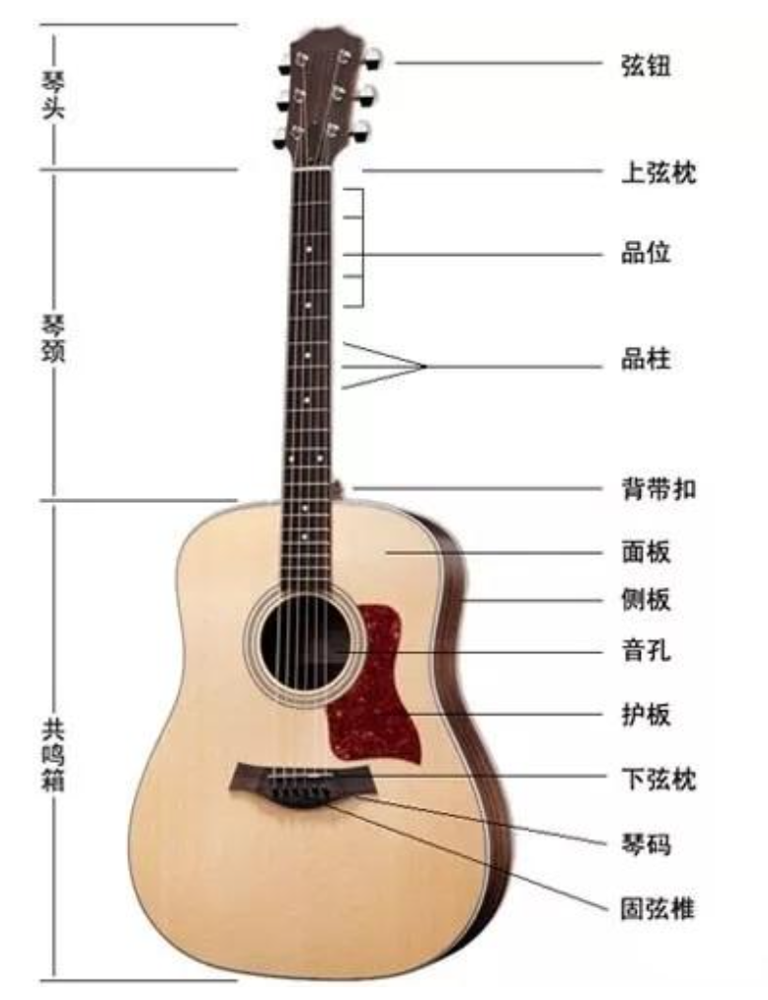

# 分类简介

吉他（英文“Guitar”的谐音）是一个非常古老的乐器，它的悠久历史远超过小提琴和钢琴。关于吉他起源一直是吉他界一个有争议的课题，一般说法，吉他是由古埃及的“鲁特琴”和古希腊的“吉达拉琴”演变而成。

16 世纪，吉他在南欧洲流行。17 世纪后期，吉他在意大利和西班牙非常盛行。18、19 世纪，是吉他发展的辉煌时期，在整个欧洲流行，同时涌现出一些技艺高超的吉他大师，如：卡尔卡西、塞戈维亚等。20 世纪，吉他已经风靡全世界，成为最受欢迎的乐器之一。

## 原声吉他

民谣吉他是我们最常见，也是最受大众欢迎的吉他。有很多民谣歌手相信大家都很熟悉，比如：赵雷《成都》、宋冬野《斑马斑马》等等，都是用民谣吉他伴奏的。

民谣吉他指板较窄，弦枕到与琴身共14品，使用钢丝弦，音色明亮。持琴姿势比较自由，经常用于伴奏或者自弹自唱。现在非常流行的指弹也是使用钢弦吉他。

## 古典吉他

吉他家族中艺术价值最高，最有深度，最受艺术界肯定的一类，被称为“世界三大经典乐器”（另外两种是钢琴，小提琴），其同时具备钢琴的富丽堂皇与小提琴的优雅婉转。它是早期资本主义上层社会皇宫贵族家庭享用的产物。

古典吉他指板较宽，弦枕到与琴身共12品，使用尼龙弦（早期是羊肠）音色柔和、优美。持琴姿势非常规范，对于技术要求也很严格，一般用手指演奏，常用于独奏、重奏，还可以和其他乐器协奏，表现力非常丰富。古典吉他用来弹唱也是非常有味道。

杨雪菲，北京人，女，罕有的活跃在国际舞台上的中国古典吉他演奏家，被誉为当代其中一位最优秀的古典吉他演奏家。

## 电吉他

它是传统工艺和现代先进的电子技术完美结合的产物，没有共鸣箱，硬质实心木头琴声，使用钢丝弦（与民谣吉他钢弦不一样）。大部分使用拨片演奏，靠拾音器接专用音箱发音。电吉他可用于伴奏，solo，可以非常狂野的演奏，表现力相当丰富，是摇滚乐队必备乐器。

# 构造

