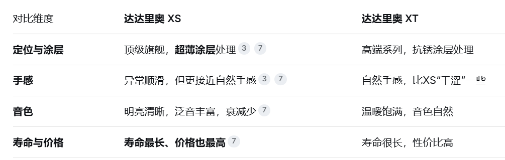
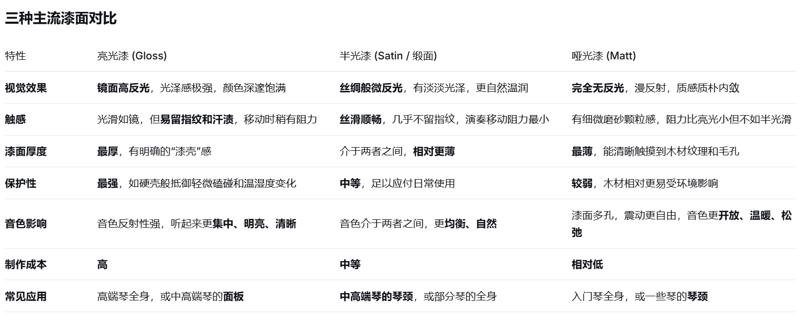

- [分类简介](#分类简介)
  - [原声吉他](#原声吉他)
  - [古典吉他](#古典吉他)
  - [电吉他](#电吉他)
- [构造](#构造)
- [琴弦大小](#琴弦大小)
- [琴弦品牌](#琴弦品牌)
  - [012-053 磷铜](#012-053-磷铜)
  - [美产 Elixir](#美产-elixir)
  - [达达里奥 XT](#达达里奥-xt)
  - [达达里奥 XS](#达达里奥-xs)
  - [达达里奥 EXP16](#达达里奥-exp16)
  - [路狗镀膜](#路狗镀膜)
  - [耳福 02](#耳福-02)
- [工艺](#工艺)
  - [油漆工艺](#油漆工艺)
  - [Plek 调试技术](#plek-调试技术)
  - [热处理木材](#热处理木材)
  - [径切和弦切](#径切和弦切)
- [疑惑](#疑惑)
  - [为什么有些面板左右两边颜色不一致](#为什么有些面板左右两边颜色不一致)

# 分类简介

吉他（英文“Guitar”的谐音）是一个非常古老的乐器，它的悠久历史远超过小提琴和钢琴。关于吉他起源一直是吉他界一个有争议的课题，一般说法，吉他是由古埃及的“鲁特琴”和古希腊的“吉达拉琴”演变而成。

16 世纪，吉他在南欧洲流行。17 世纪后期，吉他在意大利和西班牙非常盛行。18、19 世纪，是吉他发展的辉煌时期，在整个欧洲流行，同时涌现出一些技艺高超的吉他大师，如：卡尔卡西、塞戈维亚等。20 世纪，吉他已经风靡全世界，成为最受欢迎的乐器之一。

## 原声吉他

民谣吉他是我们最常见，也是最受大众欢迎的吉他。有很多民谣歌手相信大家都很熟悉，比如：赵雷《成都》、宋冬野《斑马斑马》等等，都是用民谣吉他伴奏的。

民谣吉他指板较窄，弦枕到与琴身共 14 品，使用钢丝弦，音色明亮。持琴姿势比较自由，经常用于伴奏或者自弹自唱。现在非常流行的指弹也是使用钢弦吉他。

## 古典吉他

吉他家族中艺术价值最高，最有深度，最受艺术界肯定的一类，被称为“世界三大经典乐器”（另外两种是钢琴，小提琴），其同时具备钢琴的富丽堂皇与小提琴的优雅婉转。它是早期资本主义上层社会皇宫贵族家庭享用的产物。

古典吉他指板较宽，弦枕到与琴身共 12 品，使用尼龙弦（早期是羊肠）音色柔和、优美。持琴姿势非常规范，对于技术要求也很严格，一般用手指演奏，常用于独奏、重奏，还可以和其他乐器协奏，表现力非常丰富。古典吉他用来弹唱也是非常有味道。

杨雪菲，北京人，女，罕有的活跃在国际舞台上的中国古典吉他演奏家，被誉为当代其中一位最优秀的古典吉他演奏家。

## 电吉他

它是传统工艺和现代先进的电子技术完美结合的产物，没有共鸣箱，硬质实心木头琴声，使用钢丝弦（与民谣吉他钢弦不一样）。大部分使用拨片演奏，靠拾音器接专用音箱发音。电吉他可用于伴奏，solo，可以非常狂野的演奏，表现力相当丰富，是摇滚乐队必备乐器。

# 构造

# 琴弦大小

1、2弦非常细所以没有缠绕铜丝，会显得光秃秃

# 琴弦品牌

## 012-053 磷铜

- 012-053：这是琴弦的规格，代表的是吉他 1 弦到 6 弦的粗细。012 和 053 都是英寸单位，换算成毫米，最细的 1 弦直径约为 0.30mm，最粗的 6 弦约为 1.35mm。这个规格通常被称为"Light（轻型）"，张力适中，手感舒适，是市面上最主流、适用范围最广的民谣吉他弦规格之一
- 磷铜 (Phosphor Bronze)：这是琴弦的材质，特指缠绕在4、5、6弦上的金属。磷铜弦是民谣吉他的主流选择，音色普遍认为温暖、均衡且富有表现力，比另一种常见材质"黄铜（Bronze）"的声音更饱满一些。

比较标准常见的新手琴弦标准，覆盖面广，1000 - 3000 都有

如果没有特殊说明，一般是没有镀膜的

## 美产 Elixir

比较优质的琴弦，一般用在 3000 价位的琴上

进口，属于高端，单独购买 139-159

## 达达里奥 XT 

强调自然无覆膜的手感（实际覆膜了但是感受很自然）

进口，属于中高端，单独购买 100-120 

## 达达里奥 XS

进口，属于高端，单独购买 130-160 

## 达达里奥 EXP16

EXP16 是 XT 系列的“前辈”，是一个已经绝版的经典型号 如果有的话 差不多 73 元 比较合适

## 路狗镀膜

国产，性价比，单独购买 50+

## 耳福 02

国产，性价比，40 左右

# 工艺

## 油漆工艺

哑光漆、半光漆（缎面漆）、亮光漆

## Plek 调试技术

Plek 调试技术，是一种利用高精度 CNC（计算机数控）设备，对吉他进行数字化精准测量和切削的先进工艺。你可以把它想象成给吉他品丝（fret）做了一个超级精密的“微创手术”，核心目的是让吉他的手感达到最佳状态，并消除各种恼人的杂音

## 热处理木材

不同价位的吉他，所使用的木材的等级和风干年限，差别还是很大的，像一些顶级品牌的高端型号使用的木材不仅等级更高，而且可能已经风干了几十年了。他们在品牌创立时呢，采购的木材就一直在风干存放，然后每年也会在采购新木材时挑出一部分好料，继续留着风干存放，所以那些几十年上百年的吉他品牌啊，比如马丁吉他公司都快200年了，就是会有源源不断地风干了几十年甚至更久的木材用来制作高端琴，风干木材的好处呢可以简单理解为除了木材中的水分会挥发干净以外，那些木材中的油脂就是树脂也会自然挥发掉，这样的板材做面板声音会更清亮更通透。而像咱们平时练习使用的入门面单琴，一般会自然风干六个月到两年左右，然后使用干燥设备进行干燥之后，就可以制琴了

不过现在有一种不太新的新技术，就是这种新技术已经出来有几年了，通过对面板进行加热处理，把板材中的树脂烘烤出来，以达到风干多年的效果，这种热处理技术，现在国产一线品牌基本都有，叫法名字不同，但技术层面基本上都是大同小异，并且已经从原来只用在高端琴上下放到入门级面单琴上了，像以前呢还会作为卖点拿出来特意说明一下，现在也基本没人特意讲了

## 径切和弦切

径切面板，对称，通透

弦切背侧板，美观，共振

# 疑惑

## 为什么有些面板左右两边颜色不一致

这是因为一般来说面板是使用木头对称的两边拼接而成的，因为木头外围和内芯不适合做面板，一般不会使用，所以一般一个琴的面板是由一块树木的对称两边拼接的，这恰好常常会出现颜色不一致的情况，因为光照不一致，但这并不意味着你的琴不好，反而大概率证明你的琴好，只要说明面板制作时使用的是对称的两边拼接而成，符合规范。