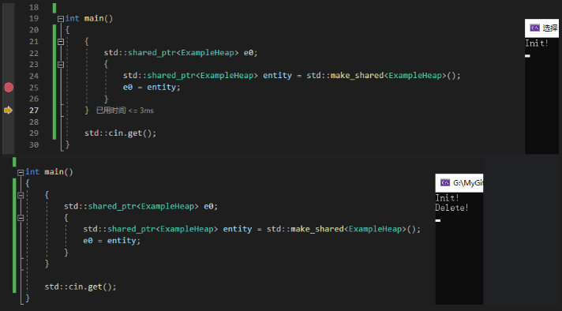
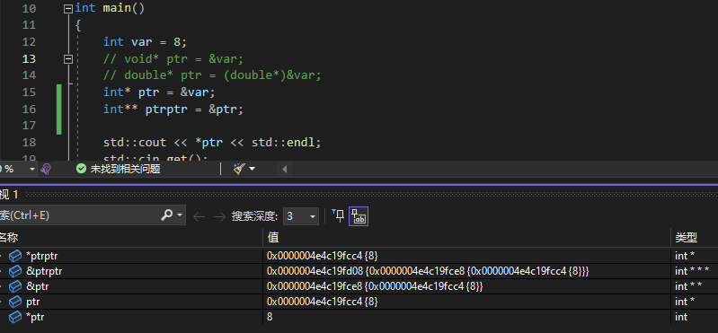

- [概述](#概述)
- [声明](#声明)
- [工作原理](#工作原理)
- [分类](#分类)
	- [原始指针](#原始指针)
		- [无类型指针](#无类型指针)
		- [传统有类型指针](#传统有类型指针)
	- [悬空指针](#悬空指针)
	- [野指针](#野指针)
	- [智能指针](#智能指针)
		- [std::unique\_ptr](#stdunique_ptr)
		- [std::shared\_ptr](#stdshared_ptr)
		- [std::weak\_ptr](#stdweak_ptr)
		- [shared\_ptr 循环引用示例](#shared_ptr-循环引用示例)
			- [使用场景](#使用场景)
		- [reset](#reset)
- [指针的指针](#指针的指针)
	- [实际应用场景](#实际应用场景)
- [引用](#引用)
	- [底层原理](#底层原理)
	- [存在的意义？](#存在的意义)

# 概述

指针（Pointer）是一种特殊变量，用于存储另一个变量的内存地址。即其内容就是一个整数，存放一个内存地址。

	声明语法： 类型 *指针名；例如： int *p;
	赋值例子： int a = 10; int* p = &a;
	解引用： *p 读写 a 的值

# 声明

- 声明指针后必须初始化，否则就是野指针。

```Cpp

int* p = nullptr; // 推荐  
int* p = 0;       // 也可以  
int* p; // 这样声明后不初始化，就是野指针  

```

- *位置随意但要看清含义

```Cpp

int* p1, p2; // 只有 p1 是指针！p2 是普通 int  
int *p1, *p2; // 都是指针，更清晰  

```

- const 指针的语义要分清

```Cpp

const int* p：指向的内容是常量
int* const p：指针本身是常量
const int* const p：指针和内容都不能改

```

# 工作原理

指针就是用来保存一个内存地址的变量。  
指针本身的存储字节数由编译器&平台决定，与指向的类型无关。  
这个地址可以指向任何类型的数据，比如 int、double、struct 等。  

int* 表示“指向 int 类型的指针”。  
double* 表示“指向 double 类型的指针”。  
指针的类型决定了解引用时的行为，即决定“指针指向的数据看作什么类型”。  
读取/写入数据时，按照该类型的大小和格式处理。  
指针的运算（如 p+1）会跳过对应类型所占的字节数。  

指针类型影响：  
解引用时的数据宽度（比如 *p 读几个字节）  
指针的加减运算步长  

# 分类

指针分为原始指针 raw pointer 和智能指针 smart pointer 。

一些出了问题的指针叫悬空指针、野指针。

## 原始指针

需要手动管理内存的分配和释放

### 无类型指针

void* 是一种可以指向任意类型数据的指针（即“无类型”或“通用指针”）。  
它不记录指向对象的类型信息，所以没法直接进行解引用或成员访问。

库函数参数（如 C 的 malloc()、memcpy()）  
需要传递任意类型对象指针的接口  
转型与底层操作  

```Cpp

int a = 10;  
void* p = &a;       // 可以指向 int  
double b = 3.14;  
p = &b;             // 也可以指向 double  

// 若要解引用，必须先强制转换到正确类型  
int* pi = (int*)p;  
// cout << *pi; // 合法，但需要保证 p 真的指向 int 类型  

```

在 C++中，由于有模板和智能指针，void* 的用法已经大大减少。

### 传统有类型指针

## 悬空指针

指针原本指向一块合法内存，而那块内存已经被释放（或对象已销毁），但指针还在用！

继续使用悬空指针会访问非法内存，导致程序崩溃或不可预期的行为。

```Cpp

int* p = new int(10);  
delete p;      // 内存已释放  
*p = 20;       // 悬空指针！再用 p 出错 

int* p;  
{  
    int x = 5;  
    p = &x;  
} // x 离开作用域被销毁  
// 此时 p 变成悬空指针，再用 p 会出问题  

```

## 野指针

指针没有被初始化，或者已经被随意修改、指向了一个不可预测的内存区域。

野指针指向哪里谁也不知道，访问它极易造成程序崩溃或数据损坏。

```Cpp

int* p;    // 没有初始化，p 是野指针  
*p = 10;   // 错误！  

int* p = (int*)0x12345678; // 随意赋个内存地址，野指针  

```

## 智能指针

智能指针是一种自动管理动态内存资源的类模板，本质上是拥有“指针功能”的对象。它能在作用域结束时，自动释放内存，防止内存泄漏，简化内存管理。

### std::unique_ptr

表示独占所有权的智能指针，禁止拷贝，只能移动。

```Cpp
#include <iostream>
#define Log(x) std::cout << x << std::endl;
#include <memory>

class ExampleHeap
{
public:
	ExampleHeap()
	{
		Log("Init!");
	}

	~ExampleHeap()
	{
		Log("Delete!");
	}
};

int main()
{
	{
		std::unique_ptr<ExampleHeap> entity = std::make_unique<ExampleHeap>();
	}
	std::cin.get();
}
```

所有权对象被销毁时（生命周期到头，delete 自动发生）。

### std::shared_ptr

共享所有权，多个 shared_ptr 可以指向同一个对象。  
使用引用计数管理资源，最后一个指针销毁时释放。  



示例：

	shared_ptr<string> name = make_shared<string>("Test")

	断点查看 &name 内容

	0x0000007f902ff788 {ptr]=0x000001cb3b6aab60"Test"}

	其中地址 0x0000007f902ff788 和  0x000001cb3b6aab60 都指啥

	0x0000007f902ff788：这是 name 这个 shared_ptr 本身的地址。
	name 是一个 std::shared_ptr<std::string> 对象，它是一个智能指针，内部包含了一个指向实际对象（std::string）的指针，以及引用计数等元数据。

	0x000001cb3b6aab60：这是 shared_ptr 内部存储的指针（ptr）的值，也就是指向实际对象（std::string）的地址。
	std::shared_ptr 内部会管理一个指针（ptr），指向堆上分配的实际对象（在这里是 std::string 类型的对象，值为 "Test"）。

	std::shared_ptr 是一个智能指针，它的内部结构通常包含以下内容：

	一个指向实际对象的指针（ptr）。
	一个指向控制块的指针（control block），控制块中包含引用计数和其他元数据。

	std::make_shared<std::string>("Test") 会在堆上分配一个 std::string 对象（值为 "Test"），并同时分配一个控制块。
	name 是一个 std::shared_ptr，它内部存储了指向这个 std::string 对象的指针（ptr），以及指向控制块的指针。

	栈内存：  
	+-----------------------+  
	| name (shared_ptr)     |  地址：0x0000007f902ff788  
	|   ptr -> 0x000001cb3b6aab60  （指向堆上的 std::string 对象）  
	|   control block -> ... （指向控制块）  
	+-----------------------+  

	堆内存：  
	+-----------------------+  
	| std::string ("Test")  |  地址：0x000001cb3b6aab60  
	+-----------------------+  
	| control block         |  包含引用计数等元数据  
	+-----------------------+

### std::weak_ptr

用于配合 std::shared_ptr，解决循环引用问题的智能指针。

不拥有资源，只能临时访问，用于观察，不影响引用计数。

典型用于双向关系的对象管理。

```Cpp

#include <memory>  
std::shared_ptr<int> sp = std::make_shared<int>(20);  
std::weak_ptr<int> wp = sp; // 观察，不拥有  

```

### shared_ptr 循环引用示例

如果 A 和 B 互相用 shared_ptr 指向对方，那么它们之间的引用计数永远不会变成 0，内存永远不会释放。

```Cpp

#include <memory>  

struct B; // 前置声明  

struct A {  
    std::shared_ptr<B> bptr;  
};  

struct B {  
    std::shared_ptr<A> aptr;  
};  

void leak() {  
    auto a = std::make_shared<A>();  
    auto b = std::make_shared<B>();  
    a->bptr = b;  
    b->aptr = a; // 互相持有 shared_ptr  
} // a 和 b 离开作用域，引用计数都为 1，内存永远不会回收！  

```

打破循环只需一方用 weak_ptr。

```Cpp

#include <memory>  

struct B; // 前置声明  

struct A {  
    std::shared_ptr<B> bptr;  
};  

struct B {  
    std::weak_ptr<A> aptr; // 用 weak_ptr，不增加引用计数  
};  

void no_leak() {  
    auto a = std::make_shared<A>();  
    auto b = std::make_shared<B>();  
    a->bptr = b;  
    b->aptr = a; // 不会阻止 a 被销毁  
} // a 和 b 都能正确释放  

```

访问时需用 .lock() 把 weak_ptr 转为 shared_ptr：

```Cpp

std::shared_ptr<A> tmp = b->aptr.lock();  
if (tmp) {  
    // 可以安全使用 tmp 指向的 A 对象  
}  

```

#### 使用场景

树结构的父节点用 weak_ptr 指向子节点，避免环。  
观察者模式、缓存池、资源引用、双向链表等。

### reset

用来释放当前持有的资源，并可选地让智能指针指向新的资源。

```Cpp

p.reset(q);	// q 为智能指针要指向的新对象

```

这会令智能指针 p 中存放指针 q，即 p 指向 q 的空间，而且会释放原来的空间，默认是 delete。

# 指针的指针

指针的指针就是保存一个指针变量地址的指针。

```Cpp
	int var = 8;
	int* ptr = &var;
	int** ptrptr = &ptr;
```


## 实际应用场景

动态二维数组分配等复杂内存管理。需要在函数中修改指针自身的值时，可用指针的指针作为参数。

```Cpp

void allocMemory(int** pp) {  
    *pp = new int(123);  
}  
int* p = nullptr;  
allocMemory(&p);    // 用指针的指针传递和修改 p  

```

# 引用

引用必须引用一个现有的变量，其本身不是一个变量。它不真正占用内存，也不存储数据。它只存在于我们的源码，编译之后其实只有现有的那个变量，不存在引用了。

```Cpp

int a = 10;  
int& ref = a;   // ref 是 a 的引用  
ref = 20;       // 相当于 a = 20  

```

引用是某个已存在变量的别名，声明后不能更换指向对象。

```Cpp
	int a = 8;
	int b = 5;

	int& ref = a;
	ref = b;
```
这样其实是把 a 变成 b 的值，即 a=5；所以如果你是想改变 ref 所引用的，你应该把 ref 变为指针。

## 底层原理

编译器通常用一个隐式指针来实现引用（但是你不能取得这个指针，也不能为引用赋新地址）。  
所有通过引用访问/赋值的操作，编译器会自动转化成通过指针对原始对象操作的汇编指令。  

下面是方便理解的伪代码：

```Cpp
int a = 10;  
int& ref = a;  
// 可能等价于：  
int* const ref = &a; // ref 这里不能改指向  

ref = 20; // 实际上变成了 *ref = 20; 
```

## 存在的意义？

引用语法更自然，用起来几乎和普通变量一样，没有指针的“*”和“&”的繁杂运算，大大降低了出错风险。

```Cpp
int a = 10;  
int& r = a; // r 就是 a，从今往后 r 和 a 完全一样  
```

改善指针表达

指针

```Cpp
void Increment(int* value)
{
	(*value)++;
}

int main()
{
	int var = 8;
	Increment(&var);

	std::cout << var << std::endl;
	std::cin.get();
}
```

引用

```Cpp
void Increment(int& value)
{
	value++;
}

int main()
{
	int var = 8;
	Increment(var);

	std::cout << var << std::endl;
	std::cin.get();
}
```

指针传递可能会传递空指针（nullptr），如果在函数中没有检查指针是否为空，可能会导致运行时错误。  
引用传递不存在空引用的情况，引用必须绑定到一个有效的变量，因此更安全。  

指针传递需要显式传递变量的地址（&var），而引用传递可以直接传递变量（var）。  
引用传递的语法更简洁，更接近直接操作变量。  

在现代 C++ 编译器中，指针传递和引用传递的性能几乎没有差别。编译器会对引用传递进行优化，将其实现为指针传递。