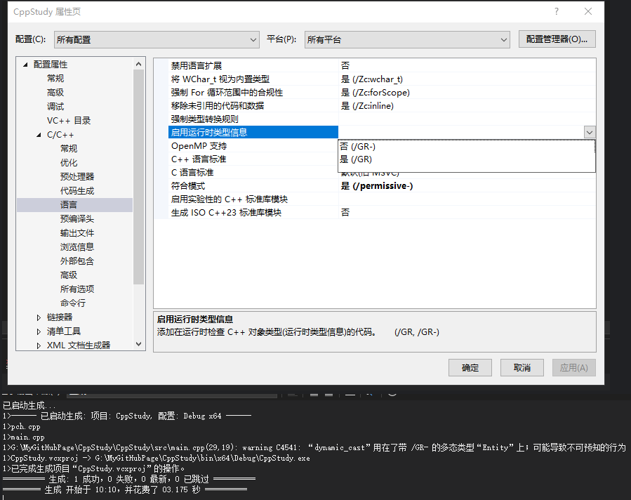

- [隐式类型转换（implicit conversion）](#隐式类型转换implicit-conversion)
- [显式类型转换（explicit conversion）](#显式类型转换explicit-conversion)
	- [旧的 C 风格强制转换](#旧的-c-风格强制转换)
	- [C++ 风格类型转换（推荐）](#c-风格类型转换推荐)
		- [static\_cast](#static_cast)
		- [dynamic\_cast](#dynamic_cast)
		- [const\_cast](#const_cast)
		- [reinterpret\_cast](#reinterpret_cast)
- [类型转换运算符](#类型转换运算符)

# 隐式类型转换（implicit conversion）

编译器自动完成的类型转换，例如：

```Cpp

int a = 10;  
double b = a; // int 自动转换为 double  

```

# 显式类型转换（explicit conversion）

也叫强制类型转换，开发者通过代码显式要求类型转换。有两种主要的方式：

## 旧的 C 风格强制转换

```Cpp
double d = 3.14;  
int i = (int)d; // 或 int i = int(d);  
```

这种方式简短但缺乏安全性和可读性。

##  C++ 风格类型转换（推荐）

C++ 提供了四种类型转换操作符，安全性和目标明确性更高：

### static_cast

用于相关类型之间的转换（如基本类型、指针/引用间的上行转换）。

```Cpp

double d = 3.14;  
int i = static_cast<int>(d);  

```

会做一些编译时检查，来看看是不是这种转换真的可能

### dynamic_cast

用于多态类型之间的指针或引用转换（主要用于类的继承体系内下行转换）。

```Cpp

Base* pb = new Derived();  
Derived* pd = dynamic_cast<Derived*>(pb); // 向下转型  

```

检查这个转换是否成功，即是否是有意义的转换。

```C++

#include <iostream>

class Entity
{
public:
	Entity(){}
	virtual ~Entity(){}
};

class Player : public Entity
{
public:
	Player() {}
	~Player() {}
};

class OtherPlayer : public Entity
{
public:
	OtherPlayer() {}
	~OtherPlayer() {}
};

int main()
{
	Player* p = new Player();
	Entity* e = p;

	OtherPlayer* o = dynamic_cast<OtherPlayer*>(e);
	if (!o)
	{
		std::cout << "No" << std::endl;
	}
	std::cin.get();
}

```

上述例子就是不能转换的，因为 e 已经是一个 player 实例了，转换到 otherplayer 不合适。  
当转换可以实现，就会返回正确类型指针，否则，返回 null。  
它能做到这点，是因为它储存了运行时类型信息，runtime type information RTTI，它存储着我们所有类型的运行时类型信息。这会增加开销，但是这会让我们做动态类型转换之类的事情。  



如果禁用了 RTTI，就会警告我们不可预知的行为。

其他语言比如 C#，会用 is 来判断转换类型是否成功，然后进行使用。

### const_cast

用于移除或添加 const/volatile 属性，常用于接口函数需要去除 const 修饰时

```Cpp

const int* p = nullptr;  
int* q = const_cast<int*>(p);  

```

移除或者添加变量的 const 限定。

偶尔需要将 const 对象 “强行” 传递到只接受非 const 接口的函数。如果你确信函数不会修改对象内容，可以用 const_cast 消除限制。

const_cast 主要用于与不支持 const 的旧代码或接口兼容、缓存/延迟初始化以及代码重用等特别场合。  
它并不是常规开发中频繁需要的工具，使用时一定要小心，严格遵守“不修改真正的 const 对象”。

- 与旧代码/接口兼容

```Cpp

void legacy_api(char* buffer); // 旧接口没加 const  

const char* data = "test";  
legacy_api(const_cast<char*>(data));  // 只要 API 不会去修改内容，这样可行  

```

- 实现 const 与非 const 函数代码重用

有时非 const 和 const 成员函数实现一样，但返回类型不同（const 与非 const 指针/引用），可以在 const 版本中用 const_cast 重用非 const 逻辑：
```Cpp

const T& get() const {  
    return const_cast<Example*>(this)->get();  
}  
T& get() {  
    // 实际实现  
}  

```

- 数据成员延迟初始化/缓存

有时类需要在 const 成员函数里懒加载或缓存额外内容，但 C++ 不能直接修改成员变量。通过 mutable 搭配 const_cast 可实现：

```Cpp

class Example {  
public:  
    int getValue() const {  
        if (!m_cached) {  
            m_value = compute(); // 编译器报错，不能改成员变量  
            m_cached = true;  
        }  
        return m_value;  
    }  
private:  
    mutable int m_value = 0;  
    mutable bool m_cached = false;  
    int compute() const { return 42; }  
};  

// 这里用 mutable 实现目的更好，但也有用 const_cast 形式的变体：

int getValue() const {  
    Example* self = const_cast<Example*>(this);  
    self->m_value = 42;  
    return self->m_value;  
}  

```

### reinterpret_cast

用于不同数据类型指针间的强制转换（如指针与整数的相互转换），极其危险，必须慎用。

```Cpp

long p = reinterpret_cast<long>(&d);  

```

其意思更倾向于不想转换，而是把这段内存重新解释成别的东西，就是类型双关。

```C++

#include <iostream>

class Entity
{

};

int main()
{
	int a;
	Entity e = *(reinterpret_cast<Entity*>(a));

	std::cin.get();
}

```

# 类型转换运算符

类型转换运算符允许你在类中定义从该类类型到其他类型的隐式转换。   
它通常用于将自定义类对象转换为基本数据类型（如整数、浮点数、指针等）。   

类型转换运算符的语法如下：  

```Cpp
operator target_type() const；
```

其中：  
target_type 是你希望将类对象转换为的目标类型。  
const 修饰符表示这个运算符不会修改类对象的状态。  

```Cpp
class Timestep
{
public:
	Timestep(float time = 0.0f) : m_Time(time) { }

	operator float() const { return m_Time; }
private:
	float m_Time;
};
```