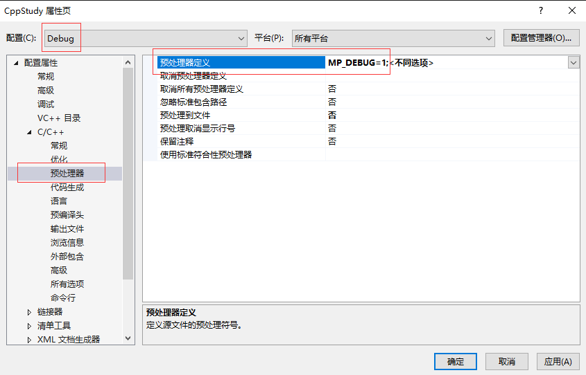

- [认识宏](#认识宏)
- [符号操作](#符号操作)
  - [\\ 换行符](#-换行符)
  - [## 连接](#-连接)
  - [#@ 字符化 ：将单个参数名转换成 const char](#-字符化-将单个参数名转换成-const-char)
  - [# 字符串化操作符 ：加双引号](#-字符串化操作符-加双引号)
  - [\_\_VA\_ARGS\_\_ ：用来接受不定数量的参数](#__va_args__-用来接受不定数量的参数)
- [函数宏](#函数宏)
- [常用宏](#常用宏)
- [宏展开顺序](#宏展开顺序)
- [__VA\_ARGS__ 嵌套使用](#va_args-嵌套使用)

# 认识宏

在 C++中使用预处理器来“宏”化某些操作。



```Cpp
#include <iostream>

#if MP_DEBUG == 1
#define Log(x) std::cout << x << std::endl
#elif MP_RELEASE == 1
#define Log(x) 
#endif

int main()
{
	Log(1);
	std::cin.get();
}
```

不用#ifdef 是因为如果不想定义 MP_DEBUG 的话就得注释掉那行代码，这样做直接 = 0 就行。

# 符号操作

## \\ 换行符

使用 \\，注意后面要直接接换行，不然还以为是空格的转义呐。

```Cpp
#include <iostream>

#define MAIN int main()\
{\
	std::cin.get();\
}

MAIN
```

## \#\# 连接

```cpp
#define Conn(x,y) x##y

int n = Conn(123,456);
    // ==> int n=123456;
char* str = Conn("asdf", "adf");
	// ==> char* str = "asdfadf";
```

## \#@ 字符化 ：将单个参数名转换成 const char

```Cpp
#define ToChar(x) #@x

char a = ToChar(1);
    // ==> char a='1';

char a = ToChar(123);
    // ==> char a='3';

char a = ToChar(1234);
	// 直接编译报错

// 按理说三个以内会以最后一个为主，多于三个 直接报错
```

## \# 字符串化操作符 ：加双引号

```Cpp
#define ToString(x) #x

char* str = ToString(123132);
	// ==> char* str="123132";

#define foo 4
#define xstr(s) str(s)
#define str(s) #s

// foo 是普通参数，优先宏展开
xstr (foo)
    // ==> xstr (4)
    // ==> str (4)
    // ==> "4"
// foo 作为字符串化参数，不会优先被宏展开
str (foo)
	// ==> "foo"
```

## \_\_VA_ARGS\_\_ ：用来接受不定数量的参数

```Cpp
#define eprintf(format, ...) fprintf (stderr, format, ##__VA_ARGS__)

eprintf ("%s:%d: ", input_file, lineno)
// ==>  fprintf (stderr, "%s:%d: ", input_file, lineno)
```

当、_\_VA_ARGS\_\_宏前面、#\#时，可以省略参数输入
```cpp
#define eprintf(format, ...) fprintf (stderr, format, ##__VA_ARGS__)

eprintf ("success!\n")
// ==> fprintf(stderr, "success!\n");
```
用##连接逗号和后面的__VA_ARGS__，这在 c 语言的 GNU 扩展语法里是一个特殊规则：当__VA_ARGS__为空时，会消除前面这个逗号。

\_\_LINE\_\_   当前行号

# 函数宏

宏可以探知函数名或者函数签名  
函数名 : \_\_FUNCTION\_\_   
函数签名 : \_\_funcsig\_\_   

# 常用宏

```Cpp
#error "编译报错宏，用来提示"

// 这将忽略在外部标头中引发的所有警告
#pragma warning(push, 0)
#include <spdlog/spdlog.h>
#pragma warning(pop)
// #pragma warning 控制编译器警告的级别
// #pragma warning(push, 0)：
// 这条指令将当前警告级别推入一个堆栈，并将警告级别设置为 0（禁用所有警告）。
// 这意味着在接下来的代码中，不会显示任何警告信息。
// #pragma warning(pop)：
// 这条指令从堆栈中弹出先前推入的警告级别。这将恢复之前的警告设置。
```

# 宏展开顺序

```Cpp
// # ## 这两个优先级最高
// 然后再是由外到内
```

# __VA_ARGS__ 嵌套使用

```Cpp
// 就是一个 logerror 函数
#define SD_CORE_ERROR(...)      ::Log::GetCoreLogger()->error(__VA_ARGS__)

#define HELP(x) x

#define LINK_MACRO(check, type, msg, ...) if(check) { SD_##type##_ERROR(msg, __VA_ARGS__); }
#define CALL_LINK_NOMSG(check, type) LINK_MACRO(check, type, "警告！出错行数：{0}", __LINE__)

#define CALL_LINK_HELP(...) HELP(CALL_LINK_NOMSG(__VA_ARGS__))
#define CALL_LINK(...) CALL_LINK_NOMSG(__VA_ARGS__)

// 下面是调用时及其展开
{
	// 没有 help 的帮助，直接进行 CALL_LINK_NOMSG 的展开
	// 其结果是，直接把__VA_ARGS__当成了第一个参数 check，而 type 是空
    CALL_LINK(1, CORE)
        if (1, CORE) {
            SD__ERROR("警告！出错行数：{0}", 15);
        }

	// 有了 help 的帮助，则需要先对 HELP(X) 进行替换，这个过程__VA_ARGS__就被拆分为 1, CORE
    CALL_LINK_HELP(1, CORE)
        if (1) {
            ::Shadow::Log::GetCoreLogger()->error("警告！出错行数：{0}", 20);
        }
}
```