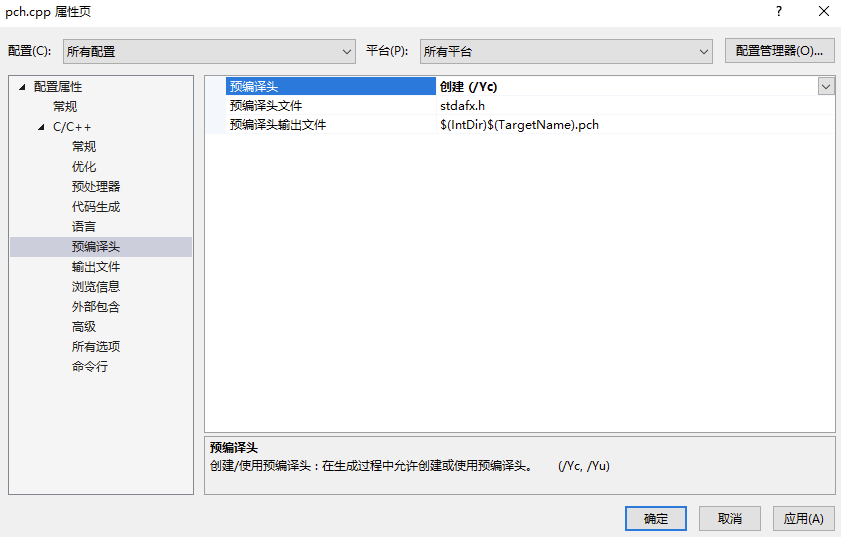
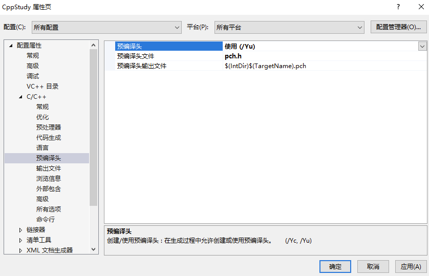

# 概念

如果我们的头文件被很多 cpp 引用，那么在编译的时候，预处理要进行文本复制，将我们的头文件复制到如此多的 cpp 中，然后编译器开始编译，这意味着我们将重复多次进行庞大代码的编译。很浪费时间。  
通过预编译头文件，可将它们编译一次，存为二进制格式。下次编译时，只要这些头文件没有变化，就直接用预编译结果，无需重复转义分析。

# 用法

新建一个头文件，如 pch.h，里面包含常用不变的头文件：
```Cpp
// pch.h  
#pragma once  
#include <iostream>  
#include <vector>  
#include <string>  
// ... 更多常用头文件 
```

创建预编译头文件 pch.h 和只引用它的 pch.cpp，然后更改设置。

pch.cpp 来创建预编译文件，更改文件设置   


更改项目设置来使用预编译头文件   


这样其他代码在 include pch.h 就会使用预编译的二进制来提升速度。

在开发过程中，预编译头文件禁止我们在其中写入代码，因为我们的代码一般都是要经常变化的，这一变，编译的时候又要把这个头文件重新编译了。但也不排除把不经常变化且非常通用的代码放到 cpp，比如 log。

# 注意事项

## 设定之后 .cpp 必须包含预编译头文件么？

如果您在项目中设置了预编译头文件，那么通常需要在每个 .cpp 源文件的最开始包含这个预编译头文件。这是因为预编译头文件中的内容会被编译器预先编译，并在编译其他源文件时使用这些预编译的信息来加速编译过程。

这样做可以确保所有源文件都能利用预编译头文件带来的编译速度提升。如果某个源文件没有包含预编译头文件，那么它就不能利用预编译的优势，可能会导致该源文件的编译时间较长。

但是，也有一些情况下您可能不想或不需要在某些特定的源文件中包含预编译头文件，比如说这些源文件非常小，或者它们使用了与项目其余部分完全不同的库。在这种情况下，您可以在项目设置中为这些特定的源文件关闭预编译头文件的使用。

在 “ 解决方案资源管理器 ” 中，右键该 .cpp 文件 → 属性。C/C++ → 预编译头 → “不使用预编译头”。

## .h 可以使用预编译头文件么，这样会不会导致什么问题？

通常情况下，预编译头文件（PCH）主要用于 .cpp 源文件，而不是 .h 头文件。这是因为预编译头文件的目的是加速编译过程，而头文件通常被多个源文件包含。如果在头文件中包含了预编译头文件，那么每个包含了该头文件的源文件都会间接地包含了预编译头文件，这可能会导致以下问题：
- 编译依赖：增加了不必要的编译依赖，可能会导致编译时间增加，特别是当预编译头文件很大时。
- 编译错误：如果预编译头文件中的宏或定义与其他源文件中的内容冲突，可能会导致难以追踪的编译错误。
- 可移植性问题：依赖于特定项目设置的预编译头文件可能会降低代码的可移植性。
因此，建议只在 .cpp 源文件中直接包含预编译头文件，并且在 .h 头文件中只包含必要的声明和定义。这样可以保持代码的清晰和可维护性，同时避免上述潜在问题。
