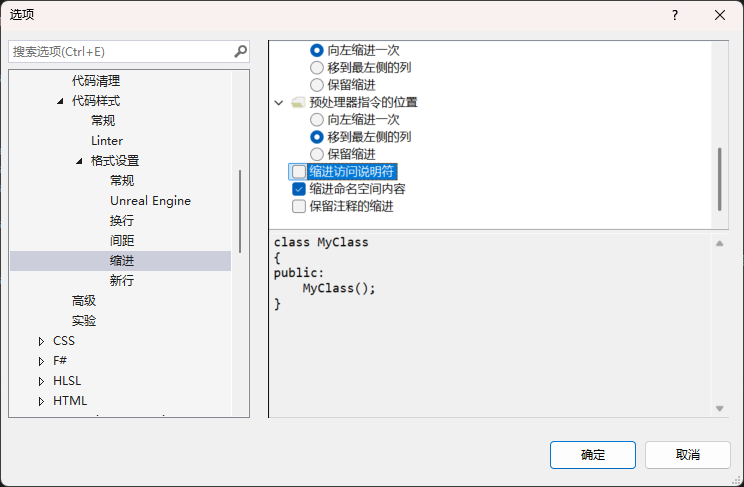

本文是一些未分类到具体哪一期的知识。  

- [使用 cpp 库操作文件](#使用-cpp-库操作文件)
- [函数多个返回值](#函数多个返回值)
- [返回值可能为空](#返回值可能为空)
- [函数参数计算顺序](#函数参数计算顺序)
- [VS 使用技巧](#vs-使用技巧)
	- [与活动文档同步以获取文件变化](#与活动文档同步以获取文件变化)
	- [设置代码风格](#设置代码风格)
	- [为一堆杂项文件创建新项目以可以跳转](#为一堆杂项文件创建新项目以可以跳转)
	- [代码无法跳转](#代码无法跳转)
	- [调试](#调试)
- [VSCode 使用技巧](#vscode-使用技巧)
	- [快捷键](#快捷键)
- [offsetof](#offsetof)
- [类](#类)
	- [复制类](#复制类)
- [预编译头文件](#预编译头文件)
	- [设定之后。cpp 必须包含预编译头文件么](#设定之后 cpp-必须包含预编译头文件么)
	- [.h 可以使用预编译头文件么，这样会不会导致什么问题？](#h-可以使用预编译头文件么这样会不会导致什么问题)
	- [头文件引用](#头文件引用)
- [数组](#数组)
	- [原生数组](#原生数组)
	- [vector 动态数组](#vector-动态数组)
		- [emplace\_back](#emplace_back)
	- [array 静态数组](#array-静态数组)
	- [在哪创建](#在哪创建)
	- [std::initializer\_list](#stdinitializer_list)
	- [数组排序](#数组排序)
- [cpp 运行库设置](#cpp-运行库设置)
	- [C 和 C++运行库](#c-和-c 运行库)
		- [C 运行库](#c-运行库)
		- [C++运行库](#c 运行库)
	- [VC++编译器](#vc 编译器)
		- [DLL 和 LIB 区分](#dll-和-lib-区分)
	- [VS 设置](#vs-设置)
		- [/MT 和/MTd](#mt-和 mtd)
		- [/MD 和/MDd](#md-和 mdd)
		- [结论](#结论)
- [单例](#单例)
- [字符串](#字符串)
	- [char](#char)
	- [const char\*](#const-char)
		- [字符串中插入 0](#字符串中插入-0)
	- [string](#string)
		- [string 每次创建都会分配内存](#string-每次创建都会分配内存)
		- [小字符串](#小字符串)
		- [跟踪内存分配](#跟踪内存分配)
		- [原始字符串](#原始字符串)
		- [方法](#方法)
- [编程习惯](#编程习惯)
	- [同类类放在一个文件还是分开放置？](#同类类放在一个文件还是分开放置)
- [持续集成和静态分析](#持续集成和静态分析)
- [auto](#auto)
- [枚举](#枚举)
- [迭代器](#迭代器)
- [多继承](#多继承)
	- [普通多继承](#普通多继承)
	- [虚拟多继承](#虚拟多继承)
		- [数据冗余](#数据冗余)
	- [多继承的指针相等与否](#多继承的指针相等与否)
	- [多继承声明](#多继承声明)
- [条件运算](#条件运算)
	- [if else](#if-else)
	- [三元运算符代替 if](#三元运算符代替-if)
- [线程](#线程)
	- [future](#future)
	- [lock\_guard 和 scoped\_lock](#lock_guard-和-scoped_lock)
- [基准测试](#基准测试)
		- [chrome://tracing](#chrometracing)
- [命名空间](#命名空间)
	- [什么时候使用 using namespace 来简化代码](#什么时候使用-using-namespace-来简化代码)
- [Cpp 与 CSharp 相互转化](#cpp-与-csharp-相互转化)
	- [方法调用](#方法调用)
	- [传递参数](#传递参数)
		- [字段和属性](#字段和属性)
	- [C#调用 C++](#c 调用-c)
- [外部变量](#外部变量)
- [未解决的问题](#未解决的问题)
	- [注释会影响代码编译](#注释会影响代码编译)
- [折叠表达式](#折叠表达式)
- [windows.h](#windowsh)
- [C++面试](#c 面试)
	- [**一、基础语法与概念**](#一基础语法与概念)
	- [**二、面向对象编程（OOP）**](#二面向对象编程 oop)
	- [**三、内存与资源管理**](#三内存与资源管理)
	- [**四、STL 与模板**](#四 stl-与模板)
	- [**五、多线程与并发**](#五多线程与并发)
	- [**六、设计模式与代码设计**](#六设计模式与代码设计)
	- [**七、C++11/14/17 新特性**](#七 c111417-新特性)
	- [**八、实战与代码题**](#八实战与代码题)
	- [**面试技巧**](#面试技巧)

## 使用 cpp 库操作文件
fstream 操作文件。ifstream 读取文件。ofstream 写文件。

sstream 存储信息流。getline 逐行获取。stringstream 存储文件内容。

```Cpp
#include <iostream>
#include <fstream>
#include <sstream>

#define Log(x) std::cout << x << std::endl;

int main()
{
	std::ifstream stream("src/Something.txt"，std::ios::in);
	std::string line;
	std::stringstream ss;
	
	stream.seekg(0, std::ios::end);
	Log(stream.tellg());
	// size_t size = stream.tellg();
	// if (size != -1)
	// {
	// 	result.resize(size);
	// 	stream.seekg(0, std::ios::beg);
	// 	stream.read(&result[0], size);
	// 	stream.close();
	// }
	stream.seekg(0, std::ios::beg);

	while (getline(stream, line))
	{
		ss << line << "\n";
	}

	Log(ss.str());
	stream.close();
	std::cin.get();
}
```

## VS 使用技巧
Ctrl + Tab : 弹框切换标签页   
F9：快捷设置断点   
可以拖动断点的小箭头，F10 往下走两步，然后拖回上面，就可以继续 F10 执行这两步，然后反复执行这一段查错。

### 与活动文档同步以获取文件变化  


三个斜杆为函数生成参数注释

### 设置代码风格   

搜索词：代码格式，代码样式

C# 左大括号不要换新行，因为新行容易导致冲突。  


C++ public private 这种缩近



### 为一堆杂项文件创建新项目以可以跳转


### 代码无法跳转

### 调试
查看内存  

查看汇编代码  

在程序还在运行的情况下，让控制台打印出讯息  

性能探测器


TODO

## VSCode 使用技巧

### 快捷键

快捷键修改：
- Ctrl + Shift + P
- 输入 Preferences: Open Keyboard Shortcuts 并选择它
- 打开的键盘快捷键设置中，您可以搜索特定的命令，如 Fold All（折叠所有）或 Unfold All（展开所有）

展开所有 一键展开  
Ctrl + K 然后 Ctrl + J
收起所有 一键收起  
Ctrl + K 然后 Ctrl + 0
这里注意是数字 0，不是字母 O

## 编程习惯

### 同类类放在一个文件还是分开放置？

比如 ertexbuffer 和 indexbuffer 这两个类
那其实他们都是 buffer 类型，所以还是放在一起的比较好

## 持续集成和静态分析

Jenkins 自动打包
pvs studio 检查一些永远为真的函数或者循环、检查一些越界之类的

## 多继承

### 普通多继承

比如有一个类 A，类 B，和类 C 继承自 A，类 D 继承自 B 和 C。类 A 有一个 _a 成员， B 有 _b，C 有 _c，D 有 _d。

此时类 D 实例 d，内存上会是这样：

	B._a
	B._b
	C._a
	C._c
	D._d

调用时，D._a 会存在二义性，因为不知道想要 B 还是 C 的 _a 变量，只能使用这种调用方法，D.B._a，D.C._a.

### 虚拟多继承

同样是上述例子，但是 B 和 C 都是虚拟继承 A

```Cpp
class A
{
public:
	int _a;
};

class B : virtual public A
{
public:
	int _b;
};

class C : virtual public A
{
public:
	int _c;
};

class D : public B, public C
{
public:
	int _d;
};
```

此时，D 内存会是这样：

	B._a 相对此处偏移量的地址（这里地址对应的数值为 20，因为 D 的 _a 要偏移 5 个字节）
	B._b
	C._a 相对此处偏移量的地址（这里地址对应的数值为 20，因为 D 的 _a 要偏移 5 个字节）
	C._c
	D._d
	D._a 实际 _a 的值，也就是 B，C 的 _a 都指向这里。

此时，这个偏移量地址指向的地方所在处就是虚表。他可以方便地处理所有 D 实例所需要的偏移，因为他们需要的偏移量都是一样的。如果没有虚表，那会加大计算量增加复杂度，结构更改的适应能力也有所降低。

#### 数据冗余

看起来虚拟多继承并没有解决冗余问题，这是因为 _a 就是一个普通变量，如果 _a 是一个数组变量，普通的继承会完完全全多出一份 _a 数组，而 B C 因为是指向，所以不会增加。

### 多继承的指针相等与否

主要看首地址能不能对上！

```Cpp
class Base1 { public:  int _b1; };
class Base2 { public:  int _b2; };
class Derive : public Base2, public Base1 { public: int _d; };

int main() {
	Derive d;
	Base1* p1 = &d;
	Base2* p2 = &d;
	Derive* p3 = &d;
	return 0;
}
```
Base2 是第一个基类，所以 p1 = p3 != p2

```Cpp
class A {  
public:  
    int _a;  
};  

class B : public A {  
public:  
    int _b;  
};  

class C : public A {  
};  

class D : public B, public C {  
}; 

int main() {
	D d;  
	B* pB = &d;  
	C* pC = &d;  
	D* pD = &d;  
	return 0;
}
```
B 是第一个基类，所以 pB = pD != pC

```Cpp
class A {  
public:  
    int _a;  
};  

class B : virtual public A {  
public:  
    int _b;  
};  

class C : virtual public A {  
};  

class D : public B, public C {  
};  

int main() {
	D d;  
	A* pA = &d;  
	B* pB = &d;  
	C* pC = &d;  
	D* pD = &d;  
	return 0;
}
```
虚继承，位置都是不一定的。所以即使 B 是第一个基类，也不一定就在 D 的起始地址。

### 多继承声明

初始化列表顺序与构造顺序无关，谁先声明谁先构造。

```Cpp
#include<iostream>
using namespace std;
class A {
public:
	A(const char* s) { cout << s << endl; }
	~A() {}
};

class B :virtual public A
{
public:
	B(const char* sa, const char* sb) :A(sa) { cout << sb << endl; }
};

class C :virtual public A
{
public:
	C(const char* sa, const char* sb) :A(sa) { cout << sb << endl; }
};

class D :public B, public C
{
public:
	D(const char* sa, const char* sb, const char* sc, const char* sd) 
		:B(sa, sb), C(sa, sc), A(sa)
	{
		cout << sd << endl;
	}
};

int main() {
	D* p = new D("class A", "class B", "class C", "class D");
	delete p;

	return 0;
}
```

所以这段代码输出：ABCD。

## 条件运算
### if else
else if 仅仅是 else 里面有个 if。
在做判断的时候，<要比<=性能好，因为少了个=的比较。
逻辑运算其实不如数学运算性能好，后面有机会我们把 if 换成数学运算。

### 三元运算符代替 if
x = bool ? a : b;
这种写法在有些情况下会优化代码，比如 x 是一个 string，如果用 if，你一定是在外面先声明一个 string，然后赋值时又把之前的 string 丢弃了。这不好。而？: 会帮助我们。
## 线程
需要引入 thread 头文件。
```Cpp
#include <iostream>
#include <thread>

static bool s_Finished = false;

void WorkPrint()
{
	using namespace std::literals::chrono_literals;

	std::cout << "Thread id = " << std::this_thread::get_id() << std::endl;

	while (!s_Finished)
	{
		std::cout << "Working...\n";
		std::this_thread::sleep_for(1s);
	}
}

int main()
{
	std::cout << "Thread id = " << std::this_thread::get_id() << std::endl;

	std::thread worker(WorkPrint);

	std::cout << "Thread id = " << std::this_thread::get_id() << std::endl;
	std::cin.get();
	s_Finished = true;

	// worker 结束后，再往下执行
	worker.join();
	std::cout << "Finished." << std::endl;
	std::cout << "Thread id = " << std::this_thread::get_id() << std::endl;

	std::cin.get();
}
```


### future
```Cpp
#include <iostream>
#include <mutex>
#include <future>
#include <vector>

#define Log(x) std::cout << x << std::endl;

// 数据锁标记
static std::mutex s_MeshesMutex;
// 线程存储，将其生命周期拉长到外部，防止循环中直接析构
std::vector<std::future<void>> m_futures;

static void LoadMesh(std::string meshs, std::string file)
{
	std::lock_guard<std::mutex> lock(s_MeshesMutex);
	// 在后面写入需要锁定的数据操作
}

int main()
{ 
	std::string meshs, file;

#define ASYNC 1
#if ASYNC
	for (int i; i < 100; i++)
	{
		m_futures.push_back(std::async(std::launch::async, LoadMesh, meshs, file));
	}
#else
	for (int i; i < 100; i++)
	{
		// meshload
	}
#endif

	std::cin.get();
}
```
### lock_guard 和 scoped_lock
std::lock_guard 和 std::scoped_lock 都是 C++中的 RAII（Resource Acquisition Is Initialization）同步原语，用于自动管理互斥量的锁定和解锁。它们的主要区别在于：

std::lock_guard 在 C++11 中引入，只能管理一个互斥量。它在构造时锁定互斥量，在析构时解锁互斥量。
std::scoped_lock 在 C++17 中引入，可以同时管理多个互斥量。它在构造时以死锁避免算法锁定所有给定的互斥量，在析构时解锁它们。
如果您只需要锁定一个互斥量，并且不需要关心 C++17 的特性，那么 std::lock_guard 就足够了。但如果您需要同时锁定多个互斥量，并且希望自动避免死锁，那么应该使用 std::scoped_lock。

```Cpp
// std::lock_guard 示例
{
    std::lock_guard<std::mutex> lock(mutex1);
    // 在这里 mutex1 被锁定
}
// 离开作用域，mutex1 自动解锁

// std::scoped_lock 示例
{
    std::scoped_lock lock(mutex1, mutex2);
    // 在这里 mutex1 和 mutex2 都被锁定
}
// 离开作用域，mutex1 和 mutex2 自动解锁

```

## 基准测试
实际开发中我们需要计时来进行基准测试，测试函数性能等
```Cpp
#include <iostream>
#include <thread>
#include <chrono>

struct Timer
{
	std::chrono::steady_clock::time_point Start, End;
	std::chrono::duration<float> Duration;

	Timer()
	{
		Start = std::chrono::high_resolution_clock::now();
	}

	~Timer()
	{
		End = std::chrono::high_resolution_clock::now();
		Duration = End - Start;
		float ms = Duration.count() * 1000.0f;
		std::cout << "duration:" << ms << "ms" << std::endl;
	}
};

void PrintTimes()
{
	Timer timer;

	for (int i = 0; i < 1000; i++)
	{
		std::cout << "Hello!\n";
	}
}

int main()
{
	PrintTimes();
	std::cin.get();
}
```
通过这个例子我们甚至可以看到，单个""和分开的"" << "\n"和"" << std::endl 的性能区别。
如果精度不够，可以转换成 us。
```Cpp
auto startUs = std::chrono::time_point_cast<std::chrono::microseconds>(Start).time_since_epoch().count();
```

在使用基础计时进行代码测试时，要注意你的环境是 release 还是 debug，release 下，会优化你的代码，我们一般要在 release 进行测试才有意义，因为 debug 加入了很多多余的保护性代码会影响测试。
#### chrome://tracing
这是一个 json 可视化性能工具！

## 命名空间
命名空间是为了防止函数命名冲突。
可以一次性嵌套命名，可以重命名以省略。
### 什么时候使用 using namespace 来简化代码
- 永远不要在头文件使用。因为你不知道你引用了什么进来，可能会导致很难以察觉的错误
- 永远不要用在第三方库。还是因为你不知道你都引用了什么，可能有两个几乎一样的函数，一个隐式转换参数，一个完美匹配参数，你可能更改了原本想要隐式转换的那个。

```Cpp
#include <iostream>
#include <vector>

namespace A
{
	void PrintValue(std::string value)
	{
		std::cout << value << std::endl;
	}
}

namespace B
{
	void PrintValue(const char* value)
	{
		std::string temp = value;
		std::reverse(temp.begin(), temp.end());
		std::cout << temp << std::endl;
	}
}

int main()
{
	using namespace A;
	using namespace B;

	PrintValue("Hello!");
	std::cin.get();
}
```

- 要使用也就仅仅在自己的命名空间使用。

## Cpp 与 CSharp 相互转化

```Cpp
	// 将文件加载到字节数组
	char* ReadBytes(const std::string& filepath, uint32_t* outSize)
	{
		std::ifstream stream(filepath, std::ios::binary | std::ios::ate);

		if (!stream)
		{
			// Failed to open the file
			return nullptr;
		}

		std::streampos end = stream.tellg();
		stream.seekg(0, std::ios::beg);
		uint32_t size = end - stream.tellg();

		if (size == 0)
		{
			// File is empty
			return nullptr;
		}

		char* buffer = new char[size];
		stream.read((char*)buffer, size);
		stream.close();

		*outSize = size;
		return buffer;
	}

	// 加载 C#程序集
	MonoAssembly* LoadCSharpAssembly(const std::string& assemblyPath)
	{
		uint32_t fileSize = 0;
		char* fileData = ReadBytes(assemblyPath, &fileSize);

		// 注意：我们不能对这个图像执行除了加载程序集以外的任何操作，因为这个图像没有对程序集的引用
		MonoImageOpenStatus status;
		// 第三个参数告诉 Mono 我们是否希望它复制数据，还是我们负责存储它，这里我们传递 1，表示 Mono 将数据复制到内部缓冲区中
		// 第四个参数是指向 MonoImageOpenStatus 枚举的指针，我们可以使用此值确定 Mono 是否能够读取该数据，或者是否有问题
		// 最后一个参数也是一个布尔值，如果设置为 true 或 1，表示 Mono 将以“反射模式”加载我们的图像，这意味着我们可以检查类型，但不能运行任何代码。
		MonoImage* image = mono_image_open_from_data_full(fileData, fileSize, 1, &status, 0);

		if (status != MONO_IMAGE_OK)
		{
			const char* errorMessage = mono_image_strerror(status);
			// 使用 errorMessage 数据记录一些错误消息
			return nullptr;
		}

		// 通过有效的图像加载创建一个 MonoAssembly
		// 如果此函数成功，我们将获得指向 MonoAssembly 结构的指针，否则它将返回 nullptr
		// 第一个参数是我们从 Mono 获得的图像，第二个参数实际上只是一个名称，Mono 可以在打印错误时使用，
		// 第三个参数是我们的 status 变量，此函数将在发生错误时写入我们的 status 变量，但在这一点上真的不应该生成错误，所以我们不会检查它。
		// 最后一个参数与 mono_image_open_from_data_full 中的最后一个参数相同，因此如果在那里指定了 1，你应该在此函数中也这样做，但在我们的情况下，我们将其设置为 0。
		MonoAssembly* assembly = mono_assembly_load_from_full(image, assemblyPath.c_str(), &status, 0);
		// 该图像仅用于获取 MonoAssembly 指针，现已无用
		mono_image_close(image);

		// 不要忘记释放文件数据
		delete[] fileData;

		return assembly;
	}

	// 迭代打印程序集中的所有类型定义
	void PrintAssemblyTypes(MonoAssembly* assembly)
	{
		// 获取程序集图像
		MonoImage* image = mono_assembly_get_image(assembly);
		// 从图像获取类型定义表信息
		const MonoTableInfo* typeDefinitionsTable = mono_image_get_table_info(image, MONO_TABLE_TYPEDEF);
		// 从表信息获取类型的数量，即行数
		int32_t numTypes = mono_table_info_get_rows(typeDefinitionsTable);

		for (int32_t i = 0; i < numTypes; i++)
		{
			// 当前行的列数据，所有列都将它们的数据存储为 uint32_t 即无符号 32 位整数
			// 将数组的大小设置为我们正在迭代的表的最大列数 MONO_TYPEDEF_SIZE
			uint32_t cols[MONO_TYPEDEF_SIZE];
			// 调用此函数后，我们的 cols 数组现在将包含一堆值，我们现在可以使用这些值来获取此类型的一些数据
			mono_metadata_decode_row(typeDefinitionsTable, i, cols, MONO_TYPEDEF_SIZE);

			// 从图像中获取命名空间和类型名称
			const char* nameSpace = mono_metadata_string_heap(image, cols[MONO_TYPEDEF_NAMESPACE]);
			const char* name = mono_metadata_string_heap(image, cols[MONO_TYPEDEF_NAME]);

			// 打印命名空间和类型名称
			HZ_CORE_TRACE("{}.{}", nameSpace, name);
		}
	}

	void ScriptEngine::InitMono()
	{
#pragma region 初始化 mono
		// 设置程序集 mscorlib 目录
		// 相对于当前工作目录的路径，当前在 Hazelnut
		mono_set_assemblies_path("mono/lib");

		// 初始化 mono，还有一个带 version 的函数，但我们一般让 mono 自己选择版本
		// 在调用此函数时，务必给它传递一个字符串，这个字符串本质上代表 runtime 的名称
		MonoDomain* rootDomain = mono_jit_init("HazelJITRuntime");
		HZ_CORE_ASSERT(rootDomain);

		// 在调用此函数时，我们会得到一个 MonoDomain 指针，重要的是我们要存储这个指针，因为稍后我们必须手动清理它
		s_Data->RootDomain = rootDomain;
#pragma endregion
		// 创建应用程序域，第一个参数是我们自己起的名字，第二个参数是配置文件路径，我们不需要
		s_Data->AppDomain = mono_domain_create_appdomain("HazelScriptRuntime", nullptr);
		// 将新的应用程序域设置为当前应用程序域，第一个参数为新的应用程序域，第二个参数为是否强制执行，其实 false 应该也行，true 可以让正在卸载应用程序域时也强行设置
		mono_domain_set(s_Data->AppDomain, true);

		// 加载 C#程序集
		s_Data->CoreAssembly = LoadCSharpAssembly("Resources/Scripts/Hazel-ScriptCore.dll");
		// 查看程序集中包含的所有类、结构体和枚举
		PrintAssemblyTypes(s_Data->CoreAssembly);

		// 1. 获取类指针
		MonoImage* assemblyImage = mono_assembly_get_image(s_Data->CoreAssembly);
		MonoClass* monoClass = mono_class_from_name(assemblyImage, "Hazel", "Main");

		// 2. 分配对象内存并调用无参构造
		MonoObject* instance = mono_object_new(s_Data->AppDomain, monoClass);
		mono_runtime_object_init(instance);

		// 3. 获取函数指针并调用 
		// 其中最后一个参数为形参数量，可以填写-1，则将返回找到的第一个函数指针。 返回函数指针，如果没找到，返回空指针
		// 如果函数有多个形参数量一样的重载版本，此函数则不管用，因为它不检查方法的实际签名
		MonoMethod* printMessageFunc = mono_class_get_method_from_name(monoClass, "PrintMessage", 0);
		mono_runtime_invoke(printMessageFunc, instance, nullptr, nullptr);
	}
```

### 方法调用

“非托管方法桩”（Unmanaged Method Thunks）是一种技术术语，特指一种用于在托管（managed）和非托管（unmanaged）代码之间建立桥梁的机制

使用 mono_runtime_invoke 相对于非托管方法桩（Unmanaged Method Thunks）来说速度较慢，但更安全且更灵活。mono_runtime_invoke 可以调用任何具有任何参数的方法，并且据我了解，它还在传递的对象和参数上执行更多的错误检查和验证。

非托管方法桩是在 Mono 的第二个版本中添加的一个概念，它允许你以比 mono_runtime_invoke 更小的开销调用 C#方法。非托管到托管的桩实际上创建了一个从非托管到托管代码的自定义调用方法（例如自定义的“跳板”），而该调用方法特定于你提供的方法签名，这意味着对于可以传递哪些参数没有歧义。

如果你每秒调用 C# 方法多次（比如超过 10 次），并且你在编译时知道该方法的签名，那么你应该使用 Unmanaged Method Thunks。
如果你在编译时不知道方法签名，或者如果你只是偶尔而非每秒多次调用该方法，你可能会选择使用 mono_runtime_invoke。

### 传递参数
传递参数通常涉及在托管和非托管内存之间进行“封送数据（marshalling data）

marshalling ：不同编程环境或者数据表示之间进行数据传递的过程，涉及格式的调整和转换。具体而言，在不同的语言或环境之间传递数据时，可能会涉及到数据类型、内存布局、字节序等方面的差异。因此，进行数据驱动是确保数据在传递过程中能够正确映射和转换的关键步骤。在本文语境中，C++ 和 C# 交互时，我们需要考虑到这两种语言之间的数据格式差异，以确保数据能够被正确地传递和理解。

#### 字段和属性
C# 中，field 和 property 是不同的。字段和属性在底层实现上是不同的概念。字段是直接存储数据的地方，而属性是通过方法（get、set）来进行封装的。因此，获取字段的指针和获取属性的指针涉及到不同的内部处理逻辑。
字段：是类中存储数据的成员，它直接包含了数据。字段通常用于表示对象的状态或属性。
属性： 属性是一种通过方法来访问、设置或计算的成员。属性通常用于控制对类的字段的访问，允许在读取或写入字段值时执行特定的逻辑。
属性本质上只是围绕字段和两个方法 (get set) 的语法糖。

与方法一样，我们不是从类的实例中获取字段或属性，而是从类本身获取字段或属性，然后我们只需使用类实例访问字段或属性。

### C# 调用 C++

## 外部变量
在 C++中，当你想在一个文件中使用在另一个文件定义的全局变量或函数时，你可以使用 extern 关键字来声明它。这告诉编译器该变量或函数的定义将在其他地方找到。

例如，如果你有一个在文件 A.cpp 中定义的全局变量，并且你想在文件 B.cpp 中使用它，你可以在 B.cpp 中这样声明它：

```Cpp
extern int myGlobalVar;
```

这样，你就可以在 B.cpp 中使用 myGlobalVar，而无需在每个文件中重新定义它。这有助于减少代码冗余，并确保所有文件中使用的是同一个变量实例。

需要注意的是，虽然 extern 可以用于函数声明，但通常不需要，因为函数声明默认就是外部链接的。但对于变量来说，如果没有 extern，每个文件都会有自己的独立实例。

## 未解决的问题

### 注释会影响代码编译

```Cpp
namespace Utils
{
        // 根据是否为多重采样返回 OpenGL 的对应枚举
        static GLenum TextureTarget(bool multisampled)
        {
            return multisampled ? GL_TEXTURE_2D_MULTISAMPLE : GL_TEXTURE_2D;
        }
}
```
这段代码在编译的时候为什么会报错：C2447	“{”: 缺少函数标题（是否是老式的形式表？)

但是我这样写就不会报错，为啥会跟注释有关？
```Cpp
namespace Utils
{
        static GLenum TextureTarget(bool multisampled)
        {
            return multisampled ? GL_TEXTURE_2D_MULTISAMPLE : GL_TEXTURE_2D;
        }
}
```

应该是 utf8 编码问题，但是用 vs 需要 utf8-bom 才行

## 折叠表达式
```Cpp

#include <iostream>

template<typename... Args>
auto sum(Args... args)
{
    return (... + args); // 左折叠，求和
}

int main()
{
    std::cout << sum(1, 2, 3, 4, 5) << std::endl; // 输出 15

    return 0;
}

```

```Cpp

template<typename ... Component>
struct ComponentGroup { };

using AllComponents = ComponentGroup<TransformComponent, SpriteRendererComponent, CircleRendererComponent>;

template<typename... Component>
static void CopyComponent(entt::registry& dst, entt::registry& src, const std::unordered_map<UUID, entt::entity>& enttMap)
{
    (
        [&]()
        {
            auto view = src.view<Component>();
            for (auto srcEntity : view)
            {
                entt::entity dstEntity = enttMap.at(src.get<IDComponent>(srcEntity).ID);

                auto& srcComponent = src.get<Component>(srcEntity);
                dst.emplace_or_replace<Component>(dstEntity, srcComponent);
            }
        }(),
            ...);
}

template<typename... Component>
static void CopyComponent(ComponentGroup<Component...>, entt::registry& dst, entt::registry& src, const std::unordered_map<UUID, entt::entity>& enttMap)
{
    CopyComponent<Component...>(dst, src, enttMap);
}

```
对于每一个组件都执行 lamda 表达式

## windows.h

建议将系统级别的头文件放在 C 运行时库的头文件前面。

```Cpp
#ifndef NOMINMAX
#define NOMINMAX // 去除 windows.h 最大最小函数，一般在程序想使用标准库而非 windows.h 库的最大最小函数时使用。
#endif

#ifndef WIN32_LEAN_AND_MEAN
#define WIN32_LEAN_AND_MEAN // 去除 windows.h 中的 n 种模块，具体根据版本不同有变化。目的是减少引入的代码量，减少命名污染，后面真的有需要再进行声明。
#endif

#include <windows.h>
```

# C++面试

在 C++面试中，面试官通常会从基础到高级逐步考察候选人的知识深度和实际应用能力。以下是常见的面试问题分类及示例，帮助你系统准备：

## 一、基础语法与概念

### 指针与引用  
   - 概述，声明，初始化，const
   - 原始指针，智能指针，悬空指针，野指针，作用域指针
   - 示例：`int* p` 和 `int& r` 的底层差异。   

2. 内存管理  
   - `new/delete` vs `malloc/free`（构造/析构函数的调用）。  
   - 什么是内存泄漏？如何检测？  

3. **`const`关键字**  
   - `const int*`、`int* const`、`const int* const` 的区别。  
   - `const`成员函数的作用（保证不修改对象状态）。  

4. **`static`关键字**  
   - 类内静态成员变量/函数的作用（属于类而非实例）。  
   - 全局静态变量的作用域和生命周期。  

---

### **二、面向对象编程（OOP）**
1. **封装、继承、多态**  
   - 多态的实现原理（虚函数表 vtable）。  
   - 虚析构函数的作用（避免派生类资源泄漏）。  

2. **虚函数与抽象类**  
   - 纯虚函数（`virtual void func() = 0;`）的作用。  
   - 能否在构造函数中调用虚函数？为什么？  

3. **继承与访问控制**  
   - `public`、`protected`、`private`继承的区别。  
   - 菱形继承问题及解决方法（虚继承）。  

### **三、内存与资源管理**
1. **堆 vs 栈**  
   - 栈内存的自动管理机制，堆的动态分配。  

2. **智能指针**  
   - `unique_ptr`（独占所有权） vs `shared_ptr`（引用计数） vs `weak_ptr`（打破循环引用）。  
   - 示例：`shared_ptr`循环引用导致的内存泄漏如何解决？  

3. **移动语义与右值引用**  
   - `std::move`的作用（将左值转为右值，触发移动构造函数）。  
   - 移动构造函数与拷贝构造函数的区别。  

---

### **四、STL 与模板**
1. **容器与算法**  
   - `vector`（动态数组） vs `list`（双向链表）的插入/查找复杂度。  
   - `map`（红黑树实现） vs `unordered_map`（哈希表）的适用场景。  

2. **迭代器失效**  
   - 什么操作会导致`vector`的迭代器失效（如插入元素导致扩容）？  

3. **模板元编程**  
   - 示例：如何用模板实现编译期计算斐波那契数列？  

---

### **五、多线程与并发**
1. **线程同步**  
   - `mutex`、`lock_guard`、`condition_variable`的使用场景。  
   - 如何避免死锁（按固定顺序加锁，RAII 管理锁）？  

2. **原子操作**  
   - `std::atomic`的作用（无锁线程安全操作）。  

3. **线程安全设计**  
   - 如何设计一个线程安全的单例模式？（双重检查锁定 + `std::call_once`）  

---

### **六、设计模式与代码设计**
1. **常见设计模式**  
   - 工厂模式（解耦对象创建） vs 观察者模式（事件通知）。  
   - 单例模式的懒汉式与饿汉式实现。  

2. **SOLID 原则**  
   - 举例说明开闭原则（对扩展开放，对修改关闭）。  

---

### **七、C++11/14/17 新特性**
1. **现代语法**  
   - `auto`推导类型、范围 for 循环（`for (auto& x : vec)`）。  
   - Lambda 表达式（`[capture](args) { ... }`）。  

2. **右值引用与完美转发**  
   - `std::forward`的作用（保持参数的值类别）。  

---

### **八、实战与代码题**
1. **手写代码**  
   - 反转链表、实现字符串类（考虑拷贝控制成员）。  
   - 二叉树层序遍历（使用队列）。  

2. **调试与优化**  
   - 如何用 Valgrind 检测内存泄漏？  
   - 性能优化案例：减少拷贝、使用移动语义。  

---

### **面试技巧**
- **清晰沟通**：回答时先概括要点，再展开细节。  
- **代码规范**：手写代码时注意命名、边界条件（如空指针、空容器）。  
- **项目经验**：准备一个用 C++解决的复杂问题，突出设计思路和优化手段。  

---

掌握以上内容，结合实际项目经验，能显著提升通过率。建议针对性练习 LeetCode 中等难度题目（如链表、树相关），并深入理解 C++底层机制（如对象内存布局、虚函数表）。