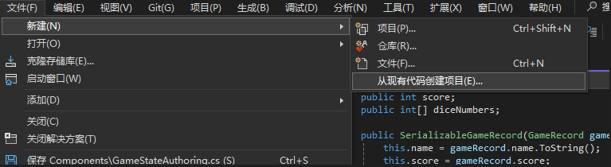
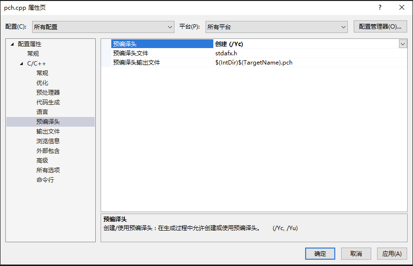
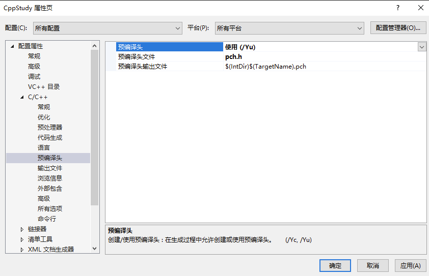

本文是一些未分类到具体哪一期的知识。  

- [使用 cpp 库操作文件](#使用-cpp-库操作文件)
- [size 和 count 命名含义](#size-和-count-命名含义)
- [const 和 mutable](#const-和-mutable)
		- [const 修饰普通类型](#const-修饰普通类型)
		- [const 修饰指针](#const-修饰指针)
		- [const 修饰成员函数](#const-修饰成员函数)
		- [mutable 修饰成员变量突破 const 限制](#mutable-修饰成员变量突破-const-限制)
		- [mutable 修饰 lamda 表达式](#mutable-修饰-lamda-表达式)
- [函数多个返回值](#函数多个返回值)
- [返回值可能为空](#返回值可能为空)
- [函数参数计算顺序](#函数参数计算顺序)
- [宏](#宏)
		- [符号操作](#符号操作)
		- [函数宏](#函数宏)
		- [常用宏](#常用宏)
		- [宏展开顺序](#宏展开顺序)
		- [__VA\_ARGS__ 嵌套使用](#va_args-嵌套使用)
- [VS 使用技巧](#vs-使用技巧)
	- [与活动文档同步以获取文件变化](#与活动文档同步以获取文件变化)
	- [设置代码风格](#设置代码风格)
	- [为一堆杂项文件创建新项目以可以跳转](#为一堆杂项文件创建新项目以可以跳转)
	- [代码无法跳转](#代码无法跳转)
	- [调试](#调试)
- [VSCode 使用技巧](#vscode-使用技巧)
	- [快捷键](#快捷键)
- [offsetof](#offsetof)
- [友元](#友元)
	- [友元函数](#友元函数)
		- [全局友元函数](#全局友元函数)
		- [其他类的友元函数](#其他类的友元函数)
	- [友元类](#友元类)
	- [友元性质](#友元性质)
	- [友元 Main](#友元-main)
- [类](#类)
	- [复制类](#复制类)
- [预编译头文件](#预编译头文件)
	- [设定之后。cpp 必须包含预编译头文件么](#设定之后 cpp-必须包含预编译头文件么)
	- [.h 可以使用预编译头文件么，这样会不会导致什么问题？](#h-可以使用预编译头文件么这样会不会导致什么问题)
	- [头文件引用](#头文件引用)
- [数组](#数组)
	- [原生数组](#原生数组)
	- [vector 动态数组](#vector-动态数组)
		- [emplace\_back](#emplace_back)
	- [array 静态数组](#array-静态数组)
	- [在哪创建](#在哪创建)
	- [std::initializer\_list](#stdinitializer_list)
	- [数组排序](#数组排序)
- [cpp 运行库设置](#cpp-运行库设置)
	- [C 和 C++运行库](#c-和-c 运行库)
		- [C 运行库](#c-运行库)
		- [C++运行库](#c 运行库)
	- [VC++编译器](#vc 编译器)
		- [DLL 和 LIB 区分](#dll-和-lib-区分)
	- [VS 设置](#vs-设置)
		- [/MT 和/MTd](#mt-和 mtd)
		- [/MD 和/MDd](#md-和 mdd)
		- [结论](#结论)
- [单例](#单例)
- [字符串](#字符串)
	- [char](#char)
	- [const char\*](#const-char)
		- [字符串中插入 0](#字符串中插入-0)
	- [string](#string)
		- [string 每次创建都会分配内存](#string-每次创建都会分配内存)
		- [小字符串](#小字符串)
		- [跟踪内存分配](#跟踪内存分配)
		- [原始字符串](#原始字符串)
		- [方法](#方法)
- [编程习惯](#编程习惯)
	- [同类类放在一个文件还是分开放置？](#同类类放在一个文件还是分开放置)
- [持续集成和静态分析](#持续集成和静态分析)
- [auto](#auto)
- [枚举](#枚举)
- [迭代器](#迭代器)
- [模板](#模板)
	- [在用到之前，并不存在](#在用到之前并不存在)
	- [使用场合广泛](#使用场合广泛)
	- [带参数的模板](#带参数的模板)
	- [模板特化](#模板特化)
		- [模板元编程](#模板元编程)
		- [传递同类型可变参数](#传递同类型可变参数)
- [多继承](#多继承)
	- [普通多继承](#普通多继承)
	- [虚拟多继承](#虚拟多继承)
		- [数据冗余](#数据冗余)
	- [多继承的指针相等与否](#多继承的指针相等与否)
	- [多继承声明](#多继承声明)
- [条件运算](#条件运算)
	- [if else](#if-else)
	- [三元运算符代替 if](#三元运算符代替-if)
- [线程](#线程)
	- [future](#future)
	- [lock\_guard 和 scoped\_lock](#lock_guard-和-scoped_lock)
- [基准测试](#基准测试)
		- [chrome://tracing](#chrometracing)
- [命名空间](#命名空间)
	- [什么时候使用 using namespace 来简化代码](#什么时候使用-using-namespace-来简化代码)
- [bind](#bind)
	- [组合 bind](#组合-bind)
- [仿函数](#仿函数)
- [函数指针](#函数指针)
	- [lambda](#lambda)
		- [通用表达式](#通用表达式)
	- [std::function](#stdfunction)
- [类方法的实质](#类方法的实质)
- [Cpp 与 CSharp 相互转化](#cpp-与-csharp-相互转化)
	- [方法调用](#方法调用)
	- [传递参数](#传递参数)
		- [字段和属性](#字段和属性)
	- [C#调用 C++](#c 调用-c)
- [外部变量](#外部变量)
- [未解决的问题](#未解决的问题)
	- [注释会影响代码编译](#注释会影响代码编译)
- [折叠表达式](#折叠表达式)
- [windows.h](#windowsh)
- [C++面试](#c 面试)
	- [**一、基础语法与概念**](#一基础语法与概念)
	- [**二、面向对象编程（OOP）**](#二面向对象编程 oop)
	- [**三、内存与资源管理**](#三内存与资源管理)
	- [**四、STL 与模板**](#四 stl-与模板)
	- [**五、多线程与并发**](#五多线程与并发)
	- [**六、设计模式与代码设计**](#六设计模式与代码设计)
	- [**七、C++11/14/17 新特性**](#七 c111417-新特性)
	- [**八、实战与代码题**](#八实战与代码题)
	- [**面试技巧**](#面试技巧)

## 使用 cpp 库操作文件
fstream 操作文件。ifstream 读取文件。ofstream 写文件。

sstream 存储信息流。getline 逐行获取。stringstream 存储文件内容。

```Cpp
#include <iostream>
#include <fstream>
#include <sstream>

#define Log(x) std::cout << x << std::endl;

int main()
{
	std::ifstream stream("src/Something.txt"，std::ios::in);
	std::string line;
	std::stringstream ss;
	
	stream.seekg(0, std::ios::end);
	Log(stream.tellg());
	// size_t size = stream.tellg();
	// if (size != -1)
	// {
	// 	result.resize(size);
	// 	stream.seekg(0, std::ios::beg);
	// 	stream.read(&result[0], size);
	// 	stream.close();
	// }
	stream.seekg(0, std::ios::beg);

	while (getline(stream, line))
	{
		ss << line << "\n";
	}

	Log(ss.str());
	stream.close();
	std::cin.get();
}
```

## size 和 count 命名含义
size 意味着 字节数  
count 意味着 数量统计

## const 和 mutable
const 是一个假的关键字，它是程序员的一种承诺，承诺之后不会对它修饰的东西进行更改，虽然我们可以绕过这个承诺。  
mutable 是在 const 基础上突破它的限制。  
#### const 修饰普通类型
代表着这个类型的数据不允许被更改，是个常量。
#### const 修饰指针
```Cpp
int a = 1, b = 2;
// 不允许这个指针指向的内存中的东西更改，但是可以改变指针本身的指向
const int* ptr0 = &a;	
*ptr0 = b;		// *ptr 不允许更改
ptr0 = &b;		// ptr 允许更改

// const 后置则相反
int* const ptr1 = &a;	
*ptr1 = b;		// *ptr 允许更改
ptr1 = &b;		// ptr 不允许更改

// 两者更是可以配合使用
const int* const ptr2 = &a;	
*ptr2 = b;		// *ptr 不允许更改
ptr2 = &b;		// ptr 不允许更改

// const int * 和 int const * 是一样的，这里关键是*和 const 的相对位置
```
#### const 修饰成员函数
操作符位于方法参数列表后，代码域前，表示这个函数不会修改类中的成员变量。
```Cpp
class Entity
{
public:
	void PrintName() const
	{
		name = "SSC";	// 不被允许
	}

private:
	const char* name = "FallShadow";
};
```
在其他函数中使用 const 修饰类类型，可以防止调用到有修改类风险的函数，即这个变量只能调用类中的 const 函数。
```Cpp
#include <iostream>

class Entity
{
public:
	void ChangeName()
	{
		name = "SSC";
	}

	void PrintName() const
	{
		std::cout << name << std::endl;
	}
private:
	const char* name = "FallShadow";
};

void PrintName(const Entity& e)
{
	e.PrintName();
	e.ChangeName();	// 不被允许
}
```

#### mutable 修饰成员变量突破 const 限制
如果类中有一个变量，即使在 const 函数中也可以进行修改，就要使用 mutable 来进行修饰。  
符合情景的例子有：调试参数，记录函数调用次数；锁定标记，只允许同时的一个进来。  
```cpp
class Entity
{
public:
	void PrintName() const
	{
		callTime++;
		std::cout << name << std::endl;
	}
private:
	const char* name = "FallShadow";
	mutable unsigned int callTime = 0;
};

void PrintName(const Entity& e)
{
	e.PrintName();
}
```

#### mutable 修饰 lamda 表达式
lamda 不能直接访问外部的变量，所以一般使用时要传递参数。
```Cpp
int x = 8;
auto f = [=](int x)
	{
		x++;
	};
f(x);
```
但是 mutable 修饰的可以不用传递。其实本质上也是使用了局部变量的方法，只不过是个语法糖。
```Cpp
int x = 8;
auto f = [=]() mutable
	{
		x++;
	};
f();
```

## 函数多个返回值
如果一个函数想返回 3 个 string
- 我们可以在调用这个函数前，创建 3 个 string，然后传递引用，然后更改这三个值。如果你想更明确些，可以在参数名字加上前缀 out 以示其是为了返回值。
- 你也可以使用指针，这样在你不想使用返回值时就不必在函数外定义 string，而是传入空指针。
- 或者直接使用 string *作为返回值，不过函数调用方不知道这个 string 多大，这也是不太方便的地方。
- 使用 array<string, 3>
- tuple  一个类，包含 x 个变量，且不关心类型

```C++
#include <iostream>
#define Log(x) std::cout << x << std::endl;
#include <tuple>

std::tuple<int, std::string, std::string> DoSomething()
{
	std::string a, b;
	int x;
	return std::make_tuple(x,a, b);
}

int main()
{
	auto results = DoSomething();
	Log(std::get<0>(results) << std::get<1>(results) << std::get<2>(results));
	std::cin.get();
}
```
- pair 类似 tuple 但是最多 2 个、

```C++
#include <iostream>
#define Log(x) std::cout << x << std::endl;
#include <tuple>

std::pair<int, std::string> DoSomething()
{
	std::string a;
	int x;
	return std::make_pair(x,a);
}

int main()
{
	auto results = DoSomething();
	Log(results.first << std::get<1>(results));
	std::cin.get();
}
```
- tie 新创建对应类型，来避免使用 0，1 这种不知道含义的代码

```C++
int main()
{
	int resultInt;
	std::string resultStr;
	std::tie(resultInt, resultStr) = DoSomething();
	Log(resultInt << resultStr));
	std::cin.get();
}
```
- 最好的方式其实是使用 struct，这样在调用函数的位置我们才知道返回的东西是啥意思，而不是 0、1，first、second 那样模糊不清。但是如果这些返回值不适合复用甚至仅仅使用了一次，为了这一次的返回使用 struct 很不值
- 对于使用次数很少，甚至仅仅一次的多项返回值，可以使用 C++17 中的结构化绑定。

```C++
int main()
{
	auto[resultInt, resultStr] = DoSomething();
	Log(resultInt << resultStr);
	std::cin.get();
}
```

## 返回值可能为空
函数返回值可能不能为我们所用或者非法，此时我们需要得知这个信息并且做出处理。
比如，读取一个文件并返回文件内容。如果文件不存在或者无法被打开等，我们需要知道这个错误。

传统做法可能是手动判断返回值是否如预期，比如文件的例子，我们可以设定返回空字符即为读取失败以做出处理，我们也可以额外返回一个 bool 表示操作的成功或者失败。
```C++
#include <iostream>
#include <fstream>

#define Log(x) std::cout << x << std::endl;

std::string ReadFileString(const std::string& filepath)
{
	std::ifstream stream(filepath);
	if (stream)
	{
		std::string content;
		// read file
		stream.close();
		return content;
	}

	return std::string();
}

int main()
{
	std::string content = ReadFileString("Something.txt");
	Log(content);
	std::cin.get();
}
```
C++17 支持的 optional 可以更方便地做到这点
```C++
#include <iostream>
#include <fstream>
#include <optional>

#define Log(x) std::cout << x << std::endl;

std::optional<std::string> ReadFileString(const std::string& filepath)
{
	std::ifstream stream(filepath);
	if (stream)
	{
		std::string content;
		// read file
		content = "content";
		stream.close();
		return content;
	}

	return { };
}

int main()
{
	std::optional<std::string> content = ReadFileString("Something.txt");
	
	// 如果是空值，就设置默认值 Empty
	std::string nowcontent = content.value_or("Empty");

	// 如果有值，就读值
	if (content.has_value())
	{
		Log("Success!");
		Log(content.value());
	}
	std::cin.get();
}
```

## 函数参数计算顺序
```C++
#include <iostream>

#define Log(x) std::cout << x << std::endl;

void Add(int a, int b)
{
	Log(a << " + " << b << " = " << a + b);
}

int main()
{
	int value = 0;
	Add(++value, ++value);
	std::cin.get();
}
```
这样的计算顺序是未定义的。根据编译器不同结果可能不同。
不过如果是后缀表达式，可以肯定的是 C++17 之后，不能同时进行，而是有先后的，所以是一个 1，一个 0. 如果是 3 个，就是 2,1,0

## 宏
在 C++中使用预处理器来“宏”化某些操作。

```Cpp
#include <iostream>

#if MP_DEBUG == 1
#define Log(x) std::cout << x << std::endl
#elif MP_RELEASE == 1
#define Log(x) 
#endif

int main()
{
	Log(1);
	std::cin.get();
}
```
不用#ifdef 是因为如果不想定义 MP_DEBUG 的话就得注释掉那行代码，这样做直接 = 0 就行。

#### 符号操作
- \\ 换行符 ： 使用、\，注意后面要直接接换行，不然还以为是空格的转义呐。

```Cpp
#include <iostream>

#define MAIN int main()\
{\
	std::cin.get();\
}

MAIN
```
- \#\# 连接

```cpp
#define Conn(x,y) x##y

int n = Conn(123,456);
    // ==> int n=123456;
char* str = Conn("asdf", "adf");
	// ==> char* str = "asdfadf";
```

- \#@ 字符化 ：将单个参数名转换成 const char

```Cpp
#define ToChar(x) #@x

char a = ToChar(1);
    // ==> char a='1';

char a = ToChar(123);
    // ==> char a='3';

char a = ToChar(1234);
	// 直接编译报错
```

- \# 字符串化操作符 ：加双引号

```Cpp
#define ToString(x) #x

char* str = ToString(123132);
	// ==> char* str="123132";

#define foo 4
#define xstr(s) str(s)
#define str(s) #s

// foo 是普通参数，优先宏展开
xstr (foo)
    // ==> xstr (4)
    // ==> str (4)
    // ==> "4"
// foo 作为字符串化参数，不会优先被宏展开
str (foo)
	// ==> "foo"
```
- \_\_VA_ARGS\_\_ ：用来接受不定数量的参数

```Cpp
#define eprintf(format, ...) fprintf (stderr, format, ##__VA_ARGS__)

eprintf ("%s:%d: ", input_file, lineno)
// ==>  fprintf (stderr, "%s:%d: ", input_file, lineno)
```

当、_\_VA_ARGS\_\_宏前面、#\#时，可以省略参数输入
```cpp
#define eprintf(format, ...) fprintf (stderr, format, ##__VA_ARGS__)

eprintf ("success!\n")
// ==> fprintf(stderr, "success!\n");
```
用##连接逗号和后面的__VA_ARGS__，这在 c 语言的 GNU 扩展语法里是一个特殊规则：当__VA_ARGS__为空时，会消除前面这个逗号。

\_\_LINE\_\_   当前行号

#### 函数宏
宏可以探知函数名或者函数签名  
函数名 : \_\_FUNCTION\_\_   
函数签名 : \_\_funcsig\_\_   
#### 常用宏
```Cpp
#error "编译报错宏，用来提示"

// 这将忽略在外部标头中引发的所有警告
#pragma warning(push, 0)
#include <spdlog/spdlog.h>
#pragma warning(pop)
// #pragma warning 控制编译器警告的级别
// #pragma warning(push, 0)：
// 这条指令将当前警告级别推入一个堆栈，并将警告级别设置为 0（禁用所有警告）。
// 这意味着在接下来的代码中，不会显示任何警告信息。
// #pragma warning(pop)：
// 这条指令从堆栈中弹出先前推入的警告级别。这将恢复之前的警告设置。
```
#### 宏展开顺序

```Cpp
// # ## 这两个优先级最高
// 然后再是由外到内
```

#### __VA_ARGS__ 嵌套使用

```Cpp
// 就是一个 logerror 函数
#define SD_CORE_ERROR(...)      ::Log::GetCoreLogger()->error(__VA_ARGS__)

#define HELP(x) x

#define LINK_MACRO(check, type, msg, ...) if(check) { SD_##type##_ERROR(msg, __VA_ARGS__); }
#define CALL_LINK_NOMSG(check, type) LINK_MACRO(check, type, "警告！出错行数：{0}", __LINE__)

#define CALL_LINK_HELP(...) HELP(CALL_LINK_NOMSG(__VA_ARGS__))
#define CALL_LINK(...) CALL_LINK_NOMSG(__VA_ARGS__)

// 下面是调用时及其展开
{
	// 没有 help 的帮助，直接进行 CALL_LINK_NOMSG 的展开
	// 其结果是，直接把__VA_ARGS__当成了第一个参数 check，而 type 是空
    CALL_LINK(1, CORE)
        if (1, CORE) {
            SD__ERROR("警告！出错行数：{0}", 15);
        }

	// 有了 help 的帮助，则需要先对 HELP(X) 进行替换，这个过程__VA_ARGS__就被拆分为 1, CORE
    CALL_LINK_HELP(1, CORE)
        if (1) {
            ::Shadow::Log::GetCoreLogger()->error("警告！出错行数：{0}", 20);
        }
}
```

## VS 使用技巧
Ctrl + Tab : 弹框切换标签页   
F9：快捷设置断点   
可以拖动断点的小箭头，F10 往下走两步，然后拖回上面，就可以继续 F10 执行这两步，然后反复执行这一段查错。

### 与活动文档同步以获取文件变化  


三个斜杆为函数生成参数注释

### 设置代码风格   
C#左大括号不要换新行，因为新行容易导致冲突。  


### 为一堆杂项文件创建新项目以可以跳转



### 代码无法跳转

### 调试
查看内存  

查看汇编代码  

在程序还在运行的情况下，让控制台打印出讯息  

性能探测器


TODO

## VSCode 使用技巧
### 快捷键
快捷键修改：
- Ctrl + Shift + P
- 输入 Preferences: Open Keyboard Shortcuts 并选择它
- 打开的键盘快捷键设置中，您可以搜索特定的命令，如 Fold All（折叠所有）或 Unfold All（展开所有）

展开所有 一键展开  
Ctrl + K 然后 Ctrl + J
收起所有 一键收起  
Ctrl + K 然后 Ctrl + 0
这里注意是数字 0，不是字母 O

## offsetof
```cpp
struct Vertex
{
	float Position[2];
	float Color[4];
	float TexCoords[2];
	float TexID;
};
offsetof(Vertex, Position);
```
用来很方便地探知变量所在的偏移位置，比起手动计算，使用 offsetof，即使有改动，也不需要变动函数。
## 友元
### 友元函数
#### 全局友元函数
友元函数在类中声明，但不在类中定义，却可以访问类的私有变量。

```Cpp
#include <iostream>
using namespace std;

class Student
{
	public:
		Student(char *name, int age, float score): m_name(name), m_age(age), m_score(score)
		{
		
		}
	
		// 将 show() 声明为友元函数
		friend void show(Student *pstu); 
	private:
	 	char *m_name;
	 	int m_age;
	 	float m_score;
};

// 非成员函数
void show(Student *pstu)
{
    cout << pstu->m_name << "的年龄是 " << pstu->m_age << "，成绩是 " << pstu->m_score << endl;
}

int main()
{
	Student stu("小明", 15, 90.6);
 	show(&stu); //调用友元函数

 	Student *pstu = new Student("李磊", 16, 80.5);
 	show(pstu); //调用友元函数

 	return 0;
}
```
成员函数在调用时会隐式地增加 this 指针，指向调用它的对象，从而使用该对象的成员；而 show() 是非成员函数，没有 this 指针，编译器不知道使用哪个对象的成员，要想明确这一点，就必须通过参数传递对象（可以直接传递对象，也可以传递对象指针或对象引用），并在访问成员时指明对象。
#### 其他类的友元函数

```Cpp
#include <iostream>
using namespace std;

// 提前声明 Address 类
class Address; 

// 声明 Student 类
class Student
{
	public:
 		Student(char *name, int age, float score): m_name(name), m_age(age), m_score(score){ }
 		void show(Address *addr);
	private:
 		char *m_name;
 		int m_age;
 		float m_score;
};

// 声明 Address 类
class Address
{
	private:
	 	char *m_province;
	 	char *m_city;
	 	char *m_district;
	public:
	 	Address(char *province, char *city, char *district)
		{
		    m_province = province;
		    m_city = city;
		    m_district = district;
		}

	 	// 将 Student 类中的成员函数 show() 声明为友元函数，以便于 student 访问 address 的内部变量
	 	friend void Student::show(Address *addr);
};

void Student::show(Address *addr)
{
    cout << m_name << "的年龄是 " << m_age << "，成绩是 " << m_score << endl;
    cout << "家庭住址：" << addr->m_province << "省" << addr->m_city << "市" << addr->m_district << "区" <<endl;
}

int main()
{
	Student stu("小明", 16, 95.5f);
	Address addr("陕西", "西安", "雁塔");
	stu.show(&addr);
	
	Student *pstu = new Student("李磊", 16, 80.5);
	Address *paddr = new Address("河北", "衡水", "桃城");
	pstu -> show(paddr);

	return 0;
}
```
一个函数可以被多个类声明为友元函数，这样就可以访问多个类中的 private 成员。

### 友元类

将类 B 声明为类 A 的友元类，那么类 B 中的所有成员函数都是类 A 的友元函数，B 可以访问类 A 的所有成员，包括 public、protected、private 属性的。

```Cpp
#include <iostream>
using namespace std;

class Address;

class Student{
	public:
	 	Student(char *name, int age, float score): m_name(name), m_age(age), m_score(score){ }
	public:
	 	void show(Address *addr);
	private:
	 	char *m_name;
	 	int m_age;
		float m_score;
};

class Address
{
	public:
		Address(char *province, char *city, char *district);

	 	// 将 Student 类声明为 Address 类的友元类
	 	friend class Student;
	private:
	 	char *m_province;
	 	char *m_city;
	 	char *m_district;
};

void Student::show(Address *addr)
{
    cout << m_name << "的年龄是 " << m_age << "，成绩是 " << m_score << endl;
    cout << "家庭住址：" << addr->m_province << "省" << addr->m_city << "市" << addr->m_district << "区" <<endl;
}

Address::Address(char *province, char *city, char *district)
{
    m_province = province;
    m_city = city;
    m_district = district;
}

int main()
{
	Student stu("小明", 16, 95.5f);
	Address addr("陕西", "西安", "雁塔");
    stu.show(&addr);
 
	Student *pstu = new Student("李磊", 16, 80.5);
	Address *paddr = new Address("河北", "衡水", "桃城");
    pstu->show(paddr);

	return 0;
}
```

### 友元性质

- 友元的关系是单向的而不是双向的。如果声明了类 B 是类 A 的友元类，不等于类 A 是类 B 的友元类，类 A 中的成员函数不能访问类 B 中的 private 成员。
- 友元的关系不能传递。如果类 B 是类 A 的友元类，类 C 是类 B 的友元类，不等于类 C 是类 A 的友元类。

### 友元 Main

```Cpp
friend int ::main(int argc, char** argv);
```
:: : 这是全局命名空间解析操作符，表示 main 函数位于全局命名空间。

## 类

### 复制类
以手写 String 类为例，看看类的复制会导致的问题。

```Cpp
class String
{
private:
	char* m_buffer;
	unsigned int m_size;
public:
	String(const char* string)
	{
		m_size = strlen(string);
		m_buffer = new char[m_size + 1];
		memcpy(m_buffer, string, m_size);
		m_buffer[m_size] = 0;
	}

	~String()
	{
		delete[] m_buffer;
	}

	char& operator[](unsigned int index)
	{
		return m_buffer[index];
	}

	friend std::ostream& operator<<(std::ostream& stream, const String& string);
};

std::ostream& operator<<(std::ostream& stream, const String& string)
{
	stream << string.m_buffer;
	return stream;
}

```

上述代码使用了友元函数，外部友元函数可以直接访问类私有变量。

```Cpp
int main()
{
	String nameA = "Sunshuchao";
	String nameB = nameA;
	Log(nameA);
	Log(nameB);
	std::cin.get();
}
```

在使用上述代码复制 string 时，当你敲下按键送入 get，程序终止时，会出现异常，因为 string 类复制时，m\_buffer 是指针，复制的是同样的内存地址，所以程序终止，析构时释放同一块内存，出错。
其根本原因是，复制时，调用的是 C++默认的复制构造函数。

```Cpp
	String(const String& other) : m_buffer(other.m_buffer), m_size(other.m_size) { }
```

这样做仅仅复制了指针，而实际两者指向了同一块内存，即浅复制。其实 unique\_ptr 无法被复制就是将复制构造函数设置为 delete。
我们要做的是在复制时给复制体一个全新的内存全新的家，即深复制。手段则是，在复制构造函数中手动申请新家。

```Cpp
	String(const String& other) : m_size(other.m_size)
	{
		m_buffer = new char[m_size + 1];
		memcpy(m_buffer, other.m_buffer, m_size + 1);
	}
```

顺便说下，当你在函数参数中使用 string 或类似类，我们其实都是进行了复制，所以参数列表最好总是使用&，并且，最好总是 const。

## 预编译头文件
如果我们的头文件被很多 cpp 引用，那么在编译的时候，预处理要进行文本复制，将我们的头文件复制到如此多的 cpp 中，然后编译器开始编译，这意味着我们将重复多次进行庞大代码的编译。很浪费时间。
预编译头文件，将头文件内容先编译为二进制，然后再应用到各个 cpp，因为已经编译过了，所以会很省时间。

创建预编译头文件 pch.h 和只引用它的 pch.cpp，然后更改设置。
pch.cpp 来创建预编译文件  
  
项目设置来使用预编译头文件  
  
这样其他代码在 include pch.h 就会使用预编译的二进制来提升速度。

在开发过程中，预编译头文件禁止我们在其中写入代码，因为我们的代码一般都是要经常变化的，这一变，编译的时候又要把这个头文件重新编译了。但也不排除把不经常变化且非常通用的代码放到 cpp，比如 log。

### 设定之后。cpp 必须包含预编译头文件么

如果您在项目中设置了预编译头文件，那么通常需要在每个。cpp 源文件的最开始包含这个预编译头文件。这是因为预编译头文件中的内容会被编译器预先编译，并在编译其他源文件时使用这些预编译的信息来加速编译过程。

这样做可以确保所有源文件都能利用预编译头文件带来的编译速度提升。如果某个源文件没有包含预编译头文件，那么它就不能利用预编译的优势，可能会导致该源文件的编译时间较长。

但是，也有一些情况下您可能不想或不需要在某些特定的源文件中包含预编译头文件，比如说这些源文件非常小，或者它们使用了与项目其余部分完全不同的库。在这种情况下，您可以在项目设置中为这些特定的源文件关闭预编译头文件的使用。

### .h 可以使用预编译头文件么，这样会不会导致什么问题？

通常情况下，预编译头文件（PCH）主要用于 .cpp 源文件，而不是 .h 头文件。这是因为预编译头文件的目的是加速编译过程，而头文件通常被多个源文件包含。如果在头文件中包含了预编译头文件，那么每个包含了该头文件的源文件都会间接地包含了预编译头文件，这可能会导致以下问题：
- 编译依赖：增加了不必要的编译依赖，可能会导致编译时间增加，特别是当预编译头文件很大时。
- 编译错误：如果预编译头文件中的宏或定义与其他源文件中的内容冲突，可能会导致难以追踪的编译错误。
- 可移植性问题：依赖于特定项目设置的预编译头文件可能会降低代码的可移植性。
因此，建议只在 .cpp 源文件中直接包含预编译头文件，并且在 .h 头文件中只包含必要的声明和定义。这样可以保持代码的清晰和可维护性，同时避免上述潜在问题。

### 头文件引用

一般如果是使用外部库的头文件或者编译器的头文件，使用<>。解决方案中的使用""

## 数组
数组其实就是指针。

### 原生数组
如果我们不使用 new 来创建，那就是在栈上创建数组，这样它的生命周期会随着代码块消逝。而如果你想获取函数里创建的数组，那就必须在堆上创建数组，使用 new，对应的，使用 delete 来销毁这部分内存，这样创建数组的好处还有内存间接寻址，比如在类中使用以节省类所占用的内存。

这种原生数组不像 C++中的 array 那样便利，array 可以直接得到数组长度等等信息，而原生数组无从得知。所以我们一般这样创建原生数组。
```Cpp
    // 在堆上创建原生数组
	static const int exampleSize = 5;
	int* example = new int[exampleSize];
```
### vector 动态数组
```C++
#include <iostream>
#define Log(x) std::cout << x << std::endl;
#include <vector>

struct Vertex
{
public:
	int x, y, z;
};

std::ostream& operator<<(std::ostream& stream, const Vertex& vertex)
{
	stream << vertex.x << ',' << vertex.y << ',' << vertex.z;
	return stream;
}

int main()
{
	std::vector<Vertex> vertices;
	vertices.push_back({ 0,0,1 });
	vertices.push_back({ 1,1,1 });
	for (int i = 0; i < vertices.size(); i++)
	{
		Log(vertices[i]);
	}
	
	vertices.erase(vertices.begin() + 1);

	for (Vertex& v : vertices)
	{
		Log(v);
	}

	std::cin.get();
}
```
上例展示了 vector 的基础用法，其中，vertices 是 vertex 列表，有时我们会创建 vertex *列表，这取决于我们的实际需要。  
上述例子性能极差，如果你在复制构造函数中打记号，其复制量会随着数组扩张而呈指数增长。  
其一：push_back({0,0,1}) 中的{0,0,1}是在 main 中创建，意味着要复制到 vertices 中。  
其二：屡次扩张 vertices，每次扩张都会将现有的 vertex 复制到新内存。  

#### emplace_back
```C++
int main()
{
	std::vector<Vertex> vertices;
	vertices.reserve(3);
	vertices.emplace_back(0, 0, 1);
	vertices.emplace_back(1,1,1 );
	std::cin.get();
}
```
- 当我们知道要创建多少够用时，应该直接指定大小容量。
- 在往里塞数据时，传入参数，让其在内部创建，防止复制。

### array 静态数组
静态数组必须指定大小，因为它不可以自己扩张。
array 和原生数组性能一致，但是功能更多，且有保护。
- 性能一致：虽然 array 可以让我们获取 size，但其实其内部并没有真的使用额外的变量来存储 size，它使用模板达到这一效果，所以他的性能是和原生数组一样的。
- 提供保护：原生数组越界是会真的读取那个位置上的数据，没有错误提示你可能都不知道这个问题，而 array 则会告知你，这不对。
### 在哪创建
vector 底层在堆上，array 在栈上。

### std::initializer_list
上述数组 vector 在初始化时可以不用显示指定长度，其初始化列表可以是任意长度。其实这是通过 std::initializer_list 这个轻量级的类模板来实现的。
```Cpp
class Foo
{
public:
    Foo(const std::initializer_list<int>& elements) : m_Elements(elements) {}
private:
	std::vector<int> m_Elements;
};
Foo foo = { 1, 2, 3, 4, 5 };
```
我们的类可以通过使用 std::initializer_list 来接收{…}

std::initializer_list 是非常高效的。它的内部并不负责保存初始化列表中元素的拷贝，仅仅存储了列表中元素的引用而已。
它有 3 个成员接口： size()、 begin()、 end()。
对 std::initializer_list 的访问只能通过 begin() 和 end() 进行循环遍历，遍历时取得的迭代器是只读的。因此，无法修改 std::initializer_list 中某一个元素的值，但是可以通过初始化列表的赋值对 std::initializer_list 做整体修改。
### 数组排序
```Cpp
#include <iostream>
#include <array>
#include <algorithm>

int main()
{
	std::array<int, 5> list = { 2,5,4,1,3 };
	std::sort(list.begin(), list.end(), std::greater<int>());
	for (int i = 0; i < 5; i++)
	{
		std::cout << list[i] << std::endl;
	}

	std::cin.get();
}
```
这是从大到小。如果这里不填，默认从小到大。
```C++
std::sort(list.begin(), list.end(), [](int a, int b) { return a < b; });
```
lambda 返回 true，取 a 在前。

## cpp 运行库设置
### C 和 C++运行库

#### C 运行库
为了提高 C 语言的开发效率，C 标准定义了一系列常用的函数，称为 C 库函数。C 标准仅仅定义了函数原型，并没有提供实现。因此这个任务留给了各个支持 C 语言标准的编译器。每个编译器通常实现了标准 C 的超集，称为 C 运行时库 (C Run Time Libray) ，简称 CRT。对于 VC++编译器来说，它提供的 CRT 库支持 C 标准定义的标准 C 函数，同时也有一些专门针对 windows 系统特别设计的函数。

#### C++运行库
与 C 语言类似，C++也定义了自己的标准，同时提供相关支持库，我们把它称为 C++运行时库或 C++标准库。由于 C++对 C 的兼容性，C++标准库包括了 C 标准库，除此之外还包括 IO 流和标准模板库 STL。

### VC++编译器
VC++完美的支持 C 和 C++标准，因此也就按照 C 和 C++的标准定义的函数原型实现了上述运行时库。为了方便有不同需求的客户的使用，VC++分别实现了动态链接库 DLL 版本和静态库 LIB 版本。同时为了支持程序调试且不影响程序的性能，又分别提供了对应的调试版本。调试版本的名称在 Release 版本名称后添了字母 d。

#### DLL 和 LIB 区分
因为静态版必须把 C 和 C++运行库复制到目标程序中，所以产生的可执行文件会比较大。同时对于使用多个模块的大型软件来说，如果每个模块均选择静态链接 C 或 C++运行库，在程序运行时就会存在多个运行库。在链接时也会出现重复定义的问题。

使用 DLL 版的 C 和 C++运行库，程序在运行时动态的加载对应的 DLL。程序体积变小，但一个很大的问题就是一旦找不到对应 DLL, 程序将无法运行。假设使用 VC6.0 并选择使用 MD 选项构建，那么当用户使用 VC2005 来使用这个 DLL 时很可能出现找不到 MSVCRT.DLL 或 MSVCP60.DLL 的情况。

### VS 设置
#### /MT 和/MTd
/MT 和/MTd 表示采用多线程 CRT 库的静态 lib 版本。该选项会在编译时将运行时库以静态 lib 的形式完全嵌入。该选项生成的可执行文件运行时不需要运行时库 dll 的参加，会获得轻微的性能提升，但最终生成的二进制代码因链入庞大的运行时库实现而变得非常臃肿。当某项目以静态链接库的形式嵌入到多个项目，则可能造成运行时库的内存管理有多份，最终将导致致命的“Invalid Address specified to RtlValidateHeap”问题。另外托管 C++和 CLI 中不再支持/MT 和/MTd 选项。

#### /MD 和/MDd
/MD 和/MDd 表示采用多线程 CRT 库的动态 dll 版本，会使应用程序使用运行时库特定版本的多线程 DLL。链接时将按照传统 VC 链接 dll 的方式将运行时库 MSVCRxx.DLL 的导入库 MSVCRT.lib 链接，在运行时要求安装了相应版本的 VC 运行时库可再发行组件包（当然把这些运行时库 dll 放在应用程序目录下也是可以的）。 因/MD 和/MDd 方式不会将运行时库链接到可执行文件内部，可有效减少可执行文件尺寸。当多项目以 MD 方式运作时，其内部会采用同一个堆，内存管理将被简化，跨模块内存管理问题也能得到缓解。

#### 结论
/MD 和/MDd 将是潮流所趋，/MT 和/MTd 在非必要时最好不要采用

## 单例
C++中的单例只是一种组织一堆全局变量和静态函数的方式。
```C++
// Random.h
#include <iostream>

#define Log(x) std::cout << x << std::endl;

class Random
{
//	在 Random 是父类时使用 protect 构造函数
// 	protected:
//  	Rendom() = default;
public:
	// 禁止复制和赋值
	Random(const Random&) = delete;
	Random& operator=(const Random&) = delete;

	static Random& Get()
	{
		static Random instance;
		return instance;
	}

	static float Float() { return Get().IFloat(); }

private:
	Random();
	float IFloat();
	float m_RandomGenerator;
};

// Random.cpp
#include "Random.h"

Random* Random::s_Instance = nullptr;
Random::Random（）{ s_Instance = this; }
float Random::IFloat() { return m_RandomGenerator; }

// main
int main()
{
	Log(Random::Float());
	std::cin.get();
}
```

## 字符串
### char
字符

strcpy 函数：
原型声明：char *strcpy(char* dest, const char *src);
功能：把从 src 地址开始且含有 NULL 结束符的字符串复制到以 dest 开始的 地址空间
说明：src 和 dest 所指内存区域不可以重叠且 dest 必须有足够的空间来容纳 src 的字符串。
返回：指向 dest 的 指针。

strcat 函数：
原型：extern char *strcat(char *dest, const char *src);
功能：将两个 char 类型连接。把 src 所指字符串添加到 dest 结尾处（覆盖 dest 结尾处的'\0')。

### const char*
字符串就是字符的集合。
字符串以 0 结束，没有以 0 结束的，计算机会继续读取

在后面加上 0 或者'\0'来阻止继续读取

#### 字符串中插入 0
在字符串中插入 0 会截短这个字符串。

### string
string 是 iostream 下的，但是使用时还是要引入 string，因为 string 重载了<<运算符，让其能处理 string。
"Something"双引号中的内容是 const char*，不是真正的 string.

在使用 string 时，如果要把它传入函数，请使用引用，除非你是想真的在函数中复制一份也无所谓。其他的类也是一样，如果不用引用，其实在函数里是使用的新创建的一份副本。

#### string 每次创建都会分配内存
```Cpp
#include <iostream>
#include <mutex>
#include <future>
#include <vector>

#define Log(x) std::cout << x << std::endl;

static int newCount;

void* operator new(size_t size)
{
	newCount++;
	Log("malloc " << size <<" bytes");
	return malloc(size);
}

void LogName(const std::string& name)
{
	Log(name);
}

void LogName(const char* name)
{
	Log(name);
}

int main()
{ 
	std::string name = "FallShadow";
	std::string firstName = name.substr(0, 4);
	std::string lastName = name.substr(4, 6);

	LogName(name.substr(0, 4));

	const char* name2 = "Fall";
	LogName(name2);

	Log(newCount);
	std::cin.get();
}
```

每次 sub 都真实分配了内存，这很费。C++17 提供了 string\_view，它不真实分配内存，而是对现有 string 进行观察。

```Cpp
#include <iostream>
#include <mutex>
#include <future>
#include <vector>

#define Log(x) std::cout << x << std::endl;

static int newCount;

void* operator new(size_t size)
{
	newCount++;
	Log("malloc " << size << " bytes");
	return malloc(size);
}

void LogName(const std::string& name)
{
	Log(name);
}

void LogName(const char* name)
{
	Log(name);
}

void LogName(std::string_view name)
{
	Log(name);
}

int main()
{
	std::string name = "FallShadow";
#if 0
	std::string firstName = name.substr(0, 4);
	std::string lastName = name.substr(4, 6);

	LogName(name.substr(0, 4));
#else
	std::string_view firstName(name.c_str(), 3);
	std::string_view lastName(name.c_str() + 4, 6);

	LogName(lastName);
#endif

	Log(newCount);
	std::cin.get();
}
```

但其实，使用 const char\*就不会有分配了。不过一般实际应用环境中还是 string。

#### 小字符串

C++对小字符串进行了优化，小于 15 个的字符串，不会进行 new 的分配，这点可以直接看 string 代码。

不过在 debug 下还是会进行分配，源代码是使用宏去做到这点的。

具体原理是有一个内部固定大小的内嵌缓冲区数组。
#### 跟踪内存分配

```Cpp
#include <iostream>
#include <memory>

#define Log(x) std::cout << x << std::endl;

struct AllocationMetrics
{
	uint32_t TotalAllocated = 0;
	uint32_t TotalFreed = 0;

	uint32_t CurrentUsage() { return TotalAllocated - TotalFreed; }
};

static AllocationMetrics s_AllocationMetrics;
static void PrintMemoryUsage()
{
	Log("Memory Usage: " << s_AllocationMetrics.CurrentUsage());
}

void* operator new(size_t size)
{
	s_AllocationMetrics.TotalAllocated += size;

	return malloc(size);
}

void operator delete(void* memory, size_t size)
{
	s_AllocationMetrics.TotalFreed += size;

	free(memory);
}

struct Object
{
	int x, y, z;
};

int main()
{
	PrintMemoryUsage();
	std::string str = "Hello";
	// const char* str = "Hello";
	PrintMemoryUsage();

	std::cin.get();
}
```
#### 原始字符串
C++11 新特性，原始字符串，字符串表示的就是自己，不需要转义字符。  
字符串中的换行符将在屏幕上如实显示，在表示字符串开头的"和（之间可以添加其他字符，不过必须在表示字符串结尾的）和"之间添加同样的字符。

#### 方法
str.find_first_of(str1, pos)  
从 pos 位置（默认是 0，即从头开始查找）开始查找 str1，从前往后，如果找到 str1 中的任何一个字符，则返回其在 str 中的索引值；如果没有找到，则返回 string::npos。

str.find_last_of(str1, pos)  
从后向前

```Cpp
auto lastSlash = filepath.find_last_of("/\\");
```

rfind(str)  
是从字符串右侧开始匹配 str，并返回在字符串中的位置（下标）, 这个是整体的了，若使用上例就是找 /\ 的位置

## 编程习惯

### 同类类放在一个文件还是分开放置？

比如 ertexbuffer 和 indexbuffer 这两个类
那其实他们都是 buffer 类型，所以还是放在一起的比较好

## 持续集成和静态分析

Jenkins 自动打包
pvs studio 检查一些永远为真的函数或者循环、检查一些越界之类的

## auto

auto 能帮助自动推断类型。然而绝大多数情况都用不到的。
虽然如果在调用函数的返回值接收上使用 auto 可以避免函数的改变影响到调用方，但实际上我们还是想知道具体类型的，不然可能会有很多错误的操作。
不过在你的变量很长的情况下，还是可以用 auto 来简化代码，不过我更倾向于仅仅在临时使用是这样做，比如迭代器的类型很长，而且我知道，迭代过后我就不会再用到那个变量，这时候我会用 auto，不然就算是函数返回类型非常长，我也会用 using 或者 typedef 来简化代码，而不是 auto。
还有一种情况是，在复杂的代码环境下，有可能是模版或者其他，我们甚至无法知道具体类型而不得不使用 auto 这个时候要注意了，你有可能需要审视你的整个代码了，因为它发出了太复杂的警告！

## 枚举

C++98 的 enum 是 "非域内枚举" 存在命名空间污染

```Cpp
// yellow, green, blue are in same scope as Color 
enum Color { yellow, green, blue};  

// error! yellow already declared in this scope 
auto yellow = false;　
```

C++11 的 enum class 是 "域内枚举"

## 迭代器
作用是用来遍历容器，而且是通用的遍历容器元素的方式，无论容器是基于什么数据结构实现的，尽管不同的数据结构，遍历元素的方式不一样，但是用迭代器遍历不同容器的代码是完全一样的。

迭代器一般实现为容器的嵌套类型，在容器内部提供具体的实现。但是容器不同，底层元素遍历的方式也不同，那么为什么说迭代器遍历所有容器的方式是一样的呢？那是因为迭代器提供了常用的 operator!=，operator++，operator *等运算符的重载函数，把迭代容器的细节全部隐藏在这些通用的运算符重载函数里面，因此用户侧表现出来的就是，迭代器遍历所有容器的方式都是一样的，其实底层都是不一样的风景^^！

## 模板
模板就是让编译器在你设定的规则下帮你写代码。
类似于其他语言的泛型，但是模板更加强大。
### 在用到之前，并不存在
```Cpp
template<typename T>
void Print(T value)
{
	std::cout << vale << std::endl;
}
```
所以这样的代码在未调用到 print 时也能通过编译。
用到之后，编译器才会生成对应的代码，在调用时可以显式声明类型，也可以不带，让编辑器自行判断。
```Cpp
int main()
{
	Print(1);
	Print<std::string>("Hello");
	std::cin.get();
}
```
### 使用场合广泛
```Cpp
template<typename T, int N>
class MyC
{
private:
	T list[N];
public:
	int GetCount()
	{
		return N;
	}
};
```

### 带参数的模板
```Cpp
// 这是一个唯一指针模板
template<typename T>
using Scope = std::unique_ptr<T>;
// 可变参数模板，递归使用，可以接受任意类型任意长度参数
template<typename T, typename ... Args>
constexpr Scope<T> CreateScope(Args&& ... args)
{
	return std::make_unique<T>(std::forward<Args>(args)...);
}
// 这是 new 的时候
Scope<RendererAPI> RenderCommand::s_RendererAPI = CreateScope<OpenGLRendererAPI>();
```
其中 std::forward<Args>(args)... 是 C++ 中的一个重要特性，用于完美转发（perfect forwarding）。
- 完美转发：
在 C++ 中，我们经常需要编写函数模板，以便接受不同类型的参数，并将这些参数传递给其他函数。完美转发允许我们在不丢失参数类型信息的情况下将参数转发给其他函数。
通常，我们会使用 std::forward 来实现完美转发。
- std::forward：
std::forward 是一个 C++ 标准库中的函数模板，位于 <utility> 头文件中。
它用于在函数模板中将参数转发给其他函数，以保持参数的值类别（lvalue 或 rvalue）不变。
使用 std::forward 时，我们通常将其放在函数模板中的参数上，例如：
```Cpp
template<typename T>
void myFunction(T&& arg) 
{
    otherFunction(std::forward<T>(arg));
}
```
这里，T&& 是一个通用引用，可以绑定到左值或右值。std::forward<T>(arg) 将 arg 转发给 otherFunction，并保持其值类别不变。
- 应用场景：
完美转发通常在实现通用容器、包装器、回调函数等方面非常有用。
例如，当我们编写一个通用的容器类时，我们希望能够正确地将元素插入到容器中，而不管元素是左值还是右值。

### 模板特化
类模板特化示例：
```Cpp
// 通用类模板
template <typename T>
class MyClass {
public:
    void Print() {
        std::cout << "Generic MyClass" << std::endl;
    }
};

// 类模板特化为 int 类型
template <>
class MyClass<int> {
public:
    void Print() {
        std::cout << "Specialized MyClass for int" << std::endl;
    }
};

// 使用示例
MyClass<float> obj1;
obj1.Print();   // Output: "Generic MyClass"

MyClass<int> obj2;
obj2.Print();   // Output: "Specialized MyClass for int"
```

函数模板特化示例：
```Cpp
// 通用函数模板
template <typename T>
void PrintValue(T value) {
    std::cout << "Generic Value: " << value << std::endl;
}

// 函数模板特化为 char *类型
template <>
void PrintValue<const char*>(const char* value) {
    std::cout << "Specialized Value: " << value << std::endl;
}

// 使用示例
PrintValue(10);              // Output: "Generic Value: 10"
PrintValue("Hello, World");  // Output: "Specialized Value: Hello, World"
```
这些示例展示了如何利用模板特化来针对特定类型提供定制化的实现。当模板参数匹配特化类型时，特化版本将被优先使用，从而使代码更具灵活性和可定制性。
#### 模板元编程
```Cpp
#include <iostream>

// 模板元编程计算斐波那契数列
template <int N>
struct Fibonacci 
{
    static constexpr int value = Fibonacci<N-1>::value + Fibonacci<N-2>::value;
};

template <>
struct Fibonacci<0> 
{
    static constexpr int value = 0;
};

template <>
struct Fibonacci<1> 
{
    static constexpr int value = 1;
};

int main() 
{
    // 计算第 10 个斐波那契数
    constexpr int fib_10 = Fibonacci<10>::value;
    std::cout << "Fibonacci(10) is: " << fib_10 << std::endl;

    return 0;
}
```
在这个示例中，我们定义了一个模板结构体 Fibonacci，利用递归的方式计算斐波那契数列中第 N 个数字。当 N 不是 0 或 1 时，Fibonacci<N> 结构体会根据 Fibonacci<N-1> 和 Fibonacci<N-2> 的值来计算第 N 个斐波那契数。当 N 等于 0 或 1 时，我们定义了特化的模板结构体来给出基础情况。

#### 传递同类型可变参数
```Cpp
emplate<typename ... Component>
struct ComponentGroup { };

using AllComponents = ComponentGroup<TransformComponent, SpriteRendererComponent, CircleRendererComponent>;

template<typename... Component>
static void CopyComponent(entt::registry& dst, entt::registry& src, const std::unordered_map<UUID, entt::entity>& enttMap)
{
    (
        [&]()
        {
            auto view = src.view<Component>();
            for (auto srcEntity : view)
            {
                entt::entity dstEntity = enttMap.at(src.get<IDComponent>(srcEntity).ID);

                auto& srcComponent = src.get<Component>(srcEntity);
                dst.emplace_or_replace<Component>(dstEntity, srcComponent);
            }
        }(),
            ...);
}

template<typename... Component>
static void CopyComponent(ComponentGroup<Component...>, entt::registry& dst, entt::registry& src, const std::unordered_map<UUID, entt::entity>& enttMap)
{
    CopyComponent<Component...>(dst, src, enttMap);
}
```
首先利用模板集合组件子类，再使用复制组件函数时，传递 AllComponents，利用。.. 承接多参数后，传递给真正的复制组件函数，这样可以在多个地方使用 AllComponents，而无需每次都用很多子类。

## 多继承

### 普通多继承

比如有一个类 A，类 B，和类 C 继承自 A，类 D 继承自 B 和 C。类 A 有一个 _a 成员， B 有 _b，C 有 _c，D 有 _d。

此时类 D 实例 d，内存上会是这样：

	B._a
	B._b
	C._a
	C._c
	D._d

调用时，D._a 会存在二义性，因为不知道想要 B 还是 C 的 _a 变量，只能使用这种调用方法，D.B._a，D.C._a.

### 虚拟多继承

同样是上述例子，但是 B 和 C 都是虚拟继承 A

```Cpp
class A
{
public:
	int _a;
};

class B : virtual public A
{
public:
	int _b;
};

class C : virtual public A
{
public:
	int _c;
};

class D : public B, public C
{
public:
	int _d;
};
```

此时，D 内存会是这样：

	B._a 相对此处偏移量的地址（这里地址对应的数值为 20，因为 D 的 _a 要偏移 5 个字节）
	B._b
	C._a 相对此处偏移量的地址（这里地址对应的数值为 20，因为 D 的 _a 要偏移 5 个字节）
	C._c
	D._d
	D._a 实际 _a 的值，也就是 B，C 的 _a 都指向这里。

此时，这个偏移量地址指向的地方所在处就是虚表。他可以方便地处理所有 D 实例所需要的偏移，因为他们需要的偏移量都是一样的。如果没有虚表，那会加大计算量增加复杂度，结构更改的适应能力也有所降低。

#### 数据冗余

看起来虚拟多继承并没有解决冗余问题，这是因为 _a 就是一个普通变量，如果 _a 是一个数组变量，普通的继承会完完全全多出一份 _a 数组，而 B C 因为是指向，所以不会增加。

### 多继承的指针相等与否

主要看首地址能不能对上！

```Cpp
class Base1 { public:  int _b1; };
class Base2 { public:  int _b2; };
class Derive : public Base2, public Base1 { public: int _d; };

int main() {
	Derive d;
	Base1* p1 = &d;
	Base2* p2 = &d;
	Derive* p3 = &d;
	return 0;
}
```
Base2 是第一个基类，所以 p1 = p3 != p2

```Cpp
class A {  
public:  
    int _a;  
};  

class B : public A {  
public:  
    int _b;  
};  

class C : public A {  
};  

class D : public B, public C {  
}; 

int main() {
	D d;  
	B* pB = &d;  
	C* pC = &d;  
	D* pD = &d;  
	return 0;
}
```
B 是第一个基类，所以 pB = pD != pC

```Cpp
class A {  
public:  
    int _a;  
};  

class B : virtual public A {  
public:  
    int _b;  
};  

class C : virtual public A {  
};  

class D : public B, public C {  
};  

int main() {
	D d;  
	A* pA = &d;  
	B* pB = &d;  
	C* pC = &d;  
	D* pD = &d;  
	return 0;
}
```
虚继承，位置都是不一定的。所以即使 B 是第一个基类，也不一定就在 D 的起始地址。

### 多继承声明

初始化列表顺序与构造顺序无关，谁先声明谁先构造。

```Cpp
#include<iostream>
using namespace std;
class A {
public:
	A(const char* s) { cout << s << endl; }
	~A() {}
};

class B :virtual public A
{
public:
	B(const char* sa, const char* sb) :A(sa) { cout << sb << endl; }
};

class C :virtual public A
{
public:
	C(const char* sa, const char* sb) :A(sa) { cout << sb << endl; }
};

class D :public B, public C
{
public:
	D(const char* sa, const char* sb, const char* sc, const char* sd) 
		:B(sa, sb), C(sa, sc), A(sa)
	{
		cout << sd << endl;
	}
};

int main() {
	D* p = new D("class A", "class B", "class C", "class D");
	delete p;

	return 0;
}
```

所以这段代码输出：ABCD。

## 条件运算
### if else
else if 仅仅是 else 里面有个 if。
在做判断的时候，<要比<=性能好，因为少了个=的比较。
逻辑运算其实不如数学运算性能好，后面有机会我们把 if 换成数学运算。

### 三元运算符代替 if
x = bool ? a : b;
这种写法在有些情况下会优化代码，比如 x 是一个 string，如果用 if，你一定是在外面先声明一个 string，然后赋值时又把之前的 string 丢弃了。这不好。而？: 会帮助我们。
## 线程
需要引入 thread 头文件。
```Cpp
#include <iostream>
#include <thread>

static bool s_Finished = false;

void WorkPrint()
{
	using namespace std::literals::chrono_literals;

	std::cout << "Thread id = " << std::this_thread::get_id() << std::endl;

	while (!s_Finished)
	{
		std::cout << "Working...\n";
		std::this_thread::sleep_for(1s);
	}
}

int main()
{
	std::cout << "Thread id = " << std::this_thread::get_id() << std::endl;

	std::thread worker(WorkPrint);

	std::cout << "Thread id = " << std::this_thread::get_id() << std::endl;
	std::cin.get();
	s_Finished = true;

	// worker 结束后，再往下执行
	worker.join();
	std::cout << "Finished." << std::endl;
	std::cout << "Thread id = " << std::this_thread::get_id() << std::endl;

	std::cin.get();
}
```


### future
```Cpp
#include <iostream>
#include <mutex>
#include <future>
#include <vector>

#define Log(x) std::cout << x << std::endl;

// 数据锁标记
static std::mutex s_MeshesMutex;
// 线程存储，将其生命周期拉长到外部，防止循环中直接析构
std::vector<std::future<void>> m_futures;

static void LoadMesh(std::string meshs, std::string file)
{
	std::lock_guard<std::mutex> lock(s_MeshesMutex);
	// 在后面写入需要锁定的数据操作
}

int main()
{ 
	std::string meshs, file;

#define ASYNC 1
#if ASYNC
	for (int i; i < 100; i++)
	{
		m_futures.push_back(std::async(std::launch::async, LoadMesh, meshs, file));
	}
#else
	for (int i; i < 100; i++)
	{
		// meshload
	}
#endif

	std::cin.get();
}
```
### lock_guard 和 scoped_lock
std::lock_guard 和 std::scoped_lock 都是 C++中的 RAII（Resource Acquisition Is Initialization）同步原语，用于自动管理互斥量的锁定和解锁。它们的主要区别在于：

std::lock_guard 在 C++11 中引入，只能管理一个互斥量。它在构造时锁定互斥量，在析构时解锁互斥量。
std::scoped_lock 在 C++17 中引入，可以同时管理多个互斥量。它在构造时以死锁避免算法锁定所有给定的互斥量，在析构时解锁它们。
如果您只需要锁定一个互斥量，并且不需要关心 C++17 的特性，那么 std::lock_guard 就足够了。但如果您需要同时锁定多个互斥量，并且希望自动避免死锁，那么应该使用 std::scoped_lock。

```Cpp
// std::lock_guard 示例
{
    std::lock_guard<std::mutex> lock(mutex1);
    // 在这里 mutex1 被锁定
}
// 离开作用域，mutex1 自动解锁

// std::scoped_lock 示例
{
    std::scoped_lock lock(mutex1, mutex2);
    // 在这里 mutex1 和 mutex2 都被锁定
}
// 离开作用域，mutex1 和 mutex2 自动解锁

```

## 基准测试
实际开发中我们需要计时来进行基准测试，测试函数性能等
```Cpp
#include <iostream>
#include <thread>
#include <chrono>

struct Timer
{
	std::chrono::steady_clock::time_point Start, End;
	std::chrono::duration<float> Duration;

	Timer()
	{
		Start = std::chrono::high_resolution_clock::now();
	}

	~Timer()
	{
		End = std::chrono::high_resolution_clock::now();
		Duration = End - Start;
		float ms = Duration.count() * 1000.0f;
		std::cout << "duration:" << ms << "ms" << std::endl;
	}
};

void PrintTimes()
{
	Timer timer;

	for (int i = 0; i < 1000; i++)
	{
		std::cout << "Hello!\n";
	}
}

int main()
{
	PrintTimes();
	std::cin.get();
}
```
通过这个例子我们甚至可以看到，单个""和分开的"" << "\n"和"" << std::endl 的性能区别。
如果精度不够，可以转换成 us。
```Cpp
auto startUs = std::chrono::time_point_cast<std::chrono::microseconds>(Start).time_since_epoch().count();
```

在使用基础计时进行代码测试时，要注意你的环境是 release 还是 debug，release 下，会优化你的代码，我们一般要在 release 进行测试才有意义，因为 debug 加入了很多多余的保护性代码会影响测试。
#### chrome://tracing
这是一个 json 可视化性能工具！

## 命名空间
命名空间是为了防止函数命名冲突。
可以一次性嵌套命名，可以重命名以省略。
### 什么时候使用 using namespace 来简化代码
- 永远不要在头文件使用。因为你不知道你引用了什么进来，可能会导致很难以察觉的错误
- 永远不要用在第三方库。还是因为你不知道你都引用了什么，可能有两个几乎一样的函数，一个隐式转换参数，一个完美匹配参数，你可能更改了原本想要隐式转换的那个。

```Cpp
#include <iostream>
#include <vector>

namespace A
{
	void PrintValue(std::string value)
	{
		std::cout << value << std::endl;
	}
}

namespace B
{
	void PrintValue(const char* value)
	{
		std::string temp = value;
		std::reverse(temp.begin(), temp.end());
		std::cout << temp << std::endl;
	}
}

int main()
{
	using namespace A;
	using namespace B;

	PrintValue("Hello!");
	std::cin.get();
}
```

- 要使用也就仅仅在自己的命名空间使用。

## bind

- 将可调用对象与其参数一起绑定成一个仿函数。
- 将多元（参数个数为 n ，n > 1）可调用对象转成一元或者（n - 1）元可调用对象，即只绑定部分参数。

```Cpp
void fun(int i, int j)
{
	if (i < j)
		cout << i << endl;
}

int main()
{
	vector<int> it1 = { 1,2,3,4, 6, 7, 8 };
	for_each(it1.begin(), it1.end(), std::bind(&fun, std::placeholders::_1, 5));

	return 0;
}
```

在非静态成员函数中，需要使用 this

```Cpp
class Test
{
public:
	void fun(int i, int j)
	{
		if (i < j)
			cout << i << endl;
	}

	void Printf()
	{
		vector<int> it1 = { 1, 2, 3, 4, 6, 7, 8 };
		for_each(it1.begin(), it1.end(), std::bind(&Test::fun, this, std::placeholders::_1, 5));
	}
};

int main()
{
	Test test;
	test.Printf();

	return 0;
}
```

### 组合 bind

bind 还有一个强大之处就是可以组合多个函数。假设要找出集合中大于 5 小于 10 的元素个数，可以使用大于 5 的函数 和 小于 10 的函数

```Cpp
std::bind(std::logical_and<bool>(), std::bind(std::greater<int>(), _1, 5), std::bind(std::less_equal<int>(), _1, 10));
```

## 仿函数

仿函数 (functor)，就是使一个类的使用看上去像一个函数。其实现就是类中实现一个 operator()，这个类就有了类似函数的行为，就是一个仿函数类了。

其实定义中已经说明特点，这里单独进行强调一下：
  - 仿函数不是函数是类
  - 仿函数重载了 () 运算符，拥有函数的行为

```Cpp
class print {
public:
	print(int j) : m_j(j)
	{
		cout << "This is print" << endl;
	}
public:
	void operator()(int i)
	{
		if(i < m_j)
			cout << i << endl;
	}

public:
	int m_j;
};

int main(int argv, char* argc[])
{
	vector<int> it = { 1,2,3,4, 6, 7, 8 };
	for_each(it.begin(), it.end(), print(5));
	return 0;
}
```

上例仿函数可以被 BIND 代替

```Cpp
void fun(int i, int j)
{
	if (i < j)
		cout << i << endl;
}

int main(int argv, char* argc[])
{
	vector<int> it = { 1, 2, 3, 4, 6, 7, 8 };
	for_each(it.begin(), it.end(), std::bind(fun, std::placeholders::_1, 5));
	return 0;
}
```

仿函数更多用途是配合 STL 进行使用，用于方便模板类和模板函数。比如如果我们不确定上例 vector 存储的类型，也不确定所输出的条件。

```Cpp
class print {
public:
	print(T j) : m_j(j) //模板类，不确定条件类型
	{
		cout << "This is print" << endl;
	}
public:
	void operator()(int i) //输出比 j 小的值
	{
		if (i < m_j)
			cout << i << endl;
	}

	void operator()(string i) //打印字符串大小小于 j 的值
	{
		if (i.size() < m_j)
			cout << i << endl;
	}

	void operator()(double i) //打印 double 比 i 小的值
	{
		if (i < m_j)
			cout << i << endl;
	}

public:
	T m_j;
};

int main(int argv, char* argc[])
{
	vector<int> it1 = { 1,2,3,4, 6, 7, 8 };
	for_each(it1.begin(), it1.end(), print(5));

	vector<string> it2 = { "123", "12345", "123436", "1343253245"};
	for_each(it2.begin(), it2.end(), print(5));

	vector<double> it3 = { 1.1, 2.3, 3.4, 4.7, 6.9, 7.1 };
	for_each(it3.begin(), it3.end(), print(5.0));
	
	return 0;
}
```

## 函数指针
```Cpp
#include <iostream>
#include <vector>

void PrintValue(int value)
{
	std::cout << "Hello : " << value << std::endl;
}

void ForEach(const std::vector<int>& values, void(*FunValue)(int))
{
	for (int value : values)
	{
		FunValue(value);
	}
}

int main()
{
	std::vector<int> list = { 1,2,5,10 };
	ForEach(list, PrintValue);

	std::cin.get();
}
```

- 普通函数
```Cpp
#include <iostream>

void printfNum(int num)
{
	std::cout << "printfNum : " << num << std::endl;
}

int main()
{
	void(*func1)(int) = printfNum;	// 函数指针
	void(&func2)(int) = printfNum;	// 函数引用
	func1(1);
	func2(2);

	return 0;
}
```
- 类成员函数和静态成员函数
```Cpp
#include <iostream>

class Base
{
public:
    int a;
    int b;

    void printfNum(int num)
    {
        std::cout << "printfNum : " << num << std::endl;
    }

    static void sPrintfNum(int num)
    {
        std::cout << "printfNum : " << num << std::endl;
    }
};

int main()
{
    void(Base:: *func1)(int) = &Base::printfNum;
    Base base;
    (base.*func1)(1);

    void(*func2)(int) = Base::sPrintfNum;
    func2(2);

    // 类非静态成员函数不允许引用
    // void (Base:: &func3)(int) = &Base::printfNum;
    // Base base;
    // (base.*func3)(3);

    void(&func4)(int) = Base::sPrintfNum;
    func4(4);
}
```
- 仿函数
无法使用指针指向
- lambda
```Cpp
#include <iostream>

int main()
{
    int (*func)(int) = [](int b)
        {
            std::cout << "lambda : " << b << std::endl;

            return b + 1;
        };
    func(func(0));
}

```

### lambda
```Cpp
	std::vector<int> list = { 1,2,5,10 };
	ForEach(list, [](int value) { std::cout << "Hello : " << value << std::endl; });
```
lambda 就是一个用完即弃的函数。只要你有函数指针，就可以使用 lambda。
lambda 的 [] 用来设定参数是按值还是按引用，=为值，&为引用
一般来说，lambda 一般用在迭代器。比如 find_if
```Cpp
int main()
{
 std::vector<int> list = { 1,2,5,10 };
 std::vector<int>::iterator result = std::find_if(list.begin(), list.end(), [](int value) { return value > 3; });
 std::cout << *result << std::endl;
 std::cin.get();
}
```
#### 通用表达式
Lambda 表达式通常使用以下语法定义：
```Cpp
auto lambda = [capture list] (parameter list) -> return-type 
{
    // lambda function body
}
```
其中：
[capture list] 是一个可选的捕获列表，指定 lambda 表达式可以访问的外部变量。
(parameter list) 是一个可选的参数列表，指定 lambda 表达式接收的参数。
-> return-type 是一个可选的返回类型指定符，指定 lambda 表达式的返回值类型。

如果 lambda 表达式包含一条 return 语句，则返回值类型为 return 表达式的类型。
如果 lambda 表达式包含一个或多个 return 语句，但它们返回不同类型的值，则返回值类型为这些类型中的任何一个。在这种情况下，编译器可能会发出警告。
如果 lambda 表达式不包含 return 语句，则返回值类型为 void。

```Cpp
// 创建一个函数对象，该对象将成员函数绑定到当前对象上，以便在事件处理中使用
#define SD_BIND_EVENT_FN(fn) [this](auto&&... args) -> decltype(auto) { return this->fn(std::forward<decltype(args)>(args)...); }
```

### std::function
std::function 是一个函数包装器，该函数包装器模板能包装任何类型的可调用实体，如普通函数，函数对象，lamda 表达式等。
- 普通函数
```Cpp
#include <iostream>
#include <functional>

void printfNum(int num)
{
	std::cout << "printfNum : " << num << std::endl;
}

int main()
{
	std::function<void(int)> func = printfNum;
	func(1);

	return 0;
}
```
- 类成员函数和静态成员函数
```Cpp
#include <iostream>
#include <functional>

class Base
{
public:
    int a;
    int b;

    void printfNum(int num)
    {
        std::cout << "printfNum : " << num << std::endl;
    }

    static void sPrintfNum(int num)
    {
        std::cout << "printfNum : " << num << std::endl;
    }
};

int main()
{
    Base base;
    std::function<void(int)> func1 = std::bind(&Base::printfNum, &base, std::placeholders::_1);
    func1(1);

    std::function<void(int)> func2 = &Base::sPrintfNum;
    func2(2);
}
```
- 仿函数
```Cpp
#include <iostream>
#include <functional>

class Base
{
public:
    void operator()(int num)
    {
        std::cout << "printfNum : " << num << std::endl;
    }
};

int main()
{
    Base base;
    base(0);
    std::function<void(int)> func1 = base;
    func1(1);

    return 0;
}
```
- lambda
```Cpp
#include <iostream>
#include <functional>

int main()
{
    std::function<int(int)> func = [](int b)
        {
            std::cout << "lambda : " << b << std::endl;

            return b + 1;
        };
    func(func(0));
}
```
## 类方法的实质
方法存储在类内，但是你在该类的实例上调用它们
实质上，所有 C++、C#类方法都有一个隐式参数，指向调用该方法的类实例，也就是 this 指针。
这也是为什么静态方法 static 不需要通过实例调用。他们本身就没有 this 指针。
## Cpp 与 CSharp 相互转化

```Cpp
	// 将文件加载到字节数组
	char* ReadBytes(const std::string& filepath, uint32_t* outSize)
	{
		std::ifstream stream(filepath, std::ios::binary | std::ios::ate);

		if (!stream)
		{
			// Failed to open the file
			return nullptr;
		}

		std::streampos end = stream.tellg();
		stream.seekg(0, std::ios::beg);
		uint32_t size = end - stream.tellg();

		if (size == 0)
		{
			// File is empty
			return nullptr;
		}

		char* buffer = new char[size];
		stream.read((char*)buffer, size);
		stream.close();

		*outSize = size;
		return buffer;
	}

	// 加载 C#程序集
	MonoAssembly* LoadCSharpAssembly(const std::string& assemblyPath)
	{
		uint32_t fileSize = 0;
		char* fileData = ReadBytes(assemblyPath, &fileSize);

		// 注意：我们不能对这个图像执行除了加载程序集以外的任何操作，因为这个图像没有对程序集的引用
		MonoImageOpenStatus status;
		// 第三个参数告诉 Mono 我们是否希望它复制数据，还是我们负责存储它，这里我们传递 1，表示 Mono 将数据复制到内部缓冲区中
		// 第四个参数是指向 MonoImageOpenStatus 枚举的指针，我们可以使用此值确定 Mono 是否能够读取该数据，或者是否有问题
		// 最后一个参数也是一个布尔值，如果设置为 true 或 1，表示 Mono 将以“反射模式”加载我们的图像，这意味着我们可以检查类型，但不能运行任何代码。
		MonoImage* image = mono_image_open_from_data_full(fileData, fileSize, 1, &status, 0);

		if (status != MONO_IMAGE_OK)
		{
			const char* errorMessage = mono_image_strerror(status);
			// 使用 errorMessage 数据记录一些错误消息
			return nullptr;
		}

		// 通过有效的图像加载创建一个 MonoAssembly
		// 如果此函数成功，我们将获得指向 MonoAssembly 结构的指针，否则它将返回 nullptr
		// 第一个参数是我们从 Mono 获得的图像，第二个参数实际上只是一个名称，Mono 可以在打印错误时使用，
		// 第三个参数是我们的 status 变量，此函数将在发生错误时写入我们的 status 变量，但在这一点上真的不应该生成错误，所以我们不会检查它。
		// 最后一个参数与 mono_image_open_from_data_full 中的最后一个参数相同，因此如果在那里指定了 1，你应该在此函数中也这样做，但在我们的情况下，我们将其设置为 0。
		MonoAssembly* assembly = mono_assembly_load_from_full(image, assemblyPath.c_str(), &status, 0);
		// 该图像仅用于获取 MonoAssembly 指针，现已无用
		mono_image_close(image);

		// 不要忘记释放文件数据
		delete[] fileData;

		return assembly;
	}

	// 迭代打印程序集中的所有类型定义
	void PrintAssemblyTypes(MonoAssembly* assembly)
	{
		// 获取程序集图像
		MonoImage* image = mono_assembly_get_image(assembly);
		// 从图像获取类型定义表信息
		const MonoTableInfo* typeDefinitionsTable = mono_image_get_table_info(image, MONO_TABLE_TYPEDEF);
		// 从表信息获取类型的数量，即行数
		int32_t numTypes = mono_table_info_get_rows(typeDefinitionsTable);

		for (int32_t i = 0; i < numTypes; i++)
		{
			// 当前行的列数据，所有列都将它们的数据存储为 uint32_t 即无符号 32 位整数
			// 将数组的大小设置为我们正在迭代的表的最大列数 MONO_TYPEDEF_SIZE
			uint32_t cols[MONO_TYPEDEF_SIZE];
			// 调用此函数后，我们的 cols 数组现在将包含一堆值，我们现在可以使用这些值来获取此类型的一些数据
			mono_metadata_decode_row(typeDefinitionsTable, i, cols, MONO_TYPEDEF_SIZE);

			// 从图像中获取命名空间和类型名称
			const char* nameSpace = mono_metadata_string_heap(image, cols[MONO_TYPEDEF_NAMESPACE]);
			const char* name = mono_metadata_string_heap(image, cols[MONO_TYPEDEF_NAME]);

			// 打印命名空间和类型名称
			HZ_CORE_TRACE("{}.{}", nameSpace, name);
		}
	}

	void ScriptEngine::InitMono()
	{
#pragma region 初始化 mono
		// 设置程序集 mscorlib 目录
		// 相对于当前工作目录的路径，当前在 Hazelnut
		mono_set_assemblies_path("mono/lib");

		// 初始化 mono，还有一个带 version 的函数，但我们一般让 mono 自己选择版本
		// 在调用此函数时，务必给它传递一个字符串，这个字符串本质上代表 runtime 的名称
		MonoDomain* rootDomain = mono_jit_init("HazelJITRuntime");
		HZ_CORE_ASSERT(rootDomain);

		// 在调用此函数时，我们会得到一个 MonoDomain 指针，重要的是我们要存储这个指针，因为稍后我们必须手动清理它
		s_Data->RootDomain = rootDomain;
#pragma endregion
		// 创建应用程序域，第一个参数是我们自己起的名字，第二个参数是配置文件路径，我们不需要
		s_Data->AppDomain = mono_domain_create_appdomain("HazelScriptRuntime", nullptr);
		// 将新的应用程序域设置为当前应用程序域，第一个参数为新的应用程序域，第二个参数为是否强制执行，其实 false 应该也行，true 可以让正在卸载应用程序域时也强行设置
		mono_domain_set(s_Data->AppDomain, true);

		// 加载 C#程序集
		s_Data->CoreAssembly = LoadCSharpAssembly("Resources/Scripts/Hazel-ScriptCore.dll");
		// 查看程序集中包含的所有类、结构体和枚举
		PrintAssemblyTypes(s_Data->CoreAssembly);

		// 1. 获取类指针
		MonoImage* assemblyImage = mono_assembly_get_image(s_Data->CoreAssembly);
		MonoClass* monoClass = mono_class_from_name(assemblyImage, "Hazel", "Main");

		// 2. 分配对象内存并调用无参构造
		MonoObject* instance = mono_object_new(s_Data->AppDomain, monoClass);
		mono_runtime_object_init(instance);

		// 3. 获取函数指针并调用 
		// 其中最后一个参数为形参数量，可以填写-1，则将返回找到的第一个函数指针。 返回函数指针，如果没找到，返回空指针
		// 如果函数有多个形参数量一样的重载版本，此函数则不管用，因为它不检查方法的实际签名
		MonoMethod* printMessageFunc = mono_class_get_method_from_name(monoClass, "PrintMessage", 0);
		mono_runtime_invoke(printMessageFunc, instance, nullptr, nullptr);
	}
```

### 方法调用
“非托管方法桩”（Unmanaged Method Thunks）是一种技术术语，特指一种用于在托管（managed）和非托管（unmanaged）代码之间建立桥梁的机制

使用 mono_runtime_invoke 相对于非托管方法桩（Unmanaged Method Thunks）来说速度较慢，但更安全且更灵活。mono_runtime_invoke 可以调用任何具有任何参数的方法，并且据我了解，它还在传递的对象和参数上执行更多的错误检查和验证。

非托管方法桩是在 Mono 的第二个版本中添加的一个概念，它允许你以比 mono_runtime_invoke 更小的开销调用 C#方法。非托管到托管的桩实际上创建了一个从非托管到托管代码的自定义调用方法（例如自定义的“跳板”），而该调用方法特定于你提供的方法签名，这意味着对于可以传递哪些参数没有歧义。

如果你每秒调用 C#方法多次（比如超过 10 次），并且你在编译时知道该方法的签名，那么你应该使用 Unmanaged Method Thunks。
如果你在编译时不知道方法签名，或者如果你只是偶尔而非每秒多次调用该方法，你可能会选择使用 mono_runtime_invoke。

### 传递参数
传递参数通常涉及在托管和非托管内存之间进行“封送数据（marshalling data）

marshalling ：不同编程环境或者数据表示之间进行数据传递的过程，涉及格式的调整和转换。具体而言，在不同的语言或环境之间传递数据时，可能会涉及到数据类型、内存布局、字节序等方面的差异。因此，进行数据驱动是确保数据在传递过程中能够正确映射和转换的关键步骤。在本文语境中，C++ 和 C# 交互时，我们需要考虑到这两种语言之间的数据格式差异，以确保数据能够被正确地传递和理解。

#### 字段和属性
C# 中，field 和 property 是不同的。字段和属性在底层实现上是不同的概念。字段是直接存储数据的地方，而属性是通过方法（get、set）来进行封装的。因此，获取字段的指针和获取属性的指针涉及到不同的内部处理逻辑。
字段：是类中存储数据的成员，它直接包含了数据。字段通常用于表示对象的状态或属性。
属性： 属性是一种通过方法来访问、设置或计算的成员。属性通常用于控制对类的字段的访问，允许在读取或写入字段值时执行特定的逻辑。
属性本质上只是围绕字段和两个方法 (get set) 的语法糖。

与方法一样，我们不是从类的实例中获取字段或属性，而是从类本身获取字段或属性，然后我们只需使用类实例访问字段或属性。

### C#调用 C++

## 外部变量
在 C++中，当你想在一个文件中使用在另一个文件定义的全局变量或函数时，你可以使用 extern 关键字来声明它。这告诉编译器该变量或函数的定义将在其他地方找到。

例如，如果你有一个在文件 A.cpp 中定义的全局变量，并且你想在文件 B.cpp 中使用它，你可以在 B.cpp 中这样声明它：

```Cpp
extern int myGlobalVar;
```

这样，你就可以在 B.cpp 中使用 myGlobalVar，而无需在每个文件中重新定义它。这有助于减少代码冗余，并确保所有文件中使用的是同一个变量实例。

需要注意的是，虽然 extern 可以用于函数声明，但通常不需要，因为函数声明默认就是外部链接的。但对于变量来说，如果没有 extern，每个文件都会有自己的独立实例。

## 未解决的问题

### 注释会影响代码编译

```Cpp
namespace Utils
{
        // 根据是否为多重采样返回 OpenGL 的对应枚举
        static GLenum TextureTarget(bool multisampled)
        {
            return multisampled ? GL_TEXTURE_2D_MULTISAMPLE : GL_TEXTURE_2D;
        }
}
```
这段代码在编译的时候为什么会报错：C2447	“{”: 缺少函数标题（是否是老式的形式表？)

但是我这样写就不会报错，为啥会跟注释有关？
```Cpp
namespace Utils
{
        static GLenum TextureTarget(bool multisampled)
        {
            return multisampled ? GL_TEXTURE_2D_MULTISAMPLE : GL_TEXTURE_2D;
        }
}
```

应该是 utf8 编码问题，但是用 vs 需要 utf8-bom 才行

## 折叠表达式
```Cpp

#include <iostream>

template<typename... Args>
auto sum(Args... args)
{
    return (... + args); // 左折叠，求和
}

int main()
{
    std::cout << sum(1, 2, 3, 4, 5) << std::endl; // 输出 15

    return 0;
}

```

```Cpp

template<typename ... Component>
struct ComponentGroup { };

using AllComponents = ComponentGroup<TransformComponent, SpriteRendererComponent, CircleRendererComponent>;

template<typename... Component>
static void CopyComponent(entt::registry& dst, entt::registry& src, const std::unordered_map<UUID, entt::entity>& enttMap)
{
    (
        [&]()
        {
            auto view = src.view<Component>();
            for (auto srcEntity : view)
            {
                entt::entity dstEntity = enttMap.at(src.get<IDComponent>(srcEntity).ID);

                auto& srcComponent = src.get<Component>(srcEntity);
                dst.emplace_or_replace<Component>(dstEntity, srcComponent);
            }
        }(),
            ...);
}

template<typename... Component>
static void CopyComponent(ComponentGroup<Component...>, entt::registry& dst, entt::registry& src, const std::unordered_map<UUID, entt::entity>& enttMap)
{
    CopyComponent<Component...>(dst, src, enttMap);
}

```
对于每一个组件都执行 lamda 表达式

## windows.h

建议将系统级别的头文件放在 C 运行时库的头文件前面。

```Cpp
#ifndef NOMINMAX
#define NOMINMAX // 去除 windows.h 最大最小函数，一般在程序想使用标准库而非 windows.h 库的最大最小函数时使用。
#endif

#ifndef WIN32_LEAN_AND_MEAN
#define WIN32_LEAN_AND_MEAN // 去除 windows.h 中的 n 种模块，具体根据版本不同有变化。目的是减少引入的代码量，减少命名污染，后面真的有需要再进行声明。
#endif

#include <windows.h>
```

## C++面试

在 C++面试中，面试官通常会从基础到高级逐步考察候选人的知识深度和实际应用能力。以下是常见的面试问题分类及示例，帮助你系统准备：

---

### **一、基础语法与概念**
1. **指针与引用**  
   - 区别是什么？引用是否可以为空？  
   - 示例：`int* p` 和 `int& r` 的底层差异。  

2. **内存管理**  
   - `new/delete` vs `malloc/free`（构造/析构函数的调用）。  
   - 什么是内存泄漏？如何检测？  

3. **`const`关键字**  
   - `const int*`、`int* const`、`const int* const` 的区别。  
   - `const`成员函数的作用（保证不修改对象状态）。  

4. **`static`关键字**  
   - 类内静态成员变量/函数的作用（属于类而非实例）。  
   - 全局静态变量的作用域和生命周期。  

---

### **二、面向对象编程（OOP）**
1. **封装、继承、多态**  
   - 多态的实现原理（虚函数表 vtable）。  
   - 虚析构函数的作用（避免派生类资源泄漏）。  

2. **虚函数与抽象类**  
   - 纯虚函数（`virtual void func() = 0;`）的作用。  
   - 能否在构造函数中调用虚函数？为什么？  

3. **继承与访问控制**  
   - `public`、`protected`、`private`继承的区别。  
   - 菱形继承问题及解决方法（虚继承）。  

---

### **三、内存与资源管理**
1. **堆 vs 栈**  
   - 栈内存的自动管理机制，堆的动态分配。  

2. **智能指针**  
   - `unique_ptr`（独占所有权） vs `shared_ptr`（引用计数） vs `weak_ptr`（打破循环引用）。  
   - 示例：`shared_ptr`循环引用导致的内存泄漏如何解决？  

3. **移动语义与右值引用**  
   - `std::move`的作用（将左值转为右值，触发移动构造函数）。  
   - 移动构造函数与拷贝构造函数的区别。  

---

### **四、STL 与模板**
1. **容器与算法**  
   - `vector`（动态数组） vs `list`（双向链表）的插入/查找复杂度。  
   - `map`（红黑树实现） vs `unordered_map`（哈希表）的适用场景。  

2. **迭代器失效**  
   - 什么操作会导致`vector`的迭代器失效（如插入元素导致扩容）？  

3. **模板元编程**  
   - 示例：如何用模板实现编译期计算斐波那契数列？  

---

### **五、多线程与并发**
1. **线程同步**  
   - `mutex`、`lock_guard`、`condition_variable`的使用场景。  
   - 如何避免死锁（按固定顺序加锁，RAII 管理锁）？  

2. **原子操作**  
   - `std::atomic`的作用（无锁线程安全操作）。  

3. **线程安全设计**  
   - 如何设计一个线程安全的单例模式？（双重检查锁定 + `std::call_once`）  

---

### **六、设计模式与代码设计**
1. **常见设计模式**  
   - 工厂模式（解耦对象创建） vs 观察者模式（事件通知）。  
   - 单例模式的懒汉式与饿汉式实现。  

2. **SOLID 原则**  
   - 举例说明开闭原则（对扩展开放，对修改关闭）。  

---

### **七、C++11/14/17 新特性**
1. **现代语法**  
   - `auto`推导类型、范围 for 循环（`for (auto& x : vec)`）。  
   - Lambda 表达式（`[capture](args) { ... }`）。  

2. **右值引用与完美转发**  
   - `std::forward`的作用（保持参数的值类别）。  

---

### **八、实战与代码题**
1. **手写代码**  
   - 反转链表、实现字符串类（考虑拷贝控制成员）。  
   - 二叉树层序遍历（使用队列）。  

2. **调试与优化**  
   - 如何用 Valgrind 检测内存泄漏？  
   - 性能优化案例：减少拷贝、使用移动语义。  

---

### **面试技巧**
- **清晰沟通**：回答时先概括要点，再展开细节。  
- **代码规范**：手写代码时注意命名、边界条件（如空指针、空容器）。  
- **项目经验**：准备一个用 C++解决的复杂问题，突出设计思路和优化手段。  

---

掌握以上内容，结合实际项目经验，能显著提升通过率。建议针对性练习 LeetCode 中等难度题目（如链表、树相关），并深入理解 C++底层机制（如对象内存布局、虚函数表）。