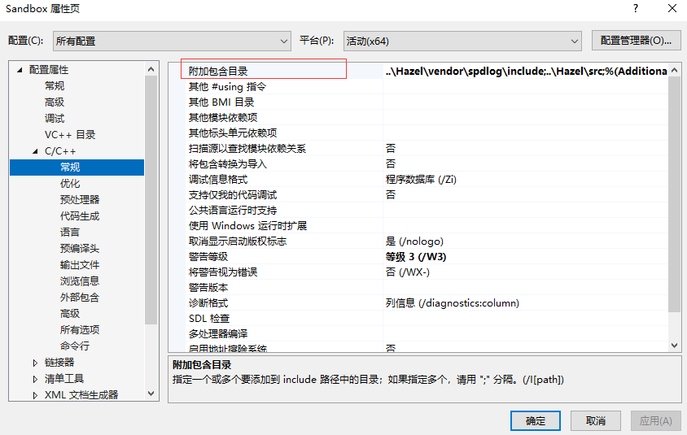

本文是一些未分类到具体哪一期的知识。  

[未解决的问题](#未解决的问题) 

[cpp运行库设置](#cpp运行库设置)  
[静态库和动态库](#静态库和动态库)  
[堆栈](#堆栈)
[折叠表达式](#折叠表达式)  


[命名空间](#命名空间)  
[静态修饰符](#static)  
[预编译头文件](#预编译头文件) 
[宏](#宏)
[const和mutable](#const和mutable)  
[constexpr](#constexpr)  
[指针](#指针)  
[外部变量](#外部变量)  
[数组](#数组)  
[迭代器](#迭代器)  
[string](#字符串)  
[枚举](#枚举)  
[条件运算](#条件运算)  
[类型双关](#类型双关)  
[类型转换](#类型转换)  
[auto](#auto)  
[左值和右值](#左值和右值)  
[BIND](#bind)  

[函数多个返回值](#函数多个返回值)  
[返回值可能为空](#返回值可能为空)  
[函数参数计算顺序](#函数参数计算顺序)  
[仿函数](#仿函数)  
[虚函数](#虚函数)  
[函数指针](#函数指针)  


[可见度](#可见度)  
[类](#类)  
[类方法的实质](#类方法的实质)  
[友元](#友元)  
[单例](#单例)  
[模板](#模板)  
[多继承](#多继承)

[size和count命名含义](#size和count命名含义)  
[VS使用技巧](#VS使用技巧)  
[VSCode使用技巧](#VSCode使用技巧)  
[使用cpp库操作文件](#使用cpp库操作文件)  
[线程](#线程)  
[基准测试](#基准测试)  
[持续集成和静态分析](#持续集成和静态分析) 
[编程习惯](#编程习惯) 
[Cpp与CSharp相互转化](#Cpp与CSharp相互转化) 

## 使用cpp库操作文件
fstream操作文件。ifstream读取文件。ofstream写文件。

sstream存储信息流。getline逐行获取。stringstream存储文件内容。

```Cpp
#include <iostream>
#include <fstream>
#include <sstream>

#define Log(x) std::cout << x << std::endl;

int main()
{
	std::ifstream stream("src/Something.txt"，std::ios::in);
	std::string line;
	std::stringstream ss;
	
	stream.seekg(0, std::ios::end);
	Log(stream.tellg());
	// size_t size = stream.tellg();
	// if (size != -1)
	// {
	// 	result.resize(size);
	// 	stream.seekg(0, std::ios::beg);
	// 	stream.read(&result[0], size);
	// 	stream.close();
	// }
	stream.seekg(0, std::ios::beg);

	while (getline(stream, line))
	{
		ss << line << "\n";
	}

	Log(ss.str());
	stream.close();
	std::cin.get();
}
```

## size和count命名含义
size 意味着 字节数  
count 意味着 数量统计

## const和mutable
const是一个假的关键字，它是程序员的一种承诺，承诺之后不会对它修饰的东西进行更改，虽然我们可以绕过这个承诺。  
mutable是在const基础上突破它的限制。  
#### const修饰普通类型
代表着这个类型的数据不允许被更改，是个常量。
#### const修饰指针
```Cpp
int a = 1, b = 2;
// 不允许这个指针指向的内存中的东西更改，但是可以改变指针本身的指向
const int* ptr0 = &a;	
*ptr0 = b;		// *ptr不允许更改
ptr0 = &b;		// ptr允许更改

// const后置则相反
int* const ptr1 = &a;	
*ptr1 = b;		// *ptr允许更改
ptr1 = &b;		// ptr不允许更改

// 两者更是可以配合使用
const int* const ptr2 = &a;	
*ptr2 = b;		// *ptr不允许更改
ptr2 = &b;		// ptr不允许更改

// const int * 和 int const * 是一样的，这里关键是*和const的相对位置
```
#### const修饰成员函数
操作符位于方法参数列表后，代码域前，表示这个函数不会修改类中的成员变量。
```Cpp
class Entity
{
public:
	void PrintName() const
	{
		name = "SSC";	// 不被允许
	}

private:
	const char* name = "FallShadow";
};
```
在其他函数中使用const修饰类类型，可以防止调用到有修改类风险的函数，即这个变量只能调用类中的const函数。
```Cpp
#include <iostream>

class Entity
{
public:
	void ChangeName()
	{
		name = "SSC";
	}

	void PrintName() const
	{
		std::cout << name << std::endl;
	}
private:
	const char* name = "FallShadow";
};

void PrintName(const Entity& e)
{
	e.PrintName();
	e.ChangeName();	// 不被允许
}
```

#### mutable修饰成员变量突破const限制
如果类中有一个变量，即使在const函数中也可以进行修改，就要使用mutable来进行修饰。  
符合情景的例子有：调试参数，记录函数调用次数；锁定标记，只允许同时的一个进来。  
```cpp
class Entity
{
public:
	void PrintName() const
	{
		callTime++;
		std::cout << name << std::endl;
	}
private:
	const char* name = "FallShadow";
	mutable unsigned int callTime = 0;
};

void PrintName(const Entity& e)
{
	e.PrintName();
}
```

#### mutable修饰lamda表达式
lamda不能直接访问外部的变量，所以一般使用时要传递参数。
```Cpp
int x = 8;
auto f = [=](int x)
	{
		x++;
	};
f(x);
```
但是mutable修饰的可以不用传递。其实本质上也是使用了局部变量的方法，只不过是个语法糖。
```Cpp
int x = 8;
auto f = [=]() mutable
	{
		x++;
	};
f();
```


## 函数多个返回值
如果一个函数想返回3个string
- 我们可以在调用这个函数前，创建3个string，然后传递引用，然后更改这三个值。如果你想更明确些，可以在参数名字加上前缀out以示其是为了返回值。
- 你也可以使用指针，这样在你不想使用返回值时就不必在函数外定义string，而是传入空指针。
- 或者直接使用string*作为返回值，不过函数调用方不知道这个string多大，这也是不太方便的地方。
- 使用array<string, 3>
- tuple  一个类，包含x个变量，且不关心类型

```C++
#include <iostream>
#define Log(x) std::cout << x << std::endl;
#include <tuple>

std::tuple<int, std::string, std::string> DoSomething()
{
	std::string a, b;
	int x;
	return std::make_tuple(x,a, b);
}

int main()
{
	auto results = DoSomething();
	Log(std::get<0>(results) << std::get<1>(results) << std::get<2>(results));
	std::cin.get();
}
```
- pair 类似tuple但是最多2个、

```C++
#include <iostream>
#define Log(x) std::cout << x << std::endl;
#include <tuple>

std::pair<int, std::string> DoSomething()
{
	std::string a;
	int x;
	return std::make_pair(x,a);
}

int main()
{
	auto results = DoSomething();
	Log(results.first << std::get<1>(results));
	std::cin.get();
}
```
- tie 新创建对应类型，来避免使用0，1这种不知道含义的代码

```C++
int main()
{
	int resultInt;
	std::string resultStr;
	std::tie(resultInt, resultStr) = DoSomething();
	Log(resultInt << resultStr));
	std::cin.get();
}
```
- 最好的方式其实是使用struct，这样在调用函数的位置我们才知道返回的东西是啥意思，而不是0、1，first、second那样模糊不清。但是如果这些返回值不适合复用甚至仅仅使用了一次，为了这一次的返回使用struct很不值
- 对于使用次数很少，甚至仅仅一次的多项返回值，可以使用C++17中的结构化绑定。

```C++
int main()
{
	auto[resultInt, resultStr] = DoSomething();
	Log(resultInt << resultStr);
	std::cin.get();
}
```


## 返回值可能为空
函数返回值可能不能为我们所用或者非法，此时我们需要得知这个信息并且做出处理。
比如，读取一个文件并返回文件内容。如果文件不存在或者无法被打开等，我们需要知道这个错误。

传统做法可能是手动判断返回值是否如预期，比如文件的例子，我们可以设定返回空字符即为读取失败以做出处理，我们也可以额外返回一个bool表示操作的成功或者失败。
```C++
#include <iostream>
#include <fstream>

#define Log(x) std::cout << x << std::endl;

std::string ReadFileString(const std::string& filepath)
{
	std::ifstream stream(filepath);
	if (stream)
	{
		std::string content;
		// read file
		stream.close();
		return content;
	}

	return std::string();
}


int main()
{
	std::string content = ReadFileString("Something.txt");
	Log(content);
	std::cin.get();
}
```
C++17支持的optional可以更方便地做到这点
```C++
#include <iostream>
#include <fstream>
#include <optional>

#define Log(x) std::cout << x << std::endl;

std::optional<std::string> ReadFileString(const std::string& filepath)
{
	std::ifstream stream(filepath);
	if (stream)
	{
		std::string content;
		// read file
		content = "content";
		stream.close();
		return content;
	}

	return { };
}


int main()
{
	std::optional<std::string> content = ReadFileString("Something.txt");
	
	// 如果是空值，就设置默认值Empty
	std::string nowcontent = content.value_or("Empty");

	// 如果有值，就读值
	if (content.has_value())
	{
		Log("Success!");
		Log(content.value());
	}
	std::cin.get();
}
```

## 函数参数计算顺序
```C++
#include <iostream>

#define Log(x) std::cout << x << std::endl;

void Add(int a, int b)
{
	Log(a << " + " << b << " = " << a + b);
}

int main()
{
	int value = 0;
	Add(++value, ++value);
	std::cin.get();
}
```
这样的计算顺序是未定义的。根据编译器不同结果可能不同。
不过如果是后缀表达式，可以肯定的是C++17之后，不能同时进行，而是有先后的，所以是一个1，一个0.如果是3个，就是2,1,0

## 宏
在C++中使用预处理器来“宏”化某些操作。

```Cpp
#include <iostream>

#if MP_DEBUG == 1
#define Log(x) std::cout << x << std::endl
#elif MP_RELEASE == 1
#define Log(x) 
#endif

int main()
{
	Log(1);
	std::cin.get();
}
```
不用#ifdef是因为如果不想定义MP_DEBUG的话就得注释掉那行代码，这样做直接 = 0就行。

#### 符号操作
- \\ 换行符 ： 使用\\，注意后面要直接接换行，不然还以为是空格的转义呐。

```Cpp
#include <iostream>

#define MAIN int main()\
{\
	std::cin.get();\
}

MAIN
```
- \#\# 连接

```cpp
#define Conn(x,y) x##y

int n = Conn(123,456);
    // ==> int n=123456;
char* str = Conn("asdf", "adf");
	// ==> char* str = "asdfadf";
```

- \#@ 字符化 ：将单个参数名转换成const char

```Cpp
#define ToChar(x) #@x

char a = ToChar(1);
    // ==> char a='1';

char a = ToChar(123);
    // ==> char a='3';

char a = ToChar(1234);
	// 直接编译报错
```

- \# 字符串化操作符 ：加双引号

```Cpp
#define ToString(x) #x

char* str = ToString(123132);
	// ==> char* str="123132";

#define foo 4
#define xstr(s) str(s)
#define str(s) #s

// foo是普通参数，优先宏展开
xstr (foo)
    // ==> xstr (4)
    // ==> str (4)
    // ==> "4"
// foo作为字符串化参数，不会优先被宏展开
str (foo)
	// ==> "foo"
```
- \_\_VA_ARGS\_\_ ：用来接受不定数量的参数

```Cpp
#define eprintf(format, ...) fprintf (stderr, format, ##__VA_ARGS__)

eprintf ("%s:%d: ", input_file, lineno)
// ==>  fprintf (stderr, "%s:%d: ", input_file, lineno)
```

当\_\_VA_ARGS\_\_宏前面\#\#时，可以省略参数输入
```cpp
#define eprintf(format, ...) fprintf (stderr, format, ##__VA_ARGS__)

eprintf ("success!\n")
// ==> fprintf(stderr, "success!\n");
```
用##连接逗号和后面的__VA_ARGS__，这在c语言的GNU扩展语法里是一个特殊规则：当__VA_ARGS__为空时，会消除前面这个逗号。


\_\_LINE\_\_   当前行号

#### 函数宏
宏可以探知函数名或者函数签名  
函数名 : \_\_FUNCTION\_\_   
函数签名 : \_\_funcsig\_\_   
#### 常用宏
```Cpp
#error "编译报错宏，用来提示"

// 这将忽略在外部标头中引发的所有警告
#pragma warning(push, 0)
#include <spdlog/spdlog.h>
#pragma warning(pop)
// #pragma warning 控制编译器警告的级别
// #pragma warning(push, 0)：
// 这条指令将当前警告级别推入一个堆栈，并将警告级别设置为 0（禁用所有警告）。
// 这意味着在接下来的代码中，不会显示任何警告信息。
// #pragma warning(pop)：
// 这条指令从堆栈中弹出先前推入的警告级别。这将恢复之前的警告设置。
```
#### 宏展开顺序
```Cpp
// # ## 这两个优先级最高
// 然后再是由外到内
```
#### __VA_ARGS__ 嵌套使用
```Cpp
// 就是一个logerror函数
#define SD_CORE_ERROR(...)      ::Log::GetCoreLogger()->error(__VA_ARGS__)

#define HELP(x) x

#define LINK_MACRO(check, type, msg, ...) if(check) { SD_##type##_ERROR(msg, __VA_ARGS__); }
#define CALL_LINK_NOMSG(check, type) LINK_MACRO(check, type, "警告！出错行数：{0}", __LINE__)

#define CALL_LINK_HELP(...) HELP(CALL_LINK_NOMSG(__VA_ARGS__))
#define CALL_LINK(...) CALL_LINK_NOMSG(__VA_ARGS__)

// 下面是调用时及其展开
{
	// 没有help的帮助，直接进行CALL_LINK_NOMSG的展开
	// 其结果是，直接把__VA_ARGS__当成了第一个参数check，而type是空
    CALL_LINK(1, CORE)
        if (1, CORE) {
            SD__ERROR("警告！出错行数：{0}", 15);
        }

	// 有了help的帮助，则需要先对HELP(X)进行替换，这个过程__VA_ARGS__就被拆分为1, CORE
    CALL_LINK_HELP(1, CORE)
        if (1) {
            ::Shadow::Log::GetCoreLogger()->error("警告！出错行数：{0}", 20);
        }
}

```


## VS使用技巧
Ctrl + Tab : 弹框切换标签页   
F9：快捷设置断点   
可以拖动断点的小箭头，F10往下走两步，然后拖回上面，就可以继续F10执行这两步，然后反复执行这一段查错。

### 与活动文档同步以获取文件变化  


三个斜杆为函数生成参数注释

### 设置代码风格   
C#左大括号不要换新行，因为新行容易导致冲突。  


### 为一堆杂项文件创建新项目以可以跳转


### 代码无法跳转


### 调试
查看内存  

查看汇编代码  

在程序还在运行的情况下，让控制台打印出讯息  

性能探测器


TODO


## VSCode使用技巧
### 快捷键
快捷键修改：
- Ctrl + Shift + P
- 输入 Preferences: Open Keyboard Shortcuts 并选择它
- 打开的键盘快捷键设置中，您可以搜索特定的命令，如 Fold All（折叠所有）或 Unfold All（展开所有）

展开所有 一键展开  
Ctrl + K 然后 Ctrl + J
收起所有 一键收起  
Ctrl + K 然后 Ctrl + 0
这里注意是数字0，不是字母O

## offsetof
```cpp
struct Vertex
{
	float Position[2];
	float Color[4];
	float TexCoords[2];
	float TexID;
};
offsetof(Vertex, Position);
```
用来很方便地探知变量所在的偏移位置，比起手动计算，使用offsetof，即使有改动，也不需要变动函数。
## 友元
### 友元函数
#### 全局友元函数
友元函数在类中声明，但不在类中定义，却可以访问类的私有变量。

```Cpp
#include <iostream>
using namespace std;

class Student
{
	public:
		Student(char *name, int age, float score): m_name(name), m_age(age), m_score(score)
		{
		
		}
	
		// 将show()声明为友元函数
		friend void show(Student *pstu); 
	private:
	 	char *m_name;
	 	int m_age;
	 	float m_score;
};

// 非成员函数
void show(Student *pstu)
{
    cout << pstu->m_name << "的年龄是 " << pstu->m_age << "，成绩是 " << pstu->m_score << endl;
}

int main()
{
	Student stu("小明", 15, 90.6);
 	show(&stu); //调用友元函数

 	Student *pstu = new Student("李磊", 16, 80.5);
 	show(pstu); //调用友元函数

 	return 0;
}
```
成员函数在调用时会隐式地增加 this 指针，指向调用它的对象，从而使用该对象的成员；而 show() 是非成员函数，没有 this 指针，编译器不知道使用哪个对象的成员，要想明确这一点，就必须通过参数传递对象（可以直接传递对象，也可以传递对象指针或对象引用），并在访问成员时指明对象。
#### 其他类的友元函数

```Cpp
#include <iostream>
using namespace std;

// 提前声明Address类
class Address; 

// 声明Student类
class Student
{
	public:
 		Student(char *name, int age, float score): m_name(name), m_age(age), m_score(score){ }
 		void show(Address *addr);
	private:
 		char *m_name;
 		int m_age;
 		float m_score;
};

// 声明Address类
class Address
{
	private:
	 	char *m_province;
	 	char *m_city;
	 	char *m_district;
	public:
	 	Address(char *province, char *city, char *district)
		{
		    m_province = province;
		    m_city = city;
		    m_district = district;
		}

	 	// 将Student类中的成员函数show()声明为友元函数，以便于student访问address的内部变量
	 	friend void Student::show(Address *addr);
};


void Student::show(Address *addr)
{
    cout << m_name << "的年龄是 " << m_age << "，成绩是 " << m_score << endl;
    cout << "家庭住址：" << addr->m_province << "省" << addr->m_city << "市" << addr->m_district << "区" <<endl;
}

int main()
{
	Student stu("小明", 16, 95.5f);
	Address addr("陕西", "西安", "雁塔");
	stu.show(&addr);
	
	Student *pstu = new Student("李磊", 16, 80.5);
	Address *paddr = new Address("河北", "衡水", "桃城");
	pstu -> show(paddr);

	return 0;
}
```
一个函数可以被多个类声明为友元函数，这样就可以访问多个类中的 private 成员。
### 友元类
将类 B 声明为类 A 的友元类，那么类 B 中的所有成员函数都是类 A 的友元函数，可以访问类 A 的所有成员，包括 public、protected、private 属性的。
```Cpp
#include <iostream>
using namespace std;

class Address;

class Student{
	public:
	 	Student(char *name, int age, float score): m_name(name), m_age(age), m_score(score){ }
	public:
	 	void show(Address *addr);
	private:
	 	char *m_name;
	 	int m_age;
		float m_score;
};


class Address
{
	public:
		Address(char *province, char *city, char *district);

	 	// 将Student类声明为Address类的友元类
	 	friend class Student;
	private:
	 	char *m_province;
	 	char *m_city;
	 	char *m_district;
};


void Student::show(Address *addr)
{
    cout << m_name << "的年龄是 " << m_age << "，成绩是 " << m_score << endl;
    cout << "家庭住址：" << addr->m_province << "省" << addr->m_city << "市" << addr->m_district << "区" <<endl;
}

Address::Address(char *province, char *city, char *district)
{
    m_province = province;
    m_city = city;
    m_district = district;
}

int main()
{
	Student stu("小明", 16, 95.5f);
	Address addr("陕西", "西安", "雁塔");
    stu.show(&addr);
 
	Student *pstu = new Student("李磊", 16, 80.5);
	Address *paddr = new Address("河北", "衡水", "桃城");
    pstu->show(paddr);

	return 0;
}
```
### 友元性质
- 友元的关系是单向的而不是双向的。如果声明了类 B 是类 A 的友元类，不等于类 A 是类 B 的友元类，类 A 中的成员函数不能访问类 B 中的 private 成员。
- 友元的关系不能传递。如果类 B 是类 A 的友元类，类 C 是类 B 的友元类，不等于类 C 是类 A 的友元类。
### 友元Main
```Cpp
friend int ::main(int argc, char** argv);
```
:: : 这是全局命名空间解析操作符，表示main函数位于全局命名空间。

## 类
### 声明
一般情况下，类必须在正式声明之后才能使用；  
但是某些情况下，只要做好提前声明，也可以先使用。

```Cpp
// 提前声明Address类
class Address; 

// 声明Student类
class Student
{
	public:
 		void show(Address *addr);
};

// 声明Address类
class Address { };
```
类的提前声明的使用效果是有限的，只有在正式声明一个类以后才能用它去创建对象。如果在上述例子中企图创建对象，会报错。

### 复制类
以手写String类为例，看看类的复制会导致的问题。

```Cpp
class String
{
private:
	char* m_buffer;
	unsigned int m_size;
public:
	String(const char* string)
	{
		m_size = strlen(string);
		m_buffer = new char[m_size + 1];
		memcpy(m_buffer, string, m_size);
		m_buffer[m_size] = 0;
	}

	~String()
	{
		delete[] m_buffer;
	}

	char& operator[](unsigned int index)
	{
		return m_buffer[index];
	}

	friend std::ostream& operator<<(std::ostream& stream, const String& string);
};

std::ostream& operator<<(std::ostream& stream, const String& string)
{
	stream << string.m_buffer;
	return stream;
}

```

上述代码使用了友元函数，外部友元函数可以直接访问类私有变量。

```Cpp
int main()
{
	String nameA = "Sunshuchao";
	String nameB = nameA;
	Log(nameA);
	Log(nameB);
	std::cin.get();
}
```

在使用上述代码复制string时，当你敲下按键送入get，程序终止时，会出现异常，因为string类复制时，m\_buffer是指针，复制的是同样的内存地址，所以程序终止，析构时释放同一块内存，出错。
其根本原因是，复制时，调用的是C++默认的复制构造函数。

```Cpp
	String(const String& other) : m_buffer(other.m_buffer), m_size(other.m_size) { }
```

这样做仅仅复制了指针，而实际两者指向了同一块内存，即浅复制。其实unique\_ptr无法被复制就是将复制构造函数设置为delete。
我们要做的是在复制时给复制体一个全新的内存全新的家，即深复制。手段则是，在复制构造函数中手动申请新家。

```Cpp
	String(const String& other) : m_size(other.m_size)
	{
		m_buffer = new char[m_size + 1];
		memcpy(m_buffer, other.m_buffer, m_size + 1);
	}
```

顺便说下，当你在函数参数中使用string或类似类，我们其实都是进行了复制，所以参数列表最好总是使用&，并且，最好总是const。

## 虚函数
父子类同名函数，如果不使用虚函数，那么在调用以父类作为参数的函数时，其中的父类同名函数调用，只会调用父类的结果，尽管参数是子类。
```C++
#include <iostream>
#define Log(x) std::cout << x << std::endl;

class Entity
{
public:
	std::string GetName() { return "Entity"; }
};

class Player : public Entity
{
public:
	std::string GetName() { return "Player"; }
};

void LogName(Entity* e)
{
	Log(e->GetName());
}

int main()
{
	Entity* e = new Entity();
	Player* p = new Player();
	LogName(e);
	LogName(p);

	std::cin.get();
}
```
虚函数引入了一种要动态分派的东西，通过虚表vtable来实现编译。
虚表是一个包含类中所有虚函数映射的列表。通过虚表我们可以在运行时找到正确的被重写的函数。
父类使用virtual，子类使用override，当然子类也可以省略override，但是写上有很多好处：
- 让别人一目了然，这个函数是重写的。
- 纠错，防止写重写函数时错拼字母或者防止父函数忘记virtual。
而且，其实子类也可以保持在前面的virtual以做提醒。

```C++
class Entity
{
public:
	virtual std::string GetName() { return "Entity"; }
};

class Player : public Entity
{
public:
	std::string GetName() override { return "Player"; }
	// virtual std::string GetName() override { return "Player"; } // 也是可行的
};
```
### 代价
需要额外的内存来存储虚表，基类多出一个指向虚表的指针。
每次调用虚函数都需要从虚表中遍历，性能损失。

### 纯虚函数
没有实现的虚函数就是纯虚函数。只有纯虚函数的类称之为接口。其他语言对于接口有一个自己的关键字interface，而C++还是用class类，只不过里面全是纯虚函数。但是这样的类不能被创建。
继承接口的类一定要实现接口，否则无法被实例化。
```C++
MoveInterface
{
public:
	virtual void Move() = 0;
};

class Entity
{
public:
	int a;
	virtual std::string GetName() { return "Entity"; }
};

class Player : public Entity, MoveInterface
{
public:
	std::string GetName() override { return "Player"; }
	void Move() override { }
};
```

### 虚析构函数
在C++中，虚析构函数是为了确保当通过基类指针删除派生类对象时，能够调用正确的析构函数来释放资源。如果基类的析构函数不是虚的，那么只会调用基类的析构函数，这可能导致派生类分配的资源没有被正确释放。因此，如果一个类被设计为基类，并且它可能会被继承，那么它的析构函数应该声明为虚的。

### 虚函数的底层分析
正常函数，所有实例共享同一段代码。相同的函数代码在内存中只存在一份，而不是每个对象都保存一份。
因此，正常函数并不占用对象的实例内存（如在栈或堆上分配的内存）。相反，它们存在于程序的代码段，这是一块不可修改的内存区域。当调用正常函数时，编译器会生成直接调用该函数的代码。调用这些函数的方式通常是将参数压入栈中，并通过函数名的地址直接跳转到函数的实现。

虚函数通过虚表管理，虚表又通过虚表指针来指向。
具体来说，一个无父类的类A，若其中有虚函数，则其内部会多出成员变量，虚表指针和虚表。展现在内存上的话，对于一个实例A，虚表指针在最前面，然后是类的按顺序定义的成员变量。虚表指针指向的虚表包含所有虚函数的内存地址，这个地址才是真正的代码段。

this -> vptr -> vtable ->virtual function

涉及到继承的情况，就需要详细分析了：
单继承：子类的虚函数表中先将父类虚函数放在前，再放自己的虚函数指针。如果子类覆盖了父类的虚函数，将被放到了虚表中原来父类虚函数的位置。
多继承：每个父类都有自己的虚表，子类的成员函数被放到了第一个父类的表中。也就是说当类在多重继承中时，其实例对象的内存结构并不只记录一个虚函数表指针。基类中有几个存在虚函数，则子类就会保存几个虚函数表指针。


#### 类空间变大
编译器会给每一个包含虚函数或继承了虚函数的类自动建立一个虚函数表，所以虚函数的一个代价就是会增加类的体积。

在虚函数接口较少的类中这个代价并不明显，虚函数表vtbl的体积相当于几个函数指针的体积，如果你有大量的类或者在每个类中有大量的虚函数,你会发现 vtbl 会占用大量的地址空间。但这并不是最主要的代价，主要的代价是发生在类的继承过程中，在上面的分析中，可以看到，当子类继承父类的虚函数时，子类会有自己的vtbl，如果子类只覆盖父类的一两个虚函数接口，子类vtbl的其余部分内容会与父类重复。如果存在大量的子类继承，且重写父类的虚函数接口只占总数的一小部分的情况下，会造成大量地址空间浪费。在一些GUI库上这种大量子类继承自同一父类且只覆盖其中一两个虚函数的情况是经常有的，这样就导致UI库的占用内存明显变大。

#### 类实例对象变大
由于虚函数指针vptr的存在，虚函数也会增加该类的每个对象的体积。在单继承或没有继承的情况下，类的每个对象会多一个vptr指针的体积，也就是4个字节；在多继承的情况下，类的每个对象会多N个（N＝包含虚函数的父类个数）vptr的体积，也就是4N个字节。当一个类的对象体积较大时，这个代价不是很明显，但当一个类的对象很轻量的时候，如成员变量只有4个字节，那么再加上4（或4N）个字节的vptr，对象的体积相当于翻了1（或N）倍，这个代价是非常大的。

#### 静态函数为啥不能是虚函数？
静态成员函数没有this指针，从而导致两者调用方式不同。虚函数依靠vptr和vtable来处理。vptr是一个指针，在类的构造函数中创建生成，并且只能用this指针来访问它，因为它是类的一个成员，并且vptr指向保存虚函数地址的vtable。虚函数的调用关系：this -> vptr -> vtable ->virtual function，对于静态成员函数，它没有this指针，所以无法访问vptr. 这就是为何static函数不能为virtual。

#### 虚函数能内联么？
虚函数用于实现运行时的多态，或者称为晚绑定或动态绑定。而内联函数用于提高效率。内联函数的原理是，在编译期间，对调用内联函数的地方的代码替换成函数代码。内联函数对于程序中需要频繁使用和调用的小函数非常有用。默认地，类中定义的所有函数，除了虚函数之外，会隐式地或自动地当成内联函数(注意：内联只是对于编译器的一个建议，编译器可以自己决定是否进行内联).
无论何时，使用基类指针或引用来调用虚函数，它都不能为内联函数(因为调用发生在运行时)。但是，无论何时，使用类的对象(不是指针或引用)来调用时，可以当做是内联，因为编译器在编译时确切知道对象是哪个类的。

#### 构造函数能是虚函数么？
虚函数基于虚表vtable（内存空间），构造函数 (constructor) 如果是virtual的，调用时也需要根据vtable寻找，但是constructor是virtual的情况下是找不到的，因为constructor自己本身都不存在了，创建不到class的实例，没有实例class的成员（除了public static/protected static for friend class/functions，其余无论是否virtual）都不能被访问了。此外构造函数不仅不能是虚函数。而且在构造函数中调用虚函数，实际执行的是父类的对应函数，因为自己还没有构造好,多态是被disable的。

#### 纯虚析构函数怎么写？
析构函数可以是纯虚的，但纯虚析构函数必须有定义体，这是因为如果基类对象被正确创建，这个析构函数需要被调用。

## 预编译头文件
如果我们的头文件被很多cpp引用，那么在编译的时候，预处理要进行文本复制，将我们的头文件复制到如此多的cpp中，然后编译器开始编译，这意味着我们将重复多次进行庞大代码的编译。很浪费时间。
预编译头文件，将头文件内容先编译为二进制，然后再应用到各个cpp，因为已经编译过了，所以会很省时间。

创建预编译头文件pch.h和只引用它的pch.cpp，然后更改设置。
pch.cpp来创建预编译文件

项目设置来使用预编译头文件

这样其他代码在include pch.h就会使用预编译的二进制来提升速度。

在开发过程中，预编译头文件禁止我们在其中写入代码，因为我们的代码一般都是要经常变化的，这一变，编译的时候又要把这个头文件重新编译了。但也不排除把不经常变化且非常通用的代码放到cpp，比如log。

### 设定之后.cpp必须包含预编译头文件么
如果您在项目中设置了预编译头文件，那么通常需要在每个.cpp源文件的最开始包含这个预编译头文件。这是因为预编译头文件中的内容会被编译器预先编译，并在编译其他源文件时使用这些预编译的信息来加速编译过程。

这样做可以确保所有源文件都能利用预编译头文件带来的编译速度提升。如果某个源文件没有包含预编译头文件，那么它就不能利用预编译的优势，可能会导致该源文件的编译时间较长。

但是，也有一些情况下您可能不想或不需要在某些特定的源文件中包含预编译头文件，比如说这些源文件非常小，或者它们使用了与项目其余部分完全不同的库。在这种情况下，您可以在项目设置中为这些特定的源文件关闭预编译头文件的使用。

### .h可以使用预编译头文件么，这样会不会导致什么问题？
通常情况下，预编译头文件（PCH）主要用于.cpp源文件，而不是.h头文件。这是因为预编译头文件的目的是加速编译过程，而头文件通常被多个源文件包含。如果在头文件中包含了预编译头文件，那么每个包含了该头文件的源文件都会间接地包含了预编译头文件，这可能会导致以下问题：
- 编译依赖：增加了不必要的编译依赖，可能会导致编译时间增加，特别是当预编译头文件很大时。
- 编译错误：如果预编译头文件中的宏或定义与其他源文件中的内容冲突，可能会导致难以追踪的编译错误。
- 可移植性问题：依赖于特定项目设置的预编译头文件可能会降低代码的可移植性。
因此，建议只在.cpp源文件中直接包含预编译头文件，并且在.h头文件中只包含必要的声明和定义。这样可以保持代码的清晰和可维护性，同时避免上述潜在问题。

### 头文件引用
一般如果是使用外部库的头文件或者编译器的头文件，使用<>。
解决方案中的使用""
## 指针
指针分为原始指针 raw pointer 和智能指针 smart pointer  
所有类型的指针都只是一个整数，存放一个内存地址  
指针加一就意味着其指向指针所指向对象的下一个对象  
指针参数使得被调用函数能够访问和修改主调函数中对象的值  

### 原始指针

#### 无类型0指针

```Cpp
void* ptr0 = 0;
void* ptrNull = NULL;
void* ptrNullPtr = nullptr;
```

无类型，内存地址为0


#### 类型不重要
指针就是指针，就是一个整数，跟类型无关，我们完全可以把空类型指针指向一个整数类型数据，或者用double类型指针指向一个整数类型数据。

```Cpp
int var = 8;
void* ptr = &var;
double* ptrDouble = (double*)&var;
```

#### 类型很重要
如果我们想从指针中取出值，电脑只知道一个地址，它不知道要取多少。  
好比上述例子中的空指针指向整型，就会报错

```Cpp
	int var = 8;
	void* ptr = &var;
	double* ptrDouble = (double*)&var;
	std::cout << *ptr << std::endl;
```
而ptrDouble意味着从指定位置开始读取double大小的数据，即8字节。

#### 指针的指针
指针也是变量，所以指针也可以被指针指。

```Cpp
	int var = 8;
	int* ptr = &var;
	int** ptrptr = &ptr;
```


#### 同一行的指针声明
```C++
int* a, b;
```
这里a是指针，而b只是int。如果两个都想要指针，需要两个前面都要有*.
#### 引用
引用其实就是指针的一个扩展，它们大体相同，但是有细微区别。
指针本身是一个变量，创建指针我们要给他赋值。
而引用必须引用一个现有的变量，其本身不是一个变量。它不真正占用内存，也不存储数据。它只存在于我们的源码，编译之后其实只有现有的那个变量，不存在引用了。

```Cpp
	int var = 8;
	int& ref = var;
```

##### 引用可以理解为让你的代码更干净的指针语法糖

指针

```Cpp
void Increment(int* value)
{
	(*value)++;
}

int main()
{
	int var = 8;
	Increment(&var);

	std::cout << var << std::endl;
	std::cin.get();
}
```

引用

```Cpp
void Increment(int& value)
{
	value++;
}

int main()
{
	int var = 8;
	Increment(var);

	std::cout << var << std::endl;
	std::cin.get();
}
```
##### 创建需要指定变量，一旦创建不可更改
```Cpp
	int a = 8;
	int b = 5;

	int& ref = a;
	ref = b;
```

这样其实是把a变成b的值，即a=5；所以如果你是想改变ref所引用的，你应该把ref变为指针。

### 智能指针

需要 include <memory>

unique_ptr shared_ptr weak_ptr

#### unique_ptr
unique_ptr正如字面意思，不允许创建两个指向同一个内存，不能复制，它必须独一无二，否则一个释放另一个没法弄了。还有就是创建的时候最好用异常保护的形式

```Cpp
#include <iostream>
#define Log(x) std::cout << x << std::endl;
#include <memory>

class ExampleHeap
{
public:
	ExampleHeap()
	{
		Log("Init!");
	}

	~ExampleHeap()
	{
		Log("Delete!");
	}
};

int main()
{
	{
		std::unique_ptr<ExampleHeap> entity = std::make_unique<ExampleHeap>();
	}
	std::cin.get();
}
```

#### shared_ptr

shared_ptr 允许你对同一块内存创建多个指针指向，这就像是计数，2 个指向后，一个退出来，计数减一，再一个退出，就真的把那个内存销毁了。


示例：

	shared_ptr<string> name = make_shared<string>("Test")

	断点查看 &name 内容

	0x0000007f902ff788 {ptr]=0x000001cb3b6aab60"Test"}

	其中地址 0x0000007f902ff788 和  0x000001cb3b6aab60 都指啥


	0x0000007f902ff788：这是 name 这个 shared_ptr 本身的地址。
	name 是一个 std::shared_ptr<std::string> 对象，它是一个智能指针，内部包含了一个指向实际对象（std::string）的指针，以及引用计数等元数据。

	0x000001cb3b6aab60：这是 shared_ptr 内部存储的指针（ptr）的值，也就是指向实际对象（std::string）的地址。
	std::shared_ptr 内部会管理一个指针（ptr），指向堆上分配的实际对象（在这里是 std::string 类型的对象，值为 "Test"）。


	std::shared_ptr 是一个智能指针，它的内部结构通常包含以下内容：

	一个指向实际对象的指针（ptr）。
	一个指向控制块的指针（control block），控制块中包含引用计数和其他元数据。

	std::make_shared<std::string>("Test") 会在堆上分配一个 std::string 对象（值为 "Test"），并同时分配一个控制块。
	name 是一个 std::shared_ptr，它内部存储了指向这个 std::string 对象的指针（ptr），以及指向控制块的指针。

	栈内存：  
	+-----------------------+  
	| name (shared_ptr)     |  地址：0x0000007f902ff788  
	|   ptr -> 0x000001cb3b6aab60  (指向堆上的 std::string 对象)  
	|   control block -> ... (指向控制块)  
	+-----------------------+  

	堆内存：  
	+-----------------------+  
	| std::string ("Test")  |  地址：0x000001cb3b6aab60  
	+-----------------------+  
	| control block         |  包含引用计数等元数据  
	+-----------------------+

##### reset

```Cpp
p.reset(q);	// q为智能指针要指向的新对象
```

这会令智能指针p中存放指针q，即p指向q的空间，而且会释放原来的空间，默认是delete。

#### weak_ptr

与 shared_ptr 配对使用。它不会增加计数，使用在想用这个类又不想掌控这个类的情境下，它不保证在使用过程中这个类不会死掉，但是你可以问它，你还有效么。


## 数组
数组其实就是指针。

### 原生数组
如果我们不使用new来创建，那就是在栈上创建数组，这样它的生命周期会随着代码块消逝。而如果你想获取函数里创建的数组，那就必须在堆上创建数组，使用new，对应的，使用delete来销毁这部分内存，这样创建数组的好处还有内存间接寻址，比如在类中使用以节省类所占用的内存。

这种原生数组不像C++中的array那样便利，array可以直接得到数组长度等等信息，而原生数组无从得知。所以我们一般这样创建原生数组。
```Cpp
    // 在堆上创建原生数组
	static const int exampleSize = 5;
	int* example = new int[exampleSize];
```
### vector动态数组
```C++
#include <iostream>
#define Log(x) std::cout << x << std::endl;
#include <vector>

struct Vertex
{
public:
	int x, y, z;
};

std::ostream& operator<<(std::ostream& stream, const Vertex& vertex)
{
	stream << vertex.x << ',' << vertex.y << ',' << vertex.z;
	return stream;
}

int main()
{
	std::vector<Vertex> vertices;
	vertices.push_back({ 0,0,1 });
	vertices.push_back({ 1,1,1 });
	for (int i = 0; i < vertices.size(); i++)
	{
		Log(vertices[i]);
	}
	
	vertices.erase(vertices.begin() + 1);

	for (Vertex& v : vertices)
	{
		Log(v);
	}

	std::cin.get();
}
```
上例展示了vector的基础用法，其中，vertices是vertex列表，有时我们会创建vertex*列表，这取决于我们的实际需要。  
上述例子性能极差，如果你在复制构造函数中打记号，其复制量会随着数组扩张而呈指数增长。  
其一：push_back({0,0,1})中的{0,0,1}是在main中创建，意味着要复制到vertices中。  
其二：屡次扩张vertices，每次扩张都会将现有的vertex复制到新内存。  

#### emplace_back
```C++
int main()
{
	std::vector<Vertex> vertices;
	vertices.reserve(3);
	vertices.emplace_back(0, 0, 1);
	vertices.emplace_back(1,1,1 );
	std::cin.get();
}
```
- 当我们知道要创建多少够用时，应该直接指定大小容量。
- 在往里塞数据时，传入参数，让其在内部创建，防止复制。

### array静态数组
静态数组必须指定大小，因为它不可以自己扩张。
array和原生数组性能一致，但是功能更多，且有保护。
- 性能一致：虽然array可以让我们获取size，但其实其内部并没有真的使用额外的变量来存储size，它使用模板达到这一效果，所以他的性能是和原生数组一样的。
- 提供保护：原生数组越界是会真的读取那个位置上的数据，没有错误提示你可能都不知道这个问题，而array则会告知你，这不对。
### 在哪创建
vector底层在堆上，array在栈上。


### std::initializer_list
上述数组vector在初始化时可以不用显示指定长度，其初始化列表可以是任意长度。其实这是通过std::initializer_list这个轻量级的类模板来实现的。
```Cpp
class Foo
{
public:
    Foo(const std::initializer_list<int>& elements) : m_Elements(elements) {}
private:
	std::vector<int> m_Elements;
};
Foo foo = { 1, 2, 3, 4, 5 };
```
我们的类可以通过使用std::initializer_list来接收{…}

std::initializer_list 是非常高效的。它的内部并不负责保存初始化列表中元素的拷贝，仅仅存储了列表中元素的引用而已。
它有 3 个成员接口： size()、 begin()、 end()。
对 std::initializer_list 的访问只能通过 begin() 和 end() 进行循环遍历，遍历时取得的迭代器是只读的。因此，无法修改 std::initializer_list 中某一个元素的值，但是可以通过初始化列表的赋值对 std::initializer_list 做整体修改.
### 数组排序
```Cpp
#include <iostream>
#include <array>
#include <algorithm>

int main()
{
	std::array<int, 5> list = { 2,5,4,1,3 };
	std::sort(list.begin(), list.end(), std::greater<int>());
	for (int i = 0; i < 5; i++)
	{
		std::cout << list[i] << std::endl;
	}

	std::cin.get();
}
```
这是从大到小。如果这里不填，默认从小到大。
```C++
std::sort(list.begin(), list.end(), [](int a, int b) { return a < b; });
```
lambda返回true，取a在前。

## cpp运行库设置
### C和C++运行库

#### C运行库
为了提高C语言的开发效率，C标准定义了一系列常用的函数，称为C库函数。C标准仅仅定义了函数原型，并没有提供实现。因此这个任务留给了各个支持C语言标准的编译器。每个编译器通常实现了标准C的超集，称为C运行时库(C Run Time Libray) ，简称CRT。对于VC++编译器来说，它提供的CRT库支持C标准定义的标准C函数，同时也有一些专门针对windows系统特别设计的函数。

#### C++运行库
与C语言类似，C++也定义了自己的标准，同时提供相关支持库，我们把它称为C++运行时库或C++标准库。由于C++对C的兼容性，C++标准库包括了C标准库，除此之外还包括IO流和标准模板库STL。

### VC++编译器
VC++完美的支持C和C++标准，因此也就按照C和C++的标准定义的函数原型实现了上述运行时库。为了方便有不同需求的客户的使用，VC++分别实现了动态链接库DLL版本和静态库LIB版本。同时为了支持程序调试且不影响程序的性能，又分别提供了对应的调试版本。调试版本的名称在Release版本名称后添了字母d。

#### DLL和LIB区分
因为静态版必须把C和C++运行库复制到目标程序中，所以产生的可执行文件会比较大。同时对于使用多个模块的大型软件来说，如果每个模块均选择静态链接C或C++运行库，在程序运行时就会存在多个运行库。在链接时也会出现重复定义的问题。

使用DLL版的C和C++运行库，程序在运行时动态的加载对应的DLL。程序体积变小，但一个很大的问题就是一旦找不到对应DLL,程序将无法运行。假设使用VC6.0并选择使用MD选项构建，那么当用户使用VC2005来使用这个DLL时很可能出现找不到MSVCRT.DLL或MSVCP60.DLL的情况。

### VS设置
#### /MT和/MTd
/MT和/MTd表示采用多线程CRT库的静态lib版本。该选项会在编译时将运行时库以静态lib的形式完全嵌入。该选项生成的可执行文件运行时不需要运行时库dll的参加，会获得轻微的性能提升，但最终生成的二进制代码因链入庞大的运行时库实现而变得非常臃肿。当某项目以静态链接库的形式嵌入到多个项目，则可能造成运行时库的内存管理有多份，最终将导致致命的“Invalid Address specified to RtlValidateHeap”问题。另外托管C++和CLI中不再支持/MT和/MTd选项。

#### /MD和/MDd
/MD和/MDd表示采用多线程CRT库的动态dll版本，会使应用程序使用运行时库特定版本的多线程DLL。链接时将按照传统VC链接dll的方式将运行时库MSVCRxx.DLL的导入库MSVCRT.lib链接，在运行时要求安装了相应版本的VC运行时库可再发行组件包（当然把这些运行时库dll放在应用程序目录下也是可以的）。 因/MD和/MDd方式不会将运行时库链接到可执行文件内部，可有效减少可执行文件尺寸。当多项目以MD方式运作时，其内部会采用同一个堆，内存管理将被简化，跨模块内存管理问题也能得到缓解。

#### 结论
/MD和/MDd将是潮流所趋，/MT和/MTd在非必要时最好不要采用

## 单例
C++中的单例只是一种组织一堆全局变量和静态函数的方式。
```C++
// Random.h
#include <iostream>

#define Log(x) std::cout << x << std::endl;

class Random
{
//	在Random是父类时使用protect构造函数
// 	protected:
//  	Rendom() = default;
public:
	// 禁止复制和赋值
	Random(const Random&) = delete;
	Random& operator=(const Random&) = delete;

	static Random& Get()
	{
		static Random instance;
		return instance;
	}

	static float Float() { return Get().IFloat(); }

private:
	Random();
	float IFloat();
	float m_RandomGenerator;
};

// Random.cpp
#include "Random.h"

Random* Random::s_Instance = nullptr;
Random::Random（）{ s_Instance = this; }
float Random::IFloat() { return m_RandomGenerator; }

// main
int main()
{
	Log(Random::Float());
	std::cin.get();
}
```
## 类型双关
```C++
	int a = 10;
	double b = a;
```
实际上a,b是位于两个不同的内存地址。b=a是一个隐式的转换。
```C++
	int a = 10;
	double b = *(double*)&a;
```
这里将一个指向原类型为int的double指针解引用为b，这定会导致b的值很奇怪，因为这句话将int数据4字节强行扩充为8字节，解释成了double数据。

```C++
#include <iostream>

struct Entity
{
	int x, y;
};

int main()
{
	Entity e = { 5, 8};
	int y = *(int*)((char*)&e + 4);
	std::cout << y << std::endl;
	std::cin.get();
}
```
C++就是可以这么自由地控制内存显示。
```C++
#include <iostream>

struct Entity
{
	int x, y;

	int* GetPosition()
	{
		return &x;
	}
};

int main()
{
	Entity e = { 5, 8};
	int* position = e.GetPosition();
	std::cout << position[1] << std::endl;
	std::cin.get();
}
```
对于同一个内存地址可以有不同的解释方法，这就是类型双关。
### union
```C++
struct Vector2
{
	float x, y;
};

struct Vector4
{
	float x, y, z, w;
}
```
对于v4，如果我们想使用v2的形式表达它，我们可以使用类型双关来解释。
```C++
struct Vector4
{
	float x, y, z, w;
	Vector2& GetV2A()
	{
		return *(Vector2*)&x;
	}

	Vector2& GetV2B()
	{
		return *(Vector2*)&z;
	}
};
```
还有一种更轻松的表达，就是使用union。
```C++
#include <iostream>

struct Vector2
{
	float x, y;
};

struct Vector4
{
	union
	{
		struct
		{
			float x, y, z, w;
		};

		struct
		{
			Vector2 a, b;
		};
	};
};

void PrintVector2(const Vector2& vector)
{
	std::cout << vector.x << "," << vector.y << std::endl;
}

int main()
{
	Vector4 v4 = { 1.0f,2.0f,3.0f,4.0f };
	PrintVector2(v4.a);
	PrintVector2(v4.b);
	v4.z = 50.0f;
	PrintVector2(v4.a);
	PrintVector2(v4.b);
	std::cin.get();
}
```
union就是对内存进行对齐解释，上例x,y对应a，z,w对应b。
### variant
还有一种单个变量存放多种类型数据的方法是使用variant。
但和union取最大的那个类型作为自身大小不同，variant大小为其中所有类型相加。如果不是为了顶级压榨性能，我们一般使用variant。
在使用时，最好先判断下数据是否是对应类型。
```C++
#include <iostream>
#include <variant>

#define Log(x) std::cout << x << std::endl;

int main()
{
	std::variant<std::string, int> data;
	data = "Hello";
	if (auto value = std::get_if<std::string>(&data))
	{
		Log(std::get<std::string>(data));
	}
	if (auto value = std::get_if<int>(&data))
	{
		Log(std::get<int>(data));
	}

	data = 2;
	Log(std::get<int>(data));

	std::cin.get();
}
```
此外，可以在多参数返回的情景中使用variant。
### any
还有一种可以存储任何类型而无需指定的方法，就是any。
```C++
#include <iostream>
#include <any>

#define Log(x) std::cout << x << std::endl;

void* operator new(size_t size)
{
	return malloc(size);
}

struct TestStruct
{
	std::string s0, s1;
};

int main()
{
	std::any data;
	//data = 5;
	//data = std::string("Hello");
	//std::string& string = std::any_cast<std::string&>(data);

	data = TestStruct();

	std::cin.get();
}
```
但是any有个问题是，超过32字节的内容，它会去堆上动态分配内存，这很慢。

事实上，我们用variant就可以了，即类型安全，又不会动态分配内存。any就是个小丑。
## 类型转换
```C++
#include <iostream>

int main()
{
	double a = 5.5;
	int b = (int)a;

	int b = static_cast<int>(a);

	std::cin.get();
}
```
类型转换常用的有四种。但是这四种效果其实都是类型转换，只不过是加了一些能起到额外效果的语法糖。而且这样我们易于搜索类型转换。
- static_cast会做一些编译时检查，来看看是不是这种转换真的可能。
- reinterpret_cast意思是不想转换，而是把这段内存重新解释成别的东西，就是类型双关。

```C++
#include <iostream>

class Entity
{

};

int main()
{
	int a;
	Entity e = *(reinterpret_cast<Entity*>(a));

	std::cin.get();
}
```
- const_cast移除或者添加变量的const限定。
- dynamic_cast检查这个转换是否成功，即是否是有意义的转换。
dynamic_cast更像是一个函数，在运行时进行转换。

```C++
#include <iostream>

class Entity
{
public:
	Entity(){}
	virtual ~Entity(){}
};

class Player : public Entity
{
public:
	Player() {}
	~Player() {}
};

class OtherPlayer : public Entity
{
public:
	OtherPlayer() {}
	~OtherPlayer() {}
};

int main()
{
	Player* p = new Player();
	Entity* e = p;

	OtherPlayer* o = dynamic_cast<OtherPlayer*>(e);
	if (!o)
	{
		std::cout << "No" << std::endl;
	}
	std::cin.get();
}
```
上述例子就是不能转换的，因为e已经是一个player实例了，转换到otherplayer不合适。
当转换可以实现，就会返回正确类型指针，否则，返回null。
它能做到这点，是因为它储存了运行时类型信息，runtime type information RTTI，它存储着我们所有类型的运行时类型信息。这会增加开销，但是这会让我们做动态类型转换之类的事情。

如果禁用了RTTI，就会警告我们不可预知的行为。

其他语言比如C#，会用is来判断转换类型是否成功，然后进行使用。
### 类型转换运算符
类型转换运算符允许你在类中定义从该类类型到其他类型的隐式转换。
它通常用于将自定义类对象转换为基本数据类型（如整数、浮点数、指针等）。

类型转换运算符的语法如下：
```Cpp
operator target_type() const；
```

其中：
target_type 是你希望将类对象转换为的目标类型。
const 修饰符表示这个运算符不会修改类对象的状态。

```Cpp
class Timestep
{
public:
	Timestep(float time = 0.0f) : m_Time(time) { }

	operator float() const { return m_Time; }
private:
	float m_Time;
};


```

## 静态库和动态库
静态库项目生成lib，link时会将所有的代码都代入到所需项目中。
动态库项目生成dll，link时自身还是那个dll文件，只不过exe通过导入导出符号来使用dll中的内容。

lib会导致主代码库臃肿，但速度会快（因为内联之类会生效）。
dll单独一个文件，且内存管理方便。

dll有个小问题，如果你的dll使用了另一个lib，但是dll实际文件中，并没有用到lib的A函数，那么A函数就不会被链接到dll中，导致主项目在使用dll时，无法使用A函数的情况。  
解法一：在lib和dll中手动标记导出使用的函数，在exe中接收。
### 静态库使用
引入一个外部静态库，需要两个文件：头文件和lib文件。
头文件，里面是所有声明。
lib文件，通常较大，里面是所有函数的定义。

将这两个文件放在我们的解决方案中，在VS设置里，将头文件引入include。
这时候其实就可以使用外部库的函数了，因为声明都在，编译也就不会出错。
但是链接时，由于没有函数的实际定义，会报错。

这就需要我们在vs中再将库目录和附加依赖项设置下。

这样一个静态库就链接好了。因为链接器可以看到更多东西，所以静态链接允许更多优化。
### 动态库使用
在程序真的执行起来的时候，才会被加载。
与静态库一样设置头文件，库目录，最后附加项，要使用dll.lib文件，这个文件是dll函数指向文件，其包含了dll中函数的位置。这样之后就可以生成项目了，但是运行之后，你会得到窗口报错：缺少XXX.dll，这是因为我们没有把DLL放到可执行文件目录下，运行时找不到动态库导致的。只要我们把文件复制过去就可以了。

### 同一解决方案下不同项目通讯
S解决方案中的A项目想用B项目的方法，使用附加include。

按照上述第三方静态库的用法，我们可能还需要设置库目录，并在附加依赖中设置B项目的lib，然而这些都可以省略，因为，AB是在同一个解决方案中，我们只要在项目右键的引用中引用B项目就好。

一个需要注意的地方是，如果B项目有变动，那在生成A项目时，B也会连带着走一遍。
## 字符串
### char
字符

strcpy函数：
原型声明：char *strcpy(char* dest, const char *src);
功能：把从src地址开始且含有NULL结束符的字符串复制到以dest开始的 地址空间
说明：src和dest所指内存区域不可以重叠且dest必须有足够的空间来容纳src的字符串。
返回：指向dest的 指针。

strcat函数：
原型：extern char *strcat(char *dest, const char *src);
功能：将两个char类型连接。把src所指字符串添加到dest结尾处(覆盖dest结尾处的'\0')。

### const char*
字符串就是字符的集合。
字符串以0结束，没有以0结束的，计算机会继续读取

在后面加上0或者'\0'来阻止继续读取

#### 字符串中插入0
在字符串中插入0会截短这个字符串。

### string
string是iostream下的，但是使用时还是要引入string，因为string重载了<<运算符，让其能处理string。
"Something"双引号中的内容是const char*，不是真正的string.

在使用string时，如果要把它传入函数，请使用引用，除非你是想真的在函数中复制一份也无所谓。其他的类也是一样，如果不用引用，其实在函数里是使用的新创建的一份副本。

#### string每次创建都会分配内存
```Cpp
#include <iostream>
#include <mutex>
#include <future>
#include <vector>

#define Log(x) std::cout << x << std::endl;

static int newCount;

void* operator new(size_t size)
{
	newCount++;
	Log("malloc " << size <<" bytes");
	return malloc(size);
}

void LogName(const std::string& name)
{
	Log(name);
}

void LogName(const char* name)
{
	Log(name);
}

int main()
{ 
	std::string name = "FallShadow";
	std::string firstName = name.substr(0, 4);
	std::string lastName = name.substr(4, 6);

	LogName(name.substr(0, 4));

	const char* name2 = "Fall";
	LogName(name2);

	Log(newCount);
	std::cin.get();
}
```

每次sub都真实分配了内存，这很费。C++17提供了string\_view，它不真实分配内存，而是对现有string进行观察。

```Cpp
#include <iostream>
#include <mutex>
#include <future>
#include <vector>

#define Log(x) std::cout << x << std::endl;

static int newCount;

void* operator new(size_t size)
{
	newCount++;
	Log("malloc " << size << " bytes");
	return malloc(size);
}

void LogName(const std::string& name)
{
	Log(name);
}

void LogName(const char* name)
{
	Log(name);
}

void LogName(std::string_view name)
{
	Log(name);
}

int main()
{
	std::string name = "FallShadow";
#if 0
	std::string firstName = name.substr(0, 4);
	std::string lastName = name.substr(4, 6);

	LogName(name.substr(0, 4));
#else
	std::string_view firstName(name.c_str(), 3);
	std::string_view lastName(name.c_str() + 4, 6);

	LogName(lastName);
#endif

	Log(newCount);
	std::cin.get();
}
```

但其实，使用const char\*就不会有分配了。不过一般实际应用环境中还是string。

#### 小字符串

C++对小字符串进行了优化，小于15个的字符串，不会进行new的分配，这点可以直接看string代码。

不过在debug下还是会进行分配，源代码是使用宏去做到这点的。

具体原理是有一个内部固定大小的内嵌缓冲区数组。
#### 跟踪内存分配

```Cpp
#include <iostream>
#include <memory>

#define Log(x) std::cout << x << std::endl;

struct AllocationMetrics
{
	uint32_t TotalAllocated = 0;
	uint32_t TotalFreed = 0;

	uint32_t CurrentUsage() { return TotalAllocated - TotalFreed; }
};

static AllocationMetrics s_AllocationMetrics;
static void PrintMemoryUsage()
{
	Log("Memory Usage: " << s_AllocationMetrics.CurrentUsage());
}

void* operator new(size_t size)
{
	s_AllocationMetrics.TotalAllocated += size;

	return malloc(size);
}

void operator delete(void* memory, size_t size)
{
	s_AllocationMetrics.TotalFreed += size;

	free(memory);
}

struct Object
{
	int x, y, z;
};

int main()
{
	PrintMemoryUsage();
	std::string str = "Hello";
	// const char* str = "Hello";
	PrintMemoryUsage();

	std::cin.get();
}
```
#### 原始字符串
C++11新特性，原始字符串，字符串表示的就是自己，不需要转义字符。  
字符串中的换行符将在屏幕上如实显示，在表示字符串开头的"和(之间可以添加其他字符，不过必须在表示字符串结尾的)和"之间添加同样的字符。

#### 方法
str.find_first_of(str1, pos)  
从pos位置(默认是0，即从头开始查找)开始查找str1，从前往后，如果找到str1中的任何一个字符，则返回其在str中的索引值；如果没有找到，则返回string::npos。

str.find_last_of(str1, pos)  
从后向前

```Cpp
auto lastSlash = filepath.find_last_of("/\\");
```

rfind(str)  
是从字符串右侧开始匹配str，并返回在字符串中的位置（下标）,这个是整体的了，若使用上例就是找 /\ 的位置
## 堆栈
### 堆
一旦你在堆上分配一个对象，就创建了一个一直存在在那里的对象。如果你的类很大或者类的生命周期跨域，那就在堆上弄吧！
```Cpp
int main()
{

	Player* p = new Player(27, 10, "FallShadow");
	Log(p->GetName());
	std::cin.get();
	delete p;
}
```
### 栈
栈通常是一个预定义大小的内存区域，通常为2M字节左右。
速度很快，几乎是一个cpu指令，而且一个作用域死亡时，delete也很快，几乎是一个cpu指令，指针就回到了之前的位置。栈是向后分配的，即先分配的地址高。
栈上的变量一个挨着一个在缓存线上（debug下，变量之间会被插入守卫防止溢出等问题）
生命周期由声明的地方的作用域决定，一但超过作用域，内存就会被释放掉。
```Cpp
#include <iostream>
#define Log(x) std::cout << x << std::endl;
using String = std::string;

class Player
{
public:
	Player() : age(0), speed(0), name("Unknown") {}
	Player(int pAge, int pSpeed, String pName) : age(pAge), speed(pSpeed), name(pName) {}

	String GetName() const
	{
		return name;
	}

private:
	int age;
	int speed;
	String name;
};

int main()
{
	Player* ptrPlayer;
	{
		Player p(27,10,"FallShadow");
		ptrPlayer = &p;
		Log(ptrPlayer->GetName());
	}
	Log(ptrPlayer->GetName());
	std::cin.get();
}
```
经常犯的一个错误是，在函数里创建栈变量，然后return其指针，这完全错误，函数执行后，指针所指的变量也被销毁了。
#### 作用域指针
如果你想让一个在堆上分配的对象像栈上对象一样，仅仅在作用域生效，出作用域释放，就可以用作用域指针。其原理是用另一个类包裹这个堆上类，然后在栈上分配这“另一个”类。

```Cpp
#include <iostream>
#define Log(x) std::cout << x << std::endl;

class ExampleHeap
{
public:
	ExampleHeap()
	{
		Log("Init!");
	}

	~ExampleHeap()
	{
		Log("Delete!");
	}
};

class ExampleStack
{
private:
	ExampleHeap* e;
public:
	ExampleStack(ExampleHeap* e) : e(e){}
	~ExampleStack()
	{
		delete e;
	}
};

int main()
{
	{
		ExampleStack e = new ExampleHeap();
	}
	std::cin.get();
}
```

这会让调用变得有些麻烦，不过我们可以通过重载->来简化代码
```Cpp
#include <iostream>
#define Log(x) std::cout << x << std::endl;

class ExampleHeap
{
public:
	ExampleHeap()
	{
		Log("Init!");
	}

	~ExampleHeap()
	{
		Log("Delete!");
	}

	void LogSomething(){}
};

class ExampleStack
{
private:
	ExampleHeap* e;
public:
	ExampleStack(ExampleHeap* e) : e(e) {}
	~ExampleStack()
	{
		delete e;
	}

	ExampleHeap* operator->()
	{
		return e;
	}
};

int main()
{
	{
		ExampleStack e = new ExampleHeap();
		e->LogSomething();
	}
	std::cin.get();
}
```
其实这就是智能指针的一种，即unique_ptr

### 内存

也是预定义的内存区域，但是可以生长，并随着程序的进行而改变。
与栈其实物理上在一样的ram上。
堆内存最慢的一点是，如果不事先请求足够的内存，或者随着程序运行内存不足，就会向操作系统发送请求分配内存，那是非常慢的，有一大堆事情要做。
所以，极端假设，你一下子申请了足够大的内存，比如4GB，堆上分配很可能和栈上分配有类似的速度。尽管你还是要查看内存空闲列表，还要处理缓存命中失效的问题，但那些其实也没有太慢。
不过，实际使用中，如果不是栈空间不足以保存我们的变量或者变量生命周期跨域，还是尽量在栈上分配。

### new和delete

new 代表着在堆上分配内存，以一种策略来寻找空闲内存，并将指定类型数据初始化到那片内存。
new和delete成对出现，new\[]对应这delete\[]

```C++
int* list = new int[50];
delete[] list;
```

#### placement new

new是一个操作符，这意味着我们可以重载来重定义它的行为。
new还有一个行为是，将数据初始化到指定位置内存，这个行为就不会去寻找空内存了，因为要存放的内存是我们手动指定的。

```C++
int main()
{
	int* list = new int[50];
	Player* p = new(list) Player(27, 10, "FallShadow");

	std::cin.get();

	delete p;
	delete[] list;
}
```

## 编程习惯
### 同类类放在一个文件还是分开放置？
比如 ertexbuffer 和 indexbuffer 这两个类
那其实他们都是buffer类型，所以还是放在一起的比较好
## 持续集成和静态分析
Jenkins 自动打包
pvs studio 检查一些永远为真的函数或者循环、检查一些越界之类的

## auto
auto能帮助自动推断类型。然而绝大多数情况都用不到的。
虽然如果在调用函数的返回值接收上使用auto可以避免函数的改变影响到调用方，但实际上我们还是想知道具体类型的，不然可能会有很多错误的操作。
不过在你的变量很长的情况下，还是可以用auto来简化代码，不过我更倾向于仅仅在临时使用是这样做，比如迭代器的类型很长，而且我知道，迭代过后我就不会再用到那个变量，这时候我会用auto，不然就算是函数返回类型非常长，我也会用using或者typedef来简化代码，而不是auto。
还有一种情况是，在复杂的代码环境下，有可能是模版或者其他，我们甚至无法知道具体类型而不得不使用auto这个时候要注意了，你有可能需要审视你的整个代码了，因为它发出了太复杂的警告！
## 枚举
C++98 的 enum 是 "非域内枚举" 存在命名空间污染
```Cpp
// yellow, green, blue are in same scope as Color 
enum Color { yellow, green, blue};  

// error! yellow already declared in this scope 
auto yellow = false;　
```
C++11 的 enum class 是 "域内枚举"

## 迭代器
作用是用来遍历容器，而且是通用的遍历容器元素的方式，无论容器是基于什么数据结构实现的，尽管不同的数据结构，遍历元素的方式不一样，但是用迭代器遍历不同容器的代码是完全一样的。

迭代器一般实现为容器的嵌套类型，在容器内部提供具体的实现。但是容器不同，底层元素遍历的方式也不同，那么为什么说迭代器遍历所有容器的方式是一样的呢？那是因为迭代器提供了常用的operator!=，operator++，operator*等运算符的重载函数，把迭代容器的细节全部隐藏在这些通用的运算符重载函数里面，因此用户侧表现出来的就是，迭代器遍历所有容器的方式都是一样的，其实底层都是不一样的风景^^！

## 模板
模板就是让编译器在你设定的规则下帮你写代码。
类似于其他语言的泛型，但是模板更加强大。
### 在用到之前，并不存在
```Cpp
template<typename T>
void Print(T value)
{
	std::cout << vale << std::endl;
}
```
所以这样的代码在未调用到print时也能通过编译。
用到之后，编译器才会生成对应的代码，在调用时可以显式声明类型，也可以不带，让编辑器自行判断。
```Cpp
int main()
{
	Print(1);
	Print<std::string>("Hello");
	std::cin.get();
}
```
### 使用场合广泛
```Cpp
template<typename T, int N>
class MyC
{
private:
	T list[N];
public:
	int GetCount()
	{
		return N;
	}
};
```

### 带参数的模板
```Cpp
// 这是一个唯一指针模板
template<typename T>
using Scope = std::unique_ptr<T>;
// 可变参数模板，递归使用，可以接受任意类型任意长度参数
template<typename T, typename ... Args>
constexpr Scope<T> CreateScope(Args&& ... args)
{
	return std::make_unique<T>(std::forward<Args>(args)...);
}
// 这是new的时候
Scope<RendererAPI> RenderCommand::s_RendererAPI = CreateScope<OpenGLRendererAPI>();
```
其中std::forward<Args>(args)... 是 C++ 中的一个重要特性，用于完美转发（perfect forwarding）。
- 完美转发：
在 C++ 中，我们经常需要编写函数模板，以便接受不同类型的参数，并将这些参数传递给其他函数。完美转发允许我们在不丢失参数类型信息的情况下将参数转发给其他函数。
通常，我们会使用 std::forward 来实现完美转发。
- std::forward：
std::forward 是一个 C++ 标准库中的函数模板，位于 <utility> 头文件中。
它用于在函数模板中将参数转发给其他函数，以保持参数的值类别（lvalue 或 rvalue）不变。
使用 std::forward 时，我们通常将其放在函数模板中的参数上，例如：
```Cpp
template<typename T>
void myFunction(T&& arg) 
{
    otherFunction(std::forward<T>(arg));
}
```
这里，T&& 是一个通用引用，可以绑定到左值或右值。std::forward<T>(arg) 将 arg 转发给 otherFunction，并保持其值类别不变。
- 应用场景：
完美转发通常在实现通用容器、包装器、回调函数等方面非常有用。
例如，当我们编写一个通用的容器类时，我们希望能够正确地将元素插入到容器中，而不管元素是左值还是右值。

### 模板特化
类模板特化示例：
```Cpp
// 通用类模板
template <typename T>
class MyClass {
public:
    void Print() {
        std::cout << "Generic MyClass" << std::endl;
    }
};

// 类模板特化为int类型
template <>
class MyClass<int> {
public:
    void Print() {
        std::cout << "Specialized MyClass for int" << std::endl;
    }
};

// 使用示例
MyClass<float> obj1;
obj1.Print();   // Output: "Generic MyClass"

MyClass<int> obj2;
obj2.Print();   // Output: "Specialized MyClass for int"
```

函数模板特化示例：
```Cpp
// 通用函数模板
template <typename T>
void PrintValue(T value) {
    std::cout << "Generic Value: " << value << std::endl;
}

// 函数模板特化为char*类型
template <>
void PrintValue<const char*>(const char* value) {
    std::cout << "Specialized Value: " << value << std::endl;
}

// 使用示例
PrintValue(10);              // Output: "Generic Value: 10"
PrintValue("Hello, World");  // Output: "Specialized Value: Hello, World"
```
这些示例展示了如何利用模板特化来针对特定类型提供定制化的实现。当模板参数匹配特化类型时，特化版本将被优先使用，从而使代码更具灵活性和可定制性。
#### 模板元编程
```Cpp
#include <iostream>

// 模板元编程计算斐波那契数列
template <int N>
struct Fibonacci 
{
    static constexpr int value = Fibonacci<N-1>::value + Fibonacci<N-2>::value;
};

template <>
struct Fibonacci<0> 
{
    static constexpr int value = 0;
};

template <>
struct Fibonacci<1> 
{
    static constexpr int value = 1;
};

int main() 
{
    // 计算第10个斐波那契数
    constexpr int fib_10 = Fibonacci<10>::value;
    std::cout << "Fibonacci(10) is: " << fib_10 << std::endl;

    return 0;
}
```
在这个示例中，我们定义了一个模板结构体 Fibonacci，利用递归的方式计算斐波那契数列中第N个数字。当N不是0或1时，Fibonacci<N> 结构体会根据 Fibonacci<N-1> 和 Fibonacci<N-2> 的值来计算第N个斐波那契数。当 N 等于0或1时，我们定义了特化的模板结构体来给出基础情况。

#### 传递同类型可变参数
```Cpp
emplate<typename ... Component>
struct ComponentGroup { };

using AllComponents = ComponentGroup<TransformComponent, SpriteRendererComponent, CircleRendererComponent>;

template<typename... Component>
static void CopyComponent(entt::registry& dst, entt::registry& src, const std::unordered_map<UUID, entt::entity>& enttMap)
{
    (
        [&]()
        {
            auto view = src.view<Component>();
            for (auto srcEntity : view)
            {
                entt::entity dstEntity = enttMap.at(src.get<IDComponent>(srcEntity).ID);

                auto& srcComponent = src.get<Component>(srcEntity);
                dst.emplace_or_replace<Component>(dstEntity, srcComponent);
            }
        }(),
            ...);
}

template<typename... Component>
static void CopyComponent(ComponentGroup<Component...>, entt::registry& dst, entt::registry& src, const std::unordered_map<UUID, entt::entity>& enttMap)
{
    CopyComponent<Component...>(dst, src, enttMap);
}
```
首先利用模板集合组件子类，再使用复制组件函数时，传递AllComponents，利用...承接多参数后，传递给真正的复制组件函数，这样可以在多个地方使用AllComponents，而无需每次都用很多子类。

## 多继承

### 普通多继承

比如有一个类 A，类 B，和类 C 继承自 A，类 D 继承自 B 和 C。类 A 有一个 _a 成员， B 有 _b，C 有 _c，D 有 _d。

此时类 D 实例 d，内存上会是这样：

	B._a
	B._b
	C._a
	C._c
	D._d

调用时，D._a 会存在二义性，因为不知道想要 B 还是 C 的 _a 变量，只能使用这种调用方法，D.B._a，D.C._a.

### 虚拟多继承

同样是上述例子，但是 B 和 C 都是虚拟继承 A

```Cpp
class A
{
public:
	int _a;
};

class B : virtual public A
{
public:
	int _b;
};

class C : virtual public A
{
public:
	int _c;
};

class D : public B, public C
{
public:
	int _d;
};
```

此时，D 内存会是这样：

	B._a 相对此处偏移量的地址（这里地址对应的数值为 20，因为 D 的 _a 要偏移 5 个字节）
	B._b
	C._a 相对此处偏移量的地址（这里地址对应的数值为 20，因为 D 的 _a 要偏移 5 个字节）
	C._c
	D._d
	D._a 实际 _a 的值，也就是 B，C 的 _a 都指向这里。

此时，这个偏移量地址指向的地方所在处就是虚表。他可以方便地处理所有 D 实例所需要的偏移，因为他们需要的偏移量都是一样的。如果没有虚表，那会加大计算量增加复杂度，结构更改的适应能力也有所降低。

#### 数据冗余

看起来虚拟多继承并没有解决冗余问题，这是因为 _a 就是一个普通变量，如果 _a 是一个数组变量，普通的继承会完完全全多出一份 _a 数组，而 B C 因为是指向，所以不会增加。

### 多继承的指针相等与否

主要看首地址能不能对上！

```Cpp
class Base1 { public:  int _b1; };
class Base2 { public:  int _b2; };
class Derive : public Base2, public Base1 { public: int _d; };

int main() {
	Derive d;
	Base1* p1 = &d;
	Base2* p2 = &d;
	Derive* p3 = &d;
	return 0;
}
```
Base2 是第一个基类，所以 p1 = p3 != p2


```Cpp
class A {  
public:  
    int _a;  
};  

class B : public A {  
public:  
    int _b;  
};  

class C : public A {  
};  

class D : public B, public C {  
}; 

int main() {
	D d;  
	B* pB = &d;  
	C* pC = &d;  
	D* pD = &d;  
	return 0;
}
```
B 是第一个基类，所以 pB = pD != pC


```Cpp
class A {  
public:  
    int _a;  
};  

class B : virtual public A {  
public:  
    int _b;  
};  

class C : virtual public A {  
};  

class D : public B, public C {  
};  

int main() {
	D d;  
	A* pA = &d;  
	B* pB = &d;  
	C* pC = &d;  
	D* pD = &d;  
	return 0;
}
```
虚继承，位置都是不一定的。所以即使 B 是第一个基类，也不一定就在 D 的起始地址。

### 多继承声明

初始化列表顺序与构造顺序无关，谁先声明谁先构造。

```Cpp
#include<iostream>
using namespace std;
class A {
public:
	A(const char* s) { cout << s << endl; }
	~A() {}
};

class B :virtual public A
{
public:
	B(const char* sa, const char* sb) :A(sa) { cout << sb << endl; }
};

class C :virtual public A
{
public:
	C(const char* sa, const char* sb) :A(sa) { cout << sb << endl; }
};

class D :public B, public C
{
public:
	D(const char* sa, const char* sb, const char* sc, const char* sd) 
		:B(sa, sb), C(sa, sc), A(sa)
	{
		cout << sd << endl;
	}
};

int main() {
	D* p = new D("class A", "class B", "class C", "class D");
	delete p;

	return 0;
}
```

所以这段代码输出：ABCD。


## 条件运算
### if else
else if仅仅是else里面有个if。
在做判断的时候，<要比<=性能好，因为少了个=的比较。
逻辑运算其实不如数学运算性能好，后面有机会我们把if换成数学运算。

### 三元运算符代替if
x = bool ? a : b;
这种写法在有些情况下会优化代码，比如x是一个string，如果用if，你一定是在外面先声明一个string，然后赋值时又把之前的string丢弃了。这不好。而?:会帮助我们。
## 线程
需要引入thread头文件。
```Cpp
#include <iostream>
#include <thread>

static bool s_Finished = false;

void WorkPrint()
{
	using namespace std::literals::chrono_literals;

	std::cout << "Thread id = " << std::this_thread::get_id() << std::endl;

	while (!s_Finished)
	{
		std::cout << "Working...\n";
		std::this_thread::sleep_for(1s);
	}
}

int main()
{
	std::cout << "Thread id = " << std::this_thread::get_id() << std::endl;

	std::thread worker(WorkPrint);

	std::cout << "Thread id = " << std::this_thread::get_id() << std::endl;
	std::cin.get();
	s_Finished = true;

	// worker结束后，再往下执行
	worker.join();
	std::cout << "Finished." << std::endl;
	std::cout << "Thread id = " << std::this_thread::get_id() << std::endl;

	std::cin.get();
}
```


### future
```Cpp
#include <iostream>
#include <mutex>
#include <future>
#include <vector>

#define Log(x) std::cout << x << std::endl;

// 数据锁标记
static std::mutex s_MeshesMutex;
// 线程存储，将其生命周期拉长到外部，防止循环中直接析构
std::vector<std::future<void>> m_futures;


static void LoadMesh(std::string meshs, std::string file)
{
	std::lock_guard<std::mutex> lock(s_MeshesMutex);
	// 在后面写入需要锁定的数据操作
}

int main()
{ 
	std::string meshs, file;

#define ASYNC 1
#if ASYNC
	for (int i; i < 100; i++)
	{
		m_futures.push_back(std::async(std::launch::async, LoadMesh, meshs, file));
	}
#else
	for (int i; i < 100; i++)
	{
		// meshload
	}
#endif

	std::cin.get();
}
```
### lock_guard 和 scoped_lock
std::lock_guard和std::scoped_lock都是C++中的RAII（Resource Acquisition Is Initialization）同步原语，用于自动管理互斥量的锁定和解锁。它们的主要区别在于：

std::lock_guard在C++11中引入，只能管理一个互斥量。它在构造时锁定互斥量，在析构时解锁互斥量。
std::scoped_lock在C++17中引入，可以同时管理多个互斥量。它在构造时以死锁避免算法锁定所有给定的互斥量，在析构时解锁它们。
如果您只需要锁定一个互斥量，并且不需要关心C++17的特性，那么std::lock_guard就足够了。但如果您需要同时锁定多个互斥量，并且希望自动避免死锁，那么应该使用std::scoped_lock。

```Cpp
// std::lock_guard示例
{
    std::lock_guard<std::mutex> lock(mutex1);
    // 在这里mutex1被锁定
}
// 离开作用域，mutex1自动解锁

// std::scoped_lock示例
{
    std::scoped_lock lock(mutex1, mutex2);
    // 在这里mutex1和mutex2都被锁定
}
// 离开作用域，mutex1和mutex2自动解锁

```

## 基准测试
实际开发中我们需要计时来进行基准测试，测试函数性能等
```Cpp
#include <iostream>
#include <thread>
#include <chrono>

struct Timer
{
	std::chrono::steady_clock::time_point Start, End;
	std::chrono::duration<float> Duration;

	Timer()
	{
		Start = std::chrono::high_resolution_clock::now();
	}

	~Timer()
	{
		End = std::chrono::high_resolution_clock::now();
		Duration = End - Start;
		float ms = Duration.count() * 1000.0f;
		std::cout << "duration:" << ms << "ms" << std::endl;
	}
};

void PrintTimes()
{
	Timer timer;

	for (int i = 0; i < 1000; i++)
	{
		std::cout << "Hello!\n";
	}
}


int main()
{
	PrintTimes();
	std::cin.get();
}
```
通过这个例子我们甚至可以看到，单个""和分开的"" << "\n"和"" << std::endl的性能区别。
如果精度不够，可以转换成us。
```Cpp
auto startUs = std::chrono::time_point_cast<std::chrono::microseconds>(Start).time_since_epoch().count();
```

在使用基础计时进行代码测试时，要注意你的环境是release还是debug，release下，会优化你的代码，我们一般要在release进行测试才有意义，因为debug加入了很多多余的保护性代码会影响测试。
#### chrome://tracing
这是一个json可视化性能工具！

## 命名空间
命名空间是为了防止函数命名冲突。
可以一次性嵌套命名，可以重命名以省略。
### 什么时候使用using namespace来简化代码
- 永远不要在头文件使用。因为你不知道你引用了什么进来，可能会导致很难以察觉的错误
- 永远不要用在第三方库。还是因为你不知道你都引用了什么，可能有两个几乎一样的函数，一个隐式转换参数，一个完美匹配参数，你可能更改了原本想要隐式转换的那个。

```Cpp
#include <iostream>
#include <vector>

namespace A
{
	void PrintValue(std::string value)
	{
		std::cout << value << std::endl;
	}
}

namespace B
{
	void PrintValue(const char* value)
	{
		std::string temp = value;
		std::reverse(temp.begin(), temp.end());
		std::cout << temp << std::endl;
	}
}


int main()
{
	using namespace A;
	using namespace B;

	PrintValue("Hello!");
	std::cin.get();
}
```

- 要使用也就仅仅在自己的命名空间使用。


## 可见度
C++只有三个可见度：private protected public
## 左值和右值
左值是有某种存储支持的变量，右值是临时值。
左值引用仅仅接受左值，除非使用const。
右值引用仅仅接受右值。
```C++
#include <iostream>
#include <memory>

#define Log(x) std::cout << x << std::endl;

void PrintName(const std::string& name)
{
	Log("[lvalue]" << name);
}

void PrintName(std::string&& name)
{
	Log("[rvalue]" << name);
}

int main()
{
	std::string fname = "Fall";
	std::string lname = "Shadow";

	std::string fullName = fname + lname;

	PrintName(fullName);
	PrintName(fname + lname);

	std::cin.get();
}
```
上例中，虽然const左值引用也可以接受右值，但是&&本身就是右值，所以右值优先匹配它。
如果你在处理一个右值引用，如果你能从那个临时值中偷取资源，会对优化有很大帮助。
### 通用引用&&
&&有时也表示通用引用，即可能是左值或者右值
```Cpp
Widget&& var1 = someWidget;      // here, “&&” means rvalue reference
 
auto&& var2 = var1;              // here, “&&” does not mean rvalue reference
 
template<typename T>
void f(std::vector<T>&& param);  // here, “&&” means rvalue reference
 
template<typename T>
void f(T&& param);               // here, “&&”does not mean rvalue reference
```
如何判断：
- 经验法则：如果一个变量或参数被声明为具有某种推导类型的类型 T&& ，则该变量或参数是通用引用。
- 而且严格限定T&&形式，任何多余限定符都足以禁用其作为通用引用的解释。
- 如果在模版类中的模版参数，则一定是右值引用，因为此时T&&方法中的模版参数T已经无需推导
```Cpp
template <class T, class Allocator = allocator<T> >
class vector {
public:
    ...
    void push_back(T&& x);       // fully specified parameter type ⇒ no type deduction;
    ...                          // && ≡ rvalue reference
};
```

那么实际应用中，通用引用究竟变成哪种引用了？
- 如果可以获取表达式的地址，则该表达式为左值。
- 如果表达式的类型是左值引用（例如，或等），则该表达式是左值。
- 否则，表达式为右值。从概念上讲（实际上通常也是如此），右值对应于临时对象，例如从函数返回的对象或通过隐式类型转换创建的对象。大多数文字值（例如，10和3.5 ）也是右值。

### 引用折叠
引用折叠是导致通用引用的机制，有时解析为左值引用，有时解析为右值引用。
- 对右值引用的右值引用变为（“折叠”为）右值引用。
- 对引用的所有其他引用（即涉及左值引用的所有组合）都折叠为左值引用。

即 T&&  
- 其中T为左值的话 我们可以写成 X & && ,这样根据引用折叠的规则，变成X&
- 其中T为右值的话 我们可以写成 X && && ,这样根据引用折叠的规则，变成X&&

## bind

- 将可调用对象与其参数一起绑定成一个仿函数。
- 将多元（参数个数为 n ，n > 1）可调用对象转成一元或者（n - 1）元可调用对象，即只绑定部分参数。

```Cpp
void fun(int i, int j)
{
	if (i < j)
		cout << i << endl;
}

int main()
{
	vector<int> it1 = { 1,2,3,4, 6, 7, 8 };
	for_each(it1.begin(), it1.end(), std::bind(&fun, std::placeholders::_1, 5));

	return 0;
}
```

在非静态成员函数中，需要使用this

```Cpp
class Test
{
public:
	void fun(int i, int j)
	{
		if (i < j)
			cout << i << endl;
	}

	void Printf()
	{
		vector<int> it1 = { 1, 2, 3, 4, 6, 7, 8 };
		for_each(it1.begin(), it1.end(), std::bind(&Test::fun, this, std::placeholders::_1, 5));
	}
};

int main()
{
	Test test;
	test.Printf();

	return 0;
}
```

### 组合bind

bind 还有一个强大之处就是可以组合多个函数。假设要找出集合中大于 5 小于 10 的元素个数，可以使用大于 5 的函数 和 小于 10 的函数

```Cpp
std::bind(std::logical_and<bool>(), std::bind(std::greater<int>(), _1, 5), std::bind(std::less_equal<int>(), _1, 10));
```

## 仿函数

仿函数(functor)，就是使一个类的使用看上去像一个函数。其实现就是类中实现一个 operator()，这个类就有了类似函数的行为，就是一个仿函数类了。

其实定义中已经说明特点，这里单独进行强调一下：
  - 仿函数不是函数是类
  - 仿函数重载了()运算符，拥有函数的行为

```Cpp
class print {
public:
	print(int j) : m_j(j)
	{
		cout << "This is print" << endl;
	}
public:
	void operator()(int i)
	{
		if(i < m_j)
			cout << i << endl;
	}

public:
	int m_j;
};


int main(int argv, char* argc[])
{
	vector<int> it = { 1,2,3,4, 6, 7, 8 };
	for_each(it.begin(), it.end(), print(5));
	return 0;
}
```

上例仿函数可以被BIND代替

```Cpp
void fun(int i, int j)
{
	if (i < j)
		cout << i << endl;
}

int main(int argv, char* argc[])
{
	vector<int> it = { 1, 2, 3, 4, 6, 7, 8 };
	for_each(it.begin(), it.end(), std::bind(fun, std::placeholders::_1, 5));
	return 0;
}
```

仿函数更多用途是配合STL进行使用，用于方便模板类和模板函数。比如如果我们不确定上例 vector 存储的类型，也不确定所输出的条件。

```Cpp
class print {
public:
	print(T j) : m_j(j) //模板类，不确定条件类型
	{
		cout << "This is print" << endl;
	}
public:
	void operator()(int i) //输出比j小的值
	{
		if (i < m_j)
			cout << i << endl;
	}


	void operator()(string i) //打印字符串大小小于j的值
	{
		if (i.size() < m_j)
			cout << i << endl;
	}

	void operator()(double i) //打印double比i小的值
	{
		if (i < m_j)
			cout << i << endl;
	}

public:
	T m_j;
};


int main(int argv, char* argc[])
{
	vector<int> it1 = { 1,2,3,4, 6, 7, 8 };
	for_each(it1.begin(), it1.end(), print(5));

	vector<string> it2 = { "123", "12345", "123436", "1343253245"};
	for_each(it2.begin(), it2.end(), print(5));

	vector<double> it3 = { 1.1, 2.3, 3.4, 4.7, 6.9, 7.1 };
	for_each(it3.begin(), it3.end(), print(5.0));
	
	return 0;
}
```

## 函数指针
```Cpp
#include <iostream>
#include <vector>

void PrintValue(int value)
{
	std::cout << "Hello : " << value << std::endl;
}

void ForEach(const std::vector<int>& values, void(*FunValue)(int))
{
	for (int value : values)
	{
		FunValue(value);
	}
}

int main()
{
	std::vector<int> list = { 1,2,5,10 };
	ForEach(list, PrintValue);

	std::cin.get();
}
```

- 普通函数
```Cpp
#include <iostream>

void printfNum(int num)
{
	std::cout << "printfNum : " << num << std::endl;
}

int main()
{
	void(*func1)(int) = printfNum;	// 函数指针
	void(&func2)(int) = printfNum;	// 函数引用
	func1(1);
	func2(2);

	return 0;
}
```
- 类成员函数和静态成员函数
```Cpp
#include <iostream>

class Base
{
public:
    int a;
    int b;

    void printfNum(int num)
    {
        std::cout << "printfNum : " << num << std::endl;
    }

    static void sPrintfNum(int num)
    {
        std::cout << "printfNum : " << num << std::endl;
    }
};

int main()
{
    void(Base:: *func1)(int) = &Base::printfNum;
    Base base;
    (base.*func1)(1);

    void(*func2)(int) = Base::sPrintfNum;
    func2(2);

    // 类非静态成员函数不允许引用
    // void (Base:: &func3)(int) = &Base::printfNum;
    // Base base;
    // (base.*func3)(3);

    void(&func4)(int) = Base::sPrintfNum;
    func4(4);
}
```
- 仿函数
无法使用指针指向
- lambda
```Cpp
#include <iostream>

int main()
{
    int (*func)(int) = [](int b)
        {
            std::cout << "lambda : " << b << std::endl;

            return b + 1;
        };
    func(func(0));
}

```

### lambda
```Cpp
	std::vector<int> list = { 1,2,5,10 };
	ForEach(list, [](int value) { std::cout << "Hello : " << value << std::endl; });
```
lambda就是一个用完即弃的函数。只要你有函数指针，就可以使用lambda。
lambda的[]用来设定参数是按值还是按引用，=为值，&为引用
一般来说，lambda一般用在迭代器。比如find_if
```Cpp
int main()
{
 std::vector<int> list = { 1,2,5,10 };
 std::vector<int>::iterator result = std::find_if(list.begin(), list.end(), [](int value) { return value > 3; });
 std::cout << *result << std::endl;
 std::cin.get();
}
```
#### 通用表达式
Lambda 表达式通常使用以下语法定义：
```Cpp
auto lambda = [capture list] (parameter list) -> return-type 
{
    // lambda function body
}
```
其中：
[capture list] 是一个可选的捕获列表，指定 lambda 表达式可以访问的外部变量。
(parameter list) 是一个可选的参数列表，指定 lambda 表达式接收的参数。
-> return-type 是一个可选的返回类型指定符，指定 lambda 表达式的返回值类型。

如果 lambda 表达式包含一条 return 语句，则返回值类型为 return 表达式的类型。
如果 lambda 表达式包含一个或多个 return 语句，但它们返回不同类型的值，则返回值类型为这些类型中的任何一个。在这种情况下，编译器可能会发出警告。
如果 lambda 表达式不包含 return 语句，则返回值类型为 void。


```Cpp
// 创建一个函数对象，该对象将成员函数绑定到当前对象上，以便在事件处理中使用
#define SD_BIND_EVENT_FN(fn) [this](auto&&... args) -> decltype(auto) { return this->fn(std::forward<decltype(args)>(args)...); }
```

### std::function
std::function是一个函数包装器，该函数包装器模板能包装任何类型的可调用实体，如普通函数，函数对象，lamda表达式等。
- 普通函数
```Cpp
#include <iostream>
#include <functional>

void printfNum(int num)
{
	std::cout << "printfNum : " << num << std::endl;
}

int main()
{
	std::function<void(int)> func = printfNum;
	func(1);

	return 0;
}
```
- 类成员函数和静态成员函数
```Cpp
#include <iostream>
#include <functional>

class Base
{
public:
    int a;
    int b;

    void printfNum(int num)
    {
        std::cout << "printfNum : " << num << std::endl;
    }

    static void sPrintfNum(int num)
    {
        std::cout << "printfNum : " << num << std::endl;
    }
};

int main()
{
    Base base;
    std::function<void(int)> func1 = std::bind(&Base::printfNum, &base, std::placeholders::_1);
    func1(1);

    std::function<void(int)> func2 = &Base::sPrintfNum;
    func2(2);
}
```
- 仿函数
```Cpp
#include <iostream>
#include <functional>

class Base
{
public:
    void operator()(int num)
    {
        std::cout << "printfNum : " << num << std::endl;
    }
};

int main()
{
    Base base;
    base(0);
    std::function<void(int)> func1 = base;
    func1(1);

    return 0;
}
```
- lambda
```Cpp
#include <iostream>
#include <functional>

int main()
{
    std::function<int(int)> func = [](int b)
        {
            std::cout << "lambda : " << b << std::endl;

            return b + 1;
        };
    func(func(0));
}
```
## 类方法的实质
方法存储在类内，但是你在该类的实例上调用它们
实质上，所有C++、C#类方法都有一个隐式参数，指向调用该方法的类实例，也就是this指针。
这也是为什么静态方法static不需要通过实例调用。他们本身就没有this指针。
## Cpp与CSharp相互转化

```Cpp
	// 将文件加载到字节数组
	char* ReadBytes(const std::string& filepath, uint32_t* outSize)
	{
		std::ifstream stream(filepath, std::ios::binary | std::ios::ate);

		if (!stream)
		{
			// Failed to open the file
			return nullptr;
		}

		std::streampos end = stream.tellg();
		stream.seekg(0, std::ios::beg);
		uint32_t size = end - stream.tellg();

		if (size == 0)
		{
			// File is empty
			return nullptr;
		}

		char* buffer = new char[size];
		stream.read((char*)buffer, size);
		stream.close();

		*outSize = size;
		return buffer;
	}

	// 加载C#程序集
	MonoAssembly* LoadCSharpAssembly(const std::string& assemblyPath)
	{
		uint32_t fileSize = 0;
		char* fileData = ReadBytes(assemblyPath, &fileSize);

		// 注意：我们不能对这个图像执行除了加载程序集以外的任何操作，因为这个图像没有对程序集的引用
		MonoImageOpenStatus status;
		// 第三个参数告诉Mono我们是否希望它复制数据，还是我们负责存储它，这里我们传递1，表示Mono将数据复制到内部缓冲区中
		// 第四个参数是指向MonoImageOpenStatus枚举的指针，我们可以使用此值确定Mono是否能够读取该数据，或者是否有问题
		// 最后一个参数也是一个布尔值，如果设置为true或1，表示Mono将以“反射模式”加载我们的图像，这意味着我们可以检查类型，但不能运行任何代码。
		MonoImage* image = mono_image_open_from_data_full(fileData, fileSize, 1, &status, 0);

		if (status != MONO_IMAGE_OK)
		{
			const char* errorMessage = mono_image_strerror(status);
			// 使用 errorMessage 数据记录一些错误消息
			return nullptr;
		}

		// 通过有效的图像加载创建一个MonoAssembly
		// 如果此函数成功，我们将获得指向MonoAssembly结构的指针，否则它将返回nullptr
		// 第一个参数是我们从Mono获得的图像，第二个参数实际上只是一个名称，Mono可以在打印错误时使用，
		// 第三个参数是我们的status变量，此函数将在发生错误时写入我们的status变量，但在这一点上真的不应该生成错误，所以我们不会检查它。
		// 最后一个参数与mono_image_open_from_data_full中的最后一个参数相同，因此如果在那里指定了1，你应该在此函数中也这样做，但在我们的情况下，我们将其设置为0。
		MonoAssembly* assembly = mono_assembly_load_from_full(image, assemblyPath.c_str(), &status, 0);
		// 该图像仅用于获取MonoAssembly指针，现已无用
		mono_image_close(image);

		// 不要忘记释放文件数据
		delete[] fileData;

		return assembly;
	}

	// 迭代打印程序集中的所有类型定义
	void PrintAssemblyTypes(MonoAssembly* assembly)
	{
		// 获取程序集图像
		MonoImage* image = mono_assembly_get_image(assembly);
		// 从图像获取类型定义表信息
		const MonoTableInfo* typeDefinitionsTable = mono_image_get_table_info(image, MONO_TABLE_TYPEDEF);
		// 从表信息获取类型的数量，即行数
		int32_t numTypes = mono_table_info_get_rows(typeDefinitionsTable);

		for (int32_t i = 0; i < numTypes; i++)
		{
			// 当前行的列数据，所有列都将它们的数据存储为uint32_t即无符号32位整数
			// 将数组的大小设置为我们正在迭代的表的最大列数 MONO_TYPEDEF_SIZE
			uint32_t cols[MONO_TYPEDEF_SIZE];
			// 调用此函数后，我们的 cols 数组现在将包含一堆值，我们现在可以使用这些值来获取此类型的一些数据
			mono_metadata_decode_row(typeDefinitionsTable, i, cols, MONO_TYPEDEF_SIZE);

			// 从图像中获取命名空间和类型名称
			const char* nameSpace = mono_metadata_string_heap(image, cols[MONO_TYPEDEF_NAMESPACE]);
			const char* name = mono_metadata_string_heap(image, cols[MONO_TYPEDEF_NAME]);

			// 打印命名空间和类型名称
			HZ_CORE_TRACE("{}.{}", nameSpace, name);
		}
	}

	void ScriptEngine::InitMono()
	{
#pragma region 初始化mono
		// 设置程序集mscorlib目录
		// 相对于当前工作目录的路径，当前在Hazelnut
		mono_set_assemblies_path("mono/lib");

		// 初始化mono，还有一个带version的函数，但我们一般让mono自己选择版本
		// 在调用此函数时，务必给它传递一个字符串，这个字符串本质上代表runtime的名称
		MonoDomain* rootDomain = mono_jit_init("HazelJITRuntime");
		HZ_CORE_ASSERT(rootDomain);

		// 在调用此函数时，我们会得到一个 MonoDomain 指针，重要的是我们要存储这个指针，因为稍后我们必须手动清理它
		s_Data->RootDomain = rootDomain;
#pragma endregion
		// 创建应用程序域，第一个参数是我们自己起的名字，第二个参数是配置文件路径，我们不需要
		s_Data->AppDomain = mono_domain_create_appdomain("HazelScriptRuntime", nullptr);
		// 将新的应用程序域设置为当前应用程序域，第一个参数为新的应用程序域，第二个参数为是否强制执行，其实false应该也行，true可以让正在卸载应用程序域时也强行设置
		mono_domain_set(s_Data->AppDomain, true);

		// 加载C#程序集
		s_Data->CoreAssembly = LoadCSharpAssembly("Resources/Scripts/Hazel-ScriptCore.dll");
		// 查看程序集中包含的所有类、结构体和枚举
		PrintAssemblyTypes(s_Data->CoreAssembly);

		// 1.获取类指针
		MonoImage* assemblyImage = mono_assembly_get_image(s_Data->CoreAssembly);
		MonoClass* monoClass = mono_class_from_name(assemblyImage, "Hazel", "Main");

		// 2.分配对象内存并调用无参构造
		MonoObject* instance = mono_object_new(s_Data->AppDomain, monoClass);
		mono_runtime_object_init(instance);

		// 3.获取函数指针并调用 
		// 其中最后一个参数为形参数量，可以填写-1，则将返回找到的第一个函数指针。 返回函数指针，如果没找到，返回空指针
		// 如果函数有多个形参数量一样的重载版本，此函数则不管用，因为它不检查方法的实际签名
		MonoMethod* printMessageFunc = mono_class_get_method_from_name(monoClass, "PrintMessage", 0);
		mono_runtime_invoke(printMessageFunc, instance, nullptr, nullptr);
	}
```

### 方法调用
“非托管方法桩”（Unmanaged Method Thunks）是一种技术术语，特指一种用于在托管（managed）和非托管（unmanaged）代码之间建立桥梁的机制

使用mono_runtime_invoke相对于非托管方法桩（Unmanaged Method Thunks）来说速度较慢，但更安全且更灵活。mono_runtime_invoke可以调用任何具有任何参数的方法，并且据我了解，它还在传递的对象和参数上执行更多的错误检查和验证。

非托管方法桩是在Mono的第二个版本中添加的一个概念，它允许你以比mono_runtime_invoke更小的开销调用C#方法。非托管到托管的桩实际上创建了一个从非托管到托管代码的自定义调用方法（例如自定义的“跳板”），而该调用方法特定于你提供的方法签名，这意味着对于可以传递哪些参数没有歧义。

如果你每秒调用C#方法多次（比如超过10次），并且你在编译时知道该方法的签名，那么你应该使用Unmanaged Method Thunks。
如果你在编译时不知道方法签名，或者如果你只是偶尔而非每秒多次调用该方法，你可能会选择使用mono_runtime_invoke。

### 传递参数
传递参数通常涉及在托管和非托管内存之间进行“封送数据（marshalling data）

marshalling ：不同编程环境或者数据表示之间进行数据传递的过程，涉及格式的调整和转换。具体而言，在不同的语言或环境之间传递数据时，可能会涉及到数据类型、内存布局、字节序等方面的差异。因此，进行数据驱动是确保数据在传递过程中能够正确映射和转换的关键步骤。在本文语境中，C++ 和 C# 交互时，我们需要考虑到这两种语言之间的数据格式差异，以确保数据能够被正确地传递和理解。

#### 字段和属性
C# 中，field和property是不同的。字段和属性在底层实现上是不同的概念。字段是直接存储数据的地方，而属性是通过方法（get、set）来进行封装的。因此，获取字段的指针和获取属性的指针涉及到不同的内部处理逻辑。
字段：是类中存储数据的成员，它直接包含了数据。字段通常用于表示对象的状态或属性。
属性： 属性是一种通过方法来访问、设置或计算的成员。属性通常用于控制对类的字段的访问，允许在读取或写入字段值时执行特定的逻辑。
属性本质上只是围绕字段和两个方法(get set)的语法糖。

与方法一样，我们不是从类的实例中获取字段或属性，而是从类本身获取字段或属性，然后我们只需使用类实例访问字段或属性。

### C#调用C++


## 外部变量
在C++中，当你想在一个文件中使用在另一个文件定义的全局变量或函数时，你可以使用extern关键字来声明它。这告诉编译器该变量或函数的定义将在其他地方找到。

例如，如果你有一个在文件A.cpp中定义的全局变量，并且你想在文件B.cpp中使用它，你可以在B.cpp中这样声明它：

```Cpp
extern int myGlobalVar;
```

这样，你就可以在B.cpp中使用myGlobalVar，而无需在每个文件中重新定义它。这有助于减少代码冗余，并确保所有文件中使用的是同一个变量实例。

需要注意的是，虽然extern可以用于函数声明，但通常不需要，因为函数声明默认就是外部链接的。但对于变量来说，如果没有extern，每个文件都会有自己的独立实例。
## static
类外的static修饰的符号在link阶段是局部的，即它只对定义它的obj可见，即linker不会在这个obj外面去寻找它的定义。基本上这个static相对于obj就相当于private相对于class。
类中的static修饰的符号意味着这部分内存对所有的类实例共享。
## constexpr
constexpr 是 C++ 中的一个关键字，自 C++11 起引入。
constexpr 用于修饰函数、变量或类成员函数。它表示在编译时计算的常量表达式。
- 当我们使用 constexpr 修饰函数时，它表明该函数可以在编译时求值，而不仅仅在运行时。
- 对于变量，constexpr 表示该变量的值在编译时就可以确定。

constexpr 函数：
constexpr 函数应该满足以下条件：
- 函数体内只能包含一条 return 语句（C++11）或多条语句（C++14 及更高版本）。
- 函数只能引用常量全局变量。
- 函数只能调用其他 constexpr 函数，而不能调用普通函数。
- 函数不能是 void 类型。

示例：
```Cpp
constexpr int add(int a, int b) 
{
    return a + b;
}
```

constexpr 变量：
constexpr 变量在编译时就被计算出来，可以用于常量表达式。

示例：
```Cpp
constexpr int myConst = 42;
```

应用场景：
使用 constexpr 可以优化代码，因为它允许在编译时进行计算，减少运行时开销。
例如，用于数组大小、模板参数、常量表达式等。
## 未解决的问题
### 注释会影响代码编译
```Cpp
namespace Utils
{
        // 根据是否为多重采样返回OpenGL的对应枚举
        static GLenum TextureTarget(bool multisampled)
        {
            return multisampled ? GL_TEXTURE_2D_MULTISAMPLE : GL_TEXTURE_2D;
        }
}
```
这段代码在编译的时候为什么会报错：C2447	“{”: 缺少函数标题(是否是老式的形式表?)

但是我这样写就不会报错，为啥会跟注释有关？
```Cpp
namespace Utils
{
        static GLenum TextureTarget(bool multisampled)
        {
            return multisampled ? GL_TEXTURE_2D_MULTISAMPLE : GL_TEXTURE_2D;
        }
}
```
## 折叠表达式
```Cpp

#include <iostream>

template<typename... Args>
auto sum(Args... args)
{
    return (... + args); // 左折叠，求和
}

int main()
{
    std::cout << sum(1, 2, 3, 4, 5) << std::endl; // 输出 15

    return 0;
}

```

```Cpp

template<typename ... Component>
struct ComponentGroup { };

using AllComponents = ComponentGroup<TransformComponent, SpriteRendererComponent, CircleRendererComponent>;

template<typename... Component>
static void CopyComponent(entt::registry& dst, entt::registry& src, const std::unordered_map<UUID, entt::entity>& enttMap)
{
    (
        [&]()
        {
            auto view = src.view<Component>();
            for (auto srcEntity : view)
            {
                entt::entity dstEntity = enttMap.at(src.get<IDComponent>(srcEntity).ID);

                auto& srcComponent = src.get<Component>(srcEntity);
                dst.emplace_or_replace<Component>(dstEntity, srcComponent);
            }
        }(),
            ...);
}

template<typename... Component>
static void CopyComponent(ComponentGroup<Component...>, entt::registry& dst, entt::registry& src, const std::unordered_map<UUID, entt::entity>& enttMap)
{
    CopyComponent<Component...>(dst, src, enttMap);
}

```
对于每一个组件都执行lamda表达式


## windows.h

建议将系统级别的头文件放在 C 运行时库的头文件前面。

```Cpp
#ifndef NOMINMAX
#define NOMINMAX // 去除 windows.h 最大最小函数，一般在程序想使用标准库而非 windows.h 库的最大最小函数时使用。
#endif

#ifndef WIN32_LEAN_AND_MEAN
#define WIN32_LEAN_AND_MEAN // 去除 windows.h 中的 n 种模块，具体根据版本不同有变化。目的是减少引入的代码量，减少命名污染，后面真的有需要再进行声明。
#endif

#include <windows.h>
```

## 
## 
## 
## 
## 
## 
## 
## 
## 
## 
## 
## 