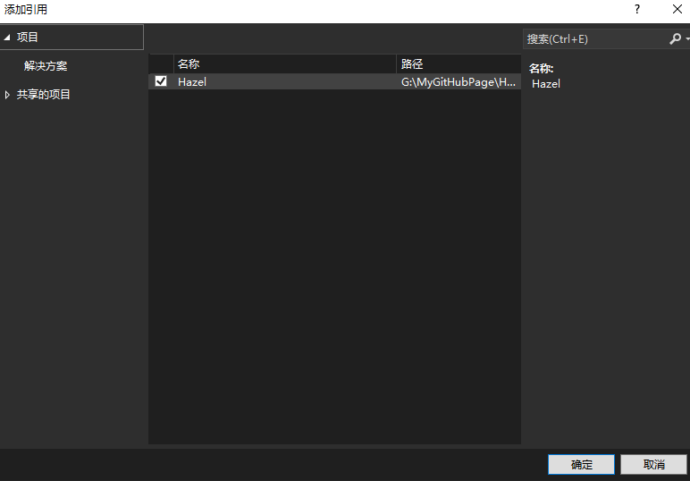

本文是一些未分类到具体哪一期的知识。  

[cpp运行库设置](#cpp运行库设置)  
[静态库和动态库](#静态库和动态库)  
[堆栈](#堆栈)


[宏](#宏)  
[预编译头文件](#预编译头文件) 
[const和mutable](#const和mutable)  
[指针](#指针)  
[数组](#数组)  
[迭代器](#迭代器)  
[string](#字符串)  
[枚举](#枚举)  
[类型双关](#类型双关)  
[类型转换](#类型转换)  
[auto](#auto)  

[函数多个返回值](#函数多个返回值)  
[返回值可能为空](#返回值可能为空)  
[函数参数计算顺序](#函数参数计算顺序)  
[虚函数](#虚函数)  

[类](#类)  
[友元](#友元)  
[单例](#单例)  
[模板](#模板)  

[size和count命名含义](#size和count命名含义)  
[VS使用技巧](#VS使用技巧)  
[使用cpp库操作文件](#使用cpp库操作文件) 
[持续集成和静态分析](持续集成和静态分析) 
[编程习惯](编程习惯) 
## 使用cpp库操作文件
fstream操作文件。ifstream读取文件。

sstream存储信息流。getline逐行获取。stringstream存储文件内容。

```Cpp
#include <iostream>
#include <fstream>
#include <sstream>

#define Log(x) std::cout << x << std::endl;

int main()
{
	std::ifstream stream("src/Something.txt"，std::ios::in);
	std::string line;
	std::stringstream ss;
	
	stream.seekg(0, std::ios::end);
	Log(stream.tellg());
	// size_t size = stream.tellg();
	// if (size != -1)
	// {
	// 	result.resize(size);
	// 	stream.seekg(0, std::ios::beg);
	// 	stream.read(&result[0], size);
	// 	stream.close();
	// }
	stream.seekg(0, std::ios::beg);

	while (getline(stream, line))
	{
		ss << line << "\n";
	}

	Log(ss.str());
	stream.close();
	std::cin.get();
}
```

## size和count命名含义
size 意味着 字节数  
count 意味着 数量统计

## const和mutable
const是一个假的关键字，它是程序员的一种承诺，承诺之后不会对它修饰的东西进行更改，虽然我们可以绕过这个承诺。  
mutable是在const基础上突破它的限制。  
#### const修饰普通类型
代表着这个类型的数据不允许被更改，是个常量。
#### const修饰指针
```Cpp
int a = 1, b = 2;
// 不允许这个指针指向的内存中的东西更改，但是可以改变指针本身的指向
const int* ptr0 = &a;	
*ptr0 = b;		// *ptr不允许更改
ptr0 = &b;		// ptr允许更改

// const后置则相反
int* const ptr1 = &a;	
*ptr1 = b;		// *ptr允许更改
ptr1 = &b;		// ptr不允许更改

// 两者更是可以配合使用
const int* const ptr2 = &a;	
*ptr2 = b;		// *ptr不允许更改
ptr2 = &b;		// ptr不允许更改

// const int * 和 int const * 是一样的，这里关键是*和const的相对位置
```
#### const修饰成员函数
操作符位于方法参数列表后，代码域前，表示这个函数不会修改类中的成员变量。
```Cpp
class Entity
{
public:
	void PrintName() const
	{
		name = "SSC";	// 不被允许
	}

private:
	const char* name = "FallShadow";
};
```
在其他函数中使用const修饰类类型，可以防止调用到有修改类风险的函数，即这个变量只能调用类中的const函数。
```Cpp
#include <iostream>

class Entity
{
public:
	void ChangeName()
	{
		name = "SSC";
	}

	void PrintName() const
	{
		std::cout << name << std::endl;
	}
private:
	const char* name = "FallShadow";
};

void PrintName(const Entity& e)
{
	e.PrintName();
	e.ChangeName();	// 不被允许
}
```

#### mutable修饰成员变量突破const限制
如果类中有一个变量，即使在const函数中也可以进行修改，就要使用mutable来进行修饰。  
符合情景的例子有：调试参数，记录函数调用次数；锁定标记，只允许同时的一个进来。  
```cpp
class Entity
{
public:
	void PrintName() const
	{
		callTime++;
		std::cout << name << std::endl;
	}
private:
	const char* name = "FallShadow";
	mutable unsigned int callTime = 0;
};

void PrintName(const Entity& e)
{
	e.PrintName();
}
```

#### mutable修饰lamda表达式
lamda不能直接访问外部的变量，所以一般使用时要传递参数。
```Cpp
int x = 8;
auto f = [=](int x)
	{
		x++;
	};
f(x);
```
但是mutable修饰的可以不用传递。其实本质上也是使用了局部变量的方法，只不过是个语法糖。
```Cpp
int x = 8;
auto f = [=]() mutable
	{
		x++;
	};
f();
```


## 函数多个返回值
如果一个函数想返回3个string
- 我们可以在调用这个函数前，创建3个string，然后传递引用，然后更改这三个值。如果你想更明确些，可以在参数名字加上前缀out以示其是为了返回值。
- 你也可以使用指针，这样在你不想使用返回值时就不必在函数外定义string，而是传入空指针。
- 或者直接使用string*作为返回值，不过函数调用方不知道这个string多大，这也是不太方便的地方。
- 使用array<string, 3>
- tuple  一个类，包含x个变量，且不关心类型

```C++
#include <iostream>
#define Log(x) std::cout << x << std::endl;
#include <tuple>

std::tuple<int, std::string, std::string> DoSomething()
{
	std::string a, b;
	int x;
	return std::make_tuple(x,a, b);
}

int main()
{
	auto results = DoSomething();
	Log(std::get<0>(results) << std::get<1>(results) << std::get<2>(results));
	std::cin.get();
}
```
- pair 类似tuple但是最多2个、

```C++
#include <iostream>
#define Log(x) std::cout << x << std::endl;
#include <tuple>

std::pair<int, std::string> DoSomething()
{
	std::string a;
	int x;
	return std::make_pair(x,a);
}

int main()
{
	auto results = DoSomething();
	Log(results.first << std::get<1>(results));
	std::cin.get();
}
```
- tie 新创建对应类型，来避免使用0，1这种不知道含义的代码

```C++
int main()
{
	int resultInt;
	std::string resultStr;
	std::tie(resultInt, resultStr) = DoSomething();
	Log(resultInt << resultStr));
	std::cin.get();
}
```
- 最好的方式其实是使用struct，这样在调用函数的位置我们才知道返回的东西是啥意思，而不是0、1，first、second那样模糊不清。但是如果这些返回值不适合复用甚至仅仅使用了一次，为了这一次的返回使用struct很不值
- 对于使用次数很少，甚至仅仅一次的多项返回值，可以使用C++17中的结构化绑定。

```C++
int main()
{
	auto[resultInt, resultStr] = DoSomething();
	Log(resultInt << resultStr);
	std::cin.get();
}
```


## 返回值可能为空
函数返回值可能不能为我们所用或者非法，此时我们需要得知这个信息并且做出处理。
比如，读取一个文件并返回文件内容。如果文件不存在或者无法被打开等，我们需要知道这个错误。

传统做法可能是手动判断返回值是否如预期，比如文件的例子，我们可以设定返回空字符即为读取失败以做出处理，我们也可以额外返回一个bool表示操作的成功或者失败。
```C++
#include <iostream>
#include <fstream>

#define Log(x) std::cout << x << std::endl;

std::string ReadFileString(const std::string& filepath)
{
	std::ifstream stream(filepath);
	if (stream)
	{
		std::string content;
		// read file
		stream.close();
		return content;
	}

	return std::string();
}


int main()
{
	std::string content = ReadFileString("Something.txt");
	Log(content);
	std::cin.get();
}
```
C++17支持的optional可以更方便地做到这点
```C++
#include <iostream>
#include <fstream>
#include <optional>

#define Log(x) std::cout << x << std::endl;

std::optional<std::string> ReadFileString(const std::string& filepath)
{
	std::ifstream stream(filepath);
	if (stream)
	{
		std::string content;
		// read file
		content = "content";
		stream.close();
		return content;
	}

	return { };
}


int main()
{
	std::optional<std::string> content = ReadFileString("Something.txt");
	
	// 如果是空值，就设置默认值Empty
	std::string nowcontent = content.value_or("Empty");

	// 如果有值，就读值
	if (content.has_value())
	{
		Log("Success!");
		Log(content.value());
	}
	std::cin.get();
}
```

## 函数参数计算顺序
```C++
#include <iostream>

#define Log(x) std::cout << x << std::endl;

void Add(int a, int b)
{
	Log(a << " + " << b << " = " << a + b);
}

int main()
{
	int value = 0;
	Add(++value, ++value);
	std::cin.get();
}
```
这样的计算顺序是未定义的。根据编译器不同结果可能不同。
不过如果是后缀表达式，可以肯定的是C++17之后，不能同时进行，而是有先后的，所以是一个1，一个0.如果是3个，就是2,1,0

## 宏
在C++中使用预处理器来“宏”化某些操作。

```Cpp
#include <iostream>

#if MP_DEBUG == 1
#define Log(x) std::cout << x << std::endl
#elif MP_RELEASE == 1
#define Log(x) 
#endif

int main()
{
	Log(1);
	std::cin.get();
}
```
不用#ifdef是因为如果不想定义MP_DEBUG的话就得注释掉那行代码，这样做直接 = 0就行。

#### 符号操作
- \\ 换行符 ： 使用\\，注意后面要直接接换行，不然还以为是空格的转义呐。

```Cpp
#include <iostream>

#define MAIN int main()\
{\
	std::cin.get();\
}

MAIN
```
- \#\# 连接

```cpp
#define Conn(x,y) x##y

int n = Conn(123,456);
    // ==> int n=123456;
char* str = Conn("asdf", "adf");
	// ==> char* str = "asdfadf";
```

- \#@ 字符化 ：将单个参数名转换成const char

```Cpp
#define ToChar(x) #@x

char a = ToChar(1);
    // ==> char a='1';

char a = ToChar(123);
    // ==> char a='3';

char a = ToChar(1234);
	// 直接编译报错
```

- \# 字符串化操作符 ：加双引号

```Cpp
#define ToString(x) #x

char* str = ToString(123132);
	// ==> char* str="123132";

#define foo 4
#define xstr(s) str(s)
#define str(s) #s

// foo作为字符串化参数，不会优先被宏展开
str (foo)
	// ==> "foo"
// foo是普通参数，优先宏展开
xstr (foo)
    // ==> xstr (4)
    // ==> str (4)
    // ==> "4"
```
- \_\_VA_ARGS\_\_ ：用来接受不定数量的参数

```Cpp
#define eprintf(...) fprintf (stderr, __VA_ARGS__)

eprintf ("%s:%d: ", input_file, lineno)
// ==>  fprintf (stderr, "%s:%d: ", input_file, lineno)
```

当\_\_VA_ARGS\_\_宏前面\#\#时，可以省略参数输入
```cpp
#define eprintf(format, ...) fprintf (stderr, format, ##__VA_ARGS__)

eprintf ("success!\n")
// ==> fprintf(stderr, "success!\n");
```

#### 函数宏
宏可以探知函数名或者函数签名  
函数名 : \_\_FUNCTION\_\_   
函数签名 : \_\_funcsig\_\_   


## VS使用技巧
Ctrl + Tab : 弹框切换标签页  

与活动文档同步  


## offsetof
```cpp
struct Vertex
{
	float Position[2];
	float Color[4];
	float TexCoords[2];
	float TexID;
};
offsetof(Vertex, Position);
```
用来很方便地探知变量所在的偏移位置，比起手动计算，使用offsetof，即使有改动，也不需要变动函数。
## 友元
### 友元函数
#### 全局友元函数
友元函数在类中声明，但不在类中定义，却可以访问类的私有变量。

```Cpp
#include <iostream>
using namespace std;

class Student
{
	public:
		Student(char *name, int age, float score): m_name(name), m_age(age), m_score(score)
		{
		
		}
	
		// 将show()声明为友元函数
		friend void show(Student *pstu); 
	private:
	 	char *m_name;
	 	int m_age;
	 	float m_score;
};

// 非成员函数
void show(Student *pstu)
{
    cout << pstu->m_name << "的年龄是 " << pstu->m_age << "，成绩是 " << pstu->m_score << endl;
}

int main()
{
	Student stu("小明", 15, 90.6);
 	show(&stu); //调用友元函数

 	Student *pstu = new Student("李磊", 16, 80.5);
 	show(pstu); //调用友元函数

 	return 0;
}
```
成员函数在调用时会隐式地增加 this 指针，指向调用它的对象，从而使用该对象的成员；而 show() 是非成员函数，没有 this 指针，编译器不知道使用哪个对象的成员，要想明确这一点，就必须通过参数传递对象（可以直接传递对象，也可以传递对象指针或对象引用），并在访问成员时指明对象。
#### 其他类的友元函数

```Cpp
#include <iostream>
using namespace std;

// 提前声明Address类
class Address; 

// 声明Student类
class Student
{
	public:
 		Student(char *name, int age, float score): m_name(name), m_age(age), m_score(score){ }
 		void show(Address *addr);
	private:
 		char *m_name;
 		int m_age;
 		float m_score;
};

// 声明Address类
class Address
{
	private:
	 	char *m_province;
	 	char *m_city;
	 	char *m_district;
	public:
	 	Address(char *province, char *city, char *district)
		{
		    m_province = province;
		    m_city = city;
		    m_district = district;
		}

	 	// 将Student类中的成员函数show()声明为友元函数，以便于student访问address的内部变量
	 	friend void Student::show(Address *addr);
};


void Student::show(Address *addr)
{
    cout << m_name << "的年龄是 " << m_age << "，成绩是 " << m_score << endl;
    cout << "家庭住址：" << addr->m_province << "省" << addr->m_city << "市" << addr->m_district << "区" <<endl;
}

int main()
{
	Student stu("小明", 16, 95.5f);
	Address addr("陕西", "西安", "雁塔");
	stu.show(&addr);
	
	Student *pstu = new Student("李磊", 16, 80.5);
	Address *paddr = new Address("河北", "衡水", "桃城");
	pstu -> show(paddr);

	return 0;
}
```
一个函数可以被多个类声明为友元函数，这样就可以访问多个类中的 private 成员。
### 友元类
将类 B 声明为类 A 的友元类，那么类 B 中的所有成员函数都是类 A 的友元函数，可以访问类 A 的所有成员，包括 public、protected、private 属性的。
```Cpp
#include <iostream>
using namespace std;

class Address;

class Student{
	public:
	 	Student(char *name, int age, float score): m_name(name), m_age(age), m_score(score){ }
	public:
	 	void show(Address *addr);
	private:
	 	char *m_name;
	 	int m_age;
		float m_score;
};


class Address
{
	public:
		Address(char *province, char *city, char *district);

	 	// 将Student类声明为Address类的友元类
	 	friend class Student;
	private:
	 	char *m_province;
	 	char *m_city;
	 	char *m_district;
};


void Student::show(Address *addr)
{
    cout << m_name << "的年龄是 " << m_age << "，成绩是 " << m_score << endl;
    cout << "家庭住址：" << addr->m_province << "省" << addr->m_city << "市" << addr->m_district << "区" <<endl;
}

Address::Address(char *province, char *city, char *district)
{
    m_province = province;
    m_city = city;
    m_district = district;
}

int main()
{
	Student stu("小明", 16, 95.5f);
	Address addr("陕西", "西安", "雁塔");
    stu.show(&addr);
 
	Student *pstu = new Student("李磊", 16, 80.5);
	Address *paddr = new Address("河北", "衡水", "桃城");
    pstu->show(paddr);

	return 0;
}
```
### 友元性质
- 友元的关系是单向的而不是双向的。如果声明了类 B 是类 A 的友元类，不等于类 A 是类 B 的友元类，类 A 中的成员函数不能访问类 B 中的 private 成员。
- 友元的关系不能传递。如果类 B 是类 A 的友元类，类 C 是类 B 的友元类，不等于类 C 是类 A 的友元类。
## 类
### 声明
一般情况下，类必须在正式声明之后才能使用；  
但是某些情况下，只要做好提前声明，也可以先使用。

```Cpp
// 提前声明Address类
class Address; 

// 声明Student类
class Student
{
	public:
 		void show(Address *addr);
};

// 声明Address类
class Address { };
```
类的提前声明的使用效果是有限的，只有在正式声明一个类以后才能用它去创建对象。如果在上述例子中企图创建对象，会报错。

### 复制类
以手写String类为例，看看类的复制会导致的问题。

```Cpp
class String
{
private:
	char* m_buffer;
	unsigned int m_size;
public:
	String(const char* string)
	{
		m_size = strlen(string);
		m_buffer = new char[m_size + 1];
		memcpy(m_buffer, string, m_size);
		m_buffer[m_size] = 0;
	}

	~String()
	{
		delete[] m_buffer;
	}

	char& operator[](unsigned int index)
	{
		return m_buffer[index];
	}

	friend std::ostream& operator<<(std::ostream& stream, const String& string);
};

std::ostream& operator<<(std::ostream& stream, const String& string)
{
	stream << string.m_buffer;
	return stream;
}

```

上述代码使用了友元函数，外部友元函数可以直接访问类私有变量。

```Cpp
int main()
{
	String nameA = "Sunshuchao";
	String nameB = nameA;
	Log(nameA);
	Log(nameB);
	std::cin.get();
}
```

在使用上述代码复制string时，当你敲下按键送入get，程序终止时，会出现异常，因为string类复制时，m\_buffer是指针，复制的是同样的内存地址，所以程序终止，析构时释放同一块内存，出错。
其根本原因是，复制时，调用的是C++默认的复制构造函数。

```Cpp
	String(const String& other) : m_buffer(other.m_buffer), m_size(other.m_size) { }
```

这样做仅仅复制了指针，而实际两者指向了同一块内存，即浅复制。其实unique\_ptr无法被复制就是将复制构造函数设置为delete。
我们要做的是在复制时给复制体一个全新的内存全新的家，即深复制。手段则是，在复制构造函数中手动申请新家。

```Cpp
	String(const String& other) : m_size(other.m_size)
	{
		m_buffer = new char[m_size + 1];
		memcpy(m_buffer, other.m_buffer, m_size + 1);
	}
```

顺便说下，当你在函数参数中使用string或类似类，我们其实都是进行了复制，所以参数列表最好总是使用&，并且，最好总是const。

## 虚函数
父子类同名函数，如果不使用虚函数，那么在调用以父类作为参数的函数时，其中的父类同名函数调用，只会调用父类的结果，尽管参数是子类。
```C++
#include <iostream>
#define Log(x) std::cout << x << std::endl;

class Entity
{
public:
	std::string GetName() { return "Entity"; }
};

class Player : public Entity
{
public:
	std::string GetName() { return "Player"; }
};

void LogName(Entity* e)
{
	Log(e->GetName());
}

int main()
{
	Entity* e = new Entity();
	Player* p = new Player();
	LogName(e);
	LogName(p);

	std::cin.get();
}
```
虚函数引入了一种要动态分派的东西，通过虚表vtable来实现编译。
虚表是一个包含类中所有虚函数映射的列表。通过虚表我们可以在运行时找到正确的被重写的函数。
父类使用virtual，子类使用override，当然子类也可以省略override，但是写上有很多好处：
- 让别人一目了然，这个函数是重写的。
- 纠错，防止写重写函数时错拼字母或者防止父函数忘记virtual。
而且，其实子类也可以保持在前面的virtual以做提醒。

```C++
class Entity
{
public:
	virtual std::string GetName() { return "Entity"; }
};

class Player : public Entity
{
public:
	std::string GetName() override { return "Player"; }
	// virtual std::string GetName() override { return "Player"; } // 也是可行的
};
```
### 代价
需要额外的内存来存储虚表，基类多出一个指向虚表的指针。
每次调用虚函数都需要从虚表中遍历，性能损失。

### 纯虚函数
没有实现的虚函数就是纯虚函数。只有纯虚函数的类称之为接口。其他语言对于接口有一个自己的关键字interface，而C++还是用class类，只不过里面全是纯虚函数。但是这样的类不能被创建。
继承接口的类一定要实现接口，否则无法被实例化。
```C++
MoveInterface
{
public:
	virtual void Move() = 0;
};

class Entity
{
public:
	int a;
	virtual std::string GetName() { return "Entity"; }
};

class Player : public Entity, MoveInterface
{
public:
	std::string GetName() override { return "Player"; }
	void Move() override { }
};
```
## 预编译头文件
如果我们的头文件被很多cpp引用，那么在编译的时候，预处理要进行文本复制，将我们的头文件复制到如此多的cpp中，然后编译器开始编译，这意味着我们将重复多次进行庞大代码的编译。很浪费时间。
预编译头文件，将头文件内容先编译为二进制，然后再应用到各个cpp，因为已经编译过了，所以会很省时间。

创建预编译头文件pch.h和只引用它的pch.cpp，然后更改设置。
pch.cpp来创建预编译文件

项目设置来使用预编译头文件

这样其他代码在include pch.h就会使用预编译的二进制来提升速度。

在开发过程中，预编译头文件禁止我们在其中写入代码，因为我们的代码一般都是要经常变化的，这一变，编译的时候又要把这个头文件重新编译了。但也不排除把不经常变化且非常通用的代码放到cpp，比如log。
### 头文件引用
一般如果是使用外部库的头文件或者编译器的头文件，使用<>。
解决方案中的使用""
## 指针
指针分为原始指针 raw pointer 和智能指针 smart pointer  
所有类型的指针都只是一个整数，存放一个内存地址  
指针加一就意味着其指向指针所指向对象的下一个对象  
指针参数使得被调用函数能够访问和修改主调函数中对象的值  

### 原始指针

#### 无类型0指针

```Cpp
void* ptr0 = 0;
void* ptrNull = NULL;
void* ptrNullPtr = nullptr;
```

无类型，内存地址为0


#### 类型不重要
指针就是指针，就是一个整数，跟类型无关，我们完全可以把空类型指针指向一个整数类型数据，或者用double类型指针指向一个整数类型数据。

```Cpp
int var = 8;
void* ptr = &var;
double* ptrDouble = (double*)&var;
```

#### 类型很重要
如果我们想从指针中取出值，电脑只知道一个地址，它不知道要取多少。  
好比上述例子中的空指针指向整型，就会报错

```Cpp
	int var = 8;
	void* ptr = &var;
	double* ptrDouble = (double*)&var;
	std::cout << *ptr << std::endl;
```
而ptrDouble意味着从指定位置开始读取double大小的数据，即8字节。

#### 指针的指针
指针也是变量，所以指针也可以被指针指。

```Cpp
	int var = 8;
	int* ptr = &var;
	int** ptrptr = &ptr;
```


#### 同一行的指针声明
```C++
int* a, b;
```
这里a是指针，而b只是int。如果两个都想要指针，需要两个前面都要有*.
#### 引用
引用其实就是指针的一个扩展，它们大体相同，但是有细微区别。
指针本身是一个变量，创建指针我们要给他赋值。
而引用必须引用一个现有的变量，其本身不是一个变量。它不真正占用内存，也不存储数据。它只存在于我们的源码，编译之后其实只有现有的那个变量，不存在引用了。

```Cpp
	int var = 8;
	int& ref = var;
```

##### 引用可以理解为让你的代码更干净的指针语法糖

指针

```Cpp
void Increment(int* value)
{
	(*value)++;
}

int main()
{
	int var = 8;
	Increment(&var);

	std::cout << var << std::endl;
	std::cin.get();
}
```

引用

```Cpp
void Increment(int& value)
{
	value++;
}

int main()
{
	int var = 8;
	Increment(var);

	std::cout << var << std::endl;
	std::cin.get();
}
```
##### 创建需要指定变量，一旦创建不可更改
```Cpp
	int a = 8;
	int b = 5;

	int& ref = a;
	ref = b;
```

这样其实是把a变成b的值，即a=5；所以如果你是想改变ref所引用的，你应该把ref变为指针。

### 智能指针
unique_ptr shared_ptr weak_ptr
#### unique_ptr
unique_ptr正如字面意思，不允许创建两个指向同一个内存，不能复制，它必须独一无二，否则一个释放另一个没法弄了。还有就是创建的时候最好用异常保护的形式

```Cpp
#include <iostream>
#define Log(x) std::cout << x << std::endl;
#include <memory>

class ExampleHeap
{
public:
	ExampleHeap()
	{
		Log("Init!");
	}

	~ExampleHeap()
	{
		Log("Delete!");
	}
};

int main()
{
	{
		std::unique_ptr<ExampleHeap> entity = std::make_unique<ExampleHeap>();
	}
	std::cin.get();
}
```

#### shared_ptr
shared_ptr 允许你对同一块内存创建多个指针指向，这就像是计数，2个指向后，一个退出来，计数减一，再一个退出，就真的把那个内存销毁了。

##### reset
```Cpp
p.reset(q);	// q为智能指针要指向的新对象
```
这会令智能指针p中存放指针q，即p指向q的空间，而且会释放原来的空间，默认是delete。
#### weak_ptr
与 shared_ptr 配对使用。它不会增加计数，使用在想用这个类又不想掌控这个类的情境下，它不保证在使用过程中这个类不会死掉，但是你可以问它，你还有效么。

## 数组
数组其实就是指针。

### 原生数组
如果我们不使用new来创建，那就是在栈上创建数组，这样它的生命周期会随着代码块消逝。而如果你想获取函数里创建的数组，那就必须在堆上创建数组，使用new，对应的，使用delete来销毁这部分内存，这样创建数组的好处还有内存间接寻址，比如在类中使用以节省类所占用的内存。

这种原生数组不像C++中的array那样便利，array可以直接得到数组长度等等信息，而原生数组无从得知。所以我们一般这样创建原生数组。
```Cpp
    // 在堆上创建原生数组
	static const int exampleSize = 5;
	int* example = new int[exampleSize];
```
### vector动态数组
```C++
#include <iostream>
#define Log(x) std::cout << x << std::endl;
#include <vector>

struct Vertex
{
public:
	int x, y, z;
};

std::ostream& operator<<(std::ostream& stream, const Vertex& vertex)
{
	stream << vertex.x << ',' << vertex.y << ',' << vertex.z;
	return stream;
}

int main()
{
	std::vector<Vertex> vertices;
	vertices.push_back({ 0,0,1 });
	vertices.push_back({ 1,1,1 });
	for (int i = 0; i < vertices.size(); i++)
	{
		Log(vertices[i]);
	}
	
	vertices.erase(vertices.begin() + 1);

	for (Vertex& v : vertices)
	{
		Log(v);
	}

	std::cin.get();
}
```
上例展示了vector的基础用法，其中，vertices是vertex列表，有时我们会创建vertex*列表，这取决于我们的实际需要。  
上述例子性能极差，如果你在复制构造函数中打记号，其复制量会随着数组扩张而呈指数增长。  
其一：push_back({0,0,1})中的{0,0,1}是在main中创建，意味着要复制到vertices中。  
其二：屡次扩张vertices，每次扩张都会将现有的vertex复制到新内存。  


```C++
int main()
{
	std::vector<Vertex> vertices;
	vertices.reserve(3);
	vertices.emplace_back(0, 0, 1);
	vertices.emplace_back(1,1,1 );
	std::cin.get();
}
```
- 当我们知道要创建多少够用时，应该直接指定大小容量。
- 在往里塞数据时，传入参数，让其在内部创建，防止复制。

### array静态数组
静态数组必须指定大小，因为它不可以自己扩张。
array和原生数组性能一致，但是功能更多，且有保护。
- 性能一致：虽然array可以让我们获取size，但其实其内部并没有真的使用额外的变量来存储size，它使用模板达到这一效果，所以他的性能是和原生数组一样的。
- 提供保护：原生数组越界是会真的读取那个位置上的数据，没有错误提示你可能都不知道这个问题，而array则会告知你，这不对。
### 在哪创建
vector底层在堆上，array在栈上。


### std::initializer_list
上述数组vector在初始化时可以不用显示指定长度，其初始化列表可以是任意长度。其实这是通过std::initializer_list这个轻量级的类模板来实现的。
```Cpp
class Foo
{
public:
    Foo(const std::initializer_list<int>& elements) : m_Elements(elements) {}
private:
	std::vector<int> m_Elements;
};
Foo foo = { 1, 2, 3, 4, 5 };
```
我们的类可以通过使用std::initializer_list来接收{…}

std::initializer_list 是非常高效的。它的内部并不负责保存初始化列表中元素的拷贝，仅仅存储了列表中元素的引用而已。
它有 3 个成员接口： size()、 begin()、 end()。
对 std::initializer_list 的访问只能通过 begin() 和 end() 进行循环遍历，遍历时取得的迭代器是只读的。因此，无法修改 std::initializer_list 中某一个元素的值，但是可以通过初始化列表的赋值对 std::initializer_list 做整体修改.
## cpp运行库设置
### C和C++运行库

#### C运行库
为了提高C语言的开发效率，C标准定义了一系列常用的函数，称为C库函数。C标准仅仅定义了函数原型，并没有提供实现。因此这个任务留给了各个支持C语言标准的编译器。每个编译器通常实现了标准C的超集，称为C运行时库(C Run Time Libray) ，简称CRT。对于VC++编译器来说，它提供的CRT库支持C标准定义的标准C函数，同时也有一些专门针对windows系统特别设计的函数。

#### C++运行库
与C语言类似，C++也定义了自己的标准，同时提供相关支持库，我们把它称为C++运行时库或C++标准库。由于C++对C的兼容性，C++标准库包括了C标准库，除此之外还包括IO流和标准模板库STL。

### VC++编译器
VC++完美的支持C和C++标准，因此也就按照C和C++的标准定义的函数原型实现了上述运行时库。为了方便有不同需求的客户的使用，VC++分别实现了动态链接库DLL版本和静态库LIB版本。同时为了支持程序调试且不影响程序的性能，又分别提供了对应的调试版本。调试版本的名称在Release版本名称后添了字母d。

#### DLL和LIB区分
因为静态版必须把C和C++运行库复制到目标程序中，所以产生的可执行文件会比较大。同时对于使用多个模块的大型软件来说，如果每个模块均选择静态链接C或C++运行库，在程序运行时就会存在多个运行库。在链接时也会出现重复定义的问题。

使用DLL版的C和C++运行库，程序在运行时动态的加载对应的DLL。程序体积变小，但一个很大的问题就是一旦找不到对应DLL,程序将无法运行。假设使用VC6.0并选择使用MD选项构建，那么当用户使用VC2005来使用这个DLL时很可能出现找不到MSVCRT.DLL或MSVCP60.DLL的情况。

### VS设置
#### /MT和/MTd
/MT和/MTd表示采用多线程CRT库的静态lib版本。该选项会在编译时将运行时库以静态lib的形式完全嵌入。该选项生成的可执行文件运行时不需要运行时库dll的参加，会获得轻微的性能提升，但最终生成的二进制代码因链入庞大的运行时库实现而变得非常臃肿。当某项目以静态链接库的形式嵌入到多个项目，则可能造成运行时库的内存管理有多份，最终将导致致命的“Invalid Address specified to RtlValidateHeap”问题。另外托管C++和CLI中不再支持/MT和/MTd选项。

#### /MD和/MDd
/MD和/MDd表示采用多线程CRT库的动态dll版本，会使应用程序使用运行时库特定版本的多线程DLL。链接时将按照传统VC链接dll的方式将运行时库MSVCRxx.DLL的导入库MSVCRT.lib链接，在运行时要求安装了相应版本的VC运行时库可再发行组件包（当然把这些运行时库dll放在应用程序目录下也是可以的）。 因/MD和/MDd方式不会将运行时库链接到可执行文件内部，可有效减少可执行文件尺寸。当多项目以MD方式运作时，其内部会采用同一个堆，内存管理将被简化，跨模块内存管理问题也能得到缓解。

#### 结论
/MD和/MDd将是潮流所趋，/MT和/MTd在非必要时最好不要采用

## 单例
C++中的单例只是一种组织一堆全局变量和静态函数的方式。
```C++
#include <iostream>
#include <mutex>
#include <future>
#include <vector>

#define Log(x) std::cout << x << std::endl;

class Random
{
//	在Random是父类时使用protect构造函数
// 	protected:
//  	Rendom() = default;
public:
	Random(const Random&) = delete;
	Random& operator=(const Random&) = delete;

	static Random& Get()
	{
		static Random instance;
		return instance;
	}

	static float Float() { return Get().IFloat(); }

private:
	Random() {}
	float IFloat() { return m_RandomGenerator; }
	float m_RandomGenerator;
};


int main()
{
	Log(Random::Float());
	std::cin.get();
}
```
## 类型双关
```C++
	int a = 10;
	double b = a;
```
实际上a,b是位于两个不同的内存地址。b=a是一个隐式的转换。
```C++
	int a = 10;
	double b = *(double*)&a;
```
这里将一个指向原类型为int的double指针解引用为b，这定会导致b的值很奇怪，因为这句话将int数据4字节强行扩充为8字节，解释成了double数据。

```C++
#include <iostream>

struct Entity
{
	int x, y;
};

int main()
{
	Entity e = { 5, 8};
	int y = *(int*)((char*)&e + 4);
	std::cout << y << std::endl;
	std::cin.get();
}
```
C++就是可以这么自由地控制内存显示。
```C++
#include <iostream>

struct Entity
{
	int x, y;

	int* GetPosition()
	{
		return &x;
	}
};

int main()
{
	Entity e = { 5, 8};
	int* position = e.GetPosition();
	std::cout << position[1] << std::endl;
	std::cin.get();
}
```
对于同一个内存地址可以有不同的解释方法，这就是类型双关。
### union
```C++
struct Vector2
{
	float x, y;
};

struct Vector4
{
	float x, y, z, w;
}
```
对于v4，如果我们想使用v2的形式表达它，我们可以使用类型双关来解释。
```C++
struct Vector4
{
	float x, y, z, w;
	Vector2& GetV2A()
	{
		return *(Vector2*)&x;
	}

	Vector2& GetV2B()
	{
		return *(Vector2*)&z;
	}
};
```
还有一种更轻松的表达，就是使用union。
```C++
#include <iostream>

struct Vector2
{
	float x, y;
};

struct Vector4
{
	union
	{
		struct
		{
			float x, y, z, w;
		};

		struct
		{
			Vector2 a, b;
		};
	};
};

void PrintVector2(const Vector2& vector)
{
	std::cout << vector.x << "," << vector.y << std::endl;
}

int main()
{
	Vector4 v4 = { 1.0f,2.0f,3.0f,4.0f };
	PrintVector2(v4.a);
	PrintVector2(v4.b);
	v4.z = 50.0f;
	PrintVector2(v4.a);
	PrintVector2(v4.b);
	std::cin.get();
}
```
union就是对内存进行对齐解释，上例x,y对应a，z,w对应b。
### variant
还有一种单个变量存放多种类型数据的方法是使用variant。
但和union取最大的那个类型作为自身大小不同，variant大小为其中所有类型相加。如果不是为了顶级压榨性能，我们一般使用variant。
在使用时，最好先判断下数据是否是对应类型。
```C++
#include <iostream>
#include <variant>

#define Log(x) std::cout << x << std::endl;

int main()
{
	std::variant<std::string, int> data;
	data = "Hello";
	if (auto value = std::get_if<std::string>(&data))
	{
		Log(std::get<std::string>(data));
	}
	if (auto value = std::get_if<int>(&data))
	{
		Log(std::get<int>(data));
	}

	data = 2;
	Log(std::get<int>(data));

	std::cin.get();
}
```
此外，可以在多参数返回的情景中使用variant。
### any
还有一种可以存储任何类型而无需指定的方法，就是any。
```C++
#include <iostream>
#include <any>

#define Log(x) std::cout << x << std::endl;

void* operator new(size_t size)
{
	return malloc(size);
}

struct TestStruct
{
	std::string s0, s1;
};

int main()
{
	std::any data;
	//data = 5;
	//data = std::string("Hello");
	//std::string& string = std::any_cast<std::string&>(data);

	data = TestStruct();

	std::cin.get();
}
```
但是any有个问题是，超过32字节的内容，它会去堆上动态分配内存，这很慢。

事实上，我们用variant就可以了，即类型安全，又不会动态分配内存。any就是个小丑。
## 类型转换
```C++
#include <iostream>

int main()
{
	double a = 5.5;
	int b = (int)a;

	int b = static_cast<int>(a);

	std::cin.get();
}
```
类型转换常用的有四种。但是这四种效果其实都是类型转换，只不过是加了一些能起到额外效果的语法糖。而且这样我们易于搜索类型转换。
- static_cast会做一些编译时检查，来看看是不是这种转换真的可能。
- reinterpret_cast意思是不想转换，而是把这段内存重新解释成别的东西，就是类型双关。

```C++
#include <iostream>

class Entity
{

};

int main()
{
	int a;
	Entity e = *(reinterpret_cast<Entity*>(a));

	std::cin.get();
}
```
- const_cast移除或者添加变量的const限定。
- dynamic_cast检查这个转换是否成功，即是否是有意义的转换。
dynamic_cast更像是一个函数，在运行时进行转换。

```C++
#include <iostream>

class Entity
{
public:
	Entity(){}
	virtual ~Entity(){}
};

class Player : public Entity
{
public:
	Player() {}
	~Player() {}
};

class OtherPlayer : public Entity
{
public:
	OtherPlayer() {}
	~OtherPlayer() {}
};

int main()
{
	Player* p = new Player();
	Entity* e = p;

	OtherPlayer* o = dynamic_cast<OtherPlayer*>(e);
	if (!o)
	{
		std::cout << "No" << std::endl;
	}
	std::cin.get();
}
```
上述例子就是不能转换的，因为e已经是一个player实例了，转换到otherplayer不合适。
当转换可以实现，就会返回正确类型指针，否则，返回null。
它能做到这点，是因为它储存了运行时类型信息，runtime type information RTTI，它存储着我们所有类型的运行时类型信息。这会增加开销，但是这会让我们做动态类型转换之类的事情。

如果禁用了RTTI，就会警告我们不可预知的行为。

其他语言比如C#，会用is来判断转换类型是否成功，然后进行使用。
## 静态库和动态库
静态库项目生成lib，link时会将所有的代码都代入到所需项目中。
动态库项目生成dll，link时自身还是那个dll文件，只不过exe通过导入导出符号来使用dll中的内容。

lib会导致主代码库臃肿，但速度会快（因为内联之类会生效）。
dll单独一个文件，且内存管理方便。

dll有个小问题，如果你的dll使用了另一个lib，但是dll实际文件中，并没有用到lib的A函数，那么A函数就不会被链接到dll中，导致主项目在使用dll时，无法使用A函数的情况。  
解法一：在lib和dll中手动标记导出使用的函数，在exe中接收。
### 静态库使用
引入一个外部静态库，需要两个文件：头文件和lib文件。
头文件，里面是所有声明。
lib文件，通常较大，里面是所有函数的定义。

将这两个文件放在我们的解决方案中，在VS设置里，将头文件引入include。
这时候其实就可以使用外部库的函数了，因为声明都在，编译也就不会出错。
但是链接时，由于没有函数的实际定义，会报错。

这就需要我们在vs中再将库目录和附加依赖项设置下。

这样一个静态库就链接好了。因为链接器可以看到更多东西，所以静态链接允许更多优化。
### 动态库使用
在程序真的执行起来的时候，才会被加载。
与静态库一样设置头文件，库目录，最后附加项，要使用dll.lib文件，这个文件是dll函数指向文件，其包含了dll中函数的位置。这样之后就可以生成项目了，但是运行之后，你会得到窗口报错：缺少XXX.dll，这是因为我们没有把DLL放到可执行文件目录下，运行时找不到动态库导致的。只要我们把文件复制过去就可以了。

### 同一解决方案下不同项目通讯
S解决方案中的A项目想用B项目的方法，使用附加include。

按照上述第三方静态库的用法，我们可能还需要设置库目录，并在附加依赖中设置B项目的lib，然而这些都可以省略，因为，AB是在同一个解决方案中，我们只要在项目右键的引用中引用B项目就好。

一个需要注意的地方是，如果B项目有变动，那在生成A项目时，B也会连带着走一遍。
## 字符串
### const char*
字符串就是字符的集合。
字符串以0结束，没有以0结束的，计算机会继续读取

在后面加上0或者'\0'来阻止继续读取

#### 字符串中插入0
在字符串中插入0会截短这个字符串。

### string
string是iostream下的，但是使用时还是要引入string，因为string重载了<<运算符，让其能处理string。
"Something"双引号中的内容是const char*，不是真正的string.

在使用string时，如果要把它传入函数，请使用引用，除非你是想真的在函数中复制一份也无所谓。其他的类也是一样，如果不用引用，其实在函数里是使用的新创建的一份副本。

#### string每次创建都会分配内存
```Cpp
#include <iostream>
#include <mutex>
#include <future>
#include <vector>

#define Log(x) std::cout << x << std::endl;

static int newCount;

void* operator new(size_t size)
{
	newCount++;
	Log("malloc " << size <<" bytes");
	return malloc(size);
}

void LogName(const std::string& name)
{
	Log(name);
}

void LogName(const char* name)
{
	Log(name);
}

int main()
{ 
	std::string name = "FallShadow";
	std::string firstName = name.substr(0, 4);
	std::string lastName = name.substr(4, 6);

	LogName(name.substr(0, 4));

	const char* name2 = "Fall";
	LogName(name2);

	Log(newCount);
	std::cin.get();
}
```

每次sub都真实分配了内存，这很费。C++17提供了string\_view，它不真实分配内存，而是对现有string进行观察。

```Cpp
#include <iostream>
#include <mutex>
#include <future>
#include <vector>

#define Log(x) std::cout << x << std::endl;

static int newCount;

void* operator new(size_t size)
{
	newCount++;
	Log("malloc " << size << " bytes");
	return malloc(size);
}

void LogName(const std::string& name)
{
	Log(name);
}

void LogName(const char* name)
{
	Log(name);
}

void LogName(std::string_view name)
{
	Log(name);
}

int main()
{
	std::string name = "FallShadow";
#if 0
	std::string firstName = name.substr(0, 4);
	std::string lastName = name.substr(4, 6);

	LogName(name.substr(0, 4));
#else
	std::string_view firstName(name.c_str(), 3);
	std::string_view lastName(name.c_str() + 4, 6);

	LogName(lastName);
#endif

	Log(newCount);
	std::cin.get();
}
```

但其实，使用const char\*就不会有分配了。不过一般实际应用环境中还是string。

#### 小字符串

C++对小字符串进行了优化，小于15个的字符串，不会进行new的分配，这点可以直接看string代码。

不过在debug下还是会进行分配，源代码是使用宏去做到这点的。
#### 跟踪内存分配

```Cpp
#include <iostream>
#include <memory>

#define Log(x) std::cout << x << std::endl;

struct AllocationMetrics
{
	uint32_t TotalAllocated = 0;
	uint32_t TotalFreed = 0;

	uint32_t CurrentUsage() { return TotalAllocated - TotalFreed; }
};

static AllocationMetrics s_AllocationMetrics;
static void PrintMemoryUsage()
{
	Log("Memory Usage: " << s_AllocationMetrics.CurrentUsage());
}

void* operator new(size_t size)
{
	s_AllocationMetrics.TotalAllocated += size;

	return malloc(size);
}

void operator delete(void* memory, size_t size)
{
	s_AllocationMetrics.TotalFreed += size;

	free(memory);
}

struct Object
{
	int x, y, z;
};

int main()
{
	PrintMemoryUsage();
	std::string str = "Hello";
	// const char* str = "Hello";
	PrintMemoryUsage();

	std::cin.get();
}
```
#### 原始字符串
C++11新特性，原始字符串，字符串表示的就是自己，不需要转义字符。  
字符串中的换行符将在屏幕上如实显示，在表示字符串开头的"和(之间可以添加其他字符，不过必须在表示字符串结尾的)和"之间添加同样的字符。

#### 方法
str.find_first_of(str1, pos)  
从pos位置(默认是0，即从头开始查找)开始查找str1，从前往后，如果找到str1中的任何一个字符，则返回其在str中的索引值；如果没有找到，则返回string::npos。

str.find_last_of(str1, pos)  
从后向前

```Cpp
auto lastSlash = filepath.find_last_of("/\\");
```

rfind(str)  
是从字符串右侧开始匹配str，并返回在字符串中的位置（下标）,这个是整体的了，若使用上例就是找 /\ 的位置
## 堆栈
### 栈
生命周期由声明的地方的作用域决定，一但超过作用域，内存就会被释放掉。
```Cpp
#include <iostream>
#define Log(x) std::cout << x << std::endl;
using String = std::string;

class Player
{
public:
	Player() : age(0), speed(0), name("Unknown") {}
	Player(int pAge, int pSpeed, String pName) : age(pAge), speed(pSpeed), name(pName) {}

	String GetName() const
	{
		return name;
	}

private:
	int age;
	int speed;
	String name;
};

int main()
{
	Player* ptrPlayer;
	{
		Player p(27,10,"FallShadow");
		ptrPlayer = &p;
		Log(ptrPlayer->GetName());
	}
	Log(ptrPlayer->GetName());
	std::cin.get();
}
```
经常犯的一个错误是，在函数里创建栈变量，然后return其指针，这完全错误，函数执行后，指针所指的变量也被销毁了。
#### 作用域指针
如果你想让一个在堆上分配的对象像栈上对象一样，仅仅在作用域生效，出作用域释放，就可以用作用域指针。其原理是用另一个类包裹这个堆上类，然后在栈上分配这“另一个”类。

```Cpp
#include <iostream>
#define Log(x) std::cout << x << std::endl;

class ExampleHeap
{
public:
	ExampleHeap()
	{
		Log("Init!");
	}

	~ExampleHeap()
	{
		Log("Delete!");
	}
};

class ExampleStack
{
private:
	ExampleHeap* e;
public:
	ExampleStack(ExampleHeap* e) : e(e){}
	~ExampleStack()
	{
		delete e;
	}
};

int main()
{
	{
		ExampleStack e = new ExampleHeap();
	}
	std::cin.get();
}
```

这会让调用变得有些麻烦，不过我们可以通过重载->来简化代码
```Cpp
#include <iostream>
#define Log(x) std::cout << x << std::endl;

class ExampleHeap
{
public:
	ExampleHeap()
	{
		Log("Init!");
	}

	~ExampleHeap()
	{
		Log("Delete!");
	}

	void LogSomething(){}
};

class ExampleStack
{
private:
	ExampleHeap* e;
public:
	ExampleStack(ExampleHeap* e) : e(e) {}
	~ExampleStack()
	{
		delete e;
	}

	ExampleHeap* operator->()
	{
		return e;
	}
};

int main()
{
	{
		ExampleStack e = new ExampleHeap();
		e->LogSomething();
	}
	std::cin.get();
}
```
其实这就是智能指针的一种，即unique_ptr

## 编程习惯
### 同类类放在一个文件还是分开放置？
比如 ertexbuffer 和 indexbuffer 这两个类
那其实他们都是buffer类型，所以还是放在一起的比较好
## 持续集成和静态分析
Jenkins 自动打包
pvs studio 检查一些永远为真的函数或者循环、检查一些越界之类的

## auto
auto能帮助自动推断类型。然而绝大多数情况都用不到的。
虽然如果在调用函数的返回值接收上使用auto可以避免函数的改变影响到调用方，但实际上我们还是想知道具体类型的，不然可能会有很多错误的操作。
不过在你的变量很长的情况下，还是可以用auto来简化代码，不过我更倾向于仅仅在临时使用是这样做，比如迭代器的类型很长，而且我知道，迭代过后我就不会再用到那个变量，这时候我会用auto，不然就算是函数返回类型非常长，我也会用using或者typedef来简化代码，而不是auto。
还有一种情况是，在复杂的代码环境下，有可能是模版或者其他，我们甚至无法知道具体类型而不得不使用auto这个时候要注意了，你有可能需要审视你的整个代码了，因为它发出了太复杂的警告！
## 枚举
C++98 的 enum 是 "非域内枚举" 存在命名空间污染
```Cpp
// yellow, green, blue are in same scope as Color 
enum Color { yellow, green, blue};  

// error! yellow already declared in this scope 
auto yellow = false;　
```
C++11 的 enum class 是 "域内枚举"

## 迭代器
作用是用来遍历容器，而且是通用的遍历容器元素的方式，无论容器是基于什么数据结构实现的，尽管不同的数据结构，遍历元素的方式不一样，但是用迭代器遍历不同容器的代码是完全一样的。

迭代器一般实现为容器的嵌套类型，在容器内部提供具体的实现。但是容器不同，底层元素遍历的方式也不同，那么为什么说迭代器遍历所有容器的方式是一样的呢？那是因为迭代器提供了常用的operator!=，operator++，operator*等运算符的重载函数，把迭代容器的细节全部隐藏在这些通用的运算符重载函数里面，因此用户侧表现出来的就是，迭代器遍历所有容器的方式都是一样的，其实底层都是不一样的风景^^！

## 模板
模板就是让编译器在你设定的规则下帮你写代码。
类似于其他语言的泛型，但是模板更加强大。
### 在用到之前，并不存在
```Cpp
template<typename T>
void Print(T value)
{
	std::cout << vale << std::endl;
}
```
所以这样的代码在未调用到print时也能通过编译。
用到之后，编译器才会生成对应的代码，在调用时可以显式声明类型，也可以不带，让编辑器自行判断。
```Cpp
int main()
{
	Print(1);
	Print<std::string>("Hello");
	std::cin.get();
}
```
### 使用场合广泛
```Cpp
template<typename T,int N>
class MyC
{
private:
	T list[N];
public:
	int GetCount()
	{
		return N;
	}
};
```

### 带参数的模板
```Cpp
// 这是一个唯一指针模板
template<typename T>
using Scope = std::unique_ptr<T>;
template<typename T, typename ... Args>
constexpr Scope<T> CreateScope(Args&& ... args)
{
	return std::make_unique<T>(std::forward<Args>(args)...);
}
// 这是new的时候
Scope<RendererAPI> RenderCommand::s_RendererAPI = CreateScope<OpenGLRendererAPI>();
```

## 
##
##
##


