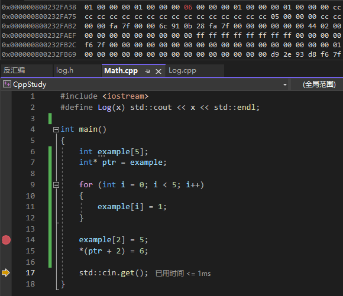
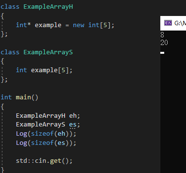

# 数组

在大多数用法中，数组名会自动转换成首元素指针，但它和指针还是有根本性差异。



a 和 &a 的值（内容）通常是一样的，都是数组首地址。但更多涉及类型和语义差异。   
arr + 1 加一个 int 的长度   
&arr + 1 加一个数组的长度  

arr：类型是 int*（退化），值为首元素地址；

&arr：类型是 int(*)[10](指向有 10 个 int 的数组)，数值上它是整个数组的起始地址，也就是首元素的地址，但语义是“整个数组”，而不是“一个 int”。

# 原生数组

如果我们不使用 new 来创建，那就是在栈上创建数组，这样它的生命周期会随着代码块消逝。而如果你想获取函数里创建的数组，那就必须在堆上创建数组，使用 new，对应的，使用 delete 来销毁这部分内存，这样创建数组的好处还有内存间接寻址，比如在类中使用以节省类所占用的内存。



这种原生数组不像 C++中的 array 那样便利，array 可以直接得到数组长度等等信息，而原生数组无从得知。所以我们一般这样创建原生数组。
```Cpp
    // 在堆上创建原生数组
	static const int exampleSize = 5;
	int* example = new int[exampleSize];
```

# vector

动态数组

```C++
#include <iostream>
#define Log(x) std::cout << x << std::endl;
#include <vector>

struct Vertex
{
public:
	int x, y, z;
};

std::ostream& operator<<(std::ostream& stream, const Vertex& vertex)
{
	stream << vertex.x << ',' << vertex.y << ',' << vertex.z;
	return stream;
}

int main()
{
	std::vector<Vertex> vertices;
	vertices.push_back({ 0,0,1 });
	vertices.push_back({ 1,1,1 });
	for (int i = 0; i < vertices.size(); i++)
	{
		Log(vertices[i]);
	}
	
	vertices.erase(vertices.begin() + 1);

	for (Vertex& v : vertices)
	{
		Log(v);
	}

	std::cin.get();
}
```

上例展示了 vector 的基础用法，其中，vertices 是 vertex 列表，有时我们会创建 vertex *列表，这取决于我们的实际需要。  
上述例子性能极差，如果你在复制构造函数中打记号，其复制量会随着数组扩张而呈指数增长。  
其一：push_back( {0,0,1} ) 中的 {0,0,1} 是在 main 中创建，意味着要复制到 vertices 中。  
其二：每一次扩容，都需要将当前所有元素全部拷贝/移动到新空间。  

## 实现核心

std::vector 内部维护一块连续的动态内存（堆上分配），用于存放元素。  
每当容量不够时，vector 会申请一块更大的内存，并把原有元素 “逐个复制/移动” 到新内存（旧内存释放）。  

## 优化方法

```C++
int main()
{
	std::vector<Vertex> vertices;
	vertices.reserve(3);
	vertices.emplace_back(0, 0, 1);
	vertices.emplace_back(1,1,1 );
	std::cin.get();
}
```
- 当我们知道要创建多少够用时，应该直接指定大小容量。
- 在往里塞数据时，传入参数，让其在内部创建，防止复制。（直接在 vector 空间中“原地构造”对象，避免临时对象。）

# array

静态数组  
静态数组必须指定大小，因为它不可以自己扩张。  
array 和原生数组性能一致，但是功能更多，且有保护。  
- 性能一致：虽然 array 可以让我们获取 size，但其实其内部并没有真的使用额外的变量来存储 size，它使用模板达到这一效果，所以他的性能是和原生数组一样的。

```Cpp
template<typename T, size_t N>  
struct array { T data[N]; /* ... */ };  
// 大小已知，不存 size 成员，如 .size() 其实是返回模板参数 N。
// 优化器可直接优化成原生数组一样。
```

- 提供保护：原生数组越界是会真的读取那个位置上的数据，没有错误提示你可能都不知道这个问题，而 array 则会告知你，这不对。

# std::initializer_list

上述数组 vector 在初始化时可以不用显示指定长度，其初始化列表可以是任意长度。其实这是通过 std::initializer_list 这个轻量级的类模板来实现的。

```Cpp
class Foo
{
public:
    Foo(const std::initializer_list<int>& elements) : m_Elements(elements) {}
private:
	std::vector<int> m_Elements;
};
Foo foo = { 1, 2, 3, 4, 5 };
```

我们的类可以通过使用 std::initializer_list 来接收 { … }

std::initializer_list 是非常高效的。它的内部并不负责保存初始化列表中元素的拷贝，仅仅存储了列表中元素的引用而已。
内部结构：仅保存指向元素首地址的指针 + 一个长度（size）。    
它有 3 个成员接口： size()、 begin()、 end()。  
对 std::initializer_list 的访问只能通过 begin() 和 end() 进行循环遍历，遍历时取得的迭代器是只读的。因此，无法修改 std::initializer_list 中某一个元素的值，但是可以通过初始化列表的赋值对 std::initializer_list 做整体修改。  

# 数组排序

```Cpp
#include <iostream>
#include <array>
#include <algorithm>

int main()
{
	std::array<int, 5> list = { 2,5,4,1,3 };
	std::sort(list.begin(), list.end(), std::greater<int>());
	for (int i = 0; i < 5; i++)
	{
		std::cout << list[i] << std::endl;
	}

	std::cin.get();
}
```
这是从大到小。如果这里不填，默认从小到大。
```C++
std::sort(list.begin(), list.end(), [](int a, int b) { return a < b; });
```
lambda 返回 true，取 a 在前。
