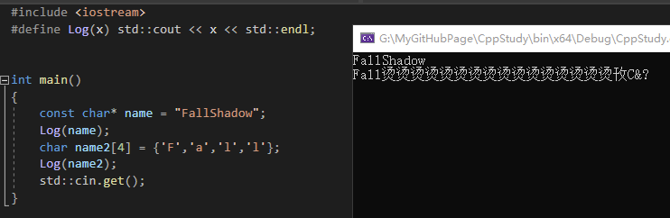
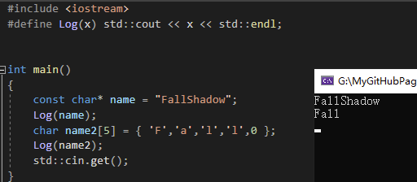
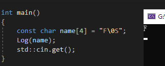
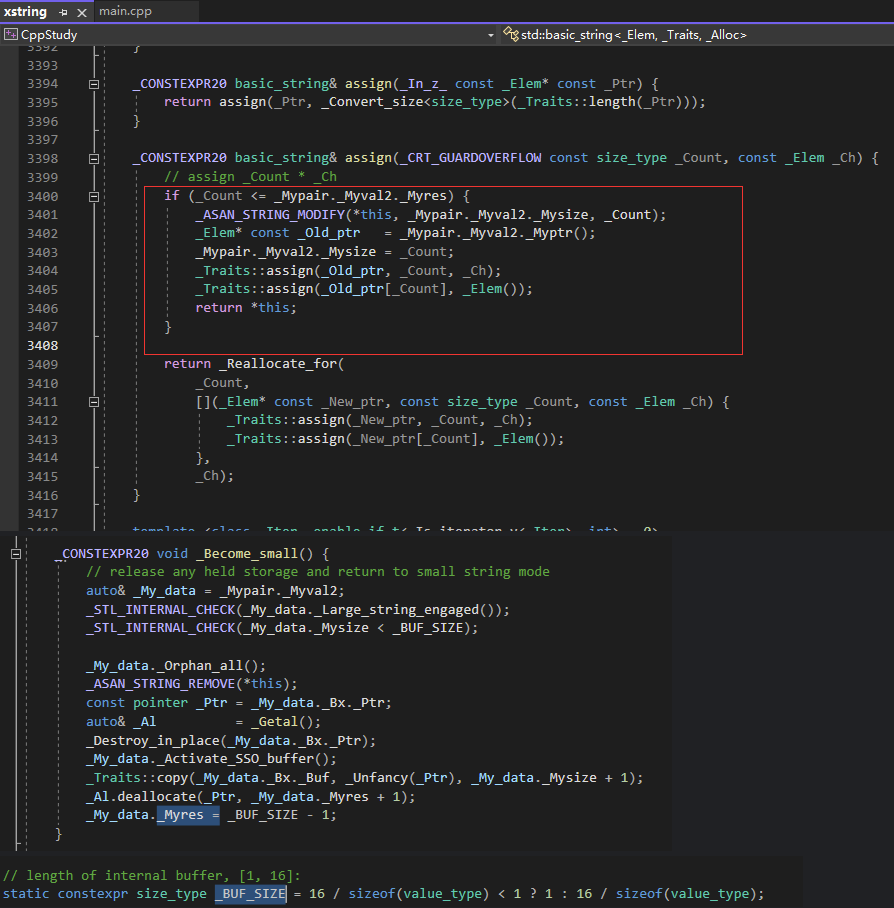

# char

字符

## strcpy 函数

原型声明：char *strcpy(char* dest, const char *src);
功能：把从 src 地址开始且含有 NULL 结束符的字符串复制到以 dest 开始的 地址空间
说明：src 和 dest 所指内存区域不可以重叠且 dest 必须有足够的空间来容纳 src 的字符串。
返回：指向 dest 的 指针。

```Cpp
#include <stdio.h>  
#include <string.h>  

int main() {  
    char src[] = "Hello, world!";  
    char dest[50];  // 目标空间要足够大  

    strcpy(dest, src);  // 将 src 复制到 dest  

    printf("dest = %s\n", dest);  // 输出：dest = Hello, world!  
    return 0;  
}  
```

## strcat 函数

原型：extern char *strcat(char *dest, const char *src);
功能：将两个 char 类型连接。把 src 所指字符串添加到 dest 结尾处（覆盖 dest 结尾处的'\0')。

```Cpp
#include <stdio.h>  
#include <string.h>  

int main() {  
    char dest[50] = "Hello";  
    char src[] = ", world!";  

    strcat(dest, src);  // 将 src 拼接到 dest 后面  

    printf("dest = %s\n", dest);  // 输出：dest = Hello, world!  
    return 0;  
}  
```

# 字符串

字符串就是字符的集合。
字符串以 0 结束，没有以 0 结束的，计算机会继续读取



在后面加上 0 或者'\0'来阻止继续读取



在字符串中插入 0 会截短这个字符串。



# string

string 是 iostream 下的，但是使用时还是要引入 string，因为 string 重载了<<运算符，让其能处理 string。

"Something" 双引号中的内容是 const char*，不是真正的 string.

在使用 string 时，如果要把它传入函数，请使用引用，除非你是想真的在函数中复制一份也无所谓。其他的类也是一样，如果不用引用，其实在函数里是使用的新创建的一份副本。

## string 每次创建都会分配内存

```Cpp
#include <iostream>
#include <mutex>
#include <future>
#include <vector>

#define Log(x) std::cout << x << std::endl;

static int newCount;

void* operator new(size_t size)
{
	newCount++;
	Log("malloc " << size <<" bytes");
	return malloc(size);
}

void LogName(const std::string& name)
{
	Log(name);
}

void LogName(const char* name)
{
	Log(name);
}

int main()
{ 
	std::string name = "FallShadow";
	std::string firstName = name.substr(0, 4);
	std::string lastName = name.substr(4, 6);

	LogName(name.substr(0, 4));

	const char* name2 = "Fall";
	LogName(name2);

	Log(newCount);
	std::cin.get();
}
```

每次 sub 都真实分配了内存，这很费。C++17 提供了 string\_view，它不真实分配内存，而是对现有 string 进行观察。

```Cpp
#include <iostream>
#include <mutex>
#include <future>
#include <vector>

#define Log(x) std::cout << x << std::endl;

static int newCount;

void* operator new(size_t size)
{
	newCount++;
	Log("malloc " << size << " bytes");
	return malloc(size);
}

void LogName(const std::string& name)
{
	Log(name);
}

void LogName(const char* name)
{
	Log(name);
}

void LogName(std::string_view name)
{
	Log(name);
}

int main()
{
	std::string name = "FallShadow";
#if 0
	std::string firstName = name.substr(0, 4);
	std::string lastName = name.substr(4, 6);

	LogName(name.substr(0, 4));
#else
	std::string_view firstName(name.c_str(), 3);
	std::string_view lastName(name.c_str() + 4, 6);

	LogName(lastName);
#endif

	Log(newCount);
	std::cin.get();
}
```

但其实，使用 const char\*就不会有分配了。不过一般实际应用环境中还是 string。

## 小字符串

C++对小字符串进行了优化，小于 15 个的字符串，不会进行 new 的分配，这点可以直接看 string 代码。


不过在 debug 下还是会进行分配，源代码是使用宏去做到这点的。

具体原理是有一个内部固定大小的内嵌缓冲区数组。

## 跟踪内存分配

```Cpp
#include <iostream>
#include <memory>

#define Log(x) std::cout << x << std::endl;

struct AllocationMetrics
{
	uint32_t TotalAllocated = 0;
	uint32_t TotalFreed = 0;

	uint32_t CurrentUsage() { return TotalAllocated - TotalFreed; }
};

static AllocationMetrics s_AllocationMetrics;
static void PrintMemoryUsage()
{
	Log("Memory Usage: " << s_AllocationMetrics.CurrentUsage());
}

void* operator new(size_t size)
{
	s_AllocationMetrics.TotalAllocated += size;

	return malloc(size);
}

void operator delete(void* memory, size_t size)
{
	s_AllocationMetrics.TotalFreed += size;

	free(memory);
}

struct Object
{
	int x, y, z;
};

int main()
{
	PrintMemoryUsage();
	std::string str = "Hello";
	// const char* str = "Hello";
	PrintMemoryUsage();

	std::cin.get();
}
```

## 方法

str.find_first_of(str1, pos)  
从 pos 位置（默认是 0，即从头开始查找）开始查找 str1，从前往后，如果找到 str1 中的任何一个字符，则返回其在 str 中的索引值；如果没有找到，则返回 string::npos。

str.find_last_of(str1, pos)  
从后向前

```Cpp
auto lastSlash = filepath.find_last_of("/\\");
```

rfind(str)  
是从字符串右侧开始匹配 str，并返回在字符串中的位置（下标）, 这个是整体的了，若使用上例就是找 /\ 的位置

# 原始字符串

C++ 11 新特性，原始字符串，字符串表示的就是自己，不需要转义字符。  
字符串中的换行符将在屏幕上如实显示，在表示字符串开头的"和（之间可以添加其他字符，不过必须在表示字符串结尾的）和"之间添加同样的字符。