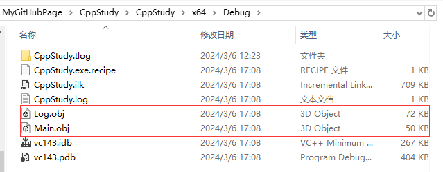
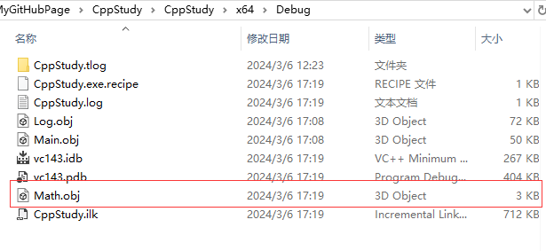
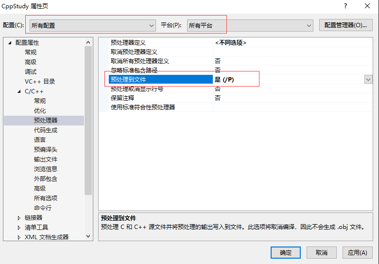
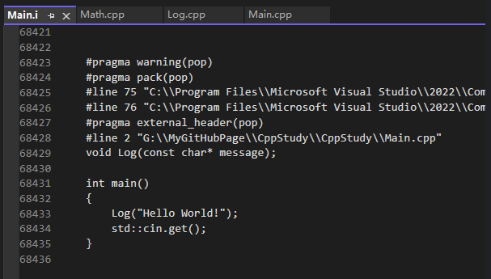
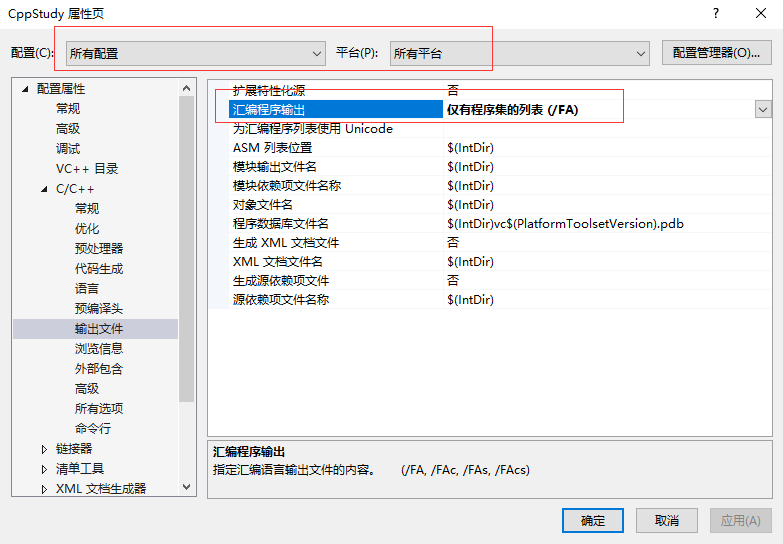
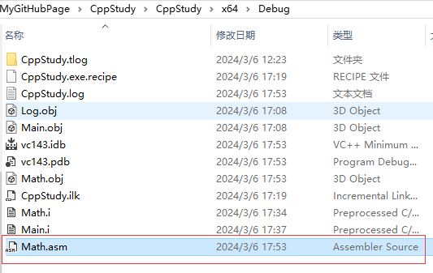
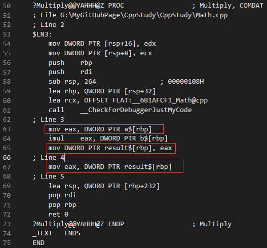

```C++
// main.cpp
#include <iostream>

void Log(const char* message)

int main()
{
    Log("Hello World!");
    std::cin.get();
}

// log.cpp
#include <iostream>

void Log(const char* message)
{
    std::cout << message << std::endl;
}

```

我们用文本书写 C++ 代码，保存为 cpp 文件，这就是一个 C++ 文本文件。从 cpp 到实际电脑可执行的 exe，经历了两个大步骤，编译和链接，即 compiling 和 linking。

# 编译

编译由 C++ 编译器执行，它只有唯一的任务，就是将 cpp 变为中继格式 obj。

## 执行流程

通过 编译器预处理代码 + tokenizing 标记解释 + parsing 解析 这三个步骤，创建叫做 abstract syntax tree 抽象语法树的代码表达。在此之后，就可以产生代码了，这个代码是真正的 cpu 可执行的机器码。除此之外，我们也会得到一些其他数据，比如某个地方存储着所有的常数变量。

总结来说，编译器的工作就是将代码转化成 constant data 常数数据或者 instructions 指令。

## 文件的概念

这里需要说明，C++ 没有文件的概念，文件仅仅是用来给编译器提供源码的某种方法，不像 java 那样，对文件强依赖，对于 C++ 来说，它会把。cpp 认作 C++ 代码，.h 认作头文件，这也只是规定中的一环，即定义文件类型和其对应的解释方法。

## cpp 和 translation unit

在实际项目中，一个 cpp 文件可能是由多个 cpp 文件组成，对于这个大的 cpp 文件，无论其内部有多少 cpp 文件，编辑器都只会生成一个 translation unit，即 n 个 cpp 才代表一个 translation unit。除非你的项目里 cpp 之间互不关联，那确实有多少 cpp 就有多少 translation unit。

## 预处理

查看上述代码生成的 obj，惊奇的发现竟然有 60KB 那么大。



现在我们再写一个 cpp，并观察它的大小

```C++
int Multiply(int a, int b)
{
	int result = a * b;
	return result;
}
```



其实上面的代码生成的 obj 那么大，其实是因为 include，它会把其后。h 文件的所有的内容都复制到当前文件中。就是真的复制，里面内容的格式是完全不关心的（甚至里面只有一个}），在编译时，先预处理，把文件都合成到这个 cpp 中，然后再往下进行。

### IDE 单独编译

vs 可以针对一个 cpp 进行单独编译，快捷键是 Ctrl + F7。这样就仅仅是编译，并不会链接。

### 将预处理导出为一个可观察的文件



这样再编译文件会生成可以查看的 .i 文件而不是 .obj 文件。

这样我们再打开 main.i 会看到惊人的大小，这里把 iostream 头文件全复制进来。可以看到 iostream 真的非常非常大。



## obj

obj 是一个二进制文件

### obj 可读方法

在 vs 设置中更改，将汇编输出改为仅有程序集的列表，这样就会额外输出一个可查看的汇编列表。




打开 asm，我们看到代码里最后的两次 move，是因为我们用 result 接了一次，然后啥也没做再返回，其实这两次完全可以合并成一次，即在返回是直接返回 a\*b



### 代码优化
