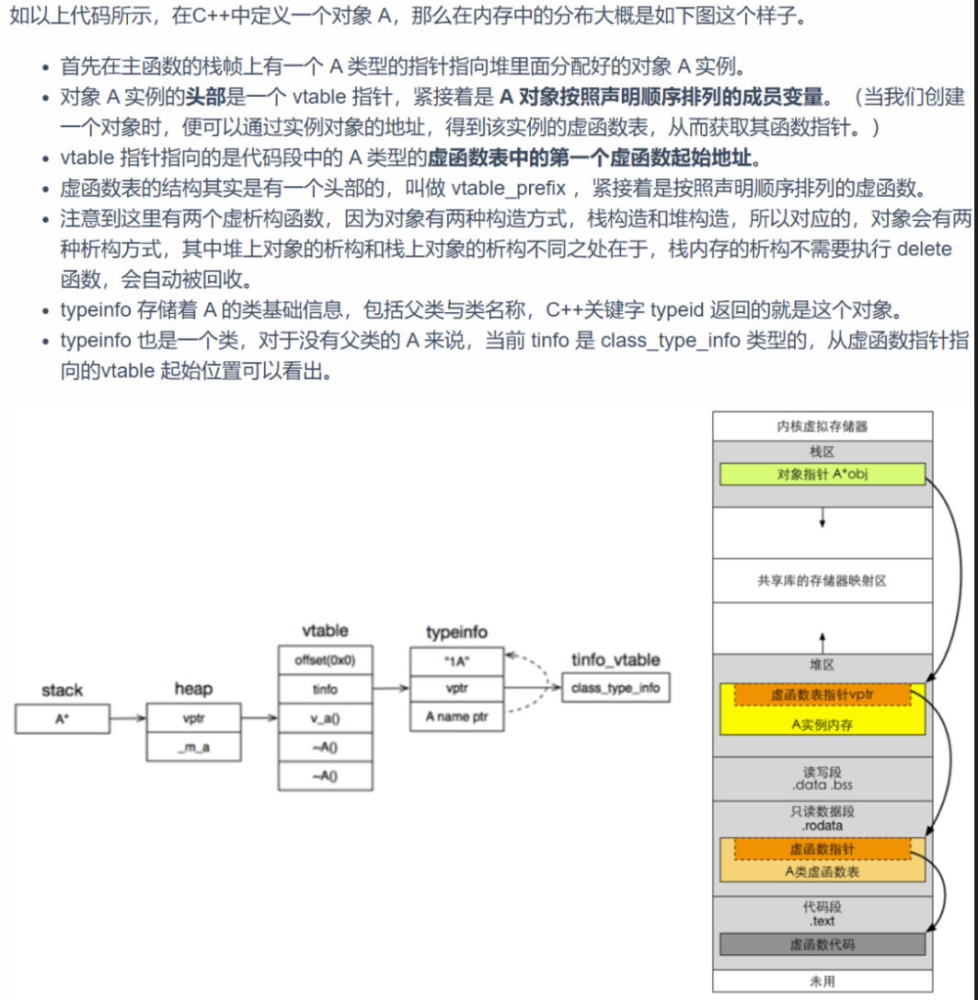
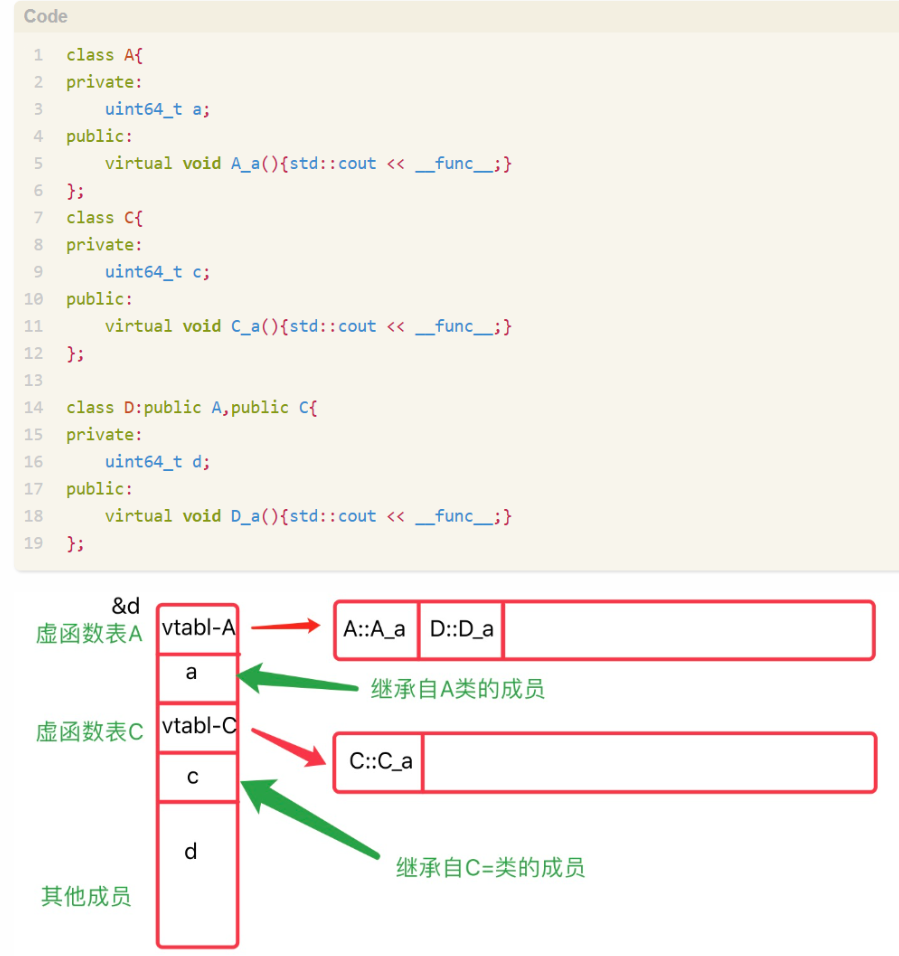

# 概念

虚函数是基类中用 virtual 关键字修饰的成员函数。  
用于支持运行时多态（运行时根据对象真实类型决定调用哪个函数实现）。

# 如果没有虚函数

如果父子类有同名函数，并且此函数并非虚函数，那么在调用以父类作为参数的函数时，其中的父类同名函数调用，只会调用父类的结果，尽管参数是子类。

```C++

#include <iostream>
#define Log(x) std::cout << x << std::endl;

class Entity
{
public:
	std::string GetName() { return "Entity"; }
};

class Player : public Entity
{
public:
	std::string GetName() { return "Player"; }
};

void LogName(Entity* e)
{
	Log(e->GetName());
}

int main()
{
	Entity* e = new Entity();
	Player* p = new Player();
	LogName(e);
	LogName(p);

	std::cin.get();
}
```

# 工作原理

虚函数引入了一种要动态分派的东西，通过虚表 vtable 来实现编译。    
编译器在每个含有虚函数的类里，生成一个虚函数表 (vtable)——其实是一个指针数组，指向各具体虚函数的实现。  
虚表是一个包含类中所有虚函数映射的列表。通过虚表我们可以在运行时找到正确的被重写的函数。  

每个对象（只要类有虚函数）都隐含有一个虚表指针（vptr），指向当前实际类型的 vtable。

vptr 通常是对象的第一个成员，占用一个指针大小，自动维护。vptr 是一个指针，在类的构造函数中创建生成，并且只能用 this 指针来访问它，因为它是类的一个成员，并且 vptr 指向保存虚函数地址的 vtable。

## 详细解析

### 正常函数

正常函数，所有实例共享同一段代码。相同的函数代码在内存中只存在一份，而不是每个对象都保存一份。

因此，正常函数并不占用对象的实例内存（如在栈或堆上分配的内存）。相反，它们存在于程序的代码段，这是一块不可修改的内存区域。

当调用正常函数时，编译器会生成直接调用该函数的代码。调用这些函数的方式通常是将参数压入栈中，并通过函数名的地址直接跳转到函数的实现。

### 虚函数

虚函数通过虚表管理，虚表又通过虚表指针来指向。

具体来说，一个无父类的类 A，若其中有虚函数，则其内部会多出成员变量，虚表指针和虚表。

展现在内存上的话，对于一个堆上实例 A，虚表指针在最前面，然后是类的按顺序定义的成员变量。这部分在堆上。  
虚表指针指向虚表，虚表存放在只读数据段 .rodata  
虚表包含所有虚函数的内存地址，这个地址才是虚函数真正的代码段，这些地址就是代码段内存地址。



this -> vptr -> vtable ->virtual function

每创建一个对象，其 vptr 都指向同一（对应类型）的静态虚表内地址。  
例如你 new 了一万个 Derived 对象，他们的 vptr 都指向那唯一一份 Derived 类的虚表地址。  

### 继承解析

- 单继承：子类的虚函数表中先将父类虚函数放在前，再放自己的虚函数指针。如果子类覆盖了父类的虚函数，将被放到了虚表中原来父类虚函数的位置。
- 多继承：当类在多重继承中时，其实例对象的内存结构并不只记录一个虚函数表指针。基类中有几个存在虚函数，则子类就会保存几个虚函数表指针。而子类自己的虚函数被放到了第一个父类的虚表中。



此时

```Cpp

A* a = &d; a->D_a(); // 合法，能调用 D_a()
C* c = &d; c->D_a(); // 非法，C 的虚表无 D_a，无法通过 C *调用

```

## 代价

需要额外的内存来存储虚表，基类多出一个指向虚表的指针。  
每次调用虚函数都需要从虚表中遍历，性能损失。  

### 类空间变大

编译器会给每一个包含虚函数或继承了虚函数的类自动建立一个虚函数表，所以虚函数的一个代价就是会增加类的体积。

在虚函数接口较少的类中这个代价并不明显，虚函数表 vtbl 的体积相当于几个函数指针的体积，如果你有大量的类或者在每个类中有大量的虚函数，你会发现 vtbl 会占用大量的地址空间。但这并不是最主要的代价，主要的代价是发生在类的继承过程中，在上面的分析中，可以看到，当子类继承父类的虚函数时，子类会有自己的 vtbl，如果子类只覆盖父类的一两个虚函数接口，子类 vtbl 的其余部分内容会与父类重复。如果存在大量的子类继承，且重写父类的虚函数接口只占总数的一小部分的情况下，会造成大量地址空间浪费。在一些 GUI 库上这种大量子类继承自同一父类且只覆盖其中一两个虚函数的情况是经常有的，这样就导致 UI 库的占用内存明显变大。

### 类实例对象变大

由于虚表指针 vptr 的存在，虚函数也会增加该类的每个对象的体积。在单继承或没有继承的情况下，类的每个对象会多一个 vptr 指针的体积，也就是 4 个字节；在多继承的情况下，类的每个对象会多 N 个（N＝包含虚函数的父类个数）vptr 的体积，也就是 4N 个字节。当一个类的对象体积较大时，这个代价不是很明显，但当一个类的对象很轻量的时候，如成员变量只有 4 个字节，那么再加上 4（或 4N）个字节的 vptr，对象的体积相当于翻了 1（或 N）倍，这个代价是非常大的。

# 写法

父类使用 virtual，子类使用 override，当然子类也可以省略 override，但是写上有很多好处：
- 让别人一目了然，这个函数是重写的。
- 纠错，防止写重写函数时错拼字母或者防止父函数忘记 virtual。

而且，其实子类也可以保持在前面的 virtual 以做提醒。

```C++

class Entity
{
public:
	virtual std::string GetName() { return "Entity"; }
};

class Player : public Entity
{
public:
	std::string GetName() override { return "Player"; }
	// virtual std::string GetName() override { return "Player"; } // 也是可行的
};

```

# 纯虚函数

基类只给接口，不实现，派生类必须重写。  
包含纯虚函数的类叫抽象类，不能实例化。  

## 接口

其他语言对于接口有一个自己的关键字 interface，而 C++ 还是用 class 类，只不过里面全是纯虚函数。但是这样的类不能被创建。

继承接口的类一定要实现接口，否则无法被实例化。

```C++

class MoveInterface
{
public:
	virtual void Move() = 0;
};

class Entity
{
public:
	int a;
	virtual std::string GetName() { return "Entity"; }
};

class Player : public Entity, MoveInterface
{
public:
	std::string GetName() override { return "Player"; }
	void Move() override { }
};

```

## 纯虚函数和虚函数区别
|                  | 虚函数 (virtual function) | 纯虚函数 (pure virtual function)         |
| ---------------- | ------------------------- | ---------------------------------------- |
| 是否有实现       | 可以有实现（也可没有）    | **不能有实现（类内实现=0）**             |
| 写法             | `virtual void foo();`     | `virtual void foo() = 0;`                |
| 所在类能否实例化 | 可以实例化                | **不可实例化（抽象类，abstract class）** |
| 子类可否继承     | 可以继承，不一定要重写    | 必须在派生类中重写/实现                  |
| 用途             | 提供接口并可覆盖默认实现  | 强制派生类实现接口，无默认实现           |

# 虚析构函数

如果有多态，析构函数一般也要声明为虚函数，否则可能导致派生对象析构不完整。

在 C++中，虚析构函数是为了确保当通过基类指针删除派生类对象时，能够调用正确的析构函数来释放资源。

如果基类的析构函数不是虚的，那么只会调用基类的析构函数，这可能导致派生类分配的资源没有被正确释放。

因此，如果一个类被设计为基类，并且它可能会被继承，那么它的析构函数应该声明为虚的。

```Cpp

class Base {  
public:  
    virtual ~Base() {}  
};  

```

## 纯虚析构函数怎么写？

析构函数可以是纯虚的，但纯虚析构函数必须有定义体，这是因为如果基类对象被正确创建，这个析构函数需要被调用。

# 需要注意的地方

虚函数不能是 static 成员函数，因为 static 不与对象绑定。  
构造函数不能为虚函数，但可以有虚析构函数。  
析构时会先调用派生类析构，再调用基类析构函数，不声明虚析构可能发生内存泄漏！  
多继承下，虚表机制更复杂（有多个 vptr）。  

# 虚函数能内联么？

在 C++ 中，内联函数是一种优化手段，指的是在函数调用处直接将函数的代码展开，而不是通过一次函数调用从栈中跳转。这种优化可以减少函数调用的开销（如参数传递和栈帧管理），但可能会增加二进制文件的大小。内联函数对于程序中需要频繁使用和调用的小函数非常有用。内联是否发生完全由编译器决定，即使你使用了 inline 关键字或者尝试让函数足够简单，编译器也可能因为性能或代码大小的考虑而拒绝内联。

虚函数调用通常是动态绑定的，也就是说，函数的实际调用版本是在运行时（runtime）根据对象的动态类型来确定的。

内联是由编译器在编译时（compile-time）完成的优化，函数实现需要在编译时就已知。

由于内联和多态的实现机制是分开的，两者在某些情况下看似冲突，但实际上可以共存。

虚函数可以内联，但前提是编译器能够确定调用的是哪一个版本的虚函数。这通常有以下两种情况：

- 当虚函数的调用对象是 “明确的（静态类型已知）” 时，虚函数就会退化成普通的函数调用，绑定成静态绑定。此时，编译器可以将虚函数内联。

	```Cpp

	class Base {  
	public:  
		virtual void Func() {  
			std::cout << "Base::Func()" << std::endl;  
		}  
	};  

	void Test() {  
		Base b; // 对象类型已知是 Base  
		b.Func(); // 编译器可以确定调用的是 Base::Func()，因此可以内联  
	}  

	```

- 在构造函数或析构函数中，虚表尚未完全建立（或已销毁），虚函数不会发生动态绑定。此时，虚函数的调用表现为普通函数调用，因此也可能会被内联。

	```Cpp

	class Derived : public Base {  
	public:  
		virtual void Func() override {  
			std::cout << "Derived::Func()" << std::endl;  
		}  
		Derived() {  
			Func(); // 此时调用的是 Base::Func()，可能被内联  
		}  
	};  

	```

- 如果虚函数是在内联函数或模板代码中调用，且可以确定调用的是哪个版本，则也可能被内联。

	```Cpp

	template<typename T>  
	void CallFunc(T obj) {  
		obj.Func(); // 如果 obj 类型可以确定，虚函数可以被内联  
	}  

	```

虚函数不能内联的情况：

- 如果虚函数的调用依赖于动态绑定（即调用版本是在运行时才确定），则编译器无法在编译时知道具体调用哪个函数，因此无法内联。
- 
	```Cpp

	void Test(Base* b) {  
		b->Func(); // 动态绑定，无法在编译时确定调用哪个版本  
	}  

	```

- 如果虚函数被派生类重写，并且调用的对象类型是基类的引用或者指针，则无法静态确定调用的版本，因此动态绑定阻碍了内联。

无论何时，使用基类指针或引用来调用虚函数，它都不能为内联函数（因为调用发生在运行时）。但是，无论何时，使用类的对象（不是指针或引用，而是静态绑定）来调用时，可以当做是内联，因为编译器在编译时确切知道对象是哪个类的。

在 C++ 中，如果一个成员函数在类体内（class definition）被定义，那么这个函数会被隐式地标记为 inline。例如：

	```Cpp

	class MyClass {  
	public:  
		void func() { // 这个函数在类体内定义  
			// 函数体  
		}  
	};  
	// 在以上代码中，func 函数会被隐式视为 inline 函数。

	```

如果成员函数的实现是在类外定义的，则它不会被隐式地当成 inline，除非显式指定 inline 关键字。

	```Cpp

	class MyClass {  
	public:  
		void func(); // 声明  
	};  

	// 类外定义  
	void MyClass::func() {  
		// 不会隐式成为 inline 函数  
	}  
	
	```

标记为 inline 只是建议，编译器会决定是否真正内联。

# 构造函数能是虚函数么？

虚函数基于虚表 vtable（内存空间），构造函数 (constructor) 如果是 virtual 的，调用时也需要根据 vtable 寻找，但是 constructor 是 virtual 的情况下是找不到的，因为 constructor 自己本身都不存在了，创建不到 class 的实例，没有实例 class 的成员（除了 public static/protected static for friend class/functions，其余无论是否 virtual）都不能被访问了。此外构造函数不仅不能是虚函数。而且在构造函数中调用虚函数，实际执行的是父类的对应函数，因为自己还没有构造好，多态是被 disable 的。
