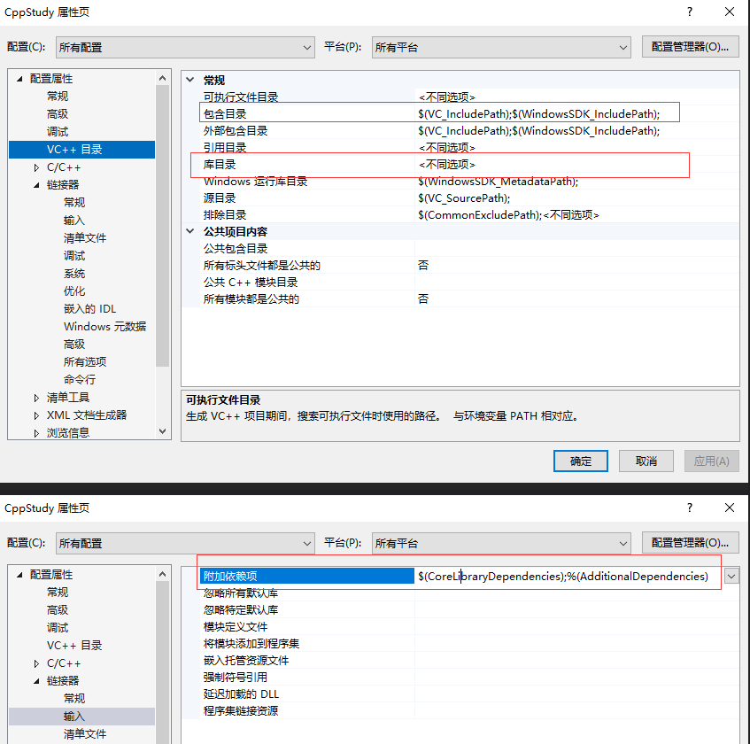
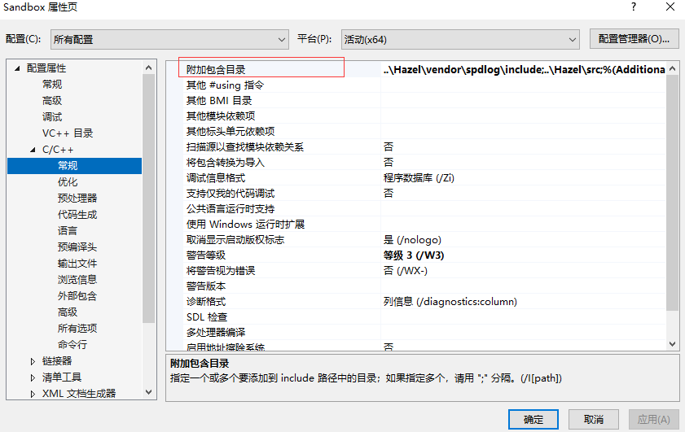
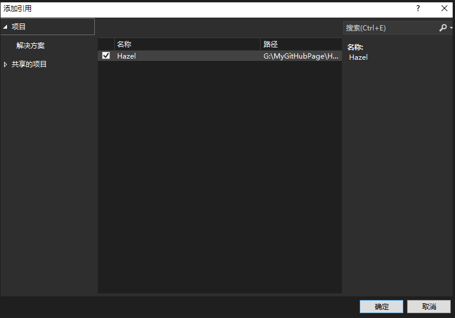

# 静态库和动态库

静态库项目生成 lib，link 时会将所有的代码都代入到所需项目中。  
动态库项目生成 dll，link 时自身还是那个 dll 文件，只不过 exe 通过导入导出符号来使用 dll 中的内容。  

lib 会导致主代码库臃肿，但速度会快（因为内联之类会生效）。  
dll 单独一个文件，且内存管理方便。  

dll 有个小问题，如果你的 dll 使用了另一个 lib，但是 dll 实际文件中，并没有用到 lib 的 A 函数，那么 A 函数就不会被链接到 dll 中，导致主项目在使用 dll 时，无法使用 A 函数的情况。    
解法一：在 lib 和 dll 中手动标记导出使用的函数，在 exe 中接收。  

# 静态库（Static Library）

- 本质：被编译为 .lib（Windows）或 .a（Linux/Unix）文件。
- 用法：链接时，“复制”需要的代码到生成的可执行文件（*.exe、无后缀等）里。
- 链接阶段：编译链接期（静态链接）。
- 执行时：程序已包含全部需要的库代码，不再需要外部库文件参与。

## 具体使用

引入一个外部静态库，需要两个文件：头文件和 lib 文件。  
头文件，里面是所有声明。  
lib 文件，通常较大，里面是所有函数的定义。  

将这两个文件放在我们的解决方案中，在 VS 设置里，将头文件引入 include。  
这时候其实就可以使用外部库的函数了，因为声明都在，编译也就不会出错。  
但是链接时，由于没有函数的实际定义，会报错。  

这就需要我们在 vs 中再将库目录和附加依赖项设置下。

这样一个静态库就链接好了。因为链接器可以看到更多东西，所以静态链接允许更多优化。

# 动态库（Dynamic Library）

- 本质：被编译为 .dll（Windows）或 .so（Linux/Unix）文件。
- 用法：可执行程序在运行时动态加载库文件。
- 链接阶段：编译期只需知道接口，真正加载在运行期（动态链接）。
- 执行时：程序必须能找到并加载这个动态库文件，否则无法运行相关功能。

## 具体使用

在程序真的执行起来的时候，才会被加载。  
与静态库一样设置头文件，库目录，最后附加项，要使用 dll.lib 文件，这个文件是 dll 函数指向文件，其包含了 dll 中函数的位置。这样之后就可以生成项目了，但是运行之后，你会得到窗口报错：缺少 XXX.dll，这是因为我们没有把 DLL 放到可执行文件目录下，运行时找不到动态库导致的。只要我们把文件复制过去就可以了。

# 工作机制对比

- 静态库

编译链接时，如 gcc main.c -lmystatic.a -o prog。

生成的 prog 文件中已包含 mystatic.a 内用到的全部代码片段。

- 动态库

分两个阶段：

链接时（编译时）：只需知道函数/变量的接口信息（不包含真实实现）

运行时加载：ld.so（Linux）或 Windows Loader 根据依赖自动加载。so/.dll。支持延迟加载（如 dlopen、LoadLibrary 等），更灵活。

# 什么时候用静态，什么时候用动态？

静态库更适合：  
    单一发布，程序必须独立运行、无外部依赖     
    嵌入式、对版本变动极为敏感的场景    

动态库更适合：   
    多个程序共用同一库，节约内存和硬盘空间   
    程序和库完全分离，便于后期升级维护   
    插件式开发、热替换扩展等    

# 表格对比总结

|          | 静态库                       | 动态库                     |
| -------- | ---------------------------- | -------------------------- |
| 文件扩展 | `.lib` / `.a`                | `.dll` / `.so`             |
| 链接方式 | 编译链接期整合进目标程序     | 程序运行期单独装载         |
| 程序体积 | **体积大**（库内容都进程序） | **体积小**（不复制库代码） |
| 多个程序 | 各自复制库代码，独立存在     | 共用一份库文件             |
| 更新维护 | 改库要重编所有依赖程序       | 可只换库文件，无需重编     |
| 依赖管理 | 运行为独立体，无外依赖       | 需保证运行时能找到库文件   |
| 性能     | 一次性加载，运行时快         | 首次调用时可能稍慢         |
| 作用范围 | 只能给本程序用               | 支持多程序共享             |

# 同一解决方案下不同项目通讯

S 解决方案中的 A 项目想用 B 项目的方法，使用附加 include。

按照上述第三方静态库的用法，我们可能还需要设置库目录，并在附加依赖中设置 B 项目的 lib，然而这些都可以省略，因为，AB 是在同一个解决方案中，我们只要在项目右键的引用中引用 B 项目就好。  

一个需要注意的地方是，如果 B 项目有变动，那在生成 A 项目时，B 也会连带着走一遍。