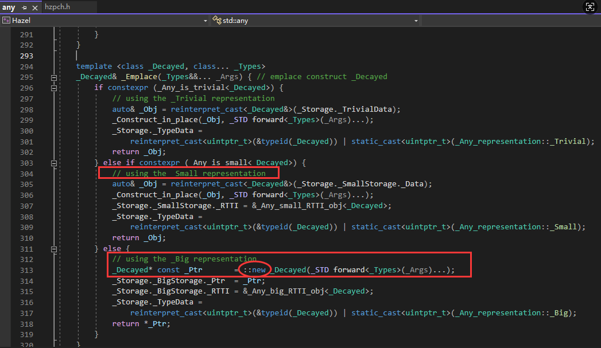

- [类型双关定义](#类型双关定义)
	- [例子](#例子)
- [实现方式](#实现方式)
	- [union](#union)
	- [指针类型强制转换（不推荐！）](#指针类型强制转换不推荐)
	- [memcpy 内存拷贝（C++11 及以后推荐）](#memcpy-内存拷贝c11-及以后推荐)
	- [variant](#variant)
		- [不是严格意义上的类型双关](#不是严格意义上的类型双关)
	- [any](#any)
- [总结](#总结)


# 类型双关定义

把一块内存按不同类型解释、快速实现转换。就是让一块数据，用另一种类型的视角重新访问和解读。

想让类型 T 的数据用类型 U 去解释，比如用 float 的存储表示为 uint32_t 去查看原始比特。  
用于底层操作、内存操作、字节序转换、硬件驱动、协议解析等。  

type punning 是原地 reinterpret，几乎零拷贝，不做类型检查，直接看 bit

## 例子

```C++

	int a = 10;
	double b = a;

```
实际上 a,b 是位于两个不同的内存地址。b=a 是一个隐式的转换。

```C++

	int a = 10;
	double b = *(double*)&a;

```

这里将一个指向原类型为 int 的 double 指针解引用为 b，这定会导致 b 的值很奇怪，因为这句话将 int 数据 4 字节强行扩充为 8 字节，解释成了 double 数据。

```C++

#include <iostream>

struct Entity
{
	int x, y;
};

int main()
{
	Entity e = { 5, 8};
	int y = *(int*)((char*)&e + 4);
	std::cout << y << std::endl;
	std::cin.get();
}

```

C++就是可以这么自由地控制内存显示。

```C++

#include <iostream>

struct Entity
{
	int x, y;

	int* GetPosition()
	{
		return &x;
	}
};

int main()
{
	Entity e = { 5, 8};
	int* position = e.GetPosition();
	std::cout << position[1] << std::endl;
	std::cin.get();
}

```

对于同一个内存地址可以有不同的解释方法，这就是类型双关。

# 实现方式

## union

```Cpp

union {  
    float f;  
    uint32_t u;  
} pun;  

pun.f = 1.23f;  
std::cout << std::hex << pun.u << std::endl; // 访问 float 的 bit 表示  

```

原理：共用一块内存，改写一种成员，再访问另一种成员。

```C++

struct Vector2
{
	float x, y;
};

struct Vector4
{
	float x, y, z, w;
}

```

对于 v4，如果我们想使用 v2 的形式表达它，我们可以使用类型双关来解释。

```C++

struct Vector4
{
	float x, y, z, w;
	Vector2& GetV2A()
	{
		return *(Vector2*)&x;
	}

	Vector2& GetV2B()
	{
		return *(Vector2*)&z;
	}
};

```

还有一种更轻松的表达，就是使用 union。

```C++

#include <iostream>

struct Vector2
{
	float x, y;
};

struct Vector4
{
	union
	{
		struct
		{
			float x, y, z, w;
		};

		struct
		{
			Vector2 a, b;
		};
	};
};

void PrintVector2(const Vector2& vector)
{
	std::cout << vector.x << "," << vector.y << std::endl;
}

int main()
{
	Vector4 v4 = { 1.0f,2.0f,3.0f,4.0f };
	PrintVector2(v4.a);
	PrintVector2(v4.b);
	v4.z = 50.0f;
	PrintVector2(v4.a);
	PrintVector2(v4.b);
	std::cin.get();
}

```
union 就是对内存进行对齐解释，上例 x,y 对应 a，z,w 对应 b。

## 指针类型强制转换（不推荐！）

```Cpp

float f = 1.23f;  
uint32_t u = *(uint32_t*)&f;  // 把 float 的地址视为 uint32_t  

```

有 UB（未定义行为）风险。  
C++标准里不同类型指针解引用不安全，易被优化器“干掉”或出错。  

## memcpy 内存拷贝（C++11 及以后推荐）

```Cpp

float f = 1.23f;  
uint32_t u;  
memcpy(&u, &f, sizeof(u));  

```

C++ 11 标准认为 memcpy 跨类型合法且无 UB。  
适合安全的 type punning。  

## variant

还有一种单个变量存放多种类型数据的方法是使用 variant。  
但和 union 取最大的那个类型作为自身大小不同，variant 大小为其中所有类型相加。如果不是为了顶级压榨性能，我们一般使用 variant。   
在使用时，最好先判断下数据是否是对应类型。  

```C++

#include <iostream>
#include <variant>

#define Log(x) std::cout << x << std::endl;

int main()
{
	std::variant<std::string, int> data;
	data = "Hello";
	if (auto value = std::get_if<std::string>(&data))
	{
		Log(std::get<std::string>(data));
	}
	if (auto value = std::get_if<int>(&data))
	{
		Log(std::get<int>(data));
	}

	data = 2;
	Log(std::get<int>(data));

	std::cin.get();
}

```
此外，可以在多参数返回的情景中使用 variant。

### 不是严格意义上的类型双关

type punning 关心的是“如何让同一块内存表示成不同类型”，比如 float <-> int；而 variant 是“如何管理多个不同类型之一的数据”，不用于 reinterpret。

| 方面         | `std::variant`           | type punning（类型双关）       |
| ------------ | ------------------------ | ------------------------------ |
| 本质         | 类型安全、自动管理       | 类型不安全、完全靠用户负责     |
| 目的         | 多选一、写成大类的联合体 | 高性能底层内存解释、硬件兼容等 |
| 应用         | 可变数据、消息/参数类型  | 协议解析、性能优化、低级操作   |
| 标准保障     | 安全、无 UB              | 部分做法有 UB（未定义）风险    |
| 支持多种类型 | 支持类型检查和访问       | 只做 reinterpret，不做区分     |

```Cpp

float f = 1.23f;  
uint32_t i;  
memcpy(&i, &f, sizeof(i));   // f 的原始比特转成 unsigned int  

std::variant<int, float> v = 1.23f;  
// v 里只记得“现在存的是 float”，你不能按 int 直接取出它的“比特表示”  

```

## any

还有一种可以存储任何类型而无需指定的方法，就是 any。

```C++

#include <iostream>
#include <any>

#define Log(x) std::cout << x << std::endl;

// 在这里断点可以发现是不是在堆上分配
void* operator new(size_t size)
{
	return malloc(size);
}

struct TestStruct
{
	std::string s0, s1;
};

int main()
{
	std::any data;
	//data = 5;
	//data = std::string("Hello");
	//std::string& string = std::any_cast<std::string&>(data);

	data = TestStruct();

	std::cin.get();
}

```

但是 any 有个问题是，超过 32 字节的内容，它会去堆上动态分配内存，这很慢。


事实上，我们用 variant 就可以了，即类型安全，又不会动态分配内存。any 就是个小丑。

本质：类型擦除、内部用动态分配或小对象优化（SBO），给你一个“任何类型的箱子”，但类型是运行时才知道的

```Cpp

#include <any>  
std::any a = 123;  
a = std::string("hello");  

```

| 方面         | `std::any`                         | type punning （类型双关）             |
| ------------ | ---------------------------------- | ------------------------------------- |
| 性质         | 类型安全，支持运行时类型查询       | 类型不安全，直接 reinterpret          |
| 用途         | 容纳不同类型、需要类型擦除的场景   | 按位级强制类型转换                    |
| 取出方式     | 需 dynamic_cast-like 检查 (get<T>) | 直接指针或 union 解读/内存拷贝 memcpy |
| 本质         | 管理被装的对象，有类型索引         | 管理同一块 bit 的不同解读             |
| 数据如何访问 | 需知道或推断出存的是啥类型         | 直接 reinterpret，快但有 UB 风险      |

# 总结

std::any 是万能“类型盒子”，安全但慢；std::variant 是类型安全选项盒，快但选项有限；type punning 是野路子，快但危险，各有边界，不能替代。