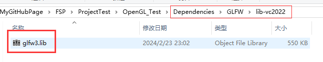
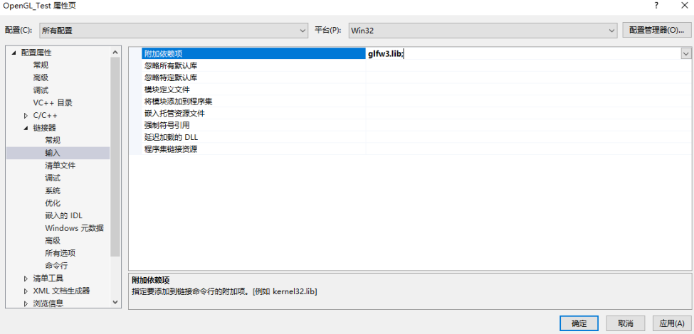
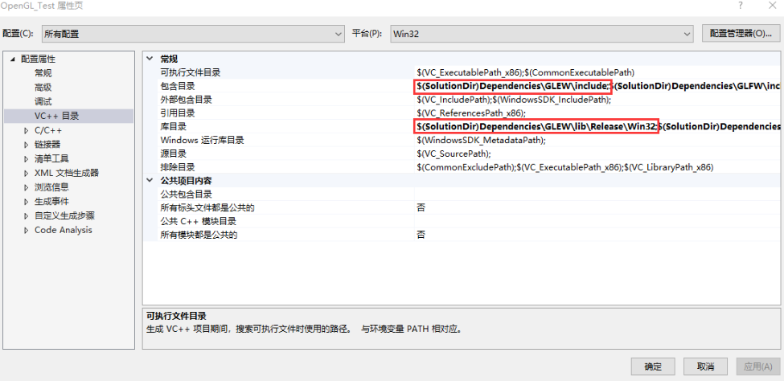
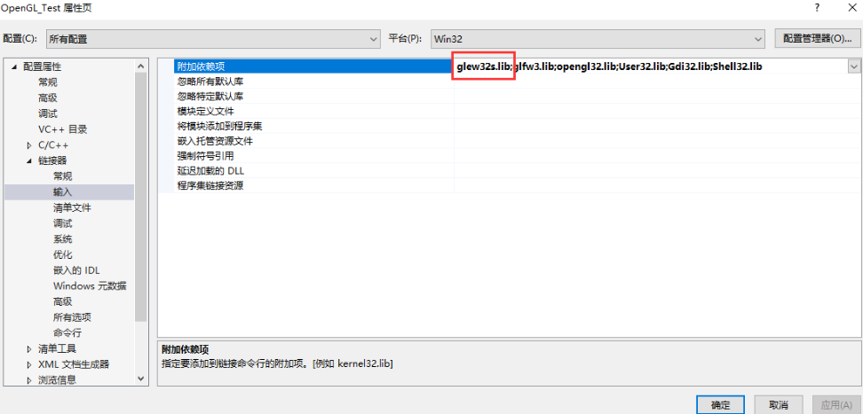
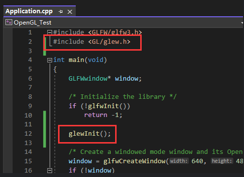
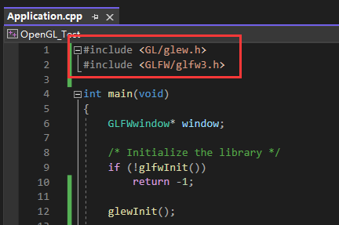
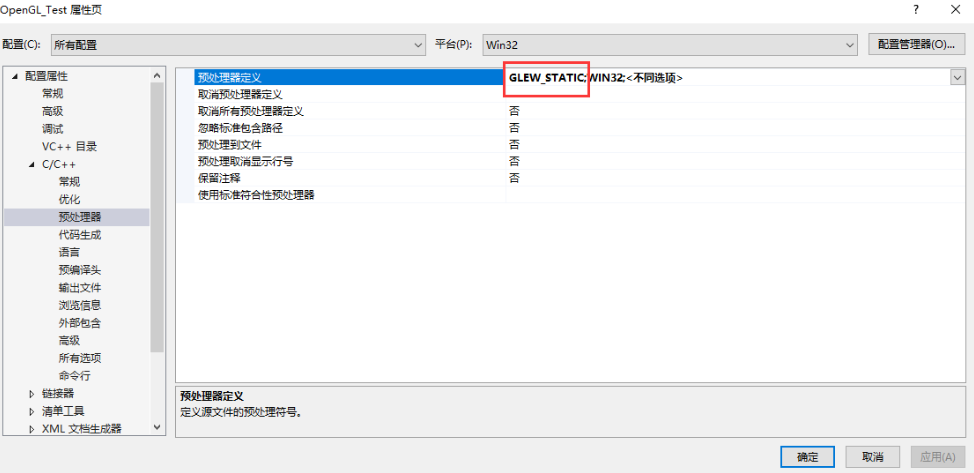

本文使用GLFW创建了一个基础的窗口，并且导入了GLEW，为OpenGL的调用提供了环境。  

[1 创建窗口](#创建窗口)  
&emsp;[1.1 示例代码解读](#示例代码解读)   
&emsp;[1.2 窗口设置](#窗口设置)   
[2 调用GL函数](#调用GL函数)  
&emsp;[2.1 使用glew](#使用glew)  
[3 最终代码](#最终代码)  

## 创建窗口
渲染，在哪里渲染？首先要有地方能让我们渲染，我们向计算机申请用于渲染的窗口，GLFW就是帮我们做这件事的，不同系统创建窗口要走不同流程，GLFW是很好的跨平台创建窗口的库，以Window为例，下面是配置GLFW的步骤。

>最流行的几个库有GLUT，SDL，SFML和GLFW。GLFW是一个专门针对OpenGL的C语言库，它提供了一些渲染物体所需的最低限度的接口。它允许用户创建OpenGL上下文、定义窗口参数以及处理用户输入，对我们来说这就够了。

1. 下载[GLFW源代码包](https://www.glfw.org/download.html)  
简单起见我们直接下载已经编译好的windows32包。这个代码包包含很多内容，但最终我们只需要编译生成的库和include文件夹。这里我们就使用静态库只保留最新的glfw3.lib就好。

2. 新建空项目  
使用显示所有文件来观察项目，然后创建src文件夹，创建Application入口文件，将glfw官网文档的示例代码复制其中，由于项目使用32位，需要把debug改成x86.

3. 依赖项配置  
在项目目录下创建依赖项文件夹，将GLFW中的include和库文件置入其中。  
形成{project}/Dependencies/GLFW/include和{project}/Dependencies/GLFW/lib的目录。  

其中，lib文件夹我们使用静态库，可以把动态库相关文件删除。

进入项目配置页，依次配置include和lib，主要是添加上面加入的glfw路径。

最后配置链接，删除所有的然后输入图中的lib

此时生成项目应该会报很多错误，依次在微软文档中搜索这些报错关键词，找到所需的链接，依次补充即可

4. 本地调试  
此时本地调试，已经出现黑框


#### 示例代码解读
```Cpp
#include <GLFW/glfw3.h>

int main(void)
{
    if (!glfwInit()) return -1;

    // 创建640 * 480 的标题为Hello World的窗口
    GLFWwindow* window = glfwCreateWindow(640, 480, "Hello World", NULL, NULL);
    if (!window)
    {
        glfwTerminate();
        return -1;
    }
    glfwMakeContextCurrent(window);

	// 渲染循环
    while (!glfwWindowShouldClose(window))
    {
		// 在每个新的渲染迭代开始的时候我们总是希望清屏，否则我们仍能看见上一次迭代的渲染结果（这可能是你想要的效果，但通常这不是）。
		// 我们可以通过调用glClear函数来清空屏幕的颜色缓冲，它接受一个缓冲位(Buffer Bit)来指定要清空的缓冲
		// 可能的缓冲位有GL_COLOR_BUFFER_BIT，GL_DEPTH_BUFFER_BIT和GL_STENCIL_BUFFER_BIT。由于现在我们只关心颜色值，所以我们只清空颜色缓冲。
		// 我们还可以指定清除底色glClearColor(0.2f, 0.3f, 0.3f, 1.0f);
        glClear(GL_COLOR_BUFFER_BIT);

		// 交换颜色缓冲（它是一个储存着GLFW窗口每一个像素颜色值的大缓冲），它在这一迭代中被用来绘制，并且将会作为输出显示在屏幕上。
		glfwSwapBuffers(window);

		// 检查有没有触发什么事件（比如键盘输入、鼠标移动等）、更新窗口状态，并调用对应的回调函数（可以通过回调方法手动设置）
		glfwPollEvents();
    }

	// 正确释放/删除之前的分配的所有资源
	glfwTerminate();
    return 0;
}
```
#### 窗口设置
在实际使用这个窗口前，还需要进行一些设置。
1. OpenGL版本设置  
```Cpp
if (!glfwInit()) return -1;

// glfwWindowHint设置一些参数
// 这里将主版本号(Major)和次版本号(Minor)都设为3
glfwWindowHint(GLFW_CONTEXT_VERSION_MAJOR, 3);
glfwWindowHint(GLFW_CONTEXT_VERSION_MINOR, 3);
// 明确告知使用核心模式
glfwWindowHint(GLFW_OPENGL_PROFILE, GLFW_OPENGL_CORE_PROFILE);
```
2. 交换缓冲区同步帧率   
glfwSwapInterval(1);   
其中的参数指示了交换缓冲区之前需要等待多少帧。默认情况下，参数为0，意味着缓冲区交换会立即发生，就是GPU做完就换，这意味这如果屏幕刷新率跟不上缓冲区交换速度，会导致很多帧画面我们根本看不到，纯纯浪费性能，而且因为缓冲区可能会在屏幕更新的途中进行交换，从而导致画面撕裂。所以一般都是将交换间隔设置为1，即对齐显示帧率，一帧一交换。
```Cpp
glfwMakeContextCurrent(window);
glfwSwapInterval(1);
```
注意需要放在glfwMakeContextCurrent后面才能生效。
3. 设置渲染范围  
我们之前设置了窗口的范围，但是窗口生成之后我们是可以更改这个窗口的大小的，如果于此同时不更改渲染的范围，就会造成渲染部分在窗口外的情况，因为此时渲染还在以窗口左下角为（0，0）点，以原来的大小渲染。比如原来1920 * 1080 被我们缩小到 800 * 600，如果不设置，会有一部分从右上角溢出。  

所以我们需要通过回调事件，在检测到窗口大小变动时，让渲染范围也跟随变化。  
```Cpp
glfwMakeContextCurrent(window);
glfwSwapInterval(1);
glfwSetFramebufferSizeCallback(window, framebuffer_size_callback);

void framebuffer_size_callback(GLFWwindow* window, int width, int height)
{
	glViewport(0, 0, width, height);
}
```

此外，额外介绍下在渲染循环中使用键盘输入。此例中，按下ESC，窗口关闭。
```Cpp
while (!glfwWindowShouldClose(window))
{
	processInput(window);
	glClear(GL_COLOR_BUFFER_BIT);
	glfwSwapBuffers(window);
	glfwPollEvents();
}

void processInput(GLFWwindow* window)
{
	// 按下退出就设置窗口关闭标识
	if (glfwGetKey(window, GLFW_KEY_ESCAPE) == GLFW_PRESS)
		glfwSetWindowShouldClose(window, true);
}
```

## 调用GL函数
问：现在我们有窗口了，我们还需要调用显卡驱动里的函数，才能在窗口做绘制，如何调用？  
答：我们需要实际进入这些驱动程序中去提取并调用函数，说是提取函数，其实是获取函数声明然后链接到函数。所以我们需要通过检索DLL找到库中函数的指针。  

问：OpenGL那么多函数，我们要用到一个就做一个这样的映射么？  
答：每用到一个就要做一次未免太繁琐。所以我们不妨用现有的库来帮助我们完成这个繁琐的任务，最常用的有glad和glew。glad很好它包含的函数非常全面，但是我们用不到那么多，基本上glew就完全足够我们学习用了。它们帮我们做好了使用函数的接口。

1. 在[glew官网](glew.sourceforge.net)下载32位包
将其复制到依赖项文件夹下并重命名为GLEW
  
进入GLEW，里面有使用文档
  
2. 配置依赖项
加入include、lib

链接静态库填写时需要注意，哪一个是静态库？根据大小或者名称中的s可以得知。




#### 使用glew
此时我们就可以在代码中使用glew了，glew在使用过程中有几点需要注意：  
1. 在使用前需要使用glewInit()函数初始化  
  
2. 此时生成项目，你会得到一个报错，这是因为glew必须声明在glfw之前。glew的头文件包含了正确的OpenGL头文件（例如GL/gl.h），所以需要在其它依赖于OpenGL的头文件之前包含glew。  
  
3. 改好后生成，还会报错，这是因为我们需要预处理定义为静态glew  
  
4. 但此时运行，还是有错误的，因为glewinit必须在有效的OpenGL上下文中，所以还需要移动初始化的位置。  
  


## 最终代码
```Cpp
#include<GL/glew.h>
#include<GLFW/glfw3.h>
#include<iostream>

void processInput(GLFWwindow* window);
void framebuffer_size_callback(GLFWwindow* window, int width, int height);

int main()
{
	if (!glfwInit()) return -1;

	// glfwWindowHint设置一些参数
	// 这里将主版本号(Major)和次版本号(Minor)都设为3
	glfwWindowHint(GLFW_CONTEXT_VERSION_MAJOR, 3);
	glfwWindowHint(GLFW_CONTEXT_VERSION_MINOR, 3);
	// 明确告知使用核心模式
	glfwWindowHint(GLFW_OPENGL_PROFILE, GLFW_OPENGL_CORE_PROFILE);

	// 创建800 * 600 的标题为OpenGL的窗口
	GLFWwindow* window = glfwCreateWindow(800, 600, "OpenGL", NULL, NULL);
	if (!window)
	{
		glfwTerminate();
		return -1;
	}
	glfwMakeContextCurrent(window);
	// 交换缓冲区同步帧率，对齐显示帧率，一帧一交换
	glfwSwapInterval(1);
	// 设置渲染范围同步为窗口大小
	glfwSetFramebufferSizeCallback(window, framebuffer_size_callback);

	// 初始化glew，为gl函数调用做准备
	if (glewInit() != GLEW_OK) 
		std::cout << "Error" << std::endl;

	// 渲染循环
	while (!glfwWindowShouldClose(window))
	{
		// 处理输入
		processInput(window);

		// 在每个新的渲染迭代开始的时候我们总是希望清屏，否则我们仍能看见上一次迭代的渲染结果（这可能是你想要的效果，但通常这不是）。
		// 我们可以通过调用glClear函数来清空屏幕的颜色缓冲，它接受一个缓冲位(Buffer Bit)来指定要清空的缓冲
		// 可能的缓冲位有GL_COLOR_BUFFER_BIT，GL_DEPTH_BUFFER_BIT和GL_STENCIL_BUFFER_BIT。由于现在我们只关心颜色值，所以我们只清空颜色缓冲。
		// 我们还可以指定清除底色glClearColor(0.2f, 0.3f, 0.3f, 1.0f);
		glClear(GL_COLOR_BUFFER_BIT);

		// 交换颜色缓冲（它是一个储存着GLFW窗口每一个像素颜色值的大缓冲），它在这一迭代中被用来绘制，并且将会作为输出显示在屏幕上。
		glfwSwapBuffers(window);

		// 检查有没有触发什么事件（比如键盘输入、鼠标移动等）、更新窗口状态，并调用对应的回调函数（可以通过回调方法手动设置）
		glfwPollEvents();
	}

	// 正确释放/删除之前的分配的所有资源
	glfwTerminate();
	return 0;
}

void processInput(GLFWwindow *window)
{
	// 按下退出就设置窗口关闭标识
	if (glfwGetKey(window, GLFW_KEY_ESCAPE) == GLFW_PRESS)
		glfwSetWindowShouldClose(window, true);
}

void framebuffer_size_callback(GLFWwindow* window, int width, int height)
{
	glViewport(0, 0, width, height);
}
```


