本文使用GLFW创建了一个基础的窗口，并且导入了GLEW，为OpenGL的调用提供了环境。  

[1 创建窗口](#创建窗口)  
[2 调用函数](#调用函数)  
&emsp;[2.1 使用glew](#使用glew)  

## 创建窗口
渲染，在哪里渲染？首先要有地方能让我们渲染，我们向计算机申请用于渲染的窗口，GLFW就是帮我们做这件事的，不同系统创建窗口要走不同流程，GLFW是很好的跨平台创建窗口的库，以Window为例，下面是配置GLFW的步骤。

>最流行的几个库有GLUT，SDL，SFML和GLFW。GLFW是一个专门针对OpenGL的C语言库，它提供了一些渲染物体所需的最低限度的接口。它允许用户创建OpenGL上下文、定义窗口参数以及处理用户输入，对我们来说这就够了。

1. 下载[GLFW源代码包](https://www.glfw.org/download.html)  
简单起见我们直接下载已经编译好的windows32包。这个代码包包含很多内容，但最终我们只需要编译生成的库和include文件夹。这里我们就使用静态库只保留最新的glfw3.lib就好。

2. 新建空项目  
使用显示所有文件来观察项目，然后创建src文件夹，创建Application入口文件，将glfw官网文档的示例代码复制其中，由于项目使用32位，需要把debug改成x86.
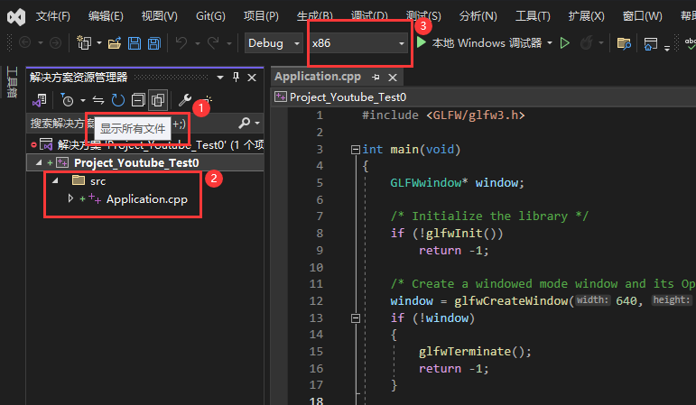
3. 依赖项配置  
在项目目录下创建依赖项文件夹，将GLFW中的include和库文件置入其中。  
形成{project}/Dependencies/GLFW/include和{project}/Dependencies/GLFW/lib的目录。  
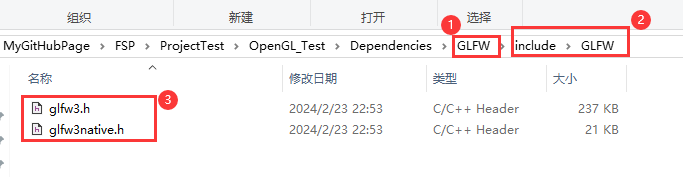
其中，lib文件夹我们使用静态库，可以把动态库相关文件删除。
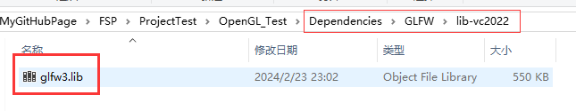
进入项目配置页，依次配置include和lib，主要是添加上面加入的glfw路径。

最后配置链接，删除所有的然后输入图中的lib
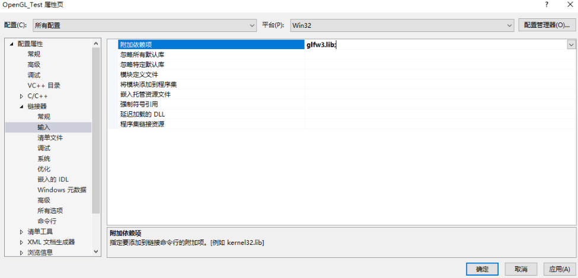
此时生成项目应该会报很多错误，依次在微软文档中搜索这些报错关键词，找到所需的链接，依次补充即可
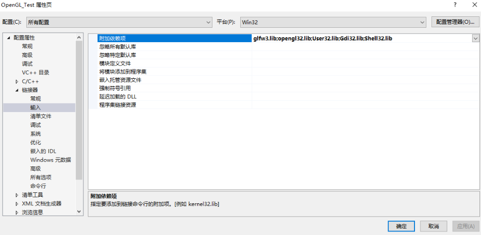
4. 本地调试  
此时本地调试，已经出现黑框
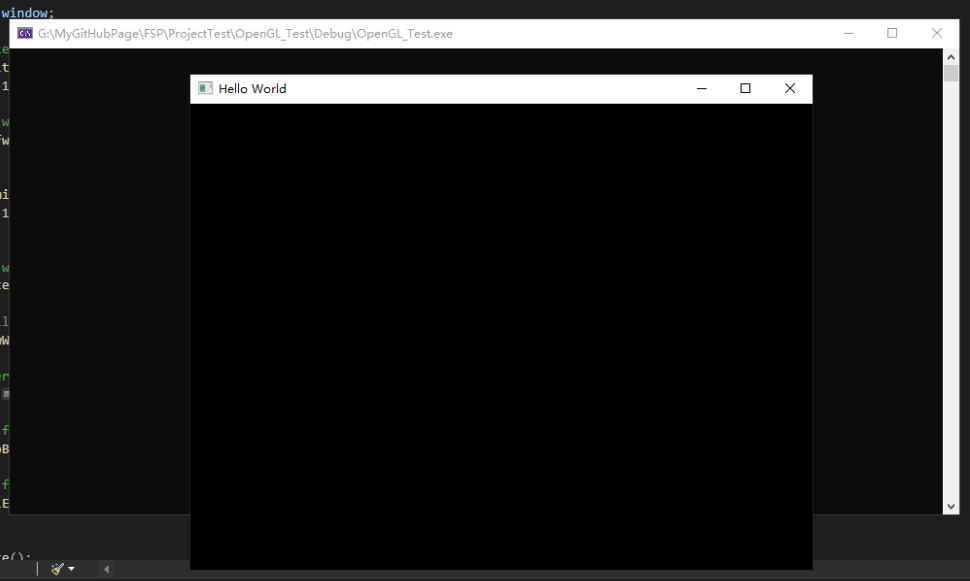

## 调用函数
问：现在我们有窗口了，我们还需要调用显卡驱动里的函数，才能在窗口做绘制，如何调用？  
答：我们需要实际进入这些驱动程序中去提取并调用函数，说是提取函数，其实是获取函数声明然后链接到函数。所以我们需要通过检索DLL找到库中函数的指针。  

问：OpenGL那么多函数，我们要用到一个就做一个这样的映射么？  
答：每用到一个就要做一次未免太繁琐。所以我们不妨用现有的库来帮助我们完成这个繁琐的任务，最常用的有glad和glew。glad很好它包含的函数非常全面，但是我们用不到那么多，基本上glew就完全足够我们学习用了。它们帮我们做好了使用函数的接口。

1. 在[glew官网](glew.sourceforge.net)下载32位包
将其复制到依赖项文件夹下并重命名为GLEW
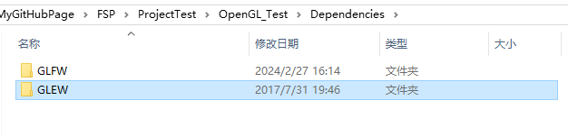  
进入GLEW，里面有使用文档
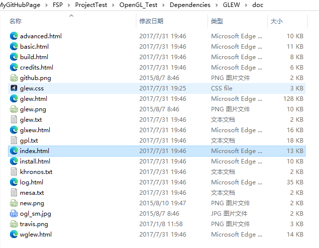  
2. 配置依赖项
加入include、lib
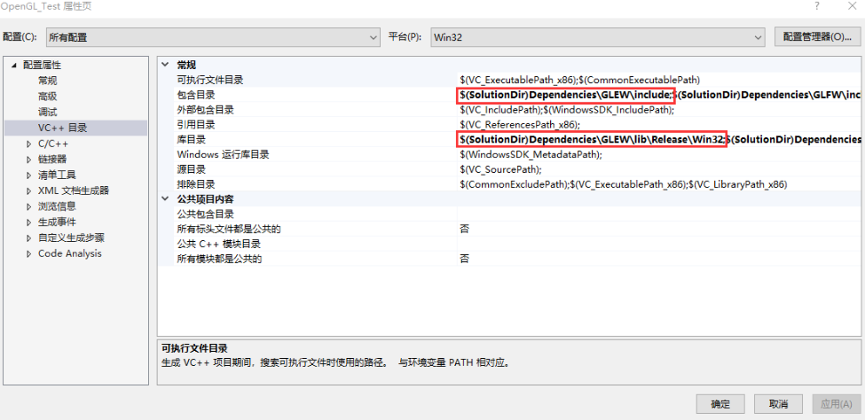
链接静态库填写时需要注意，哪一个是静态库？根据大小或者名称中的s可以得知。
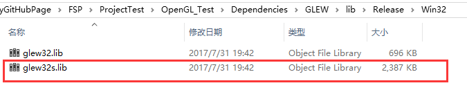
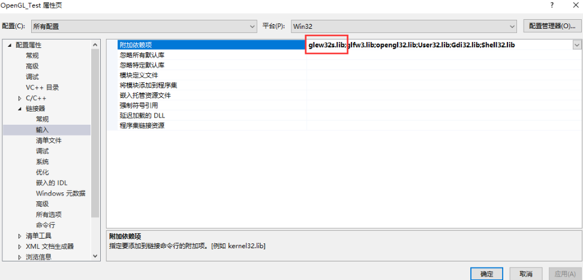


#### 使用glew
此时我们就可以在代码中使用glew了，glew在使用过程中有几点需要注意：  
1. 在使用前需要使用glewInit()函数初始化  
  
2. 此时生成项目，你会得到一个报错，这是因为glew必须声明在glfw之前  
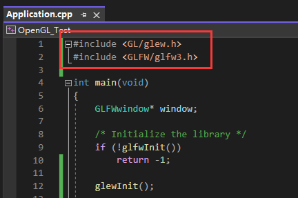  
3. 改好后生成，还会报错，这是因为我们需要预处理定义为静态glew  
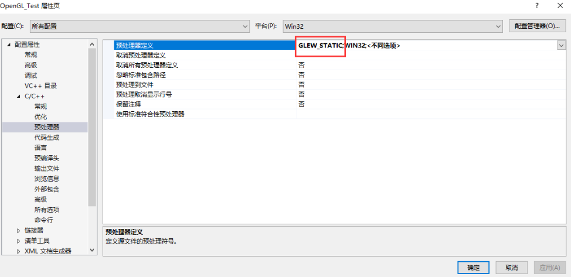  
4. 但此时运行，还是有错误的，因为glewinit必须在有效的OpenGL上下文中，所以还需要移动初始化的位置。  
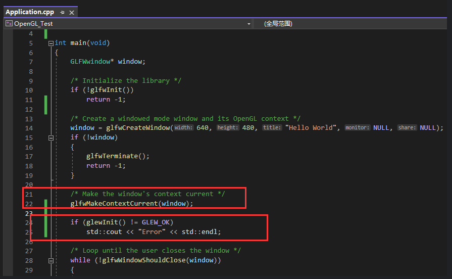  

#### 最终代码
```C++
#include<GL/glew.h>
#include<GLFW/glfw3.h>
#include<iostream>

int main()
{
	GLFWwindow* window;

	/* Initialize the library */
	if (!glfwInit()) return -1;

	/* Create a windowed mode window and its OpenGL context */
	window = glfwCreateWindow(640, 480, "Hello World", NULL, NULL);
	if (!window)
	{
		
		glfwTerminate();
		return -1;
	}

	/* Make the window's context current */
	glfwMakeContextCurrent(window);

	if (glewInit() != GLEW_OK) std::cout << "Error" << std::endl;

	/* Loop until the user closes the window */
	while (!glfwWindowShouldClose(window))
	{
		/* Render here */
		glClear(GL_COLOR_BUFFER_BIT);

		/* Swap front and back buffers */
		glfwSwapBuffers(window);

		/* Poll for and process events */
		glfwPollEvents();
	}

	glfwTerminate();
	return 0;
}
```


