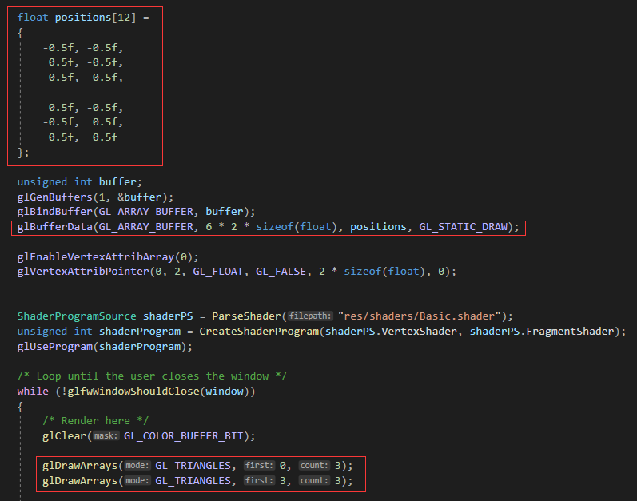
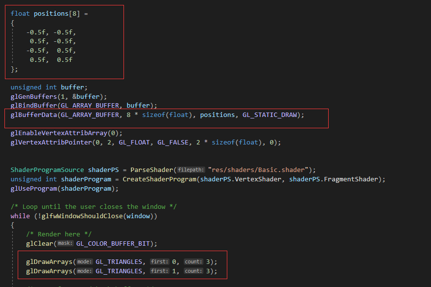

本文。  

[1 绘制正方形](#绘制正方形)  
[2 索引缓冲区](#索引缓冲区)  
## 绘制正方形
上节我们绘制了三角形，使用了三个顶点，那么如何绘制一个正方形？图形绘制的基础单元是三角形，上节使用的glDrawArrays函数中的mode也只支持点线三角形，所以想画一个正方形，其实就是画两个三角形。两个三角形，所以我们需要6个顶点。  

代码上，需要修改顶点数据，修改顶点缓冲区大小，修改绘制函数。

显然，我们可以减少两个顶点的使用，因为它们完全重复，让这4个顶点中处于中间的1，2号位的两个顶点为对角线顶点即可绘制出正方形。



## 索引缓冲区
上述绘制正方形的优化看似很好，实则局限性很强，如果我们要画一个超级多面形状，总不能有多少三角形就调用多少次DrawArray吧。  

由此，我们引入了IndexBuffer索引缓冲区。其里面存储着所有的三角形序列，即指定顶点中的哪几个去组成三角形。
```Cpp
unsigned int indices[6] =
{
	0, 1, 2,
	1, 2, 3
};

unsigned int ibo;
glGenBuffers(1, &ibo);
glBindBuffer(GL_ELEMENT_ARRAY_BUFFER, ibo);
glBufferData(GL_ELEMENT_ARRAY_BUFFER, 6 * sizeof(unsigned int), indices, GL_STATIC_DRAW);
```
绘制的时候，需要使用element
```Cpp
glDrawElements(GL_TRIANGLES, 6, GL_UNSIGNED_INT, nullptr);
```