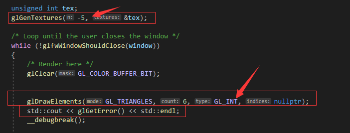

摘要：在书写代码过程中应用错误处理以防止出现有显示错误而无法溯源代码问题的情况；将错误处理抽象成渲染文件，以供给其他类使用。   

[1 错误处理](#错误处理)  
&emsp;[1.1 获取错误的函数](#获取错误的函数)  
&emsp;[1.2 宏处理错误](#宏处理错误)   
[2 渲染文件](#渲染文件)   

## 错误处理
如果窗口中绘制的图形没有达到效果，在没有错误处理的情况下是很难找到哪里出现问题的。

#### 获取错误的函数
OpenGL提供了glGetError，可以返回错误的类型代号，但是这个函数有个缺陷，它只能返回一个错误，该错误被返回后就像是被弹出栈一样，然后再次调用时，再返回下一个错误。
  
所以上图中，会返回1281错误码，而不是1280。这个错误码具体代表什么，可以在glew中查找到，但是是以16进制形式。


所以我们想看看是不是这行代码出现的问题，需要先清空已有的错误标识。
```Cpp
static void ClearAllError()
{
	while (glGetError() != GL_NO_ERROR);
}

// 调用时
ClearAllError();
// 要检查的函数
XXXXX();
// 输出错误代码以查看错误
glGetError();
```

#### 宏处理错误
如果每个函数我们都这样处理，那代码可读性将大大下降，我们可以用宏包裹起来。

```Cpp
#define GLCall(x) ClearAllError();\
	x;\
	LogError(#x, __FILE__, __LINE__)

static void ClearAllError()
{
	while (glGetError() != GL_NO_ERROR);
}

static void LogError(const char* function, const char* file, int line)
{
	while (GLenum error = glGetError())
	{
		std::cout << "[GL Error] : " << error << "\n" << function << "\n" << file << " : " << line << std::endl;
	}
}
```
上述代码中，LogError需要用while，这样才能把错误标记处理干净。这样处理之后，只需要在调用函数时，用GLCall包裹即可。  
我们还可以用断言再处理一下，让代码出现错误时断点。  
```Cpp
#define ASSERT(x) if(!x) __debugbreak();
#define GLCall(x) ClearAllError();\
	x;\
	ASSERT(LogError(#x, __FILE__, __LINE__))

static void ClearAllError()
{
	while (glGetError() != GL_NO_ERROR);
}

static bool LogError(const char* function, const char* file, int line)
{
	while (GLenum error = glGetError())
	{
		std::cout << "[GL Error] : " << error << "\n" << function << "\n" << file << " : " << line << std::endl;
		return false;
	}
	return true;
}
```
这样代码在报错时，会自动断点。这当然是在debug模式下才允许这样做，所以在最后
```Cpp
#ifdef _DEBUG
	#define ASSERT(x) if(!x) __debugbreak();
	#define GLCall(x) ClearAllError();\
		x;\
		SSERT(LogError(#x, __FILE__, __LINE__))
#else
	#define ASSERT(x) x
	#define GLCall(x) x
#endif
```

## 渲染文件
将上述代码放到Render.h和Render.cpp中以供给其他类使用。  

Render.h
```Cpp
#pragma once

#include <GL/glew.h>

#ifdef _DEBUG
#define ASSERT(x) if(!x) __debugbreak();
#define GLCall(x) ClearAllError();\
		x;\
		ASSERT(LogError(#x, __FILE__, __LINE__))
#else
#define ASSERT(x) x
#define GLCall(x) x
#endif


void ClearAllError();

bool LogError(const char* function, const char* file, int line);

```
Render.cpp
```Cpp
#include <iostream>
#include "Render.h"

void ClearAllError()
{
	while (glGetError() != GL_NO_ERROR);
}

bool LogError(const char* function, const char* file, int line)
{
	while (GLenum error = glGetError())
	{
		std::cout << "[GL Error] : " << error << "\n" << function << "\n" << file << " : " << line << std::endl;
		return false;
	}
	return true;
}
```
