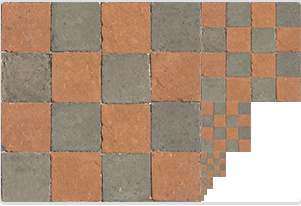

本文介绍了纹理。  


## 纹理简介
纹理(Texture)是一个2D图片。把纹理应用在物体上，这会让物体在不增加顶点的情况下，看起来更加精细。

>除了图像以外，纹理也可以被用来储存大量的数据，这些数据可以发送到着色器上  

## 加载与创建纹理
使用纹理之前要做的第一件事是把它们加载到我们的应用中。纹理图像可能被储存为各种各样的格式，每种都有自己的数据结构和排列，所以我们如何才能把这些图像加载到应用中呢？一个解决方案是选一个需要的文件格式，比如.PNG，然后自己写一个图像加载器，把图像转化为字节序列。写自己的图像加载器虽然不难，但仍然挺麻烦的，而且如果要支持更多文件格式呢？你就不得不为每种你希望支持的格式写加载器了。

另一个解决方案也许是一种更好的选择，使用一个支持多种流行格式的图像加载库来为我们解决这个问题。比如说我们要用的stb库中的stb_image.h。（stb在github上可找到）  
下载这一个头文件，将它以stb_image.h的名字加入你的工程，并另创建一个新的C++文件，输入以下代码：
```cpp
#define STB_IMAGE_IMPLEMENTATION
#include "stb_image.h"
```
通过定义STB_IMAGE_IMPLEMENTATION，预处理器会修改头文件，让其只包含相关的函数定义源码，等于是将这个头文件变为一个 .cpp 文件了。现在只需要在你的程序中包含stb_image.h并编译就可以了。
#### 加载图片
要使用stb_image.h加载图片，我们需要使用它的stbi_load函数：
```Cpp
int width, height, nrChannels;
unsigned char *data = stbi_load("container.jpg", &width, &height, &nrChannels, 0);
```
这个函数首先接受一个图像文件的位置作为输入。接下来它需要三个int作为图像的宽度、高度和颜色通道的个数

#### 生成纹理
和之前生成的OpenGL对象一样，纹理也是使用ID引用的。让我们来创建一个：
```Cpp
unsigned int m_RendererID;
GLCall(glGenTextures(1, &m_RendererID));
GLCall(glBindTexture(GL_TEXTURE_2D, m_RendererID));
```
纹理可以通过glTexImage2D来生成：
```Cpp
glTexImage2D(GL_TEXTURE_2D, 0, GL_RGB, width, height, 0, GL_RGB, GL_UNSIGNED_BYTE, data);
glGenerateMipmap(GL_TEXTURE_2D);
```
- 第一个参数指定了纹理目标(Target)。
- 第二个参数为纹理指定多级渐远纹理的级别，如果你希望单独手动设置每个多级渐远纹理的级别的话。这里我们填0，也就是基本级别。
- 第三个参数告诉OpenGL我们希望把纹理储存为何种格式。
- 第四个和第五个参数设置最终的纹理的宽度和高度。
- 下个参数应该总是被设为0（历史遗留的问题）。
- 第七第八个参数定义了源图的格式和数据类型。我们使用RGB值加载这个图像，并把它们储存为char(byte)数组，我们将会传入对应值。
- 最后一个参数是真正的图像数据。

当调用glTexImage2D时，当前绑定的纹理对象就会被附加上纹理图像。然而，目前只有基本级别(Base-level)的纹理图像被加载了，如果要使用多级渐远纹理，我们必须手动设置所有不同的图像（不断递增第二个参数）。或者，直接在生成纹理之后调用glGenerateMipmap。这会为当前绑定的纹理自动生成所有需要的多级渐远纹理。

生成了纹理和相应的多级渐远纹理后，释放图像的内存是一个很好的习惯。
```Cpp
stbi_image_free(data);
```
#### 顶点属性添加纹理坐标
比如一个三角形，想给它添加纹理，需要将三角形顶点坐标与想要的纹理坐标对应，来指明该顶点要从纹理图像的哪个部分进行采样。之后其他的地方使用片段着色器进行插值。  

>使用纹理坐标获取纹理颜色叫做采样  

```Cpp
float positions[] =
{
	-0.5f, -0.5f, 0.0f, 0.0f,
	 0.5f, -0.5f, 1.0f, 0.0f,
	-0.5f,  0.5f, 0.0f, 1.0f,
	 0.5f,  0.5f, 1.0f, 1.0f
};
// 每个顶点数据有2个顶点属性，共计4个float
VertexBuffer vb(positions, 4 * 4 * sizeof(float));
VertexArray va;
VertexBufferLayout layout;
// 顶点坐标布局 2个float
layout.Push<float>(2);
// 纹理坐标布局 2个float
layout.Push<float>(2);
va.LayoutVertexBuffer(vb, layout);
```
#### 着色器
```Cpp
#version 330 core
layout (location = 0) in vec3 aPos;
layout (location = 1) in vec3 aColor;
layout (location = 2) in vec2 aTexCoord;

out vec3 ourColor;
out vec2 TexCoord;

void main()
{
    gl_Position = vec4(aPos, 1.0);
    ourColor = aColor;
    TexCoord = aTexCoord;
}

#version 330 core
out vec4 FragColor;

in vec3 ourColor;
in vec2 TexCoord;

uniform sampler2D ourTexture;

void main()
{
    FragColor = texture(ourTexture, TexCoord);
}
```

GLSL有一个供纹理对象使用的内建数据类型，叫做采样器(Sampler)，它以纹理类型作为后缀，比如sampler1D、sampler3D，或在我们的例子中的sampler2D。我们可以简单声明一个uniform sampler2D把一个纹理添加到片段着色器中，稍后我们会把纹理赋值给这个uniform。  
我们使用GLSL内建的texture函数来采样纹理的颜色，它第一个参数是纹理采样器，第二个参数是对应的纹理坐标。

我们还可以把得到的纹理颜色与顶点颜色混合，来获得更有趣的效果。我们只需把纹理颜色与顶点颜色在片段着色器中相乘来混合二者的颜色：
```Cpp
ragColor = texture(ourTexture, TexCoord) * vec4(ourColor, 1.0);
```
#### 纹理单元
你可能会奇怪为什么sampler2D变量是个uniform，我们却不用glUniform给它赋值。使用glUniform1i，我们可以给纹理采样器分配一个位置值，这样的话我们能够在一个片段着色器中设置多个纹理。一个纹理的位置值通常称为一个纹理单元(Texture Unit)。一个纹理的默认纹理单元是0，它是默认的激活纹理单元，所以教程前面部分我们没有分配一个位置值。

纹理单元的主要目的是让我们在着色器中可以使用多于一个的纹理。通过把纹理单元赋值给采样器，我们可以一次绑定多个纹理，只要我们首先激活对应的纹理单元。就像glBindTexture一样，我们可以使用glActiveTexture激活纹理单元，传入我们需要使用的纹理单元：
```Cpp
glActiveTexture(GL_TEXTURE0); // 在绑定纹理之前先激活纹理单元
glBindTexture(GL_TEXTURE_2D, texture);
```
激活纹理单元之后，接下来的glBindTexture函数调用会绑定这个纹理到当前激活的纹理单元，纹理单元GL_TEXTURE0默认总是被激活，所以我们在前面的例子里当我们使用glBindTexture的时候，无需激活任何纹理单元。

>OpenGL至少保证有16个纹理单元供你使用，也就是说你可以激活从GL_TEXTURE0到GL_TEXTRUE15。它们都是按顺序定义的，所以我们也可以通过GL_TEXTURE0 + 8的方式获得GL_TEXTURE8，这在当我们需要循环一些纹理单元的时候会很有用。  

我们仍然需要编辑片段着色器来接收另一个采样器。这应该相对来说非常直接了：
```Cpp
#version 330 core
...

uniform sampler2D texture1;
uniform sampler2D texture2;

void main()
{
    FragColor = mix(texture(texture1, TexCoord), texture(texture2, TexCoord), 0.2);
}
```
最终输出颜色现在是两个纹理的结合。GLSL内建的mix函数需要接受两个值作为参数，并对它们根据第三个参数进行线性插值。如果第三个值是0.0，它会返回第一个输入；如果是1.0，会返回第二个输入值。0.2会返回80%的第一个输入颜色和20%的第二个输入颜色，即返回两个纹理的混合色。

你可能注意到纹理上下颠倒了！这是因为OpenGL要求y轴0.0坐标是在图片的底部的，但是图片的y轴0.0坐标通常在顶部。很幸运，stb_image.h能够在图像加载时帮助我们翻转y轴，只需要在加载任何图像前加入以下语句即可：

stbi_set_flip_vertically_on_load(true);

## 纹理的一些知识
### 纹理环绕方式
纹理坐标的范围通常是从(0, 0)到(1, 1)，如果我们把纹理坐标定为>1或者<0的数字，OpenGL会如何显示？  
OpenGL默认的行为是重复这个纹理图像。OpenGL也提供了更多的选择。
```Cpp
// 第一个参数指纹理类型
// S , T 对应2D纹理的 X , Y 轴
// 最后一个参数指定环绕方式
glTexParameteri(GL_TEXTURE_2D, GL_TEXTURE_WRAP_S, GL_MIRRORED_REPEAT);
glTexParameteri(GL_TEXTURE_2D, GL_TEXTURE_WRAP_T, GL_MIRRORED_REPEAT);
// R是3D纹理才有的
glTexParameteri(GL_TEXTURE_3D, GL_TEXTURE_WRAP_R, GL_MIRRORED_REPEAT);
```
- GL_REPEAT	对纹理的默认行为。重复纹理图像。
- GL_MIRRORED_REPEAT 和GL_REPEAT一样，但每次重复图片是镜像放置的。
- GL_CLAMP_TO_EDGE 纹理坐标会被约束在0到1之间，超出的部分会重复纹理坐标的边缘，产生一种边缘被拉伸的效果。
- GL_CLAMP_TO_BORDER 超出的坐标为用户指定的边缘颜色。

如果我们选择GL_CLAMP_TO_BORDER选项，我们还需要指定一个边缘的颜色。
```Cpp
float borderColor[] = { 1.0f, 1.0f, 0.0f, 1.0f };
glTexParameterfv(GL_TEXTURE_2D, GL_TEXTURE_BORDER_COLOR, borderColor);
```

### 纹理过滤
当你有一个很大的物体但是纹理的分辨率很低的时候，会出现一个纹理像素里面有很多屏幕像素等待分配颜色的情况，如何将纹理像素映射到纹理坐标就成了一个问题。   

将纹理像素映射到纹理坐标叫做纹理过滤。OpenGL对于纹理过滤有很多个选项，以下是最重要的两种：
- GL_NEAREST 也叫邻近过滤，Nearest Neighbor Filtering。是OpenGL默认的纹理过滤方式。当设置为GL_NEAREST的时候，OpenGL会选择中心点最接近纹理坐标的那个像素。
- GL_LINEAR 也叫线性过滤，(Bi)linear Filtering。它会基于纹理坐标附近的纹理像素，计算出一个插值，近似出这些纹理像素之间的颜色。一个纹理像素的中心距离纹理坐标越近，那么这个纹理像素的颜色对最终的样本颜色的贡献越大。

从表现上看，邻近过滤产生了颗粒状的图案，我们能够清晰看到组成纹理的像素，8-bit风，而线性过滤能够产生更平滑的图案，很难看出单个的纹理像素，更真实。

当进行放大(Magnify)和缩小(Minify)操作的时候可以设置纹理过滤的选项。
```Cpp
glTexParameteri(GL_TEXTURE_2D, GL_TEXTURE_MIN_FILTER, GL_NEAREST);
glTexParameteri(GL_TEXTURE_2D, GL_TEXTURE_MAG_FILTER, GL_LINEAR);
```

### 多级渐远纹理
想象一下，假设我们在一个大世界游戏环境下，每个物体上都有纹理，有些物体会很远，但其纹理会拥有与近处物体同样高的分辨率。由于远处的物体可能只产生很少的片段，OpenGL从高分辨率纹理中为这些片段获取正确的颜色值就很困难，因为它需要对一个跨过纹理很大部分的片段只拾取一个纹理颜色。在小物体上这会产生不真实的感觉，更不用说对它们使用高分辨率纹理浪费内存的问题了。

OpenGL使用一种叫做多级渐远纹理(Mipmap)的概念来解决这个问题，它简单来说就是一系列的纹理图像，后一个纹理图像是前一个的二分之一。多级渐远纹理背后的理念很简单：距观察者的距离超过一定的阈值，OpenGL会使用不同的多级渐远纹理，即最适合物体的距离的那个。由于距离远，解析度不高也不会被用户注意到。同时，多级渐远纹理另一加分之处是它的性能非常好。让我们看一下多级渐远纹理是什么样子的：
  

待填充 glGenerateMipmaps来生成多级渐远纹理

#### 多级渐远纹理过滤
在渲染中切换多级渐远纹理级别(Level)时，OpenGL在两个不同级别的多级渐远纹理层之间会产生不真实的生硬边界。比如在游戏中，往前走一步，物体切高级渐远纹理，往后一步走，物体切低级渐远纹理。  
和普通的纹理过滤一样，切换多级渐远纹理级别时你也可以在两个不同多级渐远纹理级别之间使用NEAREST和LINEAR过滤。
- GL_NEAREST_MIPMAP_NEAREST	使用最邻近的多级渐远纹理级别，并使用邻近插值进行纹理采样
- GL_LINEAR_MIPMAP_NEAREST 使用最邻近的多级渐远纹理级别，并使用线性插值进行采样
- GL_NEAREST_MIPMAP_LINEAR 在两个邻近的多级渐远纹理之间使用线性插值，使用邻近插值进行采样
- GL_LINEAR_MIPMAP_LINEAR 在两个邻近的多级渐远纹理之间使用线性插值，并使用线性插值进行采样

```Cpp
glTexParameteri(GL_TEXTURE_2D, GL_TEXTURE_MIN_FILTER, GL_LINEAR_MIPMAP_LINEAR);
glTexParameteri(GL_TEXTURE_2D, GL_TEXTURE_MAG_FILTER, GL_LINEAR);
```

一个常见的错误是，将放大过滤的选项设置为多级渐远纹理过滤选项之一。这样没有任何效果，因为多级渐远纹理主要是使用在纹理被缩小的情况下的：纹理放大不会使用多级渐远纹理，为放大过滤设置多级渐远纹理的选项会产生一个GL_INVALID_ENUM错误代码。


