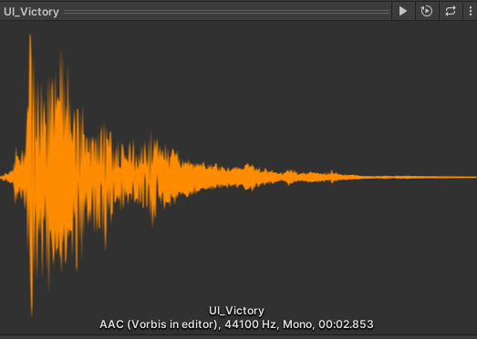
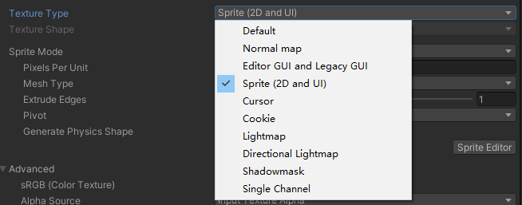
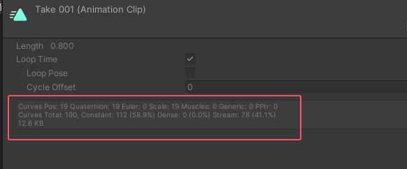

- [快速上手项目的几件事](#快速上手项目的几件事)
- [audio](#audio)
  - [Mono 和 Stereo](#mono-和-stereo)
  - [压缩](#压缩)
  - [采样率](#采样率)
  - [加载方式 Load Type](#加载方式-load-type)
  - [静音做法](#静音做法)
  - [Load In Background / Preload Audio Data](#load-in-background--preload-audio-data)
- [model](#model)
  - [导出设置](#导出设置)
    - [尺寸问题](#尺寸问题)
  - [原始模型对性能的影响点（美术应该注意的制作细节）](#原始模型对性能的影响点美术应该注意的制作细节)
  - [unity 导入设置](#unity-导入设置)
    - [model](#model-1)
    - [rig](#rig)
    - [animation](#animation)
- [纹理](#纹理)
  - [纹理类型](#纹理类型)
  - [纹理大小](#纹理大小)
  - [纹理颜色空间](#纹理颜色空间)
  - [纹理压缩](#纹理压缩)
  - [纹理图集](#纹理图集)
  - [纹理过滤](#纹理过滤)
  - [mip map](#mip-map)
  - [导入设置](#导入设置)
    - [Texture Shape](#texture-shape)
    - [Alpha Source](#alpha-source)
    - [Alpha Is Transparency](#alpha-is-transparency)
    - [Ignore Png Gamma](#ignore-png-gamma)
    - [Read/Write](#readwrite)
    - [Streaming Mipmaps 和 Virtual Texture Only](#streaming-mipmaps-和-virtual-texture-only)
    - [Generate Mip Maps](#generate-mip-maps)
  - [使用心得](#使用心得)
- [动画](#动画)
  - [动画曲线数据信息](#动画曲线数据信息)
  - [动画文件导入设置优化后信息查看原则](#动画文件导入设置优化后信息查看原则)

## 快速上手项目的几件事

1：上手一个项目，首先可以看游戏测试场景（一般会把游戏中用到的资源放到 Objects 场景下，进行测试观察）。

2：可以分类查看资源，看看项目中的资源情况（一般也就是看个多少）。、

3：查看 graphic setting 相关设置。

比如前向渲染还是延迟渲染，垂直同步是否关闭，shader 启用情况等。

4：打包到手机上，连接 profile，查看渲染三角形等 status 信息。

## audio

### Mono 和 Stereo

mono 单声道，stereo 立体声。

在 unity 中两者显示不同：

在左右两个声道音频完全相同的情况下，不如直接开启 force to mono 。

### 压缩

该压缩方式只影响包体大小，与内存无关。

可以看到气泡中的原始大小和导入大小以及压缩比例。

一般极可能使用未压缩的 wav 文件作为源文件。

- PCM（未压缩格式）
    
    特点：无损音质，文件体积大。适合对音质要求极高的场景（如音乐游戏）。

    优点：无需解码，CPU 开销低，音质最佳。

    缺点：文件体积大，不适合存储受限的移动设备。

    适用场景：PC 或主机平台，存储空间和性能不是主要限制时的短音效（如 UI 声音），因为文件小且无需解码。

- ADPCM（有损压缩）

    特点：轻度压缩，音质接近 PCM，但文件大小显著减小（约为 PCM 的 1/4）。解码效率高，适合实时解码。

    优点：音质较好，解码开销低。

    缺点：压缩率不高，文件仍较大。

    适用场景：主机和 PC 平台，尤其是对音质要求较高的场景的中等长度的音效（如环境音、对白）。

- MP3（有损压缩）

    特点：高压缩率，文件体积小。解码效率较低，可能增加 CPU 开销。

    优点：文件小，适合长音频。

    缺点：音质损失明显，解码开销较高。

    适用场景：PC 和主机平台，适合背景音乐或长音频。不推荐用于移动端（解码效率较低）。

- Vorbis（有损压缩）

    特点：开源格式，压缩率高，音质优于 MP3。Unity 中常用的压缩格式，支持多平台。

    优点：音质好，文件小，跨平台支持。

    缺点：解码效率稍低于 ADPCM。

    适用场景：PC、主机和移动端，适合背景音乐或长音频。

- AAC（有损压缩）

    特点：比 MP3 更高效的压缩算法，音质更好，文件更小。广泛支持于移动设备和主机平台。

    优点：音质与文件大小的平衡较好。

    缺点：解码开销较高。

    适用场景：移动端和主机平台，适合背景音乐或长音频。

- Opus（有损压缩）

    特点：新一代音频格式，压缩率高，音质优异。支持动态比特率调整，适合网络传输。

    优点：音质与压缩率的平衡最佳。

    缺点：部分平台支持有限。
    
    适用场景：移动端和网络游戏，适合语音聊天或动态音频。

- HE-AAC（高效 AAC）

    特点：针对低比特率优化，适合流媒体和移动端。

    优点：低比特率下音质较好。

    缺点：解码开销较高。

    适用场景：移动端，适合低带宽环境。

在 Unity 中，可以通过 Audio Import Settings 设置音频的压缩格式和质量：

Load Type：
- Decompress on Load：适合短音效，减少解码开销。
- Compressed in Memory：适合中等长度音频，节省内存。
- Streaming：适合长音频（如背景音乐）。

Compression Format：
- PCM：无损音质，适合短音效。
- Vorbis：适合背景音乐。
- ADPCM：适合中等长度音效。

Quality Slider：设置压缩强度（通常 50%-75% 是较好的平衡点）。

### 采样率

音频采样率指的是每秒钟采样的次数，单位为 Hz（赫兹）。

- 44.1 kHz（44100 Hz）

    特点：CD 级音质，适合大多数音乐和高质量音频。是最常见的采样率，广泛用于音乐和游戏音频。

    优点：音质较高，适合背景音乐和复杂音效。兼容性好，几乎所有设备都支持。

    缺点：文件大小较大，解码开销稍高。

- 48 kHz（48000 Hz）

    特点：广泛用于电影、视频和高质量音频。比 44.1 kHz 略高的采样率，音质差异不明显。

    优点：更适合与视频同步（如游戏中的过场动画）。高端设备支持良好。

    缺点：文件大小和解码开销比 44.1 kHz 略高。

- 22.05 kHz（22050 Hz）

    特点：采样率减半，适合对音质要求不高的场景。文件大小和解码开销显著降低。

    优点：文件小，适合存储空间有限的移动设备。解码效率高，适合短音效或低端设备。

    缺点：音质明显下降，尤其是高频部分。

- 16 kHz（16000 Hz）

    特点：常用于语音音频（如对话、语音聊天）。文件大小和解码开销进一步降低。

    优点：适合语音内容，音质足够清晰。文件小，解码效率高。

    缺点：不适合音乐或复杂音效，音质较差。

- 8 kHz（8000 Hz）

    特点：常用于电话语音或极低音质需求的场景。

    优点：文件极小，解码效率最高。

    缺点：音质非常差，仅适合语音或简单提示音。

一般使用 44.1 kHz，短音效可以采用 22.05 kHz。一般移动平台 22.05 kHz 就够用了。

采样率可以覆写。

### 加载方式 Load Type

- Decompress On Load : 音频文件在加载时会被完全解压缩到内存中。
        
        播放时无需解码，性能开销最低。
        适用于小于 200 kb 的需要频繁播放的简短音效（如 UI 声音、按钮点击、爆炸音效等）。
        如果音效文件较大，可能导致内存占用过高，尤其是在移动设备上。

- Comprssed In Memory : 音频文件以压缩格式存储在内存中，播放时实时解码。

        适合那些需要频繁播放但文件较大的音效。
        超过 5 秒，或者大于 200 kb 的复杂音效（如环境音、对白、较长的音效）。

- Streaming : 音频文件不会完全加载到内存中，而是以流式方式从磁盘或存储中逐步加载。

        播放时边加载边解码。
        较长较大的音乐文件，用流式加载避免载入时卡顿。
        会有额外 CPU 开销，但是值得。

### 静音做法

最好不要只是将音量设置为 0，而是把 audio source 清除。

### Load In Background / Preload Audio Data

LoadInBackground可以理解为异步加载，PreloadAudioData可以理解为预加载。

- 如果未启动任意一个选项，则在场景中使用较大音频时，由于音频加载时间较长，还会在调用音频时因运行过程中主线程暂停从而致严重问题。
- 如果只启动了Load In Background，则音频的加载不会导致主线程的暂停，但由于是现用现加载，所以依然可能会音画不同步。
- 如果只启动了Preload Audio Data，则会在加载场景时进行音频预加载，但较长的音频加载时长会在加载场景时因主线程暂停从增加加载时长。
- 二者均启动时，会在加载场景时进行音频预加载，则需要播放音频时不会产生加载延迟，同时音频预加载也不会导致主线程的暂停。

## model

### 导出设置

- 统一单位：游戏模型的大小规范，不同软件之间的单位可能不相同
- 导出的网格类型：必须是多边形拓扑，不能是贝塞尔曲线、样条曲线、细分曲面等，这些 unity 都不支持。
- 确保所有的 Deformers 都烘焙到网格模型上。（如骨骼的形变已经烘培到蒙皮的权重上等）
- 不建议将模型中使用到的纹理、材质随模型导出，这会降低unity的模型导入效率，同时也让我们的资源目录变得难以管理。
- 如果你需要导入 blend shape normals 时，必须指定光滑组 smooth groups.
- 导出时不要携带如摄像机，灯光材质等场景信息，因为这些与 unity 内部的默认设置都不同，除非你为 DCC 工具做了适配 unity 的自定义导出插件。

#### 尺寸问题

1. 检查下是否存在 Transform 中 Scale 不为 (1,1,1) 的情况。若存在：如果好修改就顺手改掉；不好改则建议让美术同学重新加工下。Transform 中 Scale 为 (1,1,1) 是后续检查流程的前提。
2. 确保 Transform 中 Scale 为 1 时，再次查看模型导入配置中的 ScaleFactor 和 ConvertUnits 的配置分别为 1 和 enable。
3. 若上述均已确认但大小依然不对，则可以认为是【 Unity 对于该模型格式 (Fbx 等) 的尺度预设】与【美术对于该模型格式的默认尺度设置】不一致。
   1. 处理方案一：由美术重新调整模型尺度，即确保导出 fbx 中的单位 1 对应的是厘米。
   2. 处理方案二：调整Unity模型导入配置中的 ScaleFactor。
4. 不管怎么样，都不应该让 Transform 的 Scale 不为 (1,1,1)。

### 原始模型对性能的影响点（美术应该注意的制作细节）

- 最小化模型面数。

        尽量不要靠增加面数来增加细节。
        避免微三角形面（一个三角形只包含个位数个像素）。
        三角面尽量均匀分布。

- 合理化拓扑结构与平滑组：尽量将模型做成闭包，而不是通过没有焊接的面去组合。这可能引起后期 unity 下的烘焙错误，也会产生额外的三角形顶点和边

- 模型下尽量少的使用材质个数：材质数的增多，同样会引起 shader 和贴图的暴涨

- 尽量少的蒙皮网格：且同一个模型下尽量使用相同的蒙皮网格，如果真的有特殊需求除外。

- 尽可能少的使用骨骼数量：过多的骨骼数量后期可能引起蒙皮动画的 cpu 和 gpu 双方的性能瓶颈。

- 原始模型中的 fk 与 ik 骨骼接连尽量分离：由于unity中不支持导入的 ik 骨骼，在 dcc 工具中做好分离，方便导出时删除 ik 骨骼节点。

### unity 导入设置

#### model

- mesh compression

        unity 默认不开启。
        在保证网格准确的情况下，可以采用更加激进的压缩方式，可以使网格占用的磁盘空间更小。
        注意，在运行时的内存不会减少。

- read/write

        启用后，会在内存中额外复制一份此网格。
        一个副本会保存在内存中，另外一个副本会保存在 gpu 显存中。
        只有在运行时需要动态修改网格数据的时候，我们才需要开启此选项。
        skinmesh 一般也需要开启此选项来做动画。
        绝大多数情况下需要保持此选项关闭以节省内存。

- optimize mesh 和 generate colliders：默认就好，除非你要禁止优化，或者需要精确制作网格碰撞。
- Index Format ： 决定了模型的索引缓冲区格式，直接影响模型的顶点数量支持范围和内存占用。

        索引缓冲区：在 3D 渲染中，索引缓冲区用于定义模型的顶点连接方式（即三角形的绘制顺序）。
        16-bit：支持的最大顶点数为 65,536 (2^16)。
        32-bit：支持的最大顶点数为 4,294,967,296 (2^32)。
        如果你确定在移动平台做游戏，可以强制所有都用  16-bit 顺便来检测模型规范。

- 法线：法线是每个顶点的方向向量，用于确定光照计算中表面的朝向。

        - 光照计算：法线是光照计算的基础，用于确定光线与表面的角度。Unity 的所有光照模型（如漫反射、镜面反射）都需要法线来计算光的强度和方向。
        - 实时光照和阴影：如果模型需要参与实时光照（如点光源、聚光灯）或投射阴影，法线是必需的。
        - 法线贴图（Normal Map）：即使使用法线贴图，模型仍然需要基础法线来正确应用法线贴图的细节。
        - 环境光遮蔽（Ambient Occlusion）：法线也用于计算环境光遮蔽效果，增强模型的光影细节。

        法线生成设置：
        - Import（导入）：使用模型文件中自带的法线。适合在 3D 建模软件中已经生成了高质量法线的模型。
        - Calculate（计算）：Unity 根据模型的几何形状重新生成法线。适合简单模型或需要在 Unity 中调整法线平滑度的情况。
        - None（无）：不生成法线，模型将无法正确参与光照计算。适合完全不需要光照的模型（如 UI 元素、简单的装饰物）。

-  切线（Tangents）：切线是与法线和顶点方向相关的向量，用于支持法线贴图（Normal Map）的计算。

         - 法线贴图（Normal Map）：切线是法线贴图工作所必需的。法线贴图用于模拟表面细节（如凹凸感），需要切线来正确计算光照方向。如果材质使用了法线贴图，但模型没有切线，Unity 会报错或显示异常。
         - 高质量材质效果：如果模型使用了复杂的材质（如 PBR 材质），通常需要切线来支持法线贴图和光照计算。
         - 动态光照：切线在动态光照下（如移动的光源）尤为重要，因为它们影响法线贴图的动态更新。

        切线的生成设置：
         - Import（导入）：使用模型文件中自带的切线。适合在 3D 建模软件中已经生成了高质量切线的模型。
         - Calculate（计算）：Unity 根据模型的法线和 UV 坐标重新生成切线。适合需要在 Unity 中调整切线的情况。
         - None（无）：不生成切线。适合不使用法线贴图的模型（如简单的材质或不需要细节的模型）。

- 法线和切线

        法线：几乎所有需要光照的模型都需要法线，用于基础光照计算。
        切线：只有在使用法线贴图时才需要切线，用于支持法线贴图的光照计算。
        设置建议：
        如果模型需要光照但不使用法线贴图：启用法线，禁用切线。
        如果模型使用法线贴图：同时启用法线和切线。
        如果模型不需要光照：禁用法线和切线以优化性能。

-  Swap UVs：用于交换模型的 UV 通道 1 和 UV 通道 2。这个选项主要与光照贴图（Lightmap）和纹理映射相关

        UV 是模型顶点的纹理坐标，用于将 2D 纹理映射到 3D 模型表面。
        一个模型可以有多个 UV 通道（如 UV1、UV2），每个通道可以存储不同的纹理坐标：
        UV 通道 1（UV1）：通常用于主纹理贴图（如颜色贴图、法线贴图等）。
        UV 通道 2（UV2）：通常用于光照贴图（Lightmap）或其他特殊用途。

        Swap UVs 会交换模型的 UV1 和 UV2，即：
        原本存储在 UV1 的纹理坐标会被移动到 UV2。
        原本存储在 UV2 的纹理坐标会被移动到 UV1。

        - 光照贴图（Lightmap）相关
        在 Unity 中，光照贴图通常使用 UV2 通道。
        如果导入的模型中，光照贴图的 UV 坐标错误地存储在 UV1 通道，而主纹理的 UV 坐标存储在 UV2 通道，可以使用 Swap UVs 来修正。

        - 修复 UV 通道错误
        某些 3D 建模软件（如 Blender、Maya）导出的模型可能会将 UV 通道顺序弄反。
        如果发现模型的纹理或光照贴图显示异常，可以尝试启用 Swap UVs。

        - 特殊用途
        如果你需要在 Unity 中手动调整 UV 通道的用途（例如将光照贴图的 UV 用作主纹理 UV），可以使用 Swap UVs。

vertex compression 选项是设置每个通道的顶点压缩。可为模型除位置、光照贴图uv之外的所有内容启动压缩。

optimize mesh data 可根据网格使用的材质删除不需要的数据，如材质中没有使用到的切线、法线、颜色以及 uv 等。

#### rig

- Animation Type 选择依据
    - 无动画选择 None；
	- 非人形动画选择 Generic；
	- 人形动画需要 Kinematices 或 Animation Retargeting 功能，或者没有有自定义骨骼对象时选择 Humanoid Rig。其他都选择Generic Rig，骨骼数一致情况下，Generic Rig会比Humanoid Rig省30%以上的CPU开销。
- Skin Weights : 蒙皮最多受到影响的骨骼数量。默认配置 4 根骨骼，但对于一些不重要的动画对象可以减少到 1 根，节省计算量。
- Optimize Bones：建议开启，默认开启，在导入时自动剔除没有影响蒙皮顶点的骨骼。
- Optimize Game Objects：在Avatar和Animatior组件中删除导入游戏角色对象的变换层级结构，而使用Unity动画内部结构骨骼，消减骨骼transform带来的性能开销。
	- 可以提高角色动画性能，但有些情况下会造成角色动画错误，这个选项可以尝试开启但要看表现效果而定。
	- 除了在ImportSetting中进行配置，在运行时通过代码调用AnimatorUtility.OptimizeTransformHierarchy接口仍然可以达到此选项效果。
    - 如果你的角色可以换装，在导入时不要开启此选项，但是在换装后可以通过代码调用，到达开启此选项的效果。

#### animation

- Bake Animations： 仅对 DCC 工具原始文件格式，且使用了布料流体等烘培动画时才有用，fbx 文件，该选项禁用。
- Resample Curves ： 将动画曲线重新采样为四元数值，并为动画每帧生成一个新的四元数关键帧，仅当导入动画文件包含欧拉曲线时才会显示此选项。
- Anim.Compression ： 开启了压缩后，会出现 3 个 Error 范围，默认值 0.5。意味着千分之 5 范围内数据变换认为没有区别。这里需要注意，如果你的动画总共的活动范围在 1 m 那么误差就是 5 mm，而如果是 1000 m，则误差就是 5 m。
  - off ： 不压缩，质量最高，内存消耗最大。值得一提的是，即使不压缩，导入到 unity 的动画也不能保证和 dcc 工具表现一致。
  - Keyframe Reduction：减少冗余关键帧，减小动画文件大小和内存大小；
  - Keyframe Reduction and Compression：减小冗余关键帧的同时，对关键帧存储数据进行压缩，动画文件更小，占用内存 Keyframe Reduction 一致，且CPU开销相对仅减少冗余关键帧变大；
  - Optimal：仅适用于 Generic 与 Humanoide 动画类型，在 Keyframe Reduction 基础上 由 Unity 决定如何进行压缩 (紧缩式数据压缩 / 流式数据压缩)。
- Animated Custom Properties：对应 dcc 的自定义动画属性。
  
## 纹理

### 纹理类型

unity下有默认八种纹理类型  

- default：绝大多数的纹理资源都会采用此类型模式
- normal map：法线贴图。它可将颜色通道转换为适合实时法线贴图的格式
- 在编辑器 GUI 控件上使用的纹理类型
- sprite：一般用在 2D 游戏中或 UGUI 上使用的纹理
- Cursor：鼠标光标自定义纹理类型
- cookie：光照 cookie 剪影类型的纹理
- light map：光照贴图类型纹理。它的编码格式会取决于不同的平台而不同，如果编码格式选择不对，或该平台不支持此类型编码，生成的光照贴图可能造成精度丢失
- single channel：如果你的原始文件中只有一个颜色通道，那请选择此类型，它可以节省纹理的内存开销

### 纹理大小

一般现代显卡上对纹理的大小支持都采用二的幂次方。

比如说 1024 × 1024  512 x 256 。并不全要求长宽相等，只要长宽的大小是二的幂次即可。不符合此比例的纹理 unity 在导入时会强行设置成最小符合二的幂次方的纹理大小，但这样的设置结果一定会造成纹理的浪费，纹理的大小直接影响内存与显存占用的大小，同时也会对GPU纹理采样、CPU加载和带宽造成影响。

合适的纹理大小：
- 不同的平台、不同的硬件配置、选择不同的纹理大小：在 unity 下可以采用 bundle 变体设置多套资源，或者通过 mip map 限制不同平台，加载不同 level 层级的贴图。
- 根据纹理用途的不同，选择不同的纹理加载方式：比如流式纹理加载 Texture Streaming 或者稀疏纹理 Sparse Texture 虚拟纹理 Virtual Texture 等方式。
- 不能让美术人员通过增加纹理大小的方式来去增加细节：这样会造成纹理使用上的内存爆炸。可以选择细节贴图 DetailMap、或者增加高反差保留等方式。
- 是在不降低视觉效果的情况下，尽量减少贴图大小：最好的方式是纹理映射的每一个纹素大小正好符合屏幕上显示的像素大小。如果纹素小了，会造成欠采样，纹理会显得模糊；如果纹理大了，会造成过采样，纹理可能就会产生噪点。过采样和欠采样都不是我们希望的，但这一点做到完美平衡很难保障。可以充分利用 unity 编辑器下 sense view，Miscellaneous 模式下的 mipmap 查看，红色的部分代表物体的贴图已经过采样，而蓝色的部分代表物体的贴图欠采样，远处物体可以欠采样，因为有后处理和雾效做补充。须知 urp 将这部分功能移动到了 rendering debugger 中。

### 纹理颜色空间

默认情况下，大多数图形处理工具都会使用 sRGB 颜色空间处理和导出纹理。但如果你的纹理不是作为颜色信息使用的话，那么就不需要使用 sRGB 空间。如金属度贴图、粗糙度贴图、高度图、法线贴图等。一旦这些纹理使用了 sRGB 空间，在一些特殊的情况下会造成视觉表现的错误。

### 纹理压缩

纹理压缩是指图像的压缩算法，保持贴图的视觉质量的同时尽量减少纹理数据的大小。默认情况下，我们的纹理原始文件格式一般采用 png 或 tga 这类的通用文件格式，但与专业图像格式相比，他们访问和采用速度都比较慢，无法通过GPU硬件加速，同时纹理数据量大，占用内存较高，所以在渲染中我们通常会采用一些硬件支持的纹理压缩格式。如 ASTC ETC ETC2 DXT 等。

### 纹理图集

纹理图集是一系列小纹理的图像集合，unity 下可以使多个网格对象对应一张纹理贴图，unity 默认支持 sprite atlas 纹理图集。但针对于一些复杂的网格类型，需要美术人员在 DCC 工具中将模型进行 UV 展开，然后进行模型 UV 映射，这些在创建纹理初期就要提前做好规划。

优点：
- 采用共同纹理图集的多个静态网格资源可以进行静态合批处理，以减少 draw call 调用次数，可以极大提高引擎渲染效率。
- 纹理图集可以减少过多碎纹理，因为它们打包在一个图集中，可以更有效地利用压缩降低纹理内存成本和冗余数据。

缺点：美术需要合理的规划模型，并要求模型具有相同的材质着色器，或者需要制作通道图去区分不同的材质，制作和修改成本都比较高。

使用心得：
- 选择合理的图集大小，防止纹理图及利用率偏低，浪费内存
- 尽可能将同一生命周期的纹理放在一起，防止长时间因某一纹理占用引起的整个图集占用

### 纹理过滤

unity下纹理过滤选项有四种

- 临近点采样过滤 Nearest Point Filtering ：最简单，计算量最小，但近距离观察时纹理会呈现块状
- 双线性过滤 Bilinear Filtering ：对临近纹素采样并进行插值化处理，双线性过滤会让像素看上去平滑渐变，但近距离观察时纹理会变得模糊。
- 三线性过滤 Trilinear Filtering ：在双线性过滤的基础上，增加了对 mip map 等级之间的采用差值混合，用来平滑过度，消除 mip map 之间的明显变化。
- 各项异性过滤 Anisotropic Filtering ：改善纹理在倾斜角度下的视觉效果，更适合用于地表纹理。

选择合适纹理过滤的最佳经验：
- 使用双线性过滤平衡性能和视觉质量。
- 有选择地使用三线性过滤，因为与双线性过滤相比，它需要更多的内存带宽。
- 使用双线性和 2x 各向异性过滤，而不是三线性和 1x 各向异性过滤，因为这样做不仅视觉效果更好，而且性能也更高。
- 保持较低的各向异性级别。仅对关键游戏资源使用高于 2 的级别。

### mip map

mip map 纹理是逐级减少分辨率来保存纹理副本，可以把它理解为纹理的LOD层级。

当纹理渲染时，会根据像素在屏幕中占据的纹理空间大小选择合适的 mip map 的级别来进行采样，渲染具有 map map 纹理对象时，当摄像机离对象较远时，将采用较低分辨率的纹理；当对象距离摄像机较近时，将采用较高的分辨率纹理。这样做的好处是，GPU不需要在远距离对对象进行全分辨率纹理采样，可以提高纹理采样性能，同时也解决了远距离情况下，纹理过采样造成的噪点问题，提高了纹理渲染质量。

但由于mip map纹理要生成低分辨率的纹理副本，会造成额外的内存开销，不过这点可以通过 unity 提供的 mip map streaming 功能，在运行时限制只采样某个级别以下的纹理进行不同设备上的不同适配。

另外 mip map 也是做 Hierarchical Z-Culling（Hi-Z Culling）的前提条件，它是目前比较流行的一种剔除方案。

### 导入设置

#### Texture Shape

- Cube：用于天空盒和反射探针。默认支持 Default、Normal、Single Channel 几种类型纹理，可以通过 Assets > Create > Legacy > Cubemap 生成，也可以通过 C# 代码 Camera.RenderToCubemap 在脚本中生成。
- 2D Array : 2D 纹理数组，极大地提高大量相同大小和格式的纹理访问效率，但需要特定平台或特定的图形 API 支持。可以通过引擎 SystemInfo.supports2DArrayTextures 接口来运行时查看该平台是否支持。
- 3D：通过纹理位图方式存储或传递一些 3D 结构化数组。一般用于体积仿真等方向，如雾效、噪声、体积数据、距离场、动画数据等信息，可以外部导入，也可以运行时程序化创建。

#### Alpha Source

是否使用原图的 Alpha。From Gray Scale 我们一般不会选用。

#### Alpha Is Transparency

指定 Alpha 通道是否开启半透明，如果位图像素不关心是否开启半透明就可以不开启此选项。这样 Alpha 信息只需要占 1 bit，节省内存。

#### Ignore Png Gamma 

是否忽略 png 文件中的 gamma 属性。一般默认，除非美术在导出 png 时设置了不同的 gamma 值，导致在 unity 内显示有差异。

#### Read/Write

开启之后，内存占用多一倍。一般不开启，除非你需要动态修改该纹理。

#### Streaming Mipmaps 和 Virtual Texture Only

#### Generate Mip Maps

是否生成 MipMaps。

何时不需要：
- 2D 场景
- 固定视角，摄像机无法缩放远近。

##### Border Mip Maps

默认不开启，只有当纹理时 Light Cookies 类型时，需要开启此选项，避免 colors bleeding 现象导致颜色渗透到较低级别的 Mip Level 纹理边缘上。

##### Mip Map Filtering

过滤算法
- Box ：最简单，随尺寸减小，Mipmap 纹理变得平滑模糊。
- Kaiser ：避免平滑模糊的锐化过滤算法。

##### Mip Maps Preserve Coverage

只有需要纹理在开启 mipmap 后，也需要做 Alpha Coverage 时开启，默认不开启。

##### Fadeout Mip Maps

作用是 mipmap 随 mip 层级淡化为 灰色，一般不开启，只有在雾效较大时开启，不影响视觉效果。

### 使用心得

- 不合理的半透明纹理，造成 OverDraw 和 内存开销。
- 过多不打图集的序列帧
- 大量重复纹理与不合理的通道图
- 只有颜色差异的贴图，可以采用分离变化区域贴图
- 九宫格
- 颜色渐变贴图，既不采用单通道，也不采用单像素宽度。这种可以使用曲线过度，或者使用单像素梯度纹理。

## 动画

### 动画曲线数据信息

- Curves Pos : 位置曲线
- Quaternion : 四元数曲线。Resample Curves开启会有，否则显示在 Euler 中。
- Euler : 欧拉曲线
- Scale : 缩放曲线
- Muscles : 肌肉曲线，Humanoid类型下会有
- Generic : 一般属性动画曲线，如颜色，材质等
- PPtr : 精灵动画曲线，一般2D系统下会有
- Curves Total : 曲线总数
- Constant : 优化为常数的曲线（动画压缩成果）
- Dense : 使用了密集数据 (线性插值后的离散值) 存储
- Stream : 使用了流式数据 (插值的时间和切线数据) 存储

### 动画文件导入设置优化后信息查看原则
- 一看效果差异（与原始制作动画差异是否明显）；
- 二看曲线数量（总曲线数量与各种曲线数显，常量曲线比重大更好）；
- 三看动画文件大小（以移动平台为例，动画文件在小几百k或更少为合理，查过1M以上的动画文件考虑是否进行了合理优化）