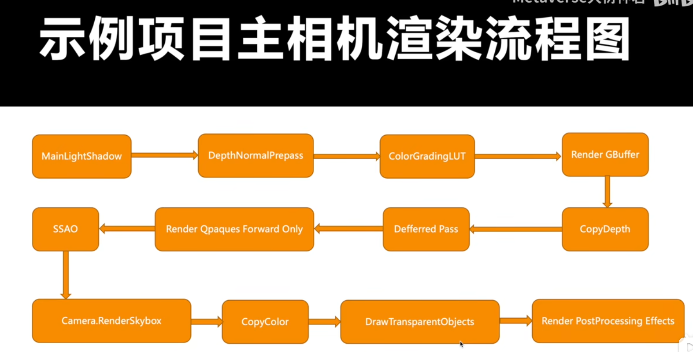
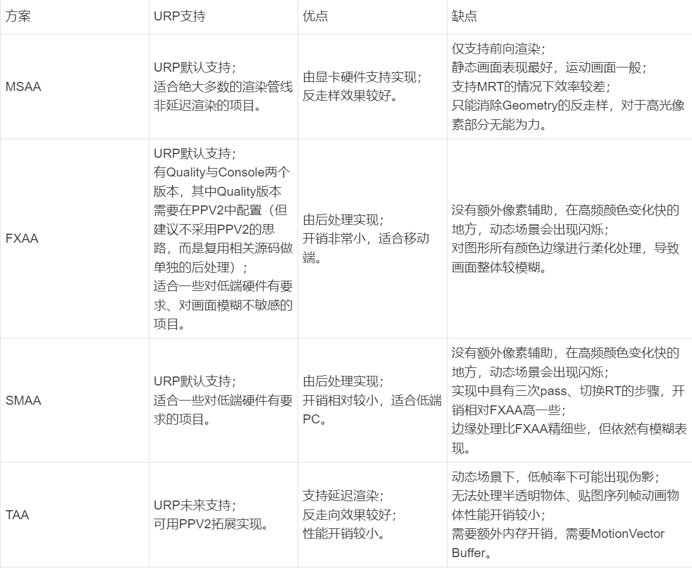
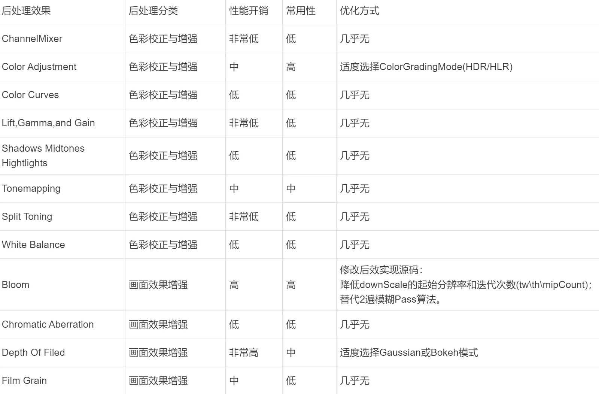
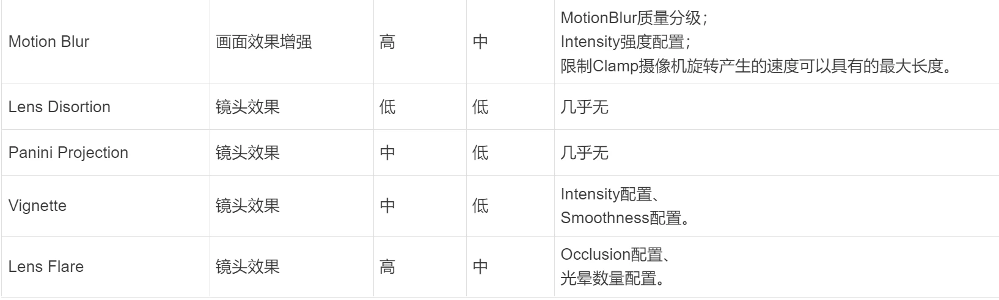

- [性能优化的流程](#性能优化的流程)
- [性能问题](#性能问题)
  - [影响性能的四大类问题](#影响性能的四大类问题)
  - [隐藏的几类小问题](#隐藏的几类小问题)
  - [可能的情况（由高到低）](#可能的情况由高到低)
- [优化思路](#优化思路)
- [优化顺序](#优化顺序)
- [线程时序](#线程时序)
- [示例瓶颈](#示例瓶颈)
- [渲染流程分析](#渲染流程分析)
  - [FrameDebugger 抓帧](#framedebugger-抓帧)
  - [示例相机渲染](#示例相机渲染)
  - [逐帧绘制步骤分析工具](#逐帧绘制步骤分析工具)
- [示例问题](#示例问题)
  - [SSAO 问题 （占了 20 多 ms!）](#ssao-问题-占了-20-多-ms)
    - [SSAO 可配置参数](#ssao-可配置参数)
    - [SSAO 移动端推荐配置](#ssao-移动端推荐配置)
    - [AO 优化](#ao-优化)
  - [反走样问题](#反走样问题)
    - [反走样发展历程](#反走样发展历程)
    - [SMAA 进一步优化](#smaa-进一步优化)
    - [Unity 中 AA 方案优化总结](#unity-中-aa-方案优化总结)
- [后处理问题](#后处理问题)
  - [后处理效果分类](#后处理效果分类)
    - [色彩校正与增强](#色彩校正与增强)
    - [画面效果增强](#画面效果增强)
    - [镜头效果](#镜头效果)
  - [URP 下所有后处理性能分析和优化](#urp-下所有后处理性能分析和优化)
  - [后处理使用细则](#后处理使用细则)

# 性能优化的流程

- 发现问题（什么平台、什么操作系统、什么情况下出现问题，一般问题还是特例问题等）；
- 定位问题（什么地方造成的性能问题，我们要用什么工具、什么方法确定瓶颈）；
- 研究问题（确定用什么方案处理这个问题，要考虑性能优化的前提）；
- 解决问题（按问题研究的结论去实际处理，并验证处理结果与预期的一致性）。

# 性能问题

## 影响性能的四大类问题

CPU、GPU、带宽、内存。

## 隐藏的几类小问题

功耗比、填充率、发热量。

## 可能的情况（由高到低）

- CPU 利用率
- 带宽利用率、CPU/GPU 强制同步
- 片元着色器指令：通过改变分辨率可以快速确认是不是由于片元着色器造成的性能下降
- 几何图形到 CPU 到 GPU 的传输、纹理 CPU 到 GPU 的传输
- 顶点着色器指令
- 几何图形复杂性

# 优化思路

升维与降维，维度转换：如空间与时间，量纲转换。

# 优化顺序

- 设备方面先排查 iOS 后排查 Android；其原因主要是苹果提供了强大的性能分析工具，且 IOS 设备种类较少，便于统一优化。完成 IOS 优化后，安卓平台也差不多优化地七七八八了，方便再对安卓平台进行调整。
- 使用 Profiler、Frame Debugger、Memory Profiler、Profile Analyzer，根据总体性能情况明确所出现的性能阻塞现象；
- 使用 UPR 工具的真机联机、云真机等功能，判断 Runtime 参数是否存在超出默认标准或所设定标准的地方；
- 根据上述性能阻塞现象和 Runtime 参数，分析导致异常的源头，并优化。

# 线程时序

- 在 Profiler 或 UPR 报告中获得 Runtime 线程时序；
- 观察单帧消耗总时长、各线程及其模块的消耗时长；
- 观察主线程性能分析标记占比，常见标记如下：
    - WaitForTagetFps 等待达到目标帧率，此时 CPU 与 GPU 负载良好，无异常瓶颈；
	- Gfx.WaitForCommands/Gfx.WaitForGfxCommandsFromMainThread 渲染线程已经准备接受新的渲染命令，此时瓶颈在 CPU；
	- Gfx.WaitForPresent/Gfx.WaitForPresentOnGfxThread 主线程等待渲染流程绘制完毕，此时瓶颈在 GPU；
	- WaitForJobGroupID 等待工作线程完成，此时瓶颈在 CPU。

# 示例瓶颈

从线程时序中分析，GPU 与带宽可能是主要瓶颈。
导致瓶颈的源头以及后续验证方向如下：
- 渲染流程与效果（是否存在冗余与不合理项）；
- 渲染中生成资源（是否存在冗余与不合理项）；
- DrawCall 与 SetPassCall（判断数量过高的原因）；
- 片元着色器（判断是否存在效率问题）；
- 渲染三角形（判断三角形数目是否过高）。

# 渲染流程分析

## FrameDebugger 抓帧

UniversalRenderPipeline.RenderSingleCameraInternal:SceneTravelCamera 场景相机的绘制步骤；

UGUI.Rendering.RenderOverlays UGUI 部分绘制步骤；

GUITexture.Draw 是 IMGUI 部分绘制步骤；

渲染步骤后面的数字为调用 GFX(Graphics Command Buffers) 指令的次数，调用 GFX 次数与渲染性能开销正相关。

## 示例相机渲染

示例工程中 FrameDebugger 的绘制步骤序列：
- MainLightShadow 主光源阴影；
- DepthNormalPrepass 深度与法线信息预渲染通道；
- ColorGradingLUT 颜色分级查找表；
- RenderGBuffer 几何、材质缓冲区；
- CopyDepth 拷贝场景深度；
- DefferedPass 延迟渲染光照与着色通道；
- RenderQpaquesForwardOnly 不透明物品前向渲染；
- SSAO 场景环境遮蔽效果渲染；
- Camera.RenderSkybox 天空盒渲染；
- CopyColor 拷贝场景颜色；
- DrawTransparentObjects 透明、半透明物品渲染；
- RenderPostProcessingEffects 后处理效果渲染。

可惜使用 FrameDebugger 无法看到耗时，所以需要借助工具。

## 逐帧绘制步骤分析工具

Mac : Xcode ； 有耗时，并且有叹号提示哪里可能有问题。
Windows : UPR。

任何超过 1ms 的 渲染子耗时都不合理，尽量将渲染控制在 10ms 之内！

# 示例问题

## SSAO 问题 （占了 20 多 ms!）

Unity 内置 SSAO 处理的五步 RenderPass：
- 深度贴图与法线贴图采样与相关计算；
- 水平方向上进行模糊处理；
- 垂直方向上进行模糊处理；
- 生成最终模糊 AO 图；
- 混合不透明物体。

SSAO 五个 Pass 中，“深度贴图与法线贴图采样与计算”的时长开销最大。
- 在该 Pass 的 BoundResources 中发现，有大量尺寸过大（屏幕全分辨率大小）的中间纹理。
- 在该 Pass 的 PipelineStatistics 中发现，ALU 模块时长开销以及 WaitTime 时长开销较大。
    - 当 ALU 模块时长开销较大时，可能的原因包括：
        - 复杂的着色器：着色器中包含大量的数学计算和逻辑运算，导致 ALU 的负载增加。
        - 高分辨率或高多边形数量：渲染大量的顶点和像素需要更多的 ALU 资源。
        - 不必要的计算：可能存在着不必要的计算或冗余计算，增加了 ALU 的负载。
        - 并行性限制：某些硬件限制了 ALU 的并行执行能力，导致渲染流程中的 ALU 时长增加。
	- 当 WaitTime 时长开销较大，可能的原因包括：
		- GPU 资源瓶颈：GPU 资源（如纹理、缓冲区等）的竞争或不足可能导致等待时间增加。
		- 内存带宽限制：内存传输速度不足，导致 GPU 等待数据加载或传输。
		- 线程调度问题：可能存在线程调度问题，导致 GPU 等待某些任务完成。
		- 同步问题：可能存在需要等待其他任务完成后才能进行的同步操作，导致等待时间增加。
- 在该 Pass 的 Preference 中发现，性能开销较大的主要是是在 Fragment 相关指令。

综上判断，在 Unity 的内置 SSAO 处理中，存在片元像素过大、带宽性能瓶颈的问题。

### SSAO 可配置参数

- DownSample：当开启该选项后，在处理过程中会降低中间纹理的大小。将较大程度的优化性能开销。
    - SSAO 处理的默认实现中，当开启 DownSample 时，只对第一个 Pass 的中间纹理进行压缩与缓冲，且缩放至屏幕尺寸的 1/4。可以通过编辑相关源码，对更多 Pass 以更大的程度进行中间纹理的压缩。（比如对第二张，第三张中间纹理进行降采样，这样会影响效果，不过可以通过参数暴露到编辑器上，实时查看效果）（注意：一般任何优化都不要降 depth 纹理采样，会出错误）
- AfterOpaque：当开启该选项后，将渲染流程中 SSAO 的处理后置到不透明物品的绘制之后。在移动平台上有更好的性能表现，但在物体真实感方面可能有所下降。
- Source、NormalQuality：若渲染管线选择前向渲染，则可以通过该项调整该处理中生成法线的精度值。若渲染管线为延迟渲染，则默认已计算获取法线信息，故该选项无法配置。
- Intensity：该选项为 AO 强度设置。该项只影响混合系数即处理效果，该项本身不会有性能方面的影响。
- Radius：该选项为 AO 采样半径，该值越大，GPU 开销越大。一般情况下，在视觉效果可以接受的情况下，应尽量减小 Radius 并适当调大 Intensity，从而实现性能与效果的平衡。
- DirectLightingStrength：该选项为直接光对 AO 影响的强度。该项只影响处理效果，该项本身不会有性能方面的影响，一般保持默认值即可。
- SampleCount：该选项为采样循环次数。次数越高、性能开销越大、同时效果越好。

### SSAO 移动端推荐配置

对于移动端，推荐值配置为：开启 DownSample，开启 AfterOpaque，Intensity 数值为 2，Radius 数值为 0.02，DirectLightingStrength 数值为 0.25，SampleCount 数值为 4。同时修改源码，对各个 Pass 的中间纹理压缩至原先的 1/16。

### AO 优化

AO 方案进一步优化： 
- 使用 HBAO 或 GTAO 方案替代 SSAO； 
- 针对 SSAO 的 Shader 指令做进一步优化； 
- 采用烘焙 AO 到静态光照贴图方案替代 SSAO Render Pass 处理。

## 反走样问题

### 反走样发展历程

- 第一代：SSMA（超级采样抗锯齿 Super-Samling Anti-Aliasing)；
- 第二代：MSAA（多重采样抗锯齿 Multi Sampling Anti-Aliasing)、FXAA（快速近似抗锯齿 Fast Approximate Anti-Aliasing)、SMAA（增强子像素形变抗锯齿 Enhanced Subpixel Morphological Anti-Aliasing)；
- 第三代：TAA（时间序列抗锯齿 Temporal Anti-Aliasing)；
- 第四代：DLSS（基于深度学习的超级采样 Deep Learning Super Sampling)。

效率：FXAA > SMAA > TAA > MSAA
质量：MSAA > SMAA > TAA > FXAA

### SMAA 进一步优化

- 通过配置 SMAA 的配置参数 Quality，从而调整 SMAA 阈值与计算权重步长。
  - 修改 SMAA 的 Shader 源码，通过调高 SMAA 预置和调低计算权重步长，可以进一步优化性能，但可能会带来视觉效果的损失。

### Unity 中 AA 方案优化总结

当项目渲染管线为前向渲染时，先使用 MSAA，视负担情况酌情选择如下优化方案：
- 高端移动设备上采用优化后的 SMAA 或 FXAA，Unity 默认 URP 下的 TAA 成熟后，根据性能与表现均衡选择采用；
- 中端移动设备上，采用 FXAA 方式或关闭 AA 渲染；
- 低端移动设备上关闭 AA 渲染。

# 后处理问题

## 后处理效果分类

### 色彩校正与增强

- Channel Mixer：通道混合器可以修改每个输入颜色通道对输出通道整体混合的影响。例如，如果增加绿色通道对红色通道整体混合的影响，则最终图像中所有绿色（包括中性/单色）的区域都将偏红色。
- Color Adjustment：颜色调整可以调整最终渲染的图像的整体色调、亮度和对比度。
- Color Curves：颜色分级曲线是一种在特定范围调整色调、饱和度或亮度的高级方法。通过调整八个可用图形中的曲线，即可实现特定色调替换或使某些亮度降低之类的效果。
- Lift, Gamma, and Gain：提升、伽马、增益轨迹球效果可用于执行三向颜色分级。使用 Lift 项、Gamma 项和 Gain 项分别控制阴影、中间调、高光的颜色与亮度。
- Shadows Midtones Hightlights：阴影、中间调、高光轨迹效果可用于执行三向颜色分级。该效果与 Lift, Gamma, and Gain 表现几乎一致，但该效果额外提供参数配置，使得用户能够指定阴影、高光的范围定义。
- Tonemapping：色调映射是将图像的 HDR 值重新映射到新的值范围的过程。其最常见的用途是使动态范围较低的图像看起来具有较高的范围，亦或是是将高动态范围图像的动态范围压缩到普通显示设备可以显示的范围之内。在 HDR 值映射的过程中最大程度得保留原始图像的颜色、亮度、对比度等细节信息，并且不产生其他伪像，如光晕、梯度翻转、颜色失真、边缘模糊等。
- White Balance：白平衡效果可以用来消除不真实的偏色，通过调整色温与色彩补偿。其使场景对象在最终图像中尽量渲染为真实世界中的颜色（往往以白色作为标准），还可以使用该功能在最终渲染中呈现更冷淡或更温暖的效果。
- Split Toning：拆分着色效果可以根据亮度值对图像的不同区域进行着色。可以使用此效果为场景中的阴影和高光添加不同的色调，同时可以通过平衡度设置控制阴影和高光的对比度。

### 画面效果增强

- Bloom：泛光效果会产生从图像明亮区域边界向外延伸的光线条纹。这种效果给人的感觉是极其明亮的光线压制住了摄像机。泛光效果还具有镜头脏污 (Lens Dirt) 功能，该功能可用于应用全屏污迹或灰尘层来衍射泛光效果。
  - Unreal Mobile Bloom 优化：https://cdn2.unrealengine.com/Resources/files/GDC2014_Next_Generation_Mobile_Rendering-2033767592.pdf
- Chraomatic Aberration：色差效果沿着图像明暗分隔边界出现颜色条纹。它可以模仿真实摄像机在镜头无法将所有颜色融合到同一点时产生的颜色失真。
- Depth Of Filed：景深效果可模拟摄像机镜头的焦点属性。在现实生活中，摄像机只能在特定距离的对象上清晰聚焦。距离摄像机更近或更远的对象会失焦。失焦效果提供了两种实现模式，一种是“高斯”，一种是“散景”。前者实现简易、性能开销小、效果粗暴；后者模拟真实相机在失焦时的视觉瑕疵表现、性能开销大。
- Film Grain：胶片颗粒效果模拟的是摄影胶片的随机光学纹理，这通常是由物理薄膜上存在的小颗粒引起的。
- Motion Blur：运动模糊效果可模拟现实世界摄像机在拍摄运动速度比摄像机曝光时间更快的对象时出现在图像中的模糊情况。这种情况通常是由快速移动对象或长曝光时间引起的。

不要全局开启，要根据特定情况开启，比如景深只在过场动画开启。local value 或者 逻辑开启。

### 镜头效果

- Lens Disortion：镜头失真效果通过扭曲最终渲染的图片来模拟真实摄像机镜头的形状，即例如鱼眼效果等镜头畸变。
- Panini Projection：Panini 投影用于修正高 Fov 相机画面中的边缘拉伸畸变效果，从而使得画面透视效果更正确。
- Vignette：渐晕效果呈现出，相对于中心，图像边缘变得更暗或去饱和。
- Lens Flare：Lens Flare 组件可控制镜头光晕的位置、衰减以及镜头光晕是否考虑遮挡等属性。

## URP 下所有后处理性能分析和优化

## 后处理使用细则

在 Universal Render Pipeline Asset 中，存在后处理相关配置项以供调整。
- Grading Mode 色彩分级模式可以根据性能与效果可以设置为 HDR(High Dynamic Range) 或 LDR(Low Dynamic Range)。
	- LUT size 色彩查找表缓冲区大小与 GradingMode 对应，若 HDR 则设置 32，若 LDR 则设置 16。
	- Fast sRGB/Linear conversions 在低端设备上，在 sRGB 和线性颜色空间的转换中，可以考虑选用更快速但质量略低的近似处理。
	- 如果平台设备支持“浮点精度纹理”，则 Grading Mode 可以直接选用 HDR，效率更高，详见 Unity 的 SystemInfo.SupportsTextureFormat。
- 所有美术效果的实现还应尽量依靠原始美术素材，后处理效果仅做不得已的调整或不可替代的实现。
- 对于效果不明显的高开销后处理，进行移除，或者使用低开销后处理进行近似替代。
- 对于暂时不需要的后处理效果，应从场景中 Remove 而不是 Disable。
