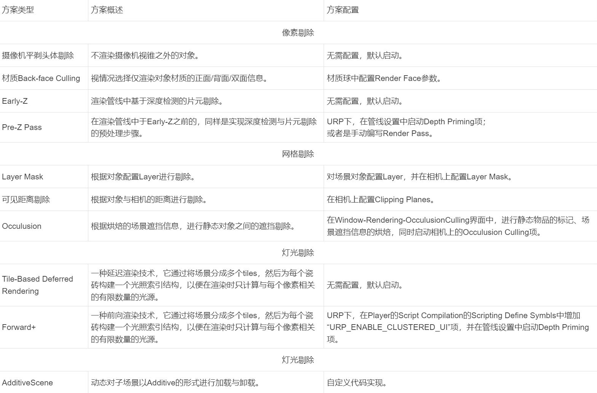
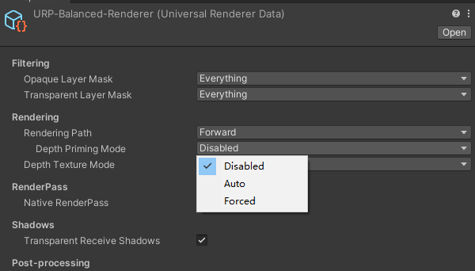
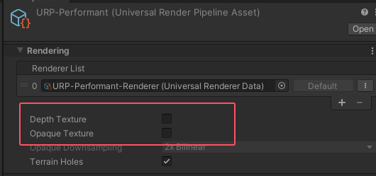

- [理论知识](#理论知识)
  - [Culling](#culling)
    - [渲染剔除](#渲染剔除)
      - [Pre-Z Pass](#pre-z-pass)
    - [可自行拓展的高级剔除方案](#可自行拓展的高级剔除方案)
  - [Simplization](#simplization)
    - [哪些内容需要简化](#哪些内容需要简化)
    - [Unity 工程中的简化方案](#unity-工程中的简化方案)
    - [可自行拓展的高级简化方案](#可自行拓展的高级简化方案)
  - [Batching](#batching)
    - [哪些内容需要 Batching](#哪些内容需要-batching)
    - [资源 Batching](#资源-batching)
      - [Mesh](#mesh)
      - [Texture](#texture)
      - [Shader 与材质](#shader-与材质)
    - [Draw Call Batching](#draw-call-batching)
      - [Static Batching](#static-batching)
      - [Dynamic Batching](#dynamic-batching)
      - [GPU Instancing](#gpu-instancing)
      - [Set Pass Call Batching](#set-pass-call-batching)
    - [Batching 失败信息与原因汇总](#batching-失败信息与原因汇总)
- [实战部分](#实战部分)
  - [场景总览](#场景总览)
  - [远景简化](#远景简化)
  - [远景、中景、近景定义](#远景中景近景定义)
  - [LOD 策略](#lod-策略)
    - [模型简化插件](#模型简化插件)
  - [遮挡剔除](#遮挡剔除)
  - [光影剔除优化](#光影剔除优化)
  - [渲染流程的精简与优化](#渲染流程的精简与优化)
    - [Naitive Render Pass](#naitive-render-pass)
    - [URP 设置](#urp-设置)
    - [管线冗余](#管线冗余)
  - [地形优化](#地形优化)
    - [Terrin To Mesh](#terrin-to-mesh)
  - [主光源阴影 LOD](#主光源阴影-lod)

# 理论知识

Culling Simplization Batching

Culling 先剔除

Simplization 再分类简化

Batching 最后合批运载

Culling 剔除、Simplization 简化、Batching 合批，三者的最终目的均为优化渲染提前期，使得渲染下游能够持续得获取数据并处理。

细分起来，Culling 为去除不需要渲染的信息，Simplization 为对待渲染的内容根据类型分类，Batching 为对数据路径类似的信息进行打包转发。

这些都发生在生产之前，例如进入 GPU 管线之前。一般这些工作由 CPU 负责。也有将 CPU 端工作放到 gpu 流水线上运行的。

## Culling

剔除包括狭义的渲染剔除、广义的资源剔除和代码剔除。

### 渲染剔除

#### Pre-Z Pass

利用第一遍 pass，以当前画面最小深度绘制一张深度图并把它写入到 zBuffer 中，同时关闭颜色输出，然后在第二遍 pass 真正绘制场景像素时，只绘制深度值与 zBuffer 中对应像素值深度值相等的像素。相当于按场景最小深度值绘制了一遍场景外壳。这样可以减少像素着色器执行次数，减轻 GPU 片源着色器的负担，以提高渲染效率

现代 GPU 设计都会尽量在光栅化后，进入片元着色器前进行深度测试，并删除看不见的像素，这个技术在大部分 GPU 上都可以从硬件上支持了，也就是我们常说的 early-z 技术。那么 unity 为什么还需要通过 depth priming 或者 pre-z pass 来手动实现像素深度剔除呢？

这是由于以下几种情况会造成硬件支持的 early-z 功能失效
1. 开启了 alpha 测试
2. 手动调用了 clip 或 DIA 指令丢弃片源
3. 关闭了深度测试或者手动修改 GPU 差值得到的深度

简单来说就是 GPU early-z 已经做好了深度剔除测试但你后面又修改了深度或者直接将片源给 clip 或 Discard 掉了，这当然会造成 early-z 的失效，这种情况只能依靠我们手动保障如何按深度剔除看不见的像素以阻止他们进入片源着色器了。

如何使用：  

自动开启选项，它是在你的渲染对象做 depth only pass 时自动开启 depth priming 功能，不管你的 depth only pass 是不是为了做深度剔除检测。

在不开启 depth priming 功能时，我们用 frame debugger 抓一针，默认渲染对象的 zTest 选项是 lessEqual 的比较方法。  
在开启 depth priming 功能时，会多一个 depth prepass 的流程，这个流程下面的渲染对象的 zWrite 选项是开启的同时 ColorMask 是零。说明这个 pass 只做深度缓冲的写入而不做颜色的输出。而在真正渲染对象的 pass 中，之前渲染对象的 zTest 选项已经变成 Equal 的方法，这就是只有深度相等的像素才会进入到片源着色器中。

使用限制：
1. 它只能在 forward 的前向渲染路径中使用，如果使用了自定义 SHADER，还需要手动在 SHADER 代码中添加 depth only pass.
2. 当你的游戏场景不复杂，overdraw 不是造成 GPU 效率的瓶颈时，深度启动功能没有多大意义，甚至可能造成负优化。
3. 第三是在手机和移动设备上 depth priming 功能与 MSAA 同时开启会带来额外的开销，我们需要对比和 overdraw 带来的开销哪个大，如果前者比后者的开销还大，那么开启 depth priming 功能也是没有意义的。
4. 还要对比开启 depth priming 功能后 DrawCall 或其他图形 API 的调用开销是否比 OverDraw 带来的开销还要大，因为多了 depth prepass 后，drawCall 的调用次数一定会增多，如果前者开销大的话，那么也不建议开启 depth priming 功能

总之我们需要对比开启 depth priming 能前后的渲染效率来判断此功能是否带来的是正优化。

### 可自行拓展的高级剔除方案

场景数据结构：Octree、BSP Tree、Portal、Voxelization；

GPU Culling：Hi-Z Pass、Temporal Reprojection Culling、Cluster、Tile-based  Buffer。

## Simplization
### 哪些内容需要简化

较重的游戏资源，比如运行时占用内存较高或处理耗时较长的资源 和 运行低效且不合适的功能

### Unity 工程中的简化方案

- Quality Settings 中有若干配置项，可以根据目标平台进行选用；
- 使用烘焙光照简化实时光照；
- 使用 BoudingBox 或组合碰撞体来代替 Mesh 碰撞体；
- 使用 Local Volume 代替 Global Volume；
- 使用 Raycast 代替 SphereCast、CapsuleCast 等；
- 使用纹理文字代替系统文字；
- 使用 Mesh LOD、Shader LOD、HLOD 等 LOD 方案；
- 在 Camera 中 Override 一些 URP 管线中的通用设置；
- OnDemandRendering 配置；

### 可自行拓展的高级简化方案

- 场景数据结构简化：retracing 场景数据结构化来简化。 sdf，体素化，点云。
- 第三方 LOD 方案与插件：自动化、实时 LOD
- Mesh Impostor：虚假替代体简化（Amplify Impostors）
- AnimationLOD：视距降低远处动画频率
- 骨骼 LOD：远处骨骼较少的 lod
- 2D 寻路代替 Navigation Mesh
- 拓展类似 OnDemand 接口。

## Batching

### 哪些内容需要 Batching

资源 Batching：   
分为 Mesh、Texture、Shader 参数、材质属性；资源 Batching 是做其他渲染合批优化的前提。

Draw Call Batching：   
分为 Static Batching、Dynamic Batching；通过将多个 Draw Call 合批成一个较大的 Draw Call，从而减少 CPU 到 GPU 之间的通信开销和渲染管线中的状态切换次数。

Set Pass Call Batching：  
仅有 SRP Batching；将具有相同渲染状态和材质属性的多个 Draw Call 合批成一个大的 Draw Call，并在 GPU 上以一次性的方式执行，而不是逐个绘制调用。

GPU Instancing：  
分为直接渲染、间接渲染、程序化间接渲染；在 GPU 中一次性传递多个相同网格的实例数据，然后在 GPU 内部进行并行处理和渲染，同样起到减少 Draw Call 的目的从而优化性能。

上述各类 Batching 方案，在实践效果意义上的优先级一般为：资源 Batching > SRP Batching = Static Batching > GPUInstancing > Dynamic Batching。

### 资源 Batching

#### Mesh

使用 Mesh.ConbineMesh 合并相邻的网格对象。（非运行时）   
优点在于，能够使用对整体网格的单次 Draw Call，来代替零散网格的多次 Draw Call。  
缺点在于，可能会带来额外的内存开销，同时 Occulusion Culling 会受到影响，在某些情况下可能会导致剔除不够精确从而带来的 Overdraw。

对于 SkinnedMeshRenderer，其在动态合并或拆分 Mesh 时，可能需要根据需求考虑 Bone、UV 和 Texture 的合并。

#### Texture

Texture 的组合合并思路，有 AtlasTexture 和 TextureArray 两种类型。

Atlas Texture 是将多个小纹理合并成一个大纹理的技术，在使用时通过 UV 坐标来指定每个小纹理的位置。这样做可以减少渲染时的纹理切换次数，从而提高性能。

Texture Array 是将多个纹理作为一个纹理数组存储在 GPU 内存中的技术。这样做可以在单个渲染调用中同时使用多个纹理，从而减少 CPU 到 GPU 的通信开销和渲染状态切换次数。通常用于同时渲染具有相似外观但不同纹理的物体，例如一组树木或草地。

#### Shader 与材质

尽量不要为了微小的属性差异而生成与配置大量几乎重复的材质球，而是可以考虑通过代码做参数覆盖。

Build In 管线下，使用 Material Property Block (Renderer.SetPropertyBlock)。

SRP 管线下，使用 Const Buffer (Material.SetFloat、Material.SetConstantBuffer 等）。

### Draw Call Batching

#### Static Batching

是 unity 在构建时自动将临近可合并的静态网格合并在一起，并将合并后的网格转换到世界空间下，并用他们的顶点信息构建一个共享的顶点缓冲和索引缓冲区，然后对可见网格进行简单的绘制调用。

将静态物体合并为一个大网格，从而以更快的速度渲染它们。  

Static Batching 不一定减少 DrawCall，但是会让 CPU 在“设置渲染状态-提交 Draw Call”上更高效。

限制条件为：一个静态批处理中，顶点数量上限为 64000。同时类似 ConbineMesh，可能存在额外的内存开销与 Occulusion Culling 影响。

具体配置方式为：在 ProjectSettings-Player 中勾选 “Static Batching” 项，同时在编辑器中对于需要实现 Static Batching 的 GameObject，在其 Static 中勾选“Batching Static”项。

对于 Runtime 动态生成的对象，可以用 StaticBatchingUtility.Combine 方法在运行时动态合批。这对于一些肉鸽游戏非常有用。

#### Dynamic Batching

在运行时 Unity 自动把使用相同材质引用的网格实例合并为一个，再传递给 GPU。

Dynamic Batching 是为过去的低端设备设计的，只有当 Dynamic Batching 产生的 CPU 开销小于 DrawCall 的开销，Dynamic Batching 才具有优化性能的效果。而在如今的电子设备上，动态批处理产生的 CPU 开销反而有可能大于 DrawCall 的开销，影响性能。

限制条件为：

- 一个动态批处理中，顶点属性数量不能大于 900；
- 除了渲染阴影对象外，相同材质，不同材质示例也不能合并；
- 具有光照贴图的游戏对象如果有附加渲染器参数时，如果需要动态合批这些对象，他们必须指向相同的光照贴图位置；
- 有多 Shader Pass 的游戏对象无法实现 Dynamic Batching；
- 受多个光照影响的对象，满足动态合批条件合批后，只会受一个光源的影响；
- 延迟渲染下不支持动态合批；
- CPU 开销可能会增大。
- 
具体配置方式为：

在 Universal Render Pipeline Asset 中勾选 “Dynamic Bathcing” 项，同时务必通过 Profile 等分析工具确保 Dynamic Batching 不会带来负优化。

#### GPU Instancing

GPU Instancing 适用于处理大量相同物体，即相同 Mesh 和 Material，比如建筑物/树/草等重复出现的物体。

限制条件为：
- 图形 Api 版本要求（移动端版本要求为 OpenGL ES 3.0 以上）；
- 渲染顶点数较少的网格时，效率可能会较差，需要实际测试对比；
-【GPU Instancing】不能与【Static Batching、Dynamic Batching、SRP Batching】同时使用。若同时开启，程序只会执行优先级更高的一个：SRP Batcher｜Static Batching > GPU Instancing > Dynamic Batching。

具体配置方式为：

在材质球面板中开启 Enable GPU Instancing 项，如果自定义 Shader 则同时还需要自定义 Instancing Buffer 的结构。

同时可以在 Runtime 中通过 DrawMeshInstanced、DrawMeshInstancedIndirct、DrawMeshInstancedProcedural 方法，这些 API 不创建 GameObject，直接根据参数在屏幕上进行 DrawMesh。

#### Set Pass Call Batching

当场景中有很多物体与材质球，但是这些材质球使用的是同一个 shader 时，SRP Batcher 的 CBUFFER 维护逻辑将带来更优的性能开销。SRP Batcher 本身不会减少 DrawCall，而是在 DrawCall 与 DrawCall 之间减少 CPU 的工作量。

限制条件为：
- 图形 Api 版本要求（移动端版本要求为 OpenGL ES 3.0 以上）；
- SRP Batcher 仅能在 SRP 管线下运行；
- 粒子对象不能实现 SRP Batching；
- 使用 MaterialPropertyBlocks 的游戏对象不能合批；
- 场景 Shader 需要支持 SRP Batcher，可以在 Shader 信息界面中观察 “SRP Batcher” 项是否为 “Compatible”。URP/HDRP 中的 Lit/Unlit Shader 默认支持。为使自定义 Shader 支持 SRP Batcher，所有的 Shader 属性都要在一个名为 UnityPerMaterial 的 CBUFFER 中声明，详见 [如何在 URP 中使用 SRP Batcher](https://mp.weixin.qq.com/s?__biz=MzkyMTM5Mjg3NQ==&mid=2247536761&idx=1&sn=aff2756e241a7f69baaa3aea178bae97&source=41#wechat_redirect)

### Batching 失败信息与原因汇总

- “An object is affected by multiple forward lights.” 此物体受到多个前向灯光的影
- “Objects have different materials.” 此物体有不同的材质
- “An object is using a multi-pass shader.” 此物体使用了多 pass 着色器
- “An object has odd negative scaling.” 此物体 Trasform 的 Scale 使用了负数
- “Either objects have different \”Receive Shadows\“ settings, or some objects are within the shadow distance, while some other objects are not.” 此物体接收阴影的设置不同，或者物体有不同的的阴影距离设置
- “Objects are affected by different forward lights.” 此物体受到不同的前向灯光影响
- “Objects are on different lighting layers.” 物体在不同的 Lighting Layer 上
- “Objects have different \”Cast Shadows\“ settings.”  此物体有不同的投影体设置
- “Objects either have different shadow caster shaders, or have different shader properties / keywords that affect the output of the shadow caster pass.” 此物体有不同的投影着色器设置或者有不同的着色器属性或者关键字影响 Shadow Caster Pass 的输出
- “The shader explicitly disables batching with the \”DisableBatching\“ tag.” 着色器中显式设置了 DisableBatching 的标记
- “Objects have different MaterialPropertyBlock set.”  此物体有不同的 MaterialPropertyBlock 集合
- “Non-instanced properties set for instanced shader.”  Instanced 的着色器有非 instanced 属性集
- “Objects are lightmapped.”  物体使用了不同的 LightMap 或者虽然使用相同的 LightMap 但使用的 UV 不同
- “Objects are affected by different light probes.”  此物体受到不同的光照探针影响
- “Objects are shadowed by baked occlusions and have different occlusion factors.”  此物体烘焙了遮挡，并且设- 置了不同的遮挡因子
- “Objects are affected by different reflection probes.”  此物体受到不同的反射探针影响
- “Rendering different meshes or submeshes with GPU instancing.” 使用 GPU 实例化渲染不同的网格或子网格
- “Objects have different batching-static settings.” 此物体有不同的静态合批设置
- “Objects belong to different static batches.” 此物体归属不同的 Static Batches
- “Dynamic Batching is turned off in the Player Settings or is disabled temporarily in the current context to avoid z-fighting.” 在 Player Settings 中关闭了动态合批，或者在当前的环境中为了避免深度冲突而临时关闭了合批
- “There are too many indices (more than 32k) in a dynamic batch.” 动态合批中有太多的索引（大于 32k）
- “A mesh renderer has additional vertex streams. Dynamic batching doesn‘t support such mesh renderers.” Mesh Renderer 具有其他顶点流。动态批处理不支持此类网格渲染器。一般在例子对象定义了 a...
- “A submesh we are trying to dynamic-batch has more than 300 vertices.” 动态合批超过 300 个顶点
- “A submesh we are trying to dynamic-batch has more than 900 vertex attributes.” 动态合批超过 900 个顶点属性
- “This is the first draw call of a new shadow cascade.” 新阴影级联的第一次绘制调用
- “The material doesn‘t have GPU instancing enabled.”  材质未启用 GPU Instancing 功能
- “Objects are rendered using different rendering functions. This can happen if the type of renderer is different (eg Mesh/Skinned Mesh) or when using different settings within the same renderer, such as Sprite Masking.”  使用不同的渲染。如果渲染器的类型不同（例如网格/蒙皮网格），或者在同一渲染器中使用不同的设置（例如精灵遮罩），则可能会发生这种情况。
- “Objects have different batching keys. This is usually caused by using different vertex streams on Particle Systems, or by mixing Lines and Trails, or by mixing lit and unlit geometry.” 此对象具有不同的 Batching Keys。 这通常是由于在粒子系统上使用不同的顶点流，或混合线和轨迹，或混合 Lit 和 Unlit 的几何体造成的。
- “Mesh uses 32 bit index buffer.” Mesh 使用了 32 位的索引缓冲
- “Submesh has non-zero base vertex.”  子网格对象有非 0 的基础顶点， submesh.BaseVertexLocation != 0
- “The previous instanced draw call has reached its maximum instance count.” 先前的 InstanceDrawCall 已经达到了 Instance 的最大数量
- “Motion Vector rendering doesn‘t support batching.” Motion Vector 的渲染不支持 Batching
- “When using late latching, children of an XR late latched GameObject do not use batching.” 使用 late latching 时，XR late latched GameObject 的子级不能合批
- “Objects have different bounds and bounds instancing is disabled.” 对象具有不同的包裹体，那么包裹体实例化被禁用
- “SRP: Node have different shaders.” 节点具有不同的着色器
- “SRP: Node use multi-pass shader” 节点使用了多 Pass 着色器
- “SRP: Node use different shader keywords” 节点使用了不同的着色器关键字
- “SRP: End of the batch flush” Batch Flush 结束
- “SRP: Node is not compatible with SRP batcher” 节点与 SRP Batcher 不兼容
- “SRP: Node material requires device state change” 节点材质需要改变渲染设备状态  
- “SRP: First call from ScriptableRenderLoopJob” ScriptableRenderLoopJob 第一次调用
- “SRP: This material has custom buffer override” 材质有自定义重写的 Buffer,

# 实战部分

## 场景总览

通过编辑器下的线框模式，可以大致观察到场景三角形与顶点分布情况；

SRP 渲染管线下，开启 Rendering Debugger 界面中的 OverDraw 项，可以观察到场景的 OverDraw 情况；

SRP 渲染管线下，将 Rendering Debugger 界面中的 Map Overlays 项设置为 Main Light Shadow Map，可以检查当前级联阴影可视视距，该视距设置不当将导致 Shadow Caster 数量过大；

SRP 渲染管线下，将 Rendering Debugger 界面中 Lighting Debug Mode 项设置为 Shadow Cascades 项，并将 Scene 视角拉高，同样可以观察到级联阴影的级别范围。

## 远景简化

对于玩家无法到达的远景，相比于使用真实模型，使用天空盒能够带来较大的性能优化。

天空盒中需要使用到已配置 Cube 类型 Texture 的 Cubemap 材质球，这里提供两个将真实模型转为 Cubemap 材质球的两种方式：

方式一：
- 在场景中 Disable 远景之外的所有模型；在场景中添加 Reflection Probe，同时将其 Type 设置为 Baked；
- 将 Reflection Probe 的 Static 项设置为 Reflection Probe Static；在 Windows-Rendering-Lighting 界面中关闭 LightMappingSettings 的 Auto Generate 项；
- 在 Reflection Probe 的 Cubemap Capture Settings 中设置符合需求的 Clipping Planes，并适当提高 Resolution 和配置 HDR 项；
- 在 Reflection Probe 点击 Bake 即可烘焙出 Cube 类型的 Texture；
- 创建材质球，将 Shader 类型选为 Skybox/CubeMap，并将烘焙的贴图挂载于此。

方式二：
- 与上述方式的区别主要在于 Cube 类型 Texture 的生成。该方式通过 Camera.RenderToCubemap 将使用摄像机的位置、清除标记和裁剪面距离渲染到 CubeTexture 上，从而在编辑器中“烘焙”场景的静态 CubeTexture 或将实时反光渲染到 CubeRenderTexture 上。- 需要注意的是，某些图形硬件不支持该功能，一般情况下更推荐使用上述 ReflectionProbes 的方法。

## 远景、中景、近景定义

远景（Background）： 远景是游戏场景中最远的元素，通常用来增加场景的氛围和深度感。远景通常包括天空、远处的山脉、建筑物等，它们通常不可交互，并且在游戏中很少发生变化。

中景（Middle Ground）： 中景是游戏场景中介于远景和近景之间的元素。中景通常包括一些比较大的物体或者景观，如建筑、树木、岩石等。这些元素通常可以与玩家进行交互，例如可以作为掩体、跳跃点或者是游戏目标

近景（Foreground）： 近景是游戏场景中最接近玩家的元素，通常位于玩家角色前方。近景通常包括一些较小的物体，如草丛、石头、障碍物等，它们可以通过与玩家交互来增加游戏的挑战性或者提供障碍。

其中中景和近景可能会随着玩家漫游的过程而发生相互转换。

## LOD 策略

一般来说，LOD 分级最好不要超过 5 级。其中 0 级使用原始模型，1 级使用轻度简化模型，2 级为重度简化模型，3 级为 Imposter 替代品，4 级为剔除。

对于近景、中景、远景均会出现的对象：
- 将其 LOD 分为 4 级，0 级对应近景使用，1 级对应中景使用，2 级对应远景使用，3 级则为剔除；

对于近景、中景会出现的对象：
- 将其 LOD 分为 3 级，0 级对应近景使用，1 级对应中景使用，2 级则为剔除；

对于只在近景中会出现的对象：
- 将其 LOD 分为 2 级，0 级对应近景使用，1 级则为剔除。

即使是用明确的分级策略，当放置环境不同、物体尺寸不同、物品功能性不同时，各级距离阈值也会有所不同。故需要根据项目实际情况进行 LOD 配置调整。

对于对象的低 LOD 级别模型，可以考虑关闭 Cast Shadows 等配置，以在远景等环境下关闭不必要的视觉效果。

在项目 ProjectSettings-Quality 中，可以对不同运行平台配置 Lod Bias 和 Maximum LOD Level，从而实现不同平台对 LOD 分级策略的差异。

### 模型简化插件

Unity Mesh Simplifier，通过该插件可以在编译器中自动生成指定分级的简化模型，并自动配置 LOD Group，同时该工具配置 Api 以进行批量处理。

Amplify Imposters，对模型基于的不同使用类型进行 Imporster 的生成。

## 遮挡剔除

Unity 存在 Occulusion Culling 和 Portal Culling 两种遮挡剔除方法，本质均为在场景中预烘焙 Occulusion 数据，在 Runtime 中根据 Camere 视锥进行 Culling。

- Occulusion Culling：

    适配于可以遮挡、被遮挡的静态对象。  
    在 Window-Rendering-OcculusionCulling 界面中，进行对象 Static 标签中的标记 (Occluder\Occludee)、场景遮挡信息的烘焙，同时启动相机上的 Occulusion Culling 项。

- Portal Culling：

    配置于对于门、窗等可开闭的门户类遮挡物。  
    无需标记为 Static，而是在对象上挂载 Occusion Portal 组件，并重新进行场景遮挡信息的烘焙。在 Runtime 中，通过代码逻辑，维护 occulusion.open 属性，以实现被遮挡对象的实时 Culling。

## 光影剔除优化

适当配置 MeshRenderer 的 Cast Shadows 和 Receive Shadows 项。例如对于 Terrain，其产生的 Shadow 不可能被 Camera 观察到，则其不应该 Cast Shadows。

可以通过配置灯光 Light 组件上的 CullingMask 项，将光源的影响范围限制在指定 Layer 的对象上。

在 SRP 管线下，可以使用 Light Layer 功能。CullingMask 用于判定的 Layer 为 Gameobject 的 Layer，而 Light Layer 使用的是一套单独的 Layer，相对更灵活。需要注意是，自 URP14 起，该功能重新设计为 Rendering Layer 功能，其配置过程详见 [Rendering Layers](https://docs.unity3d.com/Packages/com.unity.render-pipelines.universal@14.0/manual/features/rendering-layers.html)。

如果场景内存在实时灯光，则可以考虑通过代码逻辑维护实时灯光的开启、阴影状态。例如当玩家距离非常远时，此时灯光不应产生影子；例如当玩家在室外时，室内封闭空间的灯光可以直接关闭。

在 Render Pipeline Asset 中，存在若干灯光渲染配置，可以尝试在尽量不破坏视觉效果的前提，调整相关参数。

- 其中，Per Object Limit 项定义了在渲染场景时，每个对象允许接收的光源数量的上限；例如，对于室外非主光源，可以将 Per Object Limit 项由默认的 8 调为 4；
- Shadow Atlas Resolution 项定义了渲染阴影时所使用的阴影图集的分辨率；例如，对于室内非主光源，可以将 Shadow Atlas Resolution 由默认的 4096 调为 2048，可以将 Shadow Resolution Tiers 项由 1024/2048/4096 调为 256/512/1048；
- Shadow Resolution Tiers 项定义了在渲染阴影时根据距离所使用的不同级别的阴影分辨率；
- Cascade Count 项定义了在渲染阴影时所使用的级联数量。例如，对于非主光源，可以将 Cascade Count 项由默认的 4 调为 2，其中 Split1 和 Last Border 分别为 37.5m/67.5m；

这些参数数值调整，在性能优化/效果受损方面的平衡非常主观，务必根据实际项目进行评估。

## 渲染流程的精简与优化

### Naitive Render Pass

NaitiveRenderPass 相对于传统 RenderPass，由于其能够调度到现代图形 Api 设计出的更灵活的渲染管辖上下文切换渲染目标的方法，故可以在一遍渲染流程的开始与结束时指定贯穿始终的 RenderTarget，这样可以在 RenderSurface 上做显示的 Load 和 Store 操作。

同时单个 NaitiveRenderPass 允许运行多个子过程 SubPass，这些 SubPass 可以在像素着色时可以读取到当前帧 Pass 中的像素信息。所以一些原先在传统 RenderPass 中需要多 Pass 才能完成操作，在 NativeRenderPass 中只需要一遍 Pass 就能完成，同时在基于 Tile-Based Rendering 渲染过程的平台上能够有更好的性能表现。

该功能需要依赖图形 Api 接口，目前 Vulken、Metal 都有支持，但 OpenGL、OpenGL ES 无法支持。
		
自定义 Shader 需要遵守 Unity 定义的上下文规则与限制，若不符合对应规范，则会造成相关渲染错误。Amplify Shader Editor 生成的 Shader 无法支持 NativeRenderPass。

在延迟渲染管线中，如果目标平台的图形 Api 支持，则建议开启该选项。如此，可以将 DeferrredPass 在传统 RenderPass 模式下所需的两遍 Pass，优化为 NativeRenderPass 模式下的一遍 Pass。

配置方式为，在 Universal Renderer Data 中启用“Native RendererPas”选项。

详见 [官方文档](https://docs.unity3d.com/2020.1/Documentation/ScriptReference/Rendering.ScriptableRenderContext.BeginRenderPass.html)、[移动设备上的延迟着色：API 概述](https://community.arm.com/arm-community-blogs/b/mobile-graphics-and-gaming-blog/posts/deferred-shading-on-mobile?_ga=2.241410498.1127375545.1631199249-1456822519.1631199249)

### URP 设置

一般不开启，除非你需要 depth 做效果 或者 color 做啥啥啥，而且就算开启也可以在对应相机上选择开启和关闭。

### 管线冗余

urp gbuff 会默认创建临时 gbuff。

## 地形优化

### Terrin To Mesh

Unity 引擎中 Terrain 工具在移动端性能负担较大，尤其是 TerrainShader，因此推荐对于地形需求使用基于网格的烘焙/预制体方案，而对于现有 Terrain 组件建议编写脚本或者使用插件进行 Terrain 转 Mesh 的操作。

插件推荐使用 Terrain To Mesh 2021。该工具支持将现有地形组件转为 Mesh，同时进行地形分块，并支持生成简化的地形碰撞体，且 TerrainShader 支持纹理数组的传递。不过该工具使用的 Splatmap Shader 不支持 SRP Batcher，这是由于其 Shader 内部材质属性并没有定义到 ConstBuffer 中。

该插件相关配置参考如下：

Mesh 中：使用 Resolution 模式；使地形大小设置 Count，不应过大、也不宜过小，以便进行遮挡等剔除操作；勾选 Generate Collider，并将 Resolution 设置为 0.5；

Material 中：使用 Splatmap 模式，并开启 Texture 2D Array；Texture Resolution 选用 Default/512/512，Texture Format 根据目标平台进行配置；

Objects 中：可以选择性开启，如果可以的话，尽量不要选对植被等 Objects 进行处理，而是通过对各植被单独做 Mesh 配置实现，并通过 SRP Batcher 或 GPU Instancing 方案进行优化；

Save 中：勾选 Prefab Flags 的 Static，并选取 Occluder Static/Occludee Static/Batching Static/Refelction Probe Static；可以选择性得勾选 Tag，并作对应配置，以方便代码逻辑与地形交互。

由于插件中的 Splatmap Shader 不支持 SRP Batcher，可以修改其绘制顺序，如滞后到 Opaque 的最末绘制。这样可以不打断其他支持 SRP Batcher 对象的绘制。

## 主光源阴影 LOD

虽然可以将主光源级联阴影层级数 Cascade Count 设置为只有 2 级，但是如果场景里受主光源影响的物体较多，且均需要为动态阴影时，性能负担依然较大。

因此采用 LOD 的思路，基于级联阴影层级的配置，对不同距离的阴影采用不同的阴影刷新频率。

在 URP 源码中，主光源级投影通过 MainLightShadowCasterPass.cs 脚本实现，可以复制该源码、重命名、并做对应实现，示例如下：

- 重命名为 MainLightShadowCasterCachePass.cs，同时修改 UniversalRenderer.cs 脚本中对原有 MainLightShadowCasterPass 对象的类型与命名，例如将对象重命名为 m_MainLightShadowCasterCachePass；
- 移除 OnCameraCleanup 方法中对 m_MainLightShadowmapTexture 的释放逻辑；
- 增加 Cleanup 方法，实现对 m_MainLightShadowmapTexture 的释放逻辑，并在 UniversalRenderer 的 Dipose 方法中调用 m_MainLightShadowCasterCachePass.Cleanup 方法；
- 修改 Setup 方法中对 m_MainLightShadowmapTexture 的创建逻辑，只有该 Texture 为空、或 Texture 大小发生改变时，才重新创建；
- 在 Setup 方法中移除对 Clear 方法的调用；
- 增加并维护一个 m_FirsetFrame 布尔变量，在以记录当前是否是第一帧；
- 增加 m_InterleavePattern 整型数组，维护了帧序列绘制时对于不同层级阴影的绘制情况；
- 增加一个 m_InterballeaveIndex 整型变量，记录当前绘制到第几帧，以便取模后结合上述数组中获得该帧需要绘制的阴影层级；
- 移除 Configure 方法中的 ConfigureClear 逻辑；
- 在 RenderMainLightCascadeShadowmap 方法中的基于 m_ShadowCasterCascadesCount 的循环里，增加一个根据【当前阴影层级 cascadeIndex】、【当前帧序列 m_InterballeaveIndex】、【不同层级阴影绘制情况 m_InterleavePattern】的判定逻辑，只有满足条件时，才会进行对应实现；
- 在 Setup 方法中同样存在一个 m_ShadowCasterCascadesCount 的循环，需要做上述判定处理；
- 将上述循环中 ShadowUtils.RenderShadowSlice 的调用改为自行复制实现 RenderShadowSlice 方法；
- 如果目标运行平台为 metal 图形 Api 架构，则需要将 useNativeRenderPass 变量设为 false。

[Demo 工程](https://github.com/wenhaoGit/MainLightShadowOptimization.git)