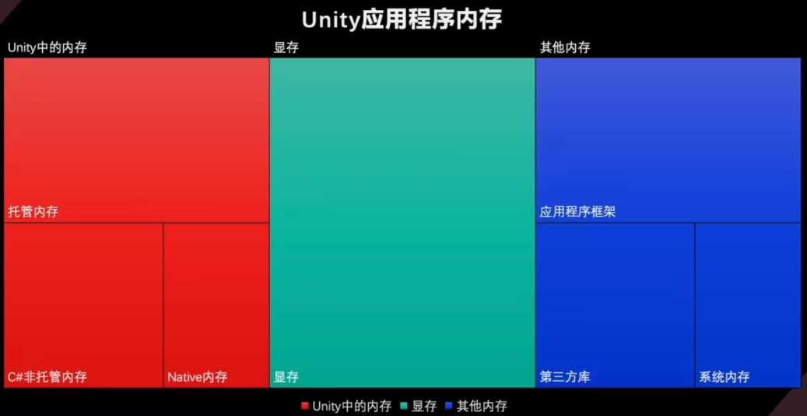

- [应用程序内存分布](#应用程序内存分布)
- [Unity 中的内存](#unity-中的内存)
  - [托管内存](#托管内存)
  - [C# 非托管内存](#c-非托管内存)
  - [Native 内存](#native-内存)
- [内存相关工具](#内存相关工具)
  - [可以自定义 unity profiler 指标](#可以自定义-unity-profiler-指标)
  - [Memory Profiler](#memory-profiler)
  - [ProjectSettings 中的 Memory Settings](#projectsettings-中的-memory-settings)
  - [UPR 工具中内存快照](#upr-工具中内存快照)
  - [mac 下的工具](#mac-下的工具)
- [移动平台内存经验数据](#移动平台内存经验数据)
- [Native 内存分配器](#native-内存分配器)
  - [桶分配器](#桶分配器)
  - [DynamicHeapAllocator 动态堆分配器](#dynamicheapallocator-动态堆分配器)
  - [DualThreadAllocator 双线程分配器](#dualthreadallocator-双线程分配器)
  - [TLS Stack Allocator](#tls-stack-allocator)
  - [Thread Safe Linear Allocator](#thread-safe-linear-allocator)
  - [分配回退流程](#分配回退流程)
- [memory profiler](#memory-profiler-1)
  - [内存度量与术语](#内存度量与术语)
    - [page](#page)
    - [region 区域](#region-区域)
  - [进程内存结构](#进程内存结构)
  - [示例工程中 Mesh 方面优化](#示例工程中-mesh-方面优化)
  - [示例工程中 Texture 方面优化](#示例工程中-texture-方面优化)
- [shader](#shader)
  - [查看 shader 变体数量](#查看-shader-变体数量)
  - [优化](#优化)
  - [代码优化](#代码优化)
    - [Shader 数据类型精度](#shader-数据类型精度)
    - [指令底层](#指令底层)
    - [unity 指令优化](#unity-指令优化)
- [托管内存优化](#托管内存优化)

# 应用程序内存分布

# Unity 中的内存

## 托管内存

使用托管堆或垃圾收集器自动分配和管理的内存；  
包括托管堆内存、脚本堆栈内存和虚拟机内存三个部分，其中托管堆内存为优化的主要部分。

unity 使用的是保守的回收器 (Boehm-Demers-Weiser Conservative Garbage Collector)，在内存的管理与分配上并不会太激进，因此一些使用不当会造成内存的浪费

## C# 非托管内存

在 C# 下与 Unity Collection 命名空间及包结合使用，允许访问 Native 内存层；  
使用 Marshal 类或者 unsafe 代码块可以在 C#中分配非托管内存，其不使用垃圾收集器管理，需要手动释放。

## Native 内存

Unity 用于运行引擎的 C++ 内存，Native 内存通常与使用底层 API 或者调用外部原生库时相关联；  
例如，当通过 Unity 的底层 API 与图形渲染管线进行交互时，可能需要使用 Native 内存来传输数据。

除了 Unity 所需要的计算内存，渲染功能还需要对应显存，而在移动端，显存往往也与内存共享。  
对于不同平台，操作系统会以不同方式分配出对应的应用程序框架内存、第三方库内存和系统内存。

# 内存相关工具

## 可以自定义 unity profiler 指标

[自定义](https://www.bilibili.com/video/BV1TY411c7nX?vd_source=386bdb94ff2a430f8d22a6de9755030c&spm_id_from=333.788.videopod.sections)

## Memory Profiler

在 Editor 中检查 Runtime 内存开销情况；  
内存占用细节可以精确到具体的 Object，并索引到场景中。

## ProjectSettings 中的 Memory Settings

可以进行 Memory Allocator 的设置；  
在 Unity 中，Memory Allocator（内存分配器）是负责在运行时管理内存分配和释放的机制。Unity 提供了几种不同的内存分配器，每种都有不同的用途和性能特点，开发人员可以根据具体需求选择合适的内存分配器；  
Memory Allocator 清单详见 [官方文档](https://docs.unity3d.com/cn/current/Manual/memory-allocator-customization.html) ：

## UPR 工具中内存快照

可以脱离编辑器，模拟运行时的内存信息；  
可以比对运行时多帧的内存快照差异；  
模拟移动端硬件环境。

## mac 下的工具

略

# 移动平台内存经验数据

Texture：80M-160M；					Mesh：50M-70M；  
Render Texture：50M-80M；			Animation Clips：30M-60M；  
Audio：10M-20M；					Cubemap：0M-50M；  
Font：5M-15M；						Shader：20M-40M；  
System.XX 总和：15M-30M；			AssetBundle：0M-10M；  
ReservedMono：<100M；				ReservedGFX：<300M；  
ReservedTotal：<650M；				其他各类对象单项：0-10M，数量小于 10000。  

其他相关数据：  
DrawCall：300~600；					SetPassCall：80~120；  
Triangles Count：60W~100W；			Material Count：200~400。

# Native 内存分配器

Memory Settings 中可以自定义的比较典型的几类分配器。

- Main Allocator：绝大多数内存分配使用的分配器。包括主线程渲染资源相关，文件 cache tap tree 等不同用途下的分配器。

- Fast Per Thread Temporary Allocators：线程上使用的临时分配器。包括各工作线程的栈分配器。比如音乐、渲染、预加载、烘焙等工作线程上的分配器。

- Fast Thread Shared Temporary Allocators：线程间共享的临时分配器

- Profiler Allocators：用于 Profiler 使用的分配器

上面的都是抽象意义上的分类，unity 代码则是通过算法分类，分出了更多类型：
- UnityDefaultAllocator  unity 默认分配器
- BucketAllocator  桶分配器
- DynamicHeapAllocator  动态堆分配器
- DualThreadAllocator  双线程分配器
- TLSAllocator(Thread Local Storage)  线程本地存储分配器
- StackAllocator  栈分配器
- ThreadSafeLinearAllocator  线程安全线性分配器
- 以及用于各个平台特性的分配器与调试分配器等

它们与按用途分类的分配器是一对多的关系，也就是按用途分类的分配器，底层都是按算法分类的分配器实现的，它们只是底层分配器抽象的一层皮。

而 memory setting 自定义设置中仅是把这层皮暴露到编辑器中了，所以我们需要了解他们具体对应关系，才能真正了解如何下手去自定义内存分配器

## 桶分配器

每个 bucket 由固定大小粒度 granularity 表示，如果 granularity 为 16 字节大小，则用于分配 16/32/48/64/··字节的内存，如果是 development 版本 granularity 在设置大小的基础上增加 40 个字节。  

分配器为分配保留内存块 Block，每个块被划分为 16kb 的子段 (subsections), 并且不可配置。Block 块只能增长，并且需要是固定 16kb 大小的整数倍。  

分配是固定大小无锁的，速度快，通常作为进入堆分配器之前用来加速小内存分配的分配器 Log 日志中可以通过查看 [ALLOC_BUCKET] 字段来看是否有 FailedAllocations.Bucket layout 字段，以及 PeakAllocated bytes 字段与 Large Block size 字段的利用率，来判定大小是否分配合适，分配失败会回退到 DynamicHeapAllocator 或 UnityDefaultAllocator 分配器上，效率变差

## DynamicHeapAllocator 动态堆分配器

所有平台都希望使用的分配器（Mac 与 IOS 暂时仍然使用 UnityDefaultAllocator，UnityDefaultAllocator 可以理解为原生的 C++中的 MALLOC 与 free）

底层基于 TLSF，保留 TLSF 块列表，并在一个块已满后，切换到另一个块，或没有时分配一个新块。你可以理解为它是两层链表管理的内存块，第一层以二的幂次方划分，当第一层的内存块分配有剩余时，引入第二层链表，将第一层中实用的内存块剩余部分用更精细的力度进行划分，在保证分配效率的同时，提高内存利用率。关于 [TLSF](http://www.gii.upv.es/tlsf/files/ecrtsO4_tIsf.pdf)

最棘手的部分是设置块的大小。根据不同平台，更大的块效率更高，碎片更少，但对于内存有限的平台来说灵活性差。

目前可设置的最大块为 256M，最小块为 128k, 如果 64 位架构使用更大的 Region 来保存多个块 MEMORY_USE_LARGE_BLOCKS，如果分配失败会会退到虚拟内存分配，效率更差。

Log 中 [ALLOC_DEFAULT_MAIN] 下关注 Peakusageframecount 字段，查看大多数帧分配内存的范围，关注内存分配峰值 Peak Allocatedmemory 字段，以及 Peak Large allocation bytes 是否超过 block 块个数乘以 block size 大小，如果超过了，将没有使用 TLSF 分配内存大小，这时我们需要调整该分配器 block 块的大小

## DualThreadAllocator 双线程分配器

它是将 2 个 DynamicHeapAllocator 实例与 1 个 BucketAllocator 封装到一起，其中 BucketAllocator 负责小的共享内存分配，1 个无锁的 DynamicHeapAllocator 用于主线程分配，另外一个 DynamicHeapAllocator 负责其他线程的共享分配，但此分配器分配与回收时需要加锁。

同样在检查设置是否合适时，需要 Log 中 [ALLOC_DEFAULT] 下分别关注 [ALLOC_BUCKET]、[ALLOC_DEFAULT_MAIN]、[ALLOC_DEFAULT_THREAD] 字段下一个 BucketAllocator 与 2 个 DynamicHeapAllocator 的分配信息，其中尤其关注 Peakmaindeferredallocationcount 字段，这个字段代表需要在主线程回收的分配队列。负责其他线程的共享分配的 DynamicHeapAllocatord 对应 C# 非托管内存的 Allocator.Persistent

## TLS Stack Allocator

用于快速临时分配的堆栈分配器。它是最快的分配器，几乎没有开销，并且可以防止内存碎片，对应 C# 非托管内存的 Allocator.Temp 分配类型

它是基于后进先出 LIFO 的算法，分配的内存生命周期在一帧内。如果分配器使用超过了配置的大小，Unity 会增加分配块大小，但会是配置设置的 2 倍大小，

如果线程堆栈分配器满了，分配器将会退到线程安全线性 job 分配器。这时一帧内允许有 1-10 分配，甚至如果是加载期间可以允许几百次。但如果每帧的分配数字增加可以考虑增加块大小。

Log 日志 [ALLOC_TEMP_TLS] 下关注 [ALLOC_TEMP_MAIN] 与 [ALLOC_TEMP_Job.Worker xx] 中的 Peak usage frame count 于 Peak Allocated Bytes 字段，也要关注 Overflow Count 字段，是否发生了分配器溢出会退的情况。

## Thread Safe Linear Allocator

用于快速无锁分配 Job 线程的缓冲区，并在 Job 完成后释放缓冲区，对应 C#非托管内存的 Allocator.TempJob

采用循环先进先出 FIFO 算法，先分配内存块，然后在这些内存块内进行线性分配内存。所有可用块都会存到一个池中，当一个块满时再从池中提取一个新的可用块。当分配器不再需要块中内存时，清理该块并放回到可用池中。快速清理分配可用块非常重要。

因此 Job 的分配尽量在几帧内完成。如果所有块都在使用中，或者一个分配对于一个块太大的情况下，则会退到主堆分配器，分配效率会下降。

Log 日志 [ALLOC_TEMP_JOB_4_FRAMES] 中我们需要关注 OverflowCout(toolarge) 与 OverflowCount(full) 字段，判断是否发生了分配器溢出会退。

## 分配回退流程

# memory profiler

## 内存度量与术语

### page

page 是操作系统管理内存的最小基础单元，通常为 4k 大小，但在不同的操作系统或平台上可能也会不同，比如在比较新的 ios 或 mac 操作系统上是 16k 大小

一般电脑中的 cpu 会有一个内存管理单元 mmu，他会维护一张 page 的表，并将虚拟地址映射到物理内存地址上，当用户访问虚拟地址时，会自动被 mmu 转换为物理地址，但当 cpu 访问虚拟地址，并没有找到映射的物理内存地址时，cpu 会触发 page fault 中断当前程序执行，然后再分配一块干净的物理内存，并从磁盘中加载所需的一页数据到该物理地址，同时更新列表并继续执行程序。当一个进程向系统申请内存时，系统并不会返回物理内存地址，而是返回一个虚拟内存地址，仅当 cpu 需要访问该虚拟内存地址时，系统才会分配并映射到物理内存上。

另外每个配置可能有不同的状态，用来描述该内存页处理的不同使用状态：
- used 代表 page 正在被进程使用，而内存页也已经被映射到了物理内存中。
- free 代表该 page 可用，并且该内存页还没有映射到物理内存中
- cache 状态代表 page 被操作系统用于缓存的可用内存，虽然内存页已经被映射到物理内存中，但 page 可能近期没有被访问

如果 free 配置数量低于一个阈值时，操作系统会从 cache 的页中去获取内存，并将 cache 页上的数据交换到磁盘，然后对 cache 的页进行清理并将其标记为免费页面。

### region 区域

另外在内存管理的更高级别上，操作系统的虚拟内存还会将 page 组织成区域，可能在不同的操作系统中使用不同的名称来定义这个概念，我这里就统称为 region，它是一块共享内存状态和保护级别的连续地址空间，它可以由具有不同的页面状态的多个配置组成。

region 也有不同的状态：
- resident 代表其中的配置页已经在物理内存中
- dirty 代表配置已修改，但未写入磁盘，代表永远不会交换到辅助存储的固定 page 段
- committed 代表已分配的内存区域，其地址不能被其他分配使用，是由 ram 磁盘上的分页文件或其他资源来支持的，访问权限由内存的保护级别控制
- reserved 该状态的 region 保留地址空间，供将来使用，地址不会被其他分配使用，也不可访问，如果尝试从 reserve 的内存读写，都会导致访问冲突异常，并且他没有与之关联的物理存储支持
- free 状态的 region 是空闲内存区，既不会 committed，也不会 reserved，并且进程无法访问
- 同样任何尝试读写 free 状态的 region 也会导致访问冲突异常

region 的类型也分为两种：
- 匿名的：这类 region 上的内存页与文件系统上的文件并没有关联。例如 c++使用 malloc 的任何分配或 mono 上的分配都是匿名的
- map 的映射类型：这类 region 包含的内存页是与文件系统设备节点关联的，文件与内存将做直接映射

## 进程内存结构

unity 的 memory profile 是针对 VSS 的  
window 的内存管理器显示的是 uss  
mac xcode 显示的是 rss 加上压缩后的内存交换页的大小  

## 示例工程中 Mesh 方面优化

在 MemoryProfiler 的 TreeMap 中观察到，占用最高的为 Mesh，展开后为大量 CombinedMesh。  
取消 StaticBatching 后，观察到 Mesh 网格资源数量上升，但总体内存开销大大减小。  
不过在取消 StaticBatching 后，不再进行网格合批功能，DrawCall 有所上升，但整体的性能开销的变小的。

## 示例工程中 Texture 方面优化

启动 Mipmap 与 TextureStreaming，如有必要可以在 ProjectSettings-Quality 中进行 TextureQuality、TextureStreaming 相关参数的调整。  
Mipmap Streaming 的示例项目+UI 调试项目：https://github.com/lwwhb/MipMapStreamingDemo

# shader

- 使用 ShaderVariantCollection 就万事大吉了吗？
- 我们有很牛云收集方案，肯定能将 Shader 变体收集完整
- 我们已经做了 Shader 变体剔除与收集，并对收集的变体做了 Warmup，但还是会有运行时 Shader 加载编译情况。

## 查看 shader 变体数量

- 通过切换到对应平台查看对应的变体数量，但是内置的 shader 难以查看，此时可以使用第二种。
- 打包，通过打包日志查看所有的变体数量，搜索 compiling shader

## 优化

如果 Shader 关键字过多，则会导致编译时的 Shader 变体过多，从而大致运行时的性能开销过大，故需要进行 Shader 变体的剔除：

Unity 提供了 IPreprocessShaders 接口，让用户自定义剔除条件。自定义的类继承 IPreprocessShaders 后，需要实现 OnProcessShader 方法，当打包时，所有 Shader 变体都可以通过该回调进行判断。

同时，Unity 在 ProjectSettings-Graphics 中存在 Instancing Variants 和 Shader Stripping 相关配置项。

在运行时，场景会实时加载所需 Shader 变体，有可能会造成加载的阻塞与尖刺，因此可以进行 Shader 变体收集与预加载，从而实现变体总数的减少与性能开销的平滑：

变体收集最终获得的是 Shader Variant Collection 变体收集文件，之后在 ProjectSettings-Graphics 的 PreloadedShaders 中进行配置。

https://github.com/lujian101/ShaderVariantCollector

## 代码优化

可以通过 xcode 实时更改当前包的 shader 代码，来看到不同指令的开销，不用重复打包去验证。

### Shader 数据类型精度

Float (32bit)（建议位置与纹理坐标信息使用）  
Half (16bit)（纹理坐标与颜色信息）  
Fixed (11bit)（颜色信息）(SPR 下已不支持）

### 指令底层

避免隐式转换

varying 尽可能组织成向量形式

### unity 指令优化

# 托管内存优化

下述操作容易造成托管内存开销的浪费：
- C#层面：
	- Boxing Allocation 装箱操作；（其中 lua 热更时接口最好不要传递 unity 变量，github miku-luaProfiler 可以查看这部分优化）
	- String 字符串拼接（尽量使用 StringBuilder)；string builder
	- 闭包分配（托管堆中产生额外的类保存使用到的变量）；
	- 避免使用 Linq 库写任何游戏内的代码，会生成大量托管堆上的垃圾内存。
- Unity 库层面：
	- Unity 中提供了 NonAlloc 函数，应尽量使用，如使用 Physics.RaycastAllNonAlloc 代替 Physics.RayCastAll；
	- Unity.Object.FindObjectsOfType、UnityEngine.Component.GetComponentsInParent、UnityEngine.Component.GetComponentsInChild 等托管内存开销较大，如有查找必要，建议基于 ObjectTag 进行查找；
	- 部分 Unity 类成员变量的访问同样托管内存开销较大，建议通过成员方法（使用 get 而不是直接点）进行间接访问，如 UnityEngine.Mesh.GetVertices、UnityEngine.Mesh.GetUV、UnityEngine.Renderer.GetSharedMaterials、Unity.Input.GetTouches 等。

- 如果发现运行时存在 GC 尖刺，可以在 ProjectSettings-Player 中开启 UseIncrementalGC 项。一帧 GC 平滑到多帧，提升帧率
- 代码剔除：剔除 unity 的代码，代码剔除等级找到合适的等级，可以通过 Preserve 标签防止 C# 接口被误剔除，可以通过 XML 详细配置。
