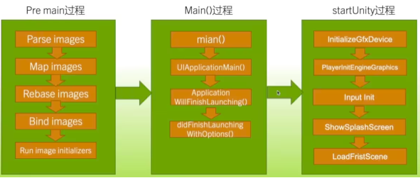
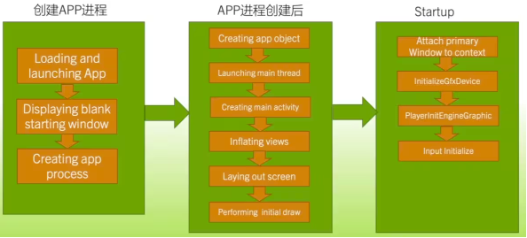

# 耗电量和发热量

- 通过平台对应工具确保设备电池处于健康状态；
- 通过 UPR 等工具确保能对工程的耗电量、发热量进行正确分析；
- 往往设备会存在温度墙，当温度过高时，设备将为芯片降频，从而导致工程性能被迫下降从而降温；

## 常规负载优化

对于目标 60fps，则需要控制 CPU 开销在 10-12ms、GPU 开销在 6-8ms；  
对于目标 30fps，则需要控制 CPU 开销在 18-20ms、GPU 开销在 8-10ms。

## 非常规优化

网络与 IO 相关：如发包频率和 IO 读写频率；  
显示亮度与显示帧率相关：如主动降低屏幕亮度或动态控制分辨率，并通过 OnDemandRendering 控制帧率方法；  
三方库相关：如 Wwise，将混合音乐控制在 4 个以内；如 Criware，建议不要在移动端使用，或不要频繁使用；同时注意检查平台 SDK；

# 启动时间优化

## 启动时间

启动时间分为两段：
- 黑屏至 UnityLogo 的时间；
- UnityLogo 至场景出现的时间。

### iOS 平台启动时间优化

iOS 平台 Unity 程序启动流程分为 PreMain、Main 和 StartUnity 三个过程。  

其中 PreMain 和 StartUnity 过程可以被优化，Main 过程需要修改 Unity 源码才能做修改。其中 Main 过程的结束表现为 UnityLogo 的出现。

- iOS 平台程序启动需要注意的点：
	- 不同版本的 iOS 系统程序启动时间略有差异；
	- OS 启动分为首次启动、冷启动与热启动，一般所涉及优化为冷启动；
	- 启动时间超过 20s 的程序会被系统自动杀死进程；
	- 默认竖屏程序会比默认横屏程序启动时间略长；
	- 推荐 PreMain 时间最好不要超过 400ms；
	- iOS15 以后通过 Xcode 的 Timeline 功能可以查看整体启动过程。
- iOS 在 PreMain 阶段优化建议：
	- 文件压缩，合并重复或删除用不到的一些代码，此时可以使用 APPCode 进行检测；
	- 减少不必要的 Framework 与引用的动态链接库加载；
	- 使用 StaticArchives 连接 dyLib；
	- C++ 代码中减少全局静态变量的使用，以及过度抽象，注意虚函数表的开销（不建议超过 10000+)；
	- OC 对象将在 +load 方法中要做的事延迟到 +initialize 方法中；
	- 减少 OC 对象的 metadata；
	- 在 initializers 中尽量不要调用 dlopen，不要创建线程；
	- 注意一些三方库与平台 SDK。

### Andorid 平台启动时间优化

Andorid 平台 Unity 程序启动流程分为创建 APP 进程、APP 进程创建后和 Startup 三个过程  

类似 iOS，前两个过程为 APP 初始化，其表现为 UnityLogo 的展示，StarUp 过程表现为第一个场景的加载完成。

- Andorid 平台程序启动需要注意的点：
	- 不同版本的 Andorid 系统程序启动时间略有差异；
	- Andorid 启动分为首次启动、冷启动与热启动，一般所涉及优化为冷启动；
	- App 进入后台可能会被系统自动杀掉，恢复也算冷启动；
	- Unity 中 Activity 的 android:launchMode 属性一定要保证是 SingleTask 的，否则原生界面调出，或切到后台等都可能发生崩溃；
	- 通过 adb logcat 查看日志中 Displayed 标签来查看程序启动到显示前时间；
	- 通过 Android Studio 的 Android CPU profiler 工具来定位启动时瓶颈；
	- 使用 GooglePlay 的 Android vitals 来发现启动异常问题；
	- 一些三方库与平台 SDK 对启动时间的影响。

- Android 启动优化建议：
	- 减少 Activity OnCreate 函数中复杂的逻辑工作；
	- 将所有的资源初始化做 LazyLoad 放到不同的线程中，不要全部放到主线程中。

### Unity 初始化完成到第一个场景加载完成优化建议

- 尽量不要使用 Resources 目录，即使使用也不要有过多资源；
- 第一个场景尽量保持简单，挂载脚本不宜过多，Awake/Start 的逻辑尽量简单；
- 资源 Text 模式比 force binary 模式慢很多；
- Graphics 下 Always Include 下不宜包含太多或太复杂的 Shader 脚本；
- 要做 Shader 变体剔除，变体过多的项目不要使用 Shader.WarmupAllShaders 来做 ShaderCache；
- ab 包不宜打得过碎，尽量使用 LZ4 压缩，不要使用 LZMA 压缩；
- 注意，编辑器下 InitializeOnLoad、InitializeOnLoadMethod 属性，运行时 RuntimeInitializeOnLoadMethod 等属性，这些属性标记的函数如果过于复杂，也会影响编辑器启动与 Player 启动的速度。

# ab 包

## AssetBundle

- AssetBundle 是一个存档文件，包含运行时加载的特定平台的非代码资源（纹理、模型、音乐、Prefab、Scene 等），以及资源之间的依赖关系。
- AssetBundle 可以用于资源更新，减小安装大小，针对平台加载优化资源，减轻运行时内存压力。
- AssetBundle 是一个容器，包含存档文件包头、以及序列化类型文件与资源文件。

## AssetBundle 打包方案

- 通过 BuildPipeline 接口直接打包，并通过对应回调进行功能的拓展，同时可以结合 Asset Graph 处理整体流程。
- 通过 ScriptableBuildPipeline 接口进行实现，同时可以结合 Addressables 包完成更多分包策略。

## 构建 AssetBundle 参考策略

- 根据对象的修改频率差异拆分不同的 AssetBundle；
- 具有相同生命周期的资源打成一个 AssetBundle，如果一个 AB 中只有不到 50％的资源经常加载，可以考虑拆到不同的 AssetBundle 中；
- 不可能同时加载的高低配置资源拆分到不同的 AssetBundle；
- 如果多个对象依赖于某个 AssetBundle 中的单个资源，这类单个资源可以单独打包或者根据生命周期将这类被多个对象依赖的资源打成共享 AssetBundle；
- 如果一组对象只是一个对象的不同版本，可以考虑使用 AB 变体（注意 Addressable 不支持 AB 变体）。

## 构造 AssetBundle 值得注意的点

- AB 包体不能因为避免重复引用而拆的过于细碎，过小的包体，会导致包头占用内存压力会比较大（2M~5M 的包体是一个合理的参考值）；太过细碎，句柄也是一个问题
- LZMA 格式压缩的 AB 包较小，但需要完全解压后再加载，加载时间更长，而 LZ4 格式压缩的 AB 包按块加载，加载时间较快，但包体大小较大（移动平台建议使用 LZ4 压缩格式）；
- 如果确定使用相同版本 Unity 发布打包，即后续开发不会升级 Unity 版本，那么 AB 包体不做 Unity 版本兼容时可以尝试开启打包选项中的 BuildAssetBundleOption.DisableWriteTypeTree 选项， 这样处理版本兼容的 TypeTree 信息不会被打到 AB 中，可以极大减小包体大小及运行加载时的内存开销；
- 避免同一个资源被打入多个 AB 中，会增加运行时内存开销，可以使用 UPR Assets Checker 工具来做检查；有些粒子资源会依赖引擎的图，可能会导致多个 ab 都分别包含这份资源，此时需要额外弄一个代替资源。
- 不要使用 AB 包文件的 MD5 值作为更新包依据，一般会使用包内资源的 MD5 值或路径作为判断包是否发生变化的依据。
