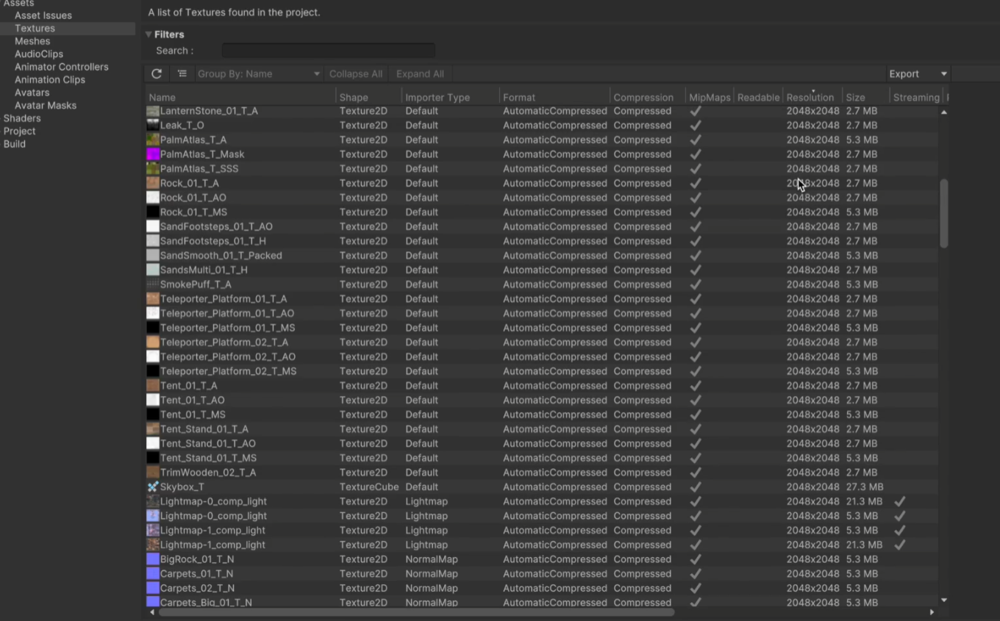

# 项目信息

什么引擎版本，什么渲染管线，什么游戏类型，什么资源规模，什么美术风格。

例如：这是一款使用 Unity6.0.32f1 引擎版本、URP Forward+ 管线开发的一款二次元大
世界场景的 MMORPG 游戏

# 目标需求

目标平台、目标机器配置、目标分辨率和帧率、目标内存、目标图形 API

# 进一步优化步骤

- 了解性能基础数据
- 项目资源规模和质量
- 游戏场景的规模与结构
- 了解各模块解决方案：
  - 引擎功能
  - 自定义功能
  - 第三方功能

其中 project auditor 可以帮助我们了解项目，进行项目统计

使用此工具可以方便地看到所有的资源信息，最好用的莫过于查看 texture 的 分辨率和大小占用

# 场景分析

- 先看节点排布，了解场景信息
- 再打开 gizmo icon 了解复杂对象的分布情况
- 再打开 layer 通过显示隐藏了解图层分布
- 再打开灯光浏览器，看看灯光等具体分布

# 项目设置分析与优化

- 没有用到音乐音效的，可以直接在引擎设置中关闭此功能以避免开销。
- graphics 设置中剔除变体：根据场景特性做一些 SHADER 层面的剔除
  - 包括 light map 与默认雾效的 SHADER 变体，可以从场景中直接导入来做剔除】
  - 实例化的 SHADER 变体，一般我们选择 strip unused 剔除不用的变体
  - 没用到 brg 可以全都剔除 brg 变体
  - 没有使用视频，可以选择不包含视频的 shader
  - 注意取消剔除 运行时调试 shader，因为我们调试会用到，等我们优化完成后，再开启剔除
- 物理相关设置
- player 相关设置

# 管线设置分析与优化

# package 优化

# profile 新功能

## highlights 显示到底是谁的瓶颈

- 指定目标帧率，看下每一帧的耗时，点击进去可以直接查看 cpu gpu 的详细窗口，更便捷
- cpu 下可以直接看调用的反顺序堆栈，无需一个一个点开
