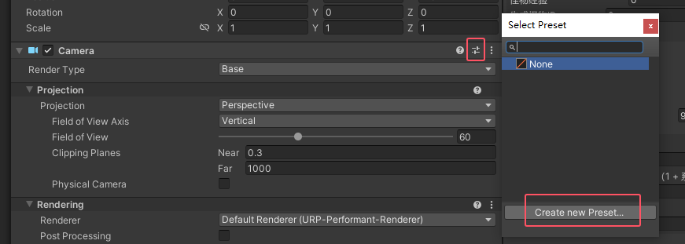
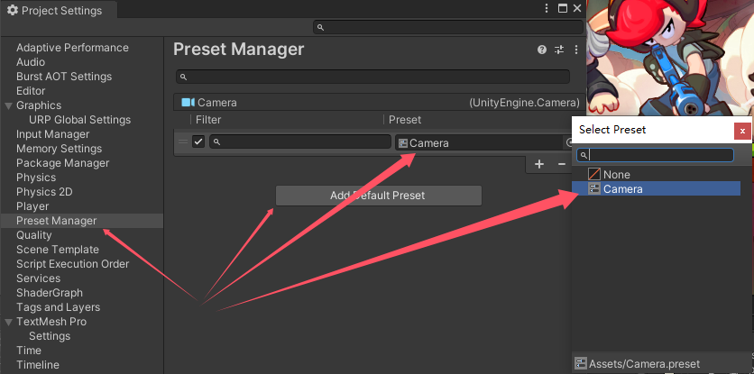
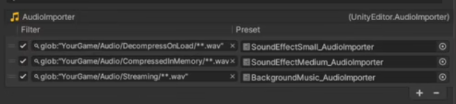

- [Unity 项目结构及用途](#unity-项目结构及用途)
- [Asset 目录文件夹](#asset-目录文件夹)
- [Asset 目录设计](#asset-目录设计)
  - [一级目录设计原则](#一级目录设计原则)
  - [二级目录设计原则](#二级目录设计原则)
  - [三级目录设计原则](#三级目录设计原则)
  - [四级目录设计原则](#四级目录设计原则)
- [资源导入工作流](#资源导入工作流)
  - [手动编写导入工具](#手动编写导入工具)
    - [AssetPostprocessor](#assetpostprocessor)
    - [AssetsModifiedProcessor (新试验接口)](#assetsmodifiedprocessor-新试验接口)
  - [利用 Presets 功能](#利用-presets-功能)
    - [是什么？](#是什么)
    - [怎么用？](#怎么用)
    - [误操作导致设置变化](#误操作导致设置变化)
  - [利用 AssetGraph 工具](#利用-assetgraph-工具)
    - [是什么？](#是什么-1)
    - [怎么用？](#怎么用-1)


# Unity 项目结构及用途

- Asset 文件夹 : 用来存储和重用的项目资产。
- Library 文件夹 : 用来存储项目内部资产数据信息的目录。
- Packages 文件夹 : 用来存储项目的包文件信息。对应的在 Library 文件夹有 PackageCache 缓存包文件信息。
- Project Settings 文件夹 : 用来存储项目设置的信息。
- UserSettings 文件夹 : 用来存储用户设置信息。
- Temp 文件夹 : 用来存储使用 Unity 编辑器打开项目时的临时数据，一旦关闭 Unity 编辑器也会被删除
- Logs 文件夹 : 用来存储项目的日志信息 ( 不包含编辑器日志信息 )


# Asset 目录文件夹

- Editor 文件夹 ( 可以多个 )
- Editor Default Resources 文件夹 ( 根目录唯一 ) ： EditorGUIUtility.Load 加载
- Gizmos 文件夹 (根目录唯一) ： Unity 提供了 EditorGUIUtility.SetIconForObject 方法，可以为场景中的对象设置自定义图标。
- Plugins 文件夹 (2019后已无) ： 插件采用 package 扩展，并且使用 asmdef
- Resources 文件夹
- Standard Assets 文件夹：存放 Unity 提供的标准资源包（Standard Assets）
- Streaming Assets 文件夹：用于存储需要在运行时直接访问的文件或资源。文件会原样保留在构建后的游戏包中，不会被 Unity 压缩或修改。例如配置文件、视频文件、音频文件、JSON 数据等。文件不会被 Unity 的资源管理系统（如 Resources）直接加载，而是通过文件路径或流式读取的方式访问。

忽略导入的文件夹
- 隐藏的文件夹
- 以'.'开头的文件和文件夹
- 以'~'结尾的文件和文件夹
- 扩展名为cvs的文件和文件夹
- 扩展名为.tmp的文件夹

# Asset 目录设计

## 一级目录设计原则

- 目录尽可能少
- 区分编辑模式与运行模式
- 区分工程大版本（原版和资料片和 mod）（超大规模项目会用到）
- 访问场景文件、全局配置文件便捷
- 不在一级目录做资源类别区分，只有 Video 类视频建议直接放到 StreamAssets 下

## 二级目录设计原则

- 只区分资源类型
- 资源类型大类划分齐全
- 不做子类型区分
- 不做功能区分
- 不做生命周期区分

## 三级目录设计原则

audio 按加载方式

texture 按 texture type

models 按 是否蒙皮划分

除了这三种之外，其他的可以按照功能或者生命周期划分

## 四级目录设计原则

audio texture models 按照功能或者生命周期继续划分

# 资源导入工作流

## 手动编写导入工具
- 优点 : 根据项目特点自定义安排导入工作流，并且可以和后续资源制作与打包工作流结合
- 缺点 : 存在开发和维护成本，会让编辑器菜单界面变得复杂，对新人理解工程不友好
- 适合类型 : 大型商业游戏团队

### AssetPostprocessor

编写编辑器代码继承 AssetPostprocesser 对象自定义实现一系列 OnPreprocessXXX 接口修改资源导入设置属性

XXX 代表资源类型

伪代码:

```Cpp
public class XXXAssetPostprocessor : AssetPostprocessor {
    public void OnPreprocessXXXAsset() {
        XXXAssetlmporter xxxlmporter =(XXXAssetlmporter)assetlmporter;
        xxxlmporter.属性=xxx
        xxxlmporter.SaveAndReimport();
    }
}
```

### AssetsModifiedProcessor (新试验接口)

资源被添加、删除、修改、移动时回调该对象的 OnAssetsModified 接口。

```Cpp
void OnAssetsModified(string[] changedAssets, string[] addedAssets, string[] deletedAssets, AssetMoveInfo[] movedAssets) {

}
```

## 利用 Presets 功能
- 优点 : 使用简单方便，只需要 Assets 目录结构合理规范即可
- 缺点 : 无法和后续工作流整合，只适合做资源导入设置。
- 适合类型 : 小型团队或中小规模项目

### 是什么？
Presets 是将相同属性设置跨多个组件、资源或项目设置保存和应用的资源。该资源运行时没有效果，仅能在 Unity 编辑器下
使用。

### 怎么用？

为组件或者资源创建 preset  



为组件或者资源设置默认 preset，前面的 Filter 可以使用 glob 搜索。



就比如可以为三种加载方式的音效预设好三种加载方式的 preset，之后导入的资源自动设置为这样。



### 误操作导致设置变化

AssetsModifiedProcessor 使用这个 API 找到官方文档的示例代码，放入工程 Editor 中，将 默认的 glob preset 清空，并且将 preset 放到对应的 glob 路径下。这下，就算你在这个文件夹下更改资源设置，也会被 AssetsModifiedProcessor 检测到并修改回 preset 的样子。

## 利用 AssetGraph 工具
- 优点 : 功能全，覆盖Unity资源工作流全流程，节点化编辑，直观
- 缺点 : 有一定上手成本，一些自定义生成节点也需要开发，不是 Unity 标准包，Unity 新功能支持较慢。
- 适合类型:任何规模项目和中大型团队

### 是什么？

AssetGraph 是 Unity 提供的一种资源管理工具，主要用于通过可视化的方式管理和处理项目中的资源（Assets）。它允许开发者通过图形化界面（Graph）的形式定义资源的处理流程，例如资源的导入、打包、分组等操作，从而简化资源管理的复杂性，提高工作效率。

### 怎么用？

在 Unity-Technologies 官方工具中搜索 AssetGraph 

自己学吧。


