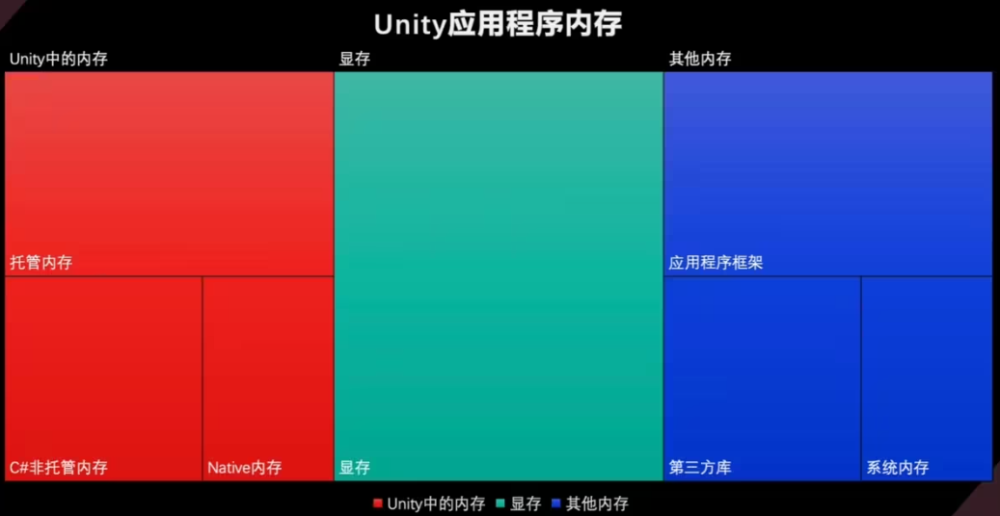
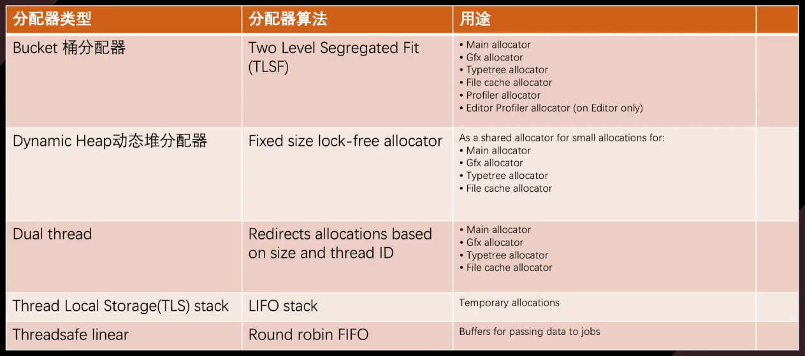
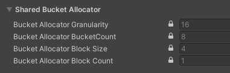

- [应用程序内存分布](#应用程序内存分布)
- [Unity 中的内存](#unity-中的内存)
  - [托管内存](#托管内存)
  - [C# 非托管内存](#c-非托管内存)
  - [Native 内存](#native-内存)
- [内存相关工具](#内存相关工具)
  - [可以自定义 unity profiler 指标](#可以自定义-unity-profiler-指标)
  - [Memory Profiler](#memory-profiler)
  - [ProjectSettings 中的 Memory Settings](#projectsettings-中的-memory-settings)
  - [UPR 工具中内存快照](#upr-工具中内存快照)
  - [mac 下的工具](#mac-下的工具)
- [移动平台内存经验数据](#移动平台内存经验数据)
- 

# 应用程序内存分布

# Unity 中的内存

## 托管内存

使用托管堆或垃圾收集器自动分配和管理的内存；  
包括托管堆内存、脚本堆栈内存和虚拟机内存三个部分，其中托管堆内存为优化的主要部分。

unity 使用的是保守的回收器 (Boehm-Demers-Weiser Conservative Garbage Collector)，在内存的管理与分配上并不会太激进，因此一些使用不当会造成内存的浪费

## C# 非托管内存

在 C# 下与 Unity Collection 命名空间及包结合使用，允许访问 Native 内存层；  
使用 Marshal 类或者 unsafe 代码块可以在 C#中分配非托管内存，其不使用垃圾收集器管理，需要手动释放。

## Native 内存

Unity 用于运行引擎的 C++ 内存，Native 内存通常与使用底层 API 或者调用外部原生库时相关联；  
例如，当通过 Unity 的底层 API 与图形渲染管线进行交互时，可能需要使用 Native 内存来传输数据。

除了 Unity 所需要的计算内存，渲染功能还需要对应显存，而在移动端，显存往往也与内存共享。  
对于不同平台，操作系统会以不同方式分配出对应的应用程序框架内存、第三方库内存和系统内存。

# 内存相关工具

## 可以自定义 unity profiler 指标

[自定义](https://www.bilibili.com/video/BV1TY411c7nX?vd_source=386bdb94ff2a430f8d22a6de9755030c&spm_id_from=333.788.videopod.sections)

## Memory Profiler

在 Editor 中检查 Runtime 内存开销情况；  
内存占用细节可以精确到具体的 Object，并索引到场景中。

## ProjectSettings 中的 Memory Settings

可以进行 Memory Allocator 的设置；  
在 Unity 中，Memory Allocator（内存分配器）是负责在运行时管理内存分配和释放的机制。Unity 提供了几种不同的内存分配器，每种都有不同的用途和性能特点，开发人员可以根据具体需求选择合适的内存分配器；  
Memory Allocator 清单详见 [官方文档](https://docs.unity3d.com/cn/current/Manual/memory-allocator-customization.html) ：

## UPR 工具中内存快照

可以脱离编辑器，模拟运行时的内存信息；  
可以比对运行时多帧的内存快照差异；  
模拟移动端硬件环境。

## mac 下的工具

略

# 移动平台内存经验数据

Texture：80M-160M；					Mesh：50M-70M；  
Render Texture：50M-80M；			Animation Clips：30M-60M；  
Audio：10M-20M；					Cubemap：0M-50M；  
Font：5M-15M；						Shader：20M-40M；  
System.XX 总和：15M-30M；			AssetBundle：0M-10M；  
ReservedMono：<100M；				ReservedGFX：<300M；  
ReservedTotal：<650M；				其他各类对象单项：0-10M，数量小于 10000。  

其他相关数据：  
DrawCall：300~600；					SetPassCall：80~120；  
Triangles Count：60W~100W；			Material Count：200~400。

# Native 内存分配器

Memory Settings 中可以自定义的比较典型的几类分配器。

- Main Allocator：绝大多数内存分配使用的分配器。包括主线程渲染资源相关，文件 cache tap tree 等不同用途下的分配器。

- Fast Per Thread Temporary Allocators：线程上使用的临时分配器。包括各工作线程的栈分配器。比如音乐、渲染、预加载、烘焙等工作线程上的分配器。

- Fast Thread Shared Temporary Allocators：线程间共享的临时分配器

- Profiler Allocators：用于 Profiler 使用的分配器

上面的都是抽象意义上的分类，unity 代码则是通过算法分类，分出了更多类型：
- UnityDefaultAllocator  unity 默认分配器
- BucketAllocator  桶分配器
- DynamicHeapAllocator  动态堆分配器
- DualThreadAllocator  双线程分配器
- TLSAllocator(Thread Local Storage)  线程本地存储分配器
- StackAllocator  栈分配器
- ThreadSafeLinearAllocator  线程安全线性分配器
- 以及用于各个平台特性的分配器与调试分配器等

它们与按用途分类的分配器是一对多的关系，也就是按用途分类的分配器，底层都是按算法分类的分配器实现的，它们只是底层分配器抽象的一层皮。

而 memory setting 自定义设置中仅是把这层皮暴露到编辑器中了，所以我们需要了解他们具体对应关系，才能真正了解如何下手去自定义内存分配器

## 桶分配器

每个 bucket 由固定大小粒度 granularity 表示，如果 granularity 为 16 字节大小，则用于分配 16/32/48/64/··字节的内存，如果是 development 版本 granularity 在设置大小的基础上增加 40 个字节。  

分配器为分配保留内存块 Block，每个块被划分为 16kb 的子段 (subsections), 并且不可配置。Block 块只能增长，并且需要是固定 16kb 大小的整数倍。  

分配是固定大小无锁的，速度快，通常作为进入堆分配器之前用来加速小内存分配的分配器 Log 日志中可以通过查看 [ALLOC_BUCKET] 字段来看是否有 FailedAllocations.Bucket layout 字段，以及 PeakAllocated bytes 字段与 Large Block size 字段的利用率，来判定大小是否分配合适，分配失败会回退到 DynamicHeapAllocator 或 UnityDefaultAllocator 分配器上，效率变差

## DynamicHeapAllocator（动态堆分配器）

所有平台都希望使用的分配器（Mac 与 IOS 暂时仍然使用 UnityDefaultAllocator，UnityDefaultAllocator 可以理解为原生的 C++中的 MALLOC 与 free）

底层基于 TLSF，保留 TLSF 块列表，并在一个块已满后，切换到另一个块，或没有时分配一个新块。你可以理解为它是两层链表管理的内存块，第一层以二的幂次方划分，当第一层的内存块分配有剩余时，引入第二层链表，将第一层中实用的内存块剩余部分用更精细的力度进行划分，在保证分配效率的同时，提高内存利用率。关于 [TLSF](http://www.gii.upv.es/tlsf/files/ecrtsO4_tIsf.pdf)

最棘手的部分是设置块的大小。根据不同平台，更大的块效率更高，碎片更少，但对于内存有限的平台来说灵活性差。

目前可设置的最大块为 256M，最小块为 128k, 如果 64 位架构使用更大的 Region 来保存多个块 MEMORY_USE_LARGE_BLOCKS，如果分配失败会会退到虚拟内存分配，效率更差。

Log 中 [ALLOC_DEFAULT_MAIN] 下关注 Peakusageframecount 字段，查看大多数帧分配内存的范围，关注内存分配峰值 Peak Allocatedmemory 字段，以及 Peak Large allocation bytes 是否超过 block 块个数乘以 block size 大小，如果超过了，将没有使用 TLSF 分配内存大小，这时我们需要调整该分配器 block 块的大小

## DualThreadAllocator（双线程分配器）

它是将 2 个 DynamicHeapAllocator 实例与 1 个 BucketAllocator 封装到一起，其中 BucketAllocator 负责小的共享内存分配，1 个无锁的 DynamicHeapAllocator 用于主线程分配，另外一个 DynamicHeapAllocator 负责其他线程的共享分配，但此分配器分配与回收时需要加锁。

同样在检查设置是否合适时，需要 Log 中 [ALLOC_DEFAULT] 下分别关注 [ALLOC_BUCKET]、[ALLOC_DEFAULT_MAIN]、[ALLOC_DEFAULT_THREAD] 字段下一个 BucketAllocator 与 2 个 DynamicHeapAllocator 的分配信息，其中尤其关注 Peakmaindeferredallocationcount 字段，这个字段代表需要在主线程回收的分配队列。负责其他线程的共享分配的 DynamicHeapAllocatord 对应 C# 非托管内存的 Allocator.Persistent

## 