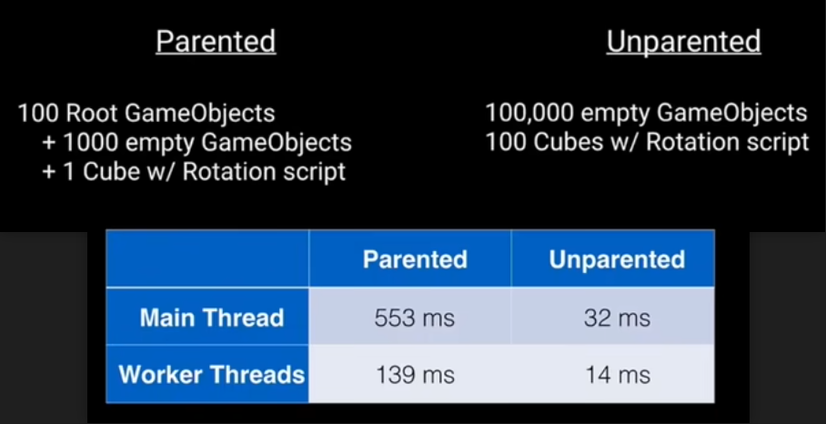
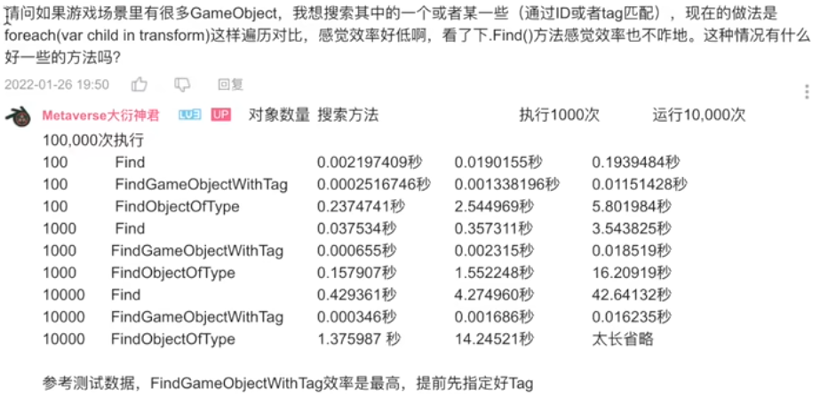
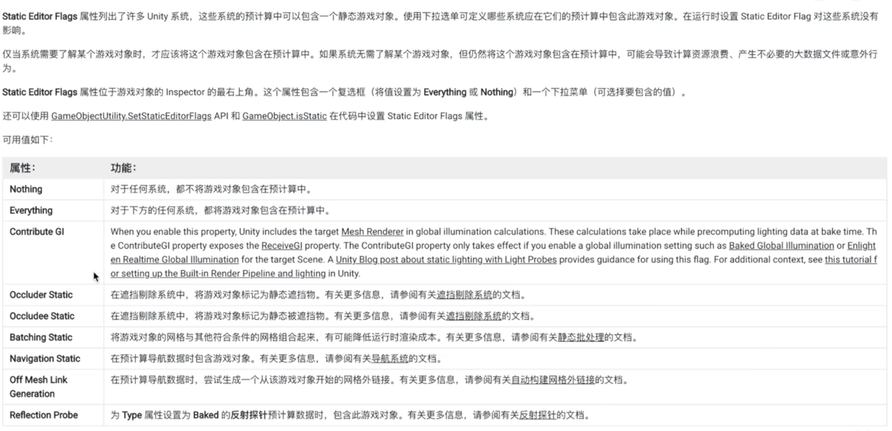
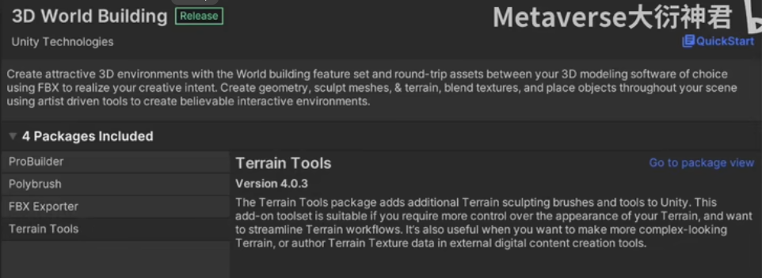

- [Scene 场景](#scene-场景)
  - [场景结构设计原则](#场景结构设计原则)
  - [场景合并冲突问题](#场景合并冲突问题)
- [预制体](#预制体)
  - [是什么？](#是什么)
  - [好处](#好处)
  - [嵌套预制体](#嵌套预制体)
  - [预制体变体](#预制体变体)
    - [本质](#本质)
- [UGUI](#ugui)
  - [Canvas](#canvas)
    - [Re-batch 过程](#re-batch-过程)
    - [Canvas 使用准则](#canvas-使用准则)
    - [UGUI 射线检测（Raycaster）](#ugui-射线检测raycaster)
  - [渲染细节](#渲染细节)
  - [Re-Build](#re-build)
    - [Layout Rebuild](#layout-rebuild)
    - [Graphic Rebuild](#graphic-rebuild)
  - [性能问题](#性能问题)

# Scene 场景

## 场景结构设计原则

- 合理设计场景一级节点的同时，避免场景节点深度太深。
  - Unity 在 Transform 时，会自动进行层级间的级联变换，因此对一个具有大量子物体的父物体进行 Transform 时，会有较高的性能负担。
  - 代码生成的游戏对象如果不需要随父节点进行 Transform 的，一律放到根节点下。
  > unit 2018 中提到：transform 使用连续内存存储 并通过 transform dirty 标记，逐级进行脏设置来实现级联变换的。
  > 
  > 
  >
  > 效率相差几十倍
  
- 尽量使用prefab构建场景，而不是直接创建的GameObject节点。由prefab组成的场景在版本管理时更为清晰。
- 避免DontDestroyOnLoad节点下有太多生命周期过长或引用资源过多的复杂节点对象。Additve模式添加的场景要尤为注意。
- 最好为一些需要经常访问的节点添加tag，静态节点一定要添加Static标记。FindObjectWithTag方法会比其他Gameobject查询方法拥有更好的性能。
  > 
  > 
- 编辑器提效包：

## 场景合并冲突问题

在使用Git进行版本控制时，Unity的.scene文件通常会遇到一些问题，因为.scene文件是二进制文件，而Git更擅长处理文本文件的变化。这可能导致.scene文件无法被正确序列化、合并或比较差异。

处理方案：
- .unitypackage文件是一种压缩文件格式，可以包含场景、资源和其他项目文件，可以方便地在Unity项目之间导入和导出，并可以被Git正确地处理。
- .prefab文件来管理场景中的对象。.prefab文件是可以序列化的，更适合与版本控制系统一起使用，因为它们是文本文件，可以好地处理合并和冲突。
- SmartMerge是Unity的一款内置工具，可以帮助解决Unity场景文件的合并冲突，使得多个开发者同时修改同一个场景文件时更易解决冲突。

# 预制体

## 是什么？

Unity中的预制体是用来存储游戏对象、子对象及其所需组件的可重用资源。

一般来说预制体资源可充当资源模版，在此模版基础上可以在场景中创建新的预制体实例。

## 好处

- 由于预制体系统可以自动保持所有实例副本同步，因此可以比单纯地简单复制粘贴游戏对象做到更好的对象管理。
- 此外通过嵌套预制体(Nested Prefabs)可以将一个预制体嵌套到另一个预制体中，从而创建多个易于编辑的复杂游戏对象层级视图。
- 可以通过覆盖各个预制体实例的设置来创建预制体变体(Prefabs Variant)，从而可以将一系列覆盖组合在一起形成有意义预制体的变化。

## 嵌套预制体

优点：
- 嵌套预制体方便预制体管理，方便资源重复利用。
- 嵌套预制体方便修改，只需修改子预制体就可以做到所有嵌套预制体同步。
- 美术制作时可以比较合理的分配 UV 和贴图利用率。（通过展小部件的 UV，利用小部件组合成大部件，减少展 UV 的工作复杂度）
- 方便关卡设计人员发挥，充分合理利用资源。
- 嵌套预制体比较方便利用工具做 LOD，LOD 效果也比较好。（基础模型基本闭包，复杂度不高，出错概率小）
- 方便做场景遮挡剔除，可以做到精细的遮挡剔除优化效果。

缺点：
- 手动做 Bundle 依赖时要按 Scene 方式处理，依赖关系较为复杂。（不像单预制体，就一层，这个会有多层依赖）
- 某些情况下可能会增加材质数量与 Drawcall 数量。
- 不太适合做大规模远景对象。远景可以使用模型替代品，甚至是模型面片。
- 美术与关卡设计人员要充分考虑组合复杂度与特例场景显示，避免重复性和单一性，需要更多的沟通成本

## 预制体变体

预制体变体允许你创建基于已有预制体的变体，并在这些变体中修改部分属性或组件，而不影响原始预制体。

限制：
- 不能改变本体 Prefab 游戏对象层级。
- 不能删除本体 Prefab 中的游戏对象，但可以通过 Deactive 游戏对象来达到与删除游戏对象同样的效果。
- 对于 Prefab 变体要保持其 Override 属性的变化，谨慎通过 Apply to base 把这些变化应用到本体 Prefab 上，这样会破坏基础 Prefab 的结构和功能。

### 本质

预制体变体本质上是原预制体的一个实例，从文本文件上可以看到，预制体文本中保存的时 GameObject 而变体保存的是 PrefabInstance。

# UGUI

## Canvas

Canvas 负责管理 UGUI 元素，负责 UI 渲染网格的生成与更新，并向 GPU 发送 DrawCall 指令。这些都是在引擎 native 层，由 C++ 负责完成的。

对于每个 Canvas 对象，在绘制之前，都要进行合批的过程，如果 Canvas 底下的所有 UI 元素每一帧都保持不变，那么我们只需要在绘制前合批一次，并保存下结果，并在之后的每帧渲染中继续使用这个保存的结果。如果 UI 元素发生变化，这时画布需要重新匹配几何体，被标记成 Dirty，被标记成 Dirty 的 Canvas，会触发 Re-batch。

### Re-batch 过程

1. 根据 UI 元素的深度关系进行排序  
2. 检查 UI 元素的覆盖关系  
   e.g. canvas 上有一个按钮，按钮层级下有一个 Text，当两个按钮互不覆盖，我们可以看到 batch 数量是 2。这是因为按钮地板与文字使用的材质不同。但是两个按钮之间，底板和文字各自相同，所以被合批了。当我们移动按钮到两者有重叠部分时，会打断已有的合批，batch 变成 4。
3. 检查 UI 元素材质并进行合批。(合批在多线程完成，在移动平台上根据核数不同会有差异（小游戏甚至单线程）)

### Canvas 使用准则

- 将所有可能打断合批的层移到最下边的图层，尽量避免UI元素出现重叠区域；
- 可以拆分使用多个同级或嵌套的 Canvas 来减少 Canvas 的 Rebatch 复杂度；嵌套不会导致复杂，因为 ReBatch 是针对 Canvas 单独进行的。并不会做出跨 Canvas 合批
- 拆分动态和静态对象放到不同Canvas下；
- 不使用 Layout 组件；就不存在 Layout Rebuild
- Canvas 的 RenderMode 尽量 Overlay 模式，减少 Camera 调用的开销。

### UGUI 射线检测（Raycaster）

每个 Canvas 绑定一个 Graphic RayCaster 组件 每帧检测鼠标位置。不需要的可以禁用

- 必要的需要交互UI组件才开启 "Raycast Target" ；
- 开启 "Raycast Target" 的UI组件越少，层级越浅，性能越好；
- 对于复杂的控件，尽量在根节点开启 "Raycast Target" ；比如按钮可以仅在底板开启
- 对于嵌套的 Canvas，OverrideSorting 属性的开启会打断射线，可以降低层级遍历的成本。

## 渲染细节

UGUI 中渲染是在 Transparent 半透明渲染队列中完成的，半透明队列的绘制顺序是从后往前画，由于 UI 元素做 Alpha Blend，我们在做 UI 时很难保障每一个像素不被重画，UI 的 Overdraw 太高。这会造成片元着色器利用率过高，造成GPU负担。

UI SpriteAtlas 图集利用率不高的情况下，大量完全透明的像素被采样也会导致像素被重绘，造成片元着色器利用率过高；同时纹理采样器浪费了大量采样在无效的像素上，导致需要采样的图集像素不能尽快的被采样，造成纹理采样器的填充率过低，同样也会带来性能问题。

## Re-Build

在 Re-Batch 过程中完成，主要逻辑在 C# 层。用来重新计算 Layout 布局，与渲染网格重建。

每当 Canvas 组件调用 WillRenderCanvases 事件时，都会调用 PerformUpdate::CanvasUpdateRegistry 接口：

主要干三件事：
- 通过 ICanvasElement.Rebuild 方法重新构建 Dirty 的 Layout 组件；
- 通过 ClippingRegistry.Cullf 方法，对任何已注册的裁剪组件 Clipping Compnents(Such as Masks) 的对象进行裁剪剔除操作；
- 任何 Dirty 的 Graphics Compnents 都会被要求重新生成图形元素。

### Layout Rebuild

- UI元素位置、大小、颜色发生变化；
- 优先计算靠近 Root 节点，并根据层级深度排序 transform 时。

会被标记为 dirty 触发 layout rebuild

### Graphic Rebuild

- 顶点数据被标记成 Dirty；
- 材质或贴图数据被标记成 Dirty。

会被标记为 dirty 触发 Graphic rebuild

## 性能问题

- Canvas Re-batch 时间过长；
- Canvas Over-dirty、Re-batch次数过多；
- 生成网格顶点时间过长；
- Fill-rate overutilization。GPU 片元着色器利用率过高问题。