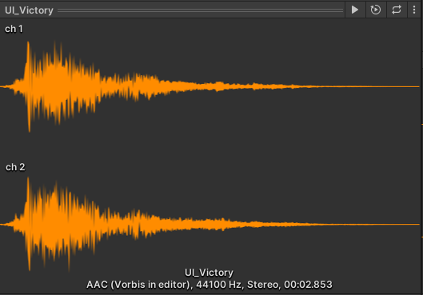

## 快速上手项目的几件事

1：上手一个项目，首先可以看游戏测试场景（一般会把游戏中用到的资源放到 Objects 场景下，进行测试观察）。

2：可以分类查看资源，看看项目中的资源情况（一般也就是看个多少）。、

3：查看 graphic setting 相关设置。

比如前向渲染还是延迟渲染，垂直同步是否关闭，shader 启用情况等。

4：打包到手机上，连接 profile，查看渲染三角形等 status 信息。

## audio

### Mono 和 Stereo

mono 单声道，stereo 立体声。

在 unity 中两者显示不同：

在左右两个声道音频完全相同的情况下，不如直接开启 force to mono 。

### 压缩

可以看到气泡中的原始大小和导入大小以及压缩比例。

一般极可能使用未压缩的 wav 文件作为源文件。

- PCM（未压缩格式）
    
    特点：无损音质，文件体积大。适合对音质要求极高的场景（如音乐游戏）。

    优点：无需解码，CPU 开销低，音质最佳。

    缺点：文件体积大，不适合存储受限的移动设备。

    适用场景：PC 或主机平台，存储空间和性能不是主要限制时的短音效（如 UI 声音），因为文件小且无需解码。

- ADPCM（有损压缩）

    特点：轻度压缩，音质接近 PCM，但文件大小显著减小（约为 PCM 的 1/4）。解码效率高，适合实时解码。

    优点：音质较好，解码开销低。

    缺点：压缩率不高，文件仍较大。

    适用场景：主机和 PC 平台，尤其是对音质要求较高的场景的中等长度的音效（如环境音、对白）。

- MP3（有损压缩）

    特点：高压缩率，文件体积小。解码效率较低，可能增加 CPU 开销。

    优点：文件小，适合长音频。

    缺点：音质损失明显，解码开销较高。

    适用场景：PC 和主机平台，适合背景音乐或长音频。不推荐用于移动端（解码效率较低）。

- Vorbis（有损压缩）

    特点：开源格式，压缩率高，音质优于 MP3。Unity 中常用的压缩格式，支持多平台。

    优点：音质好，文件小，跨平台支持。

    缺点：解码效率稍低于 ADPCM。

    适用场景：PC、主机和移动端，适合背景音乐或长音频。

- AAC（有损压缩）

    特点：比 MP3 更高效的压缩算法，音质更好，文件更小。广泛支持于移动设备和主机平台。

    优点：音质与文件大小的平衡较好。

    缺点：解码开销较高。

    适用场景：移动端和主机平台，适合背景音乐或长音频。

- Opus（有损压缩）

    特点：新一代音频格式，压缩率高，音质优异。支持动态比特率调整，适合网络传输。

    优点：音质与压缩率的平衡最佳。

    缺点：部分平台支持有限。
    
    适用场景：移动端和网络游戏，适合语音聊天或动态音频。

- HE-AAC（高效 AAC）

    特点：针对低比特率优化，适合流媒体和移动端。

    优点：低比特率下音质较好。

    缺点：解码开销较高。

    适用场景：移动端，适合低带宽环境。

在 Unity 中，可以通过 Audio Import Settings 设置音频的压缩格式和质量：

Load Type：
- Decompress on Load：适合短音效，减少解码开销。
- Compressed in Memory：适合中等长度音频，节省内存。
- Streaming：适合长音频（如背景音乐）。

Compression Format：
- PCM：无损音质，适合短音效。
- Vorbis：适合背景音乐。
- ADPCM：适合中等长度音效。

Quality Slider：设置压缩强度（通常 50%-75% 是较好的平衡点）。

### 采样率

音频采样率指的是每秒钟采样的次数，单位为 Hz（赫兹）。

- 44.1 kHz（44100 Hz）

    特点：CD 级音质，适合大多数音乐和高质量音频。是最常见的采样率，广泛用于音乐和游戏音频。

    优点：音质较高，适合背景音乐和复杂音效。兼容性好，几乎所有设备都支持。

    缺点：文件大小较大，解码开销稍高。

- 48 kHz（48000 Hz）

    特点：广泛用于电影、视频和高质量音频。比 44.1 kHz 略高的采样率，音质差异不明显。

    优点：更适合与视频同步（如游戏中的过场动画）。高端设备支持良好。

    缺点：文件大小和解码开销比 44.1 kHz 略高。

- 22.05 kHz（22050 Hz）

    特点：采样率减半，适合对音质要求不高的场景。文件大小和解码开销显著降低。

    优点：文件小，适合存储空间有限的移动设备。解码效率高，适合短音效或低端设备。

    缺点：音质明显下降，尤其是高频部分。

- 16 kHz（16000 Hz）

    特点：常用于语音音频（如对话、语音聊天）。文件大小和解码开销进一步降低。

    优点：适合语音内容，音质足够清晰。文件小，解码效率高。

    缺点：不适合音乐或复杂音效，音质较差。

- 8 kHz（8000 Hz）

    特点：常用于电话语音或极低音质需求的场景。

    优点：文件极小，解码效率最高。

    缺点：音质非常差，仅适合语音或简单提示音。

一般使用 44.1 kHz，短音效可以采用 22.05 kHz。一般移动平台 22.05 kHz 就够用了。

采样率可以覆写。

### 加载方式

- Decompress On Load : 音频文件在加载时会被完全解压缩到内存中。
        
        播放时无需解码，性能开销最低。
        适用于小于 200 kb 的需要频繁播放的简短音效（如 UI 声音、按钮点击、爆炸音效等）。
        如果音效文件较大，可能导致内存占用过高，尤其是在移动设备上。

- Compressed In Memory : 音频文件以压缩格式存储在内存中，播放时实时解码。

        适合那些需要频繁播放但文件较大的音效。
        超过 5 秒，或者大于 200 kb 的复杂音效（如环境音、对白、较长的音效）。

- Streaming : 音频文件不会完全加载到内存中，而是以流式方式从磁盘或存储中逐步加载。

        播放时边加载边解码。
        较长较大的音乐文件，用流式加载避免载入时卡顿。
        会有额外 CPU 开销，但是值得。

### 静音做法

最好不要只是将音量设置为 0，而是把 audio source 清除。