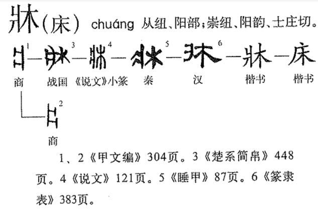

[说文解字（全 77 讲）万献初〈附音韵学〉_哔哩哔哩_bilibili](https://www.bilibili.com/video/BV1Kb4y127uR/?spm_id_from=333.1245.0.0&vd_source=386bdb94ff2a430f8d22a6de9755030c)

周礼八岁入小学。是说文解字的序中的一句。说的是小孩子从八岁开始识字。其实从六岁就开始了，一直到十二岁，有的到十五岁。到了明清，小学的内容就是三百千千：三字经，百家姓，千字文，千家诗。古代的小学和现代的小学虽然都教语文，但是古代更注重教字为什么这样写、字的由来。
就比如一首静夜思
床前明月光，疑是地上霜，举头望明月，低头思故乡。
其中的床，并不是我们今天所说的睡觉的床，床的写法演替：

诗中的床指胡床，胡床不是睡觉用的，而是指室外坐卧、安放手臂、放置杂物的类似茶几一样的器具。所以李白不是躺，而是支在茶几上。

天地玄黄

大：四肢伸到最大，来表示形容词的大。
大人在下面加一横，就是立。在上面加一横，就是天。
夫：大人二十行冠礼，把头发盘在头上，所以出头。

它：上古指蛇。上古草居患它，故相问无它乎。古人多穴居或草居，以蛇多为患，因此见面时，总是心有余悸地问上一句：有没有碰到蛇？
地：土像蛇一样向四面八方展开，就是地。从也的字都有延展的意思，比如拖，施，逶迤。

玄：首先看丝，两条丝放一起，整整齐齐叫丝，现在抽出一条丝，是不是很细，再在上面加一个盖子，是不是看不清，很玄。

黄：指田地上发出的光。

初：做衣服第一步，用刀裁剪