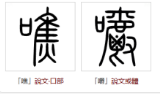
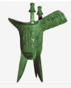
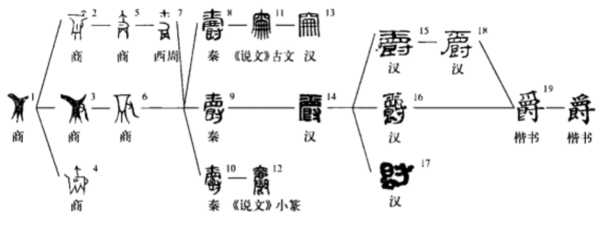

## 嚼
嚼，最初写作噍

焦甲骨文写法中意味着在火上烤挂在树枝上的肉，旁边一个口，意味着用嘴吃烤肉是做出的咀嚼动作。吃烤肉，还是那么大一串烤肉，已经是非常丰盛的一餐了，所以要好好咀嚼，细细品味。

后来人们的吃饭喝酒大型盛宴中，必不可少的喝酒的器具是爵，就是古时候的酒杯

有酒杯有口，放在一起，好好吃一餐。估计是老祖宗想着我们现在不用再使用那么原始的烤肉方法了，换成 B 格更高的酒杯吃饭咀嚼才能凸显高贵。

爵这个字就麻烦了，最早就是象形字，具体演变的理由和类似字的延伸就是知识盲区啊！

还是商代的爵字有意思，一个手托着一个酒杯