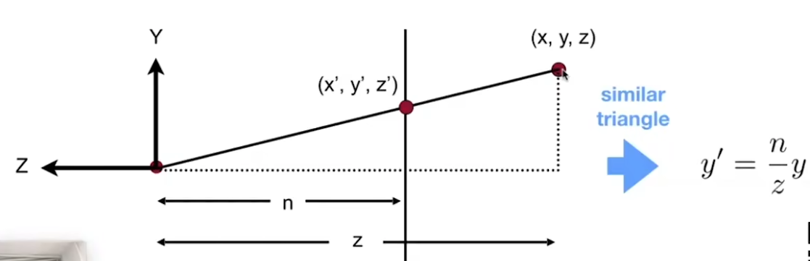
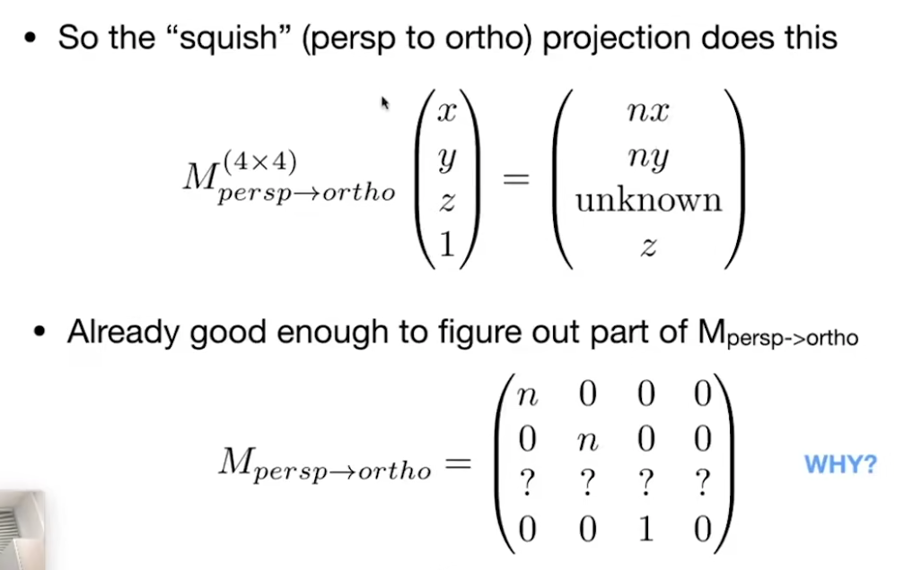
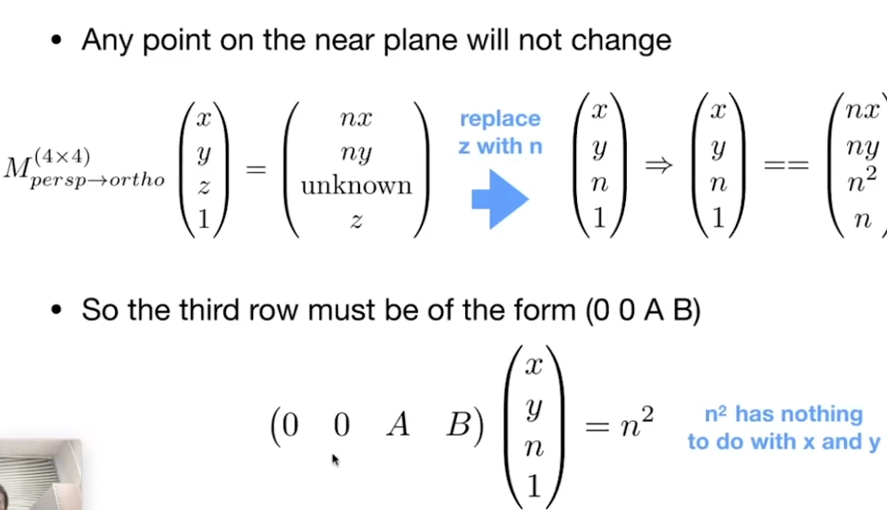
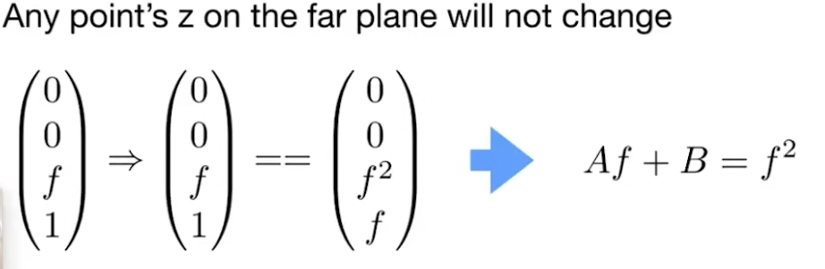
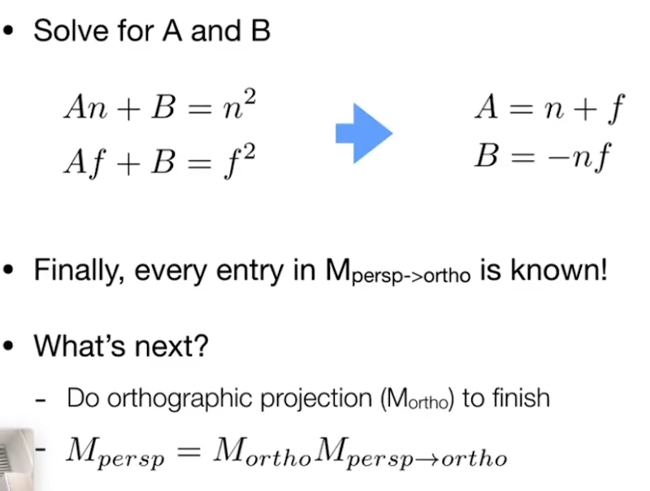

齐次坐标
点：X,Y,1
向量：X,Y,0

## 视图变换
视图变换：将相机放在原点朝-z方向看
1：先平移到原点
2：求出要摆放的轴旋转到相机本身的轴的矩阵
3：这个矩阵求逆，就是相机需要做的旋转

这个变换整体也是场景需要做的变换

## 正交投影
将视图范围立方体归一化为正交需要的立方体。
先进行中心平移到原点，其实就是相加/2，然后再缩放，-1到1是2，也就是2/相加

## 透视投影
将透视范围的截头锥体，挤成长方体，当然这个挤，一定是除了近平面所有都要往里挤，然后我们再应用正交投影就解决了问题。

1：近平面永远不变
2：近远平面的Z不变，只是在这个平面内向里面收缩
3：中心点不变

1：从侧面看，通过相似三角形可以求出xy对应关系，进一步求出矩阵的三行

2：近平面，xyz都不变，可以求出一个关系

3：远平面，中心点不变，可以求出一个关系

4：求解
