# 画家算法

先画距离最远的物体，然后一点一点往近处画，一次一次覆盖远处物体，类似油画家的作画。

看起来是没问题的，但不是总生效的，比如经典的三角形相互遮挡问题。

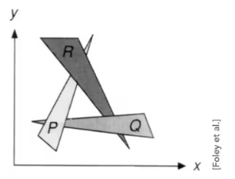

这种情况下三个三角形互相遮挡，没办法定义谁更深，谁更浅，谁要覆盖谁，就不能采用画家算法。

## Z-Buffer

既然没办法判断三角形整体深度，那就判断三角形所占像素的深度，比如一个三角形占用了 N 个像素，每个像素各自深度进行画家算法覆盖判断。这听起来就像是把一个大的问题分解成许多小问题，把一个大的三角形，拆解成许多小方块儿。

对单个像素来说，逐步记录深度。如先画地板，先记录地板深度，物品来了后，比对物品的深度和记录的深度，发现物品深度小于记录的地板深度，说明物品要遮挡住地板。

使用这种方法最后会得到一张像素级别的深度图，这张深度图大小跟渲染图是一样大小的。

其实，这种方法并没有解决相互遮挡的问题，比如真的就有两个深度相同的像素，依然不知道谁要覆盖谁。现在我们暂时假设不存在深度相同的像素。实际情况中，在浮点数的表示中，两个浮点数完全相同的概率很小。（实际上会有相同深度的，但本课中暂不考虑）（透明物体 Z-Buffer 也处理不了，需要其他方法处理，暂不考虑）

注意！如果你使用了 MSAA 超采样了，深度图其实是对应采样点的深度信息，也就是那四个采样点的深度分别计算！也就是这种情况下的深度图是普通着色流程的 4 倍。

# 着色

根据光照、材质等信息，为场景中每个点（通常是每个像素或每个片元）计算最终颜色的过程。

换句话说：着色决定“画成什么颜色、亮多亮、什么质感（金属、塑料、皮肤等）”。

# Blinn-Phong 光照着色模型

镜面反射 + 漫反射 + 全局常亮光照

## 局部着色

不考虑其他物体的存在造成的影响，只考虑当下要渲染的那一个点的光照，以及围绕这个点所产生的 单位法向量，单位光照方向向量，单位观测方向向量，以及这个计算中产生的 Blinn-Phong 模型。这叫局部着色，这一步不会考虑阴影，也就是不会考虑其他物体遮挡光照投射到物体身上的过程。

# 光的能量

同样的光，以不同角度照上去，明暗不一样

物体表面法向量 n 和光源方向 l 的夹角 θ，决定了明暗强度

可以把光当成能量，吸收的越多越亮

# 能量守恒

光的能量都集中在一个球壳上，一开始球壳的表面积很小，考虑到能量守恒的话，那么单位面积上光的能量就很多，光越向外扩散，单位面积的能量就越小

通过球面公式可以计算出，距离光源为 r 的球壳上，单位面积上能量为 I/r²

## 疑问

目前来说似乎能量守恒没有考虑观察点到物体表面的距离产生的影响，这一部分涉及到辐射度，之后再说

# 漫反射公式

I/r² 表示有多少光到达了 ShadingPoint（因为光会随着传播距离而衰减）

Kd 表示了该点颜色的反射率

- 如果 Kd = 0，那么该点完全没有反射光出去，该点吸收了所有光，那么该点表现黑色
- 如果 Kd = 1，那么该点反射了所有光，那么该点表现为白色
- 如果用 RGB 三个通道表示 Kd，那么 Kd 就是 Color

Max（0，n·l）表示反射角度，nl 都是单位向量，n·l = cosθ，当入射光从表面下面照入，θ > 90°，cos < 0，这种情况没有意义，因为我们只考虑反射光，不考虑折射等光线穿透，所以需要和 0 比，取最大值

漫反射和观测方向无关

# 着色点

着色是在某一个 shading point 上，在对应一张图，大概就是这么一个点，在这个点上来计算它，然后要想得到一整张图，那我们势必要应用这个着色很多次。

着色的频率是个问题

# 高光

当观察方向接近镜面反射方向的时候  <=>  法线方向 n 接近于 半程向量 h

Phong 模型求 R 和 V 的接近程度

Blinn-Phong 模型 巧妙地把 R 和 V 的接近程度 转换为 n 和 h 的接近程度

知道两个单位向量 l 和 v，求他俩的角平分线向量很简单，将两个向量相加，并求归一化

## NH 项的指数容忍度

向量之间的夹角余弦确实可以衡量两向量是否接近，但容忍度太大了

在一次幂的cos曲线下可看到，当夹角很大时，仍然有很大的值，这样生成的高光就会很大

正常情况下，我们认为高光都是很小很亮的

随着指数增加，能看到在大约0~30°之内才可以看到高光，这样就算一个合理的模型

在布林冯模型下，一般来说，指数选在100~200之间，高光角度大约在3~5°之间，算是比较真实的

## KP

纵向来看，反射系数Ks越大，高光越亮

横向来看，指数p越大，高光越小

# 环境光

一个茶杯，在光源并没有直接照射的方向上也有一定的亮度，因为一个光线可以弹射很多次，从四面八方打到任何一个点，这些光照就算是环境光照

由于环境光照非常复杂，这里我们假设一个点受到的环境光照永远都是相同的，强度称为Ⅰa

任何一个点都有自己的颜色，Ka相当于环境光的系数

可以近似的得到一个环境光La = KaⅠa

# 布林冯反射模型公式

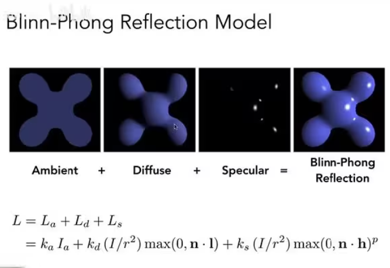

# 缺点

如果有一个凹进去的点，按理来说其不应该有那么强的环境光照射，但是按照这个公式来看，就是会导致有光。

# ShadingFrequencies 着色频率

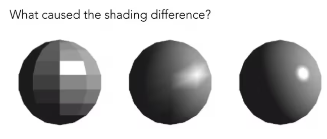

FlatShading（面着色）：三角形面作为法线计算的依据！

GouraudShading（顶点着色）：三角形顶点作为法线计算的依据！

PhongShading(像素着色)：phong 着色，并非 blinn-phong 着色

三种着色频率产生的效果也取决于模型本身

每一行的模型本身顶点数是一样的，越往下顶点数越多

当几何足够复杂时用FlatShading得到的效果也很好

反过来说，当几何的面数大于像素数量时FlatShading的性能也不会好于PhongShading

# 如何求逐顶点的法线

将和顶点相邻的面的法向量做加权平均

如何求顶点相邻的面（几何信息会告诉你）

# 如何求逐像素的法线

已知顶点法线，如何求中间某一点的法线---->插值、重心坐标

# 渲染管线

顶点处理：将三维空间的点投影在平面上

三角形处理：将这些点连接形成三角形

光栅化：将三角形离散成为屏幕上的 Fragment（未经处理的像素）

着色：给像素上色

后处理：深度缓冲-处理遮挡关系，MSAA等抗锯齿

## 实例

MVP变换 --- 顶点处理：MVP变换本质上就是将不同的顶点进行变换

对像素采样 --- 光栅化

判定fragment是否可见 --- Fragment处理：Z-Buffer 深度测试

Shading --- 顶点 或 像素处理：如果用的是GouraudShading，那么进行的就是顶点处理；如果用的是PhongShading，那么进行的就是像素处理

# Shader

现代GPU中，这套渲染管线某些部分是可编程的，可以由开发者去定义顶点/像素如何着色

也就是用代码控制如何着色

这部分代码就叫Shader

Shader指定的是每一个像素/顶点如何着色，所以不能也不用去指定某一个像素如何着色

如果写的是顶点操作，这个shader就叫做VertexShader（顶点着色器）

如果写的是像素操作，这个shader就叫做FragmentShader（片段/片元着色器）/PixelShader（像素着色器）

# 纹理映射

我们希望得到一个三角形，三角形里面映射了一张图片，怎么得到？ 

以球来说，我们发现不同位置有不同颜色，球整体其实公用同一个着色模型，唯一区别就是漫反射系数Kd不同

我们希望有一种方法，可以定义一个物体上任意一点的基本属性

3D物体的表面其实都是2D的，比如地球仪，将地球仪上的图撕下来，可以平铺成一张2D的图

物体的表面，通过这种方式可以和一张图有一一对应的关系，这张图就叫纹理

将这张图平铺/裁剪/拉伸到任何物体表面，就叫纹理映射

空间上模型的三角形怎么对应到纹理上的三角形？

由美术同学提供

纹理上的坐标系通常以UV来表示

通常约定U和V的范围[0,1]

当纹理不断重复贴到模型上，可以得到不错的效果，虽然看纹理效果可以看到两张纹理之间有很明显的变化，但是在场景中很自然的无缝衔接

说明这个纹理本身设计的好，这种纹理叫TilableTextures  王氏砖

这种纹理的设计也是很值得研究的

纹理和着色的区别：纹理可以理解为一个底色

# 插值

## 为啥需要插值？

因为我们要表现顶点中间位置像素信息

## 插值的值都有哪些？

颜色，法线

## 怎么做插值？

重心坐标

# 重心坐标

在三角形ABC所在的平面中任意一点（x，y），都可以用三角形三个顶点的线性组合来表示

ABC 顶点前面的系数 α + β + γ = 1  这样其实就是说其实两个数确定了，第三个数也就确定了，很合理，因为二维坐标，就应该两个数确定。

（α ， β ， γ）可以用来描述此三角形的重心坐标

如果点在三角形内，会符合另外一个条件 α  β  γ 都必须 ≥ 0

设三角形内一点，点P，连接PA，PB，PC，会形成三个小三角形Aa，Ab，Ac，P的重心坐标就是小三角形面积占大三角形面积的比

α = Aa/(Aa + Ab + Ac)

所以可以求一个特殊的点，三角形重心，三角形重心将三角形划分为三个等面积的小三角形。

所以三角形重心的重心坐标为

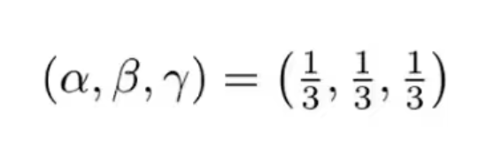

## 投影变换性质

对于三维空间中的点，不能保证其被投影后的重心坐标不变

如果想插值三维空间中的属性，就应该插值三维空间中的坐标。

因为在做光栅化时，需要知道像素中心在三角形的什么位置，此时不能直接求重心坐标进行插值

需要将该点重新投影回三维空间中，在三维空间中计算重心坐标插值

这一点你想想深度就知道了，就是应该在原来的未投影的三角形上求

# 纹理插值

屏幕上的采样点（x,y）可以用重心坐标算出在纹理中采样的uv，得到对应纹理

# 第一个问题：纹理放大

当低分辨率纹理应用到高分辨率的屏幕上，纹理就会被拉大。

## Nearest

对于任意一点，可以找到对应纹理上的位置，位置可能不是整数，将位置坐标四舍五入，然后取纹理上的值

这样的话，一个texel就可能会被映射到多个pixel上，也就说可能在3*3的像素内用了同一个纹理的元素（texel）

这样就会产生马赛克效果如图 Nearest

## 双线性插值

先用U01  U11插值出来U1

再用U00 U10插值出来U0

再把U0和U1进行插值，得到红点的最终值，即为双线性插值

之所以叫双线性，是因为水平和竖直都用了插值（水平两次，竖直一次）

## Bicubic

Bicubic 是将周围 16 个进行立方插值

每次用四个做一个这个三次的这个差值

似乎不是线性插值，这里，有一种权重的感觉。

## 三种插值比较

# 第二个问题：纹理缩小

如果直接简单的使用线性插值进行采样会得到右图，远处有摩尔纹近处有锯齿

远处的一个像素就会覆盖很大一片的纹理区域，单纯以像素的中心是标准取纹理的值是不对的

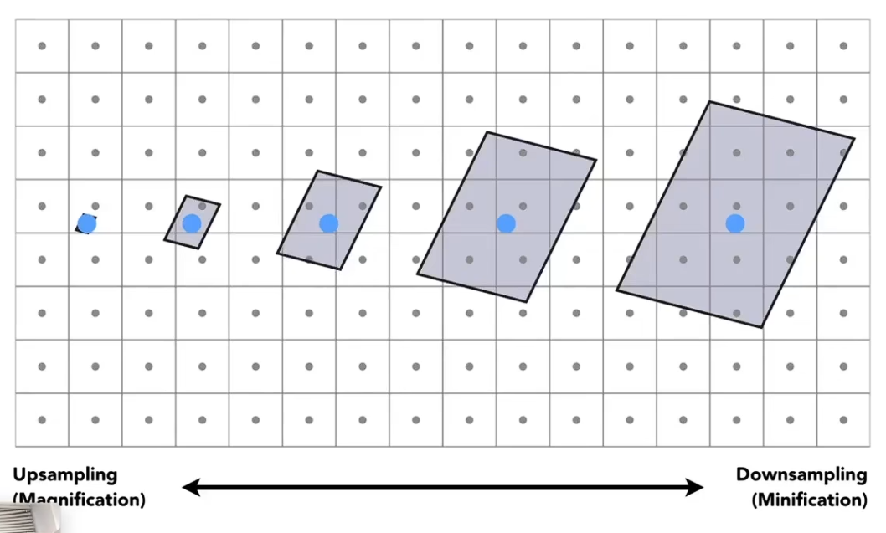

这其实就是转变为了采样率不足的问题，之前解决采样率不足的问题我们可以使用SSAA，每个像素内分为若干小像素进行采样。

以512个小像素为例，得到的结果如下图

正确，但花费了512倍的性能

既然采样有问题，那我们如果可以直接查询而不采样呢？

这里涉及到算法问题，我们之前采样换成算法说法，叫点查询

而现在我们点查询包含了太多的采样点了，我们想求出这个点所包含范围的平均值，这个叫平均范围查询，算法中还有最大最小范围查询。

## Mipmap（多级渐远纹理）技术

将原纹理提前用滤波处理得到很多更小的图像，当物体远离相机时，直接查询较小的纹理，得到正确的结果像素

Mipmap就可以实现我们需要的查询，但仅仅是近似的、正方形的查询

因为生成了多个较小的图像，需要额外储存生成的小图像

所以Mipmap占用的额外空间是原来的1/3

这是一种典型的空间换时间的思想

把第零层复制三份，放在 1,2,3 位置，剩下的位置正好够下面的用

把第一层复制三份，放在 4,5,6 位置，剩下的位置正好够下面的用

无穷收敛，正好，可以填满这张图，然后我们知道我们其实都复制了三份才填满了图形，所以实际上，我们只用了 1 / 3 。

### 如何得知我需要查询第几层

要查询在屏幕空间内的某像素，映射在纹理空间内占多大区域

可以将自己中心和邻居的中心分别投影到纹理空间内，这样就能知道在纹理空间中，该点和邻居点之间的距离L，要求的区域可以近似为以 L 为边长的正方形区域

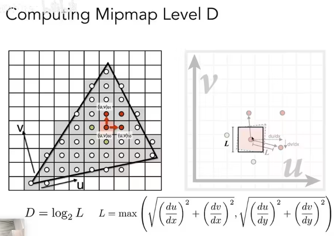

如果我们的 L 就是一个单位分辨率的，那我们可以说，我们就在第 0 层 查询就可以了。

如果正好是 2 * 2 那说明我们正好使用第 1 层就可以。

### 不是整数层怎么办

实际情况不可能那么恰好，我们可能得到的结果是 1.8 层

如果简单的一刀切， 0 - 1 使用第 0 层 1 到 2 使用第 1 层，那么会出现很明显的切换 mipmap 的 “裂痕”。

使用三线性插值，在上下两层去选取周围四个点插值，然后再对两层的结果插值。

题外话：我们不能控制看的，但是至少控制下我们纹理图要是 2 的次幂

### 不规则映射导致的模糊

运用上述 Mipmap 后，在远处产生的图像很模糊，因为Mipmap是近似的、正方形的查询

只能查询正方形区域，而且三线性插值也是近似

屏幕上的像素映射到纹理上不一定是正方形，对于不是正方形的Mipmap就无法处理。

如下图，对于右边不是正方形但是是比较规则的矩形

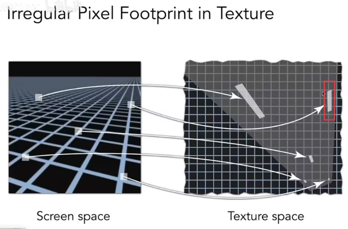

注意红框内就是各向异性可以完美处理的标准情况

### 各向异性过滤

将原图宽度不变长度压缩，长度不变宽度压缩就可以提供矩形的查找，即为各向异性过滤

经常看到的各向异性过滤 x2 x4等，指的是要生成多少层的压缩图，x2 就是一层，x4 就是两层。

大家会发现这个随着这多少 x 逐渐往上增加，这个最后的结果会逐渐收敛到总存储的三倍，也就是说各项异性过滤它的存储量，其实来说你开多少 x 这个其实关系不大

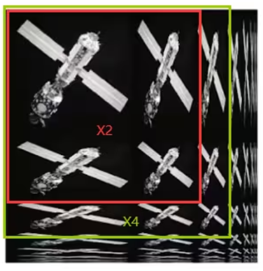

但各向异性过滤也只是能解决映射在纹理空间是比较规则的矩形的情况，当出现不规则矩形的时候也无法处理

不过实际应用中各向异性表现还可以

### EWA 过滤

EWA过滤可以将任意形状拆分为很多大小不同的椭圆，经过多次查询，就能查询出最终的结果。

但是代价也是需要多次查询的时间

具体有兴趣去了解

# 纹理的其他应用

纹理本质上就是提供了一个快捷的查询，不只局限于图像，光照也能同理进行查询

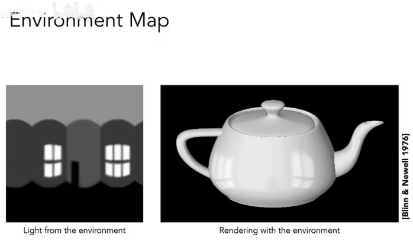

光照贴图认为光照是无限远的，忽略了光的位置信息

# 怎样描述环境光？

如果在房间中有一光滑的金属球，我们观察他就会发现它反射出来的就是环境光。

那我们就可以把环境光储存在球上面，并且也能把它展开成平面

但展开后发现球形图的上下会扭曲。

虽然我们能描述球上不同的位置，但无法均匀的描述

所以我们可以将信息记录在这个球的外接立方体，这样信息就变得均匀了 CubeMap

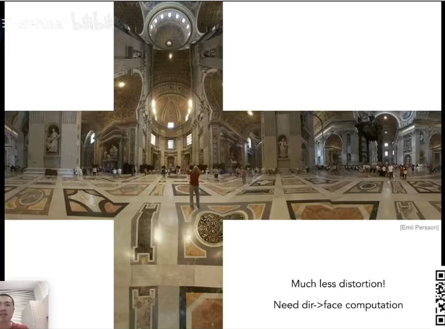

# BumpMapping -- 法线贴图

法线贴图是为了在不增加三角形面数的情况下，在着色时显示更多细节

对某一点进行着色时，需要判断该点的法线方向，从而计算光照和颜色

需要从原本的模型表面映射到法线贴图中，查询新的法线位置

法线贴图和凹凸贴图 这两个 到底有何不同？

## 法线贴图如何知道法线的方向呢？

先看一维中的简单示例：先算该点切线

- 切线可以用该点与下一个点的位置差计算出来
- 将切线逆时针旋转90°，求归一化，得到法线

## 二维的贴图（3D空间）中如何求法线？

对 u、v 坐标分别求导，算出切线，旋转得到法线（我也奇怪，这里是不是叉乘就可以了，弹幕有说 tbn 矩阵，有说因为是笛卡尔坐标系会有啥影响啥的）

这里的发现在本地坐标系 0，0，1 具体作业三会有详细

# 位移贴图

法线和凹凸贴图在两个地方会露陷

- 边缘的地方
- 自己的这个几何相对复杂会产生自己的阴影，投影到自己的这个情况

他们实际上没有改变几何，但是通过这种方法欺骗人的眼睛，让人觉得这里面这个法线的变化会有这种这个凹凸的感觉

位移贴图实际上改变了各个三角形的顶点位置

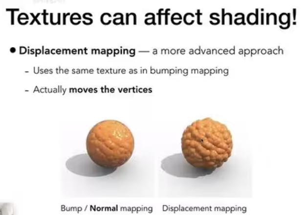

## 限制

要求本身模型就足够精细才能达到不错的效果。

因为它本质上是要去改变三角形顶点位置的，如果本身模型就很少量的三角形，它变出花儿啦都不行。

## 突破限制

我就是不想做那么精细又想达到不错的效果，有办法么？

我们能不能在做的时候分析出来这个三角形需要继续拆分变小，来满足我的需求

dx 的动态曲面细分。

# 三维纹理

纹理存储的不再是普遍意义上的图，而是可以通过公式计算进行信息展开，来实现各种效果

# 环境光遮蔽

环境光遮蔽也能预先计算好，存储到纹理中