- [阴影](#阴影)
  - [shadow mapping](#shadow-mapping)
    - [经典阴影映射](#经典阴影映射)
    - [软阴影](#软阴影)
  - [阴影走样](#阴影走样)
- [光线追踪](#光线追踪)
  - [光栅化问题](#光栅化问题)
  - [光线追踪问题](#光线追踪问题)
  - [光线是什么呢？](#光线是什么呢)
  - [光线投射](#光线投射)
  - [Whitted-Style](#whitted-style)
    - [实现的难点](#实现的难点)
    - [第一个难点：交点](#第一个难点交点)
      - [和球相交（隐式表面）](#和球相交隐式表面)
      - [一般隐式表面](#一般隐式表面)
      - [一般显示表面](#一般显示表面)
        - [光线和三角形求交：平面法](#光线和三角形求交平面法)
        - [光线和三角形求交：Moller Trumbore Algorithm](#光线和三角形求交moller-trumbore-algorithm)
        - [光线和物体求交：暴力法](#光线和物体求交暴力法)
        - [光线和物体求交加速：Bounding Volumes](#光线和物体求交加速bounding-volumes)
    - [第二个难点：怎么判断这个光线投射出去会打到哪里（加速 AABB 求交）](#第二个难点怎么判断这个光线投射出去会打到哪里加速-aabb-求交)
      - [空间划分！](#空间划分)
        - [Oct-Tree](#oct-tree)
        - [KD-Tree](#kd-tree)
        - [BSP-Tree](#bsp-tree)
        - [空间划分的问题](#空间划分的问题)
      - [对象划分](#对象划分)
    - [第三个难点：Radiometry 辐射度量学](#第三个难点radiometry-辐射度量学)
      - [Radiant energy](#radiant-energy)
      - [Radiant flux](#radiant-flux)
      - [三种光度测量](#三种光度测量)
        - [Intensity](#intensity)
        - [Irradiance](#irradiance)
        - [Radiance](#radiance)
      - [BRDF 反射方程](#brdf-反射方程)
        - [递归问题](#递归问题)
      - [渲染方程](#渲染方程)
        - [入射光](#入射光)
        - [简写](#简写)
        - [多次弹射](#多次弹射)
      - [概率](#概率)
      - [蒙特卡洛积分](#蒙特卡洛积分)
        - [黎曼积分](#黎曼积分)
      - [路径追踪](#路径追踪)
        - [蒙特卡洛解渲染方程](#蒙特卡洛解渲染方程)
        - 

# 阴影

之前我们提到局部着色，只考虑着色点，光源，摄像机。完全不考虑其他物体甚至这个物体本身对着色点的影响

不渲染阴影会感觉所有东西都在浮空，阴影会给人物体和物体接触的感觉

## shadow mapping

如果点不在阴影里，你又能看到这个点，那说明什么呢，说明你可以从摄像机看到这个点，并且光源也可以看到这个点。如果这个点在阴影里面，那就说明你看得到这个点，但是这个光看不到这个点。

### 经典阴影映射

经典的 shadow mapping 只能处理点光源/方向光，这种阴影通常有非常明显的边界。这个阴影的边界说明什么呢，要么这个点在阴影里，要么这一点就不在阴影里，就是一个非零即一的过程啊，这种阴影我们管它叫硬阴影。

1. 从光源看向这个场景（光源就像个摄像机）：从光源看向场景，记录你看到的任何点，它的深度是多少啊，即深度图。
2. 从相机看向这个场景：同样记录深度图
3. 将相机看到的深度图上的每一个点 A，映射回光源深度图对应的像素 P，计算这个点 A 到光源的深度，和像素 P 记录的深度，如果 深度 A 大于 深度 P 说明这个点和光源之间有物体遮挡，如果 深度 A 等于 深度 P 说明这个点可以被光源看到

第一步：光源看到的深度图

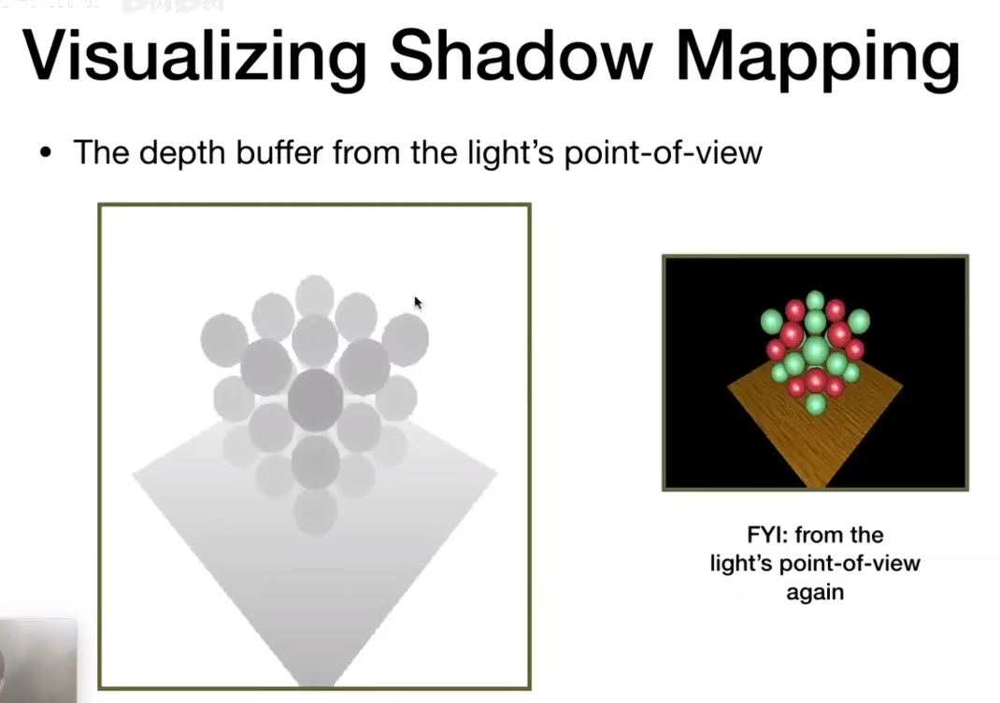

第二三步：摄像机看到的深度图和光源比对

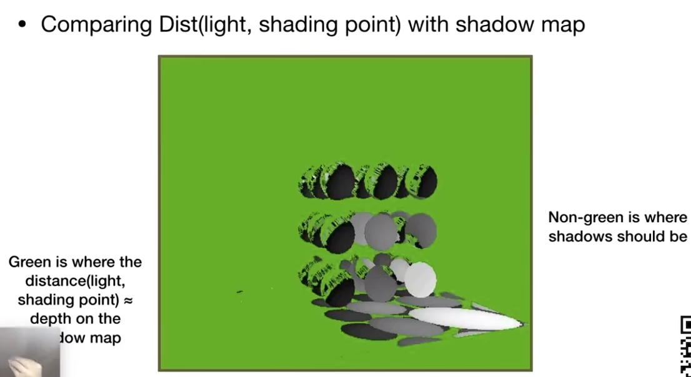

你会发现，按理说我们得到的是非零即一的结果，为什么还会有这种脏脏的点在呢？

1. 浮点数精度问题，导致我们判断深度相等时会有误差
2. 观察角度不同导致一个像素可能涵盖很多个点，具体如何取到点去重新映射到光源这件事情也是会有误差的。

- 可以用范围判断，引入可接受偏差，但是还是会导致各种各样的问题。
- 还有一个问题是，这两张深度图的精度问题，如果光深度分辨率很大，而渲染的图很小或者相反，都会造成不真实问题。
- 两张图，两趟渲染

### 软阴影

光源有大小，具体从光源的哪里去生成深度图也是一个问题。

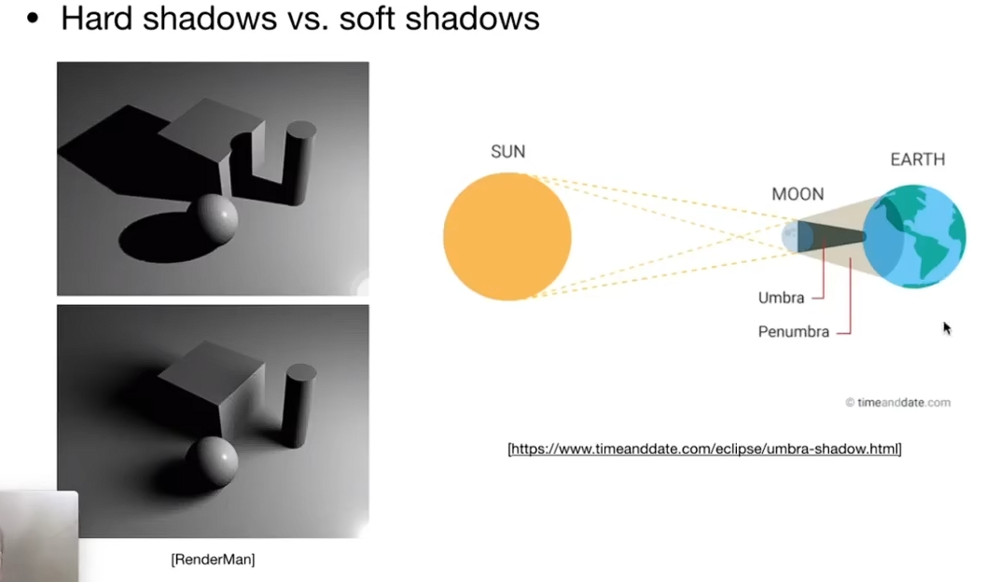

越靠近物体根部接触的地方它越硬，然后越靠近这个就越远离物体这个根部越软。

完全看不到光源叫做本影（Umbra），部分看到光源是半影（Penumbra），阴影程度取决于有多少或者说你能够看多大的光源，对于点光源确实是不可能出现软阴影的，就是说如果有软阴影，一定是因为光源有一定的大小

光栅化实现软阴影主要思路是对硬阴影做近似过滤（在边缘区域“渐变”）

## 阴影走样

# 光线追踪

光线追踪和光栅化是两种不同的成像方式。为什么要引入光线追踪呢？光栅化有些问题解决的并不好，最大的问题：全局效果 (global effects) 表达不佳。

## 光栅化问题

- 光栅化做阴影比较困难
- Glossy 反射 （类似古代铜镜的反射：反射 + 粗糙）
- 光栅化只弹射一次光线，很难模拟多次弹射的室内场景（间接光照）

光栅化本质上来说它是一种快速的近似，质量相对较低。

## 光线追踪问题

- 非常慢（离线）

完完全全符合物理规律，最真实的渲染结果

## 光线是什么呢？

- 光线是沿着直线传播的（光线其实是一种光波，有波动性，在一定程度上我们需要考虑波动性质，这里忽略）
- 光线和光线不会发生碰撞（不对但是还是这么假设）
- 光线可逆性（你凝视着深渊的时候，深渊也在凝视着你）

## 光线投射

从相机出发做光线的投射：对于每一个像素，从摄影机连一条线穿过这个像素，然后就可以打出去一根光线（eye ray / camera ray），和物体发生相交，然后再把这个交点和光源做一个连线，判定这个点是不是对光源也可见，也就是说判定他是不是在阴影里。如果他不在阴影里，也就是光源也可以照得到它，那就形成了一条有效的光路，从光源到这个点，再到我的眼睛，就可以计算这条公路上带的能量，自然就可以把最后的颜色算出来，这步就是着色。（前提假设，眼睛是一个点，而不是有大小的摄像头接收；光源也假设是一个点光源；进行完美的反射）

- 因为我们从像素出发投射到最近的物体了，这一步已经做好了深度测试，这比光栅化深度测试简单太多了。
- 相交之后一定能拿到交点和交点法线，然后与光源连线，就可以得知这点是否被照亮，如果被照亮，也可以直接计算出着色颜色（LNV 都有了）。

这个时候还是只做了一次光线弹射，得到的效果和光栅化类似

## Whitted-Style

递归算法

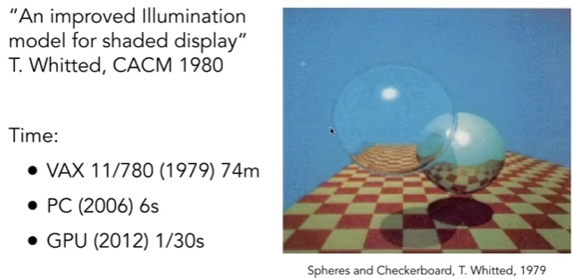

左边这个球基本上是在做折射，右边这个球基本上是在做反射。

生成这一帧
- 1979：74 分钟
- 2006：6s
- 2012：1/30
- now：1/N000

反射 + 折射 => 相交的所有点和光源判定着色 => 在能量损失前提下计算着色

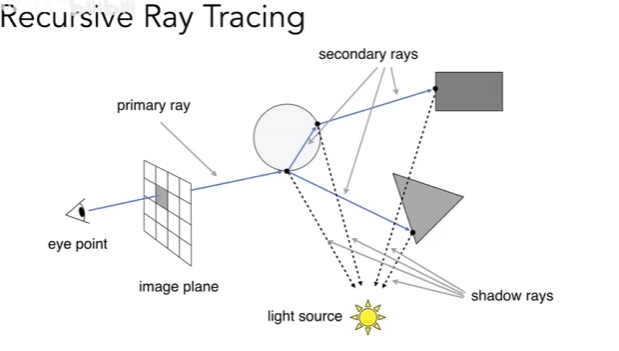

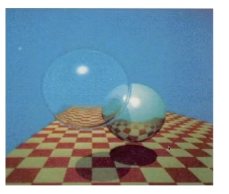

尤其看透明玻璃球那里，阴影要淡很多，不难想象，这是相机通过这个点折射到玻璃球能获取更多相交点，也就能从光源获取更多能量。

### 实现的难点

- 交点怎么求
- 怎么判断这个光线投射出去会打到哪里
- 怎么求反射光的方向和折射光的方向以及他们各自带的能量，衰减又应该怎么算

### 第一个难点：交点

数学上的光线定义：起点 o，方向 d, 交点 p。p = o + td (0 ≤ t < ∞)

#### 和球相交（隐式表面）

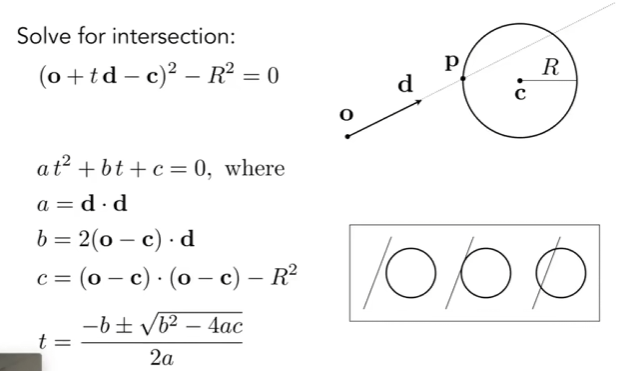

#### 一般隐式表面

- 一定是实数不是虚数
- t 是时间，一定是正数

能拿到隐式表达，一定可以解出 t 的

#### 一般显示表面

在纸上随便画任何一个封闭的一条曲线，比如画一个正方形、圆形，然后在这个形状内部点一个点，然后随便往哪个方向去打一根光线出去，然后判断这个光线和这个物体有多少个交点，你会发现一个很神奇的现象，如果你点的这个点是在这个形状内的，你得到的交点数量一定是奇数。如果是偶数个交点，那一定是在物体外。

问题：光线和三角形求交（忽略光线和三角形完美平行的情况，一定是有一个交点或者没有交点）

##### 光线和三角形求交：平面法

三角形在一个平面内，所以把这个问题分解为两步
- 光线和平面怎么样求交
  - 定义平面：一个法线 + 平面内任意一个点
  - 平面表达式：$(p-p')*N=0$ 平面上的任意线段和法线垂直 展开之后：$ax + by + cz + d = 0$
  - 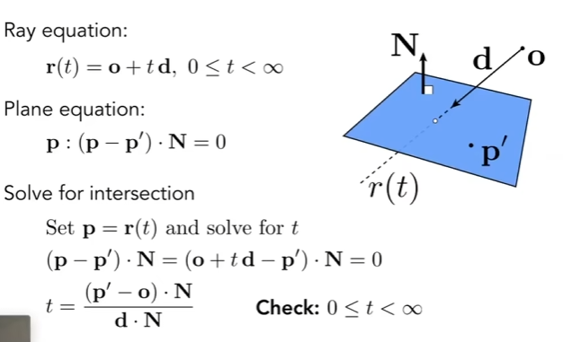
- 找到这个交点之后，再判定它是不是在三角形内

##### 光线和三角形求交：Moller Trumbore Algorithm

MT 算法

如果光线和三角形相交，这个交点一定可以用三角形重心坐标表示。

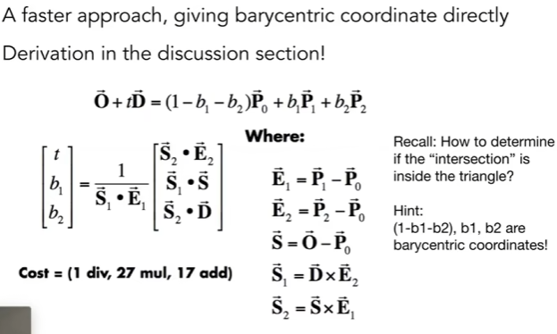

不需要了解算法细节，只需要知道，可以直接输入三角形的三个坐标和光线，就可以直接得出交点是否在三角形内。

##### 光线和物体求交：暴力法

把光线和每个三角形都做一次这个求交，然后再求这个最近的交点

##### 光线和物体求交加速：Bounding Volumes

用一个简单的图形把物体框起来，比如长方体。将其理解为三组对面平面组合成的一个区域。

光线和 AABB 如何求交，先看 2D

- 放宽到直线光线和 2D 长方形 四条线 求交点。可以得到四个交点各自的 t
- 其实和盒子的交线就是分别和两组对线交点线段的交集

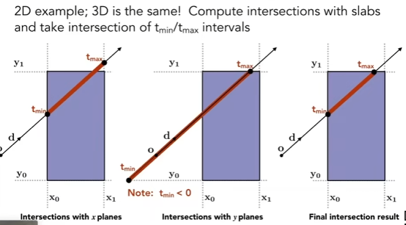

放到 3D 里也是一样，光线分别和三组平面求交点，每组平面都会有一个 tmin 和 一个 tmax。如果光线和长方体有交，那么三组 tmin 中最大的那个，就是它真的进入长方体的时间，而三组 tmax 中最小的那个就是它出去长方体的时间。如果 max{tmin} < min{tmax} 那就是没有交点咯（要想判定一定进入了这个盒子，那必须得确认他进入了这个所有的三个对面，才能说他进入了这个盒子，而光线离开这个盒子，我只需要知道这个光线只要离开了任意一个对面，那他就已经离开了这个盒子）

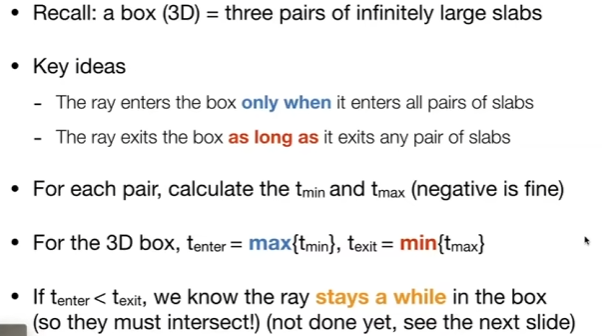

但是我们光线是射线，所以还需要最后判定一下 t 的正负值。

texit 需要大于零

下一步，实际计算，我们会发现 AABB 平行于坐标轴，使用它们做计算非常容易！

### 第二个难点：怎么判断这个光线投射出去会打到哪里（加速 AABB 求交）

求交点我们已经可以使用 aabb 了，但是目前还是对场景中所有的 aabb 进行求交，但实际上光线射出去根本不会和某些物体碰撞，我们为什么不从光线的角度找到应该求交的 aabb 呢？干脆用 aabb 切割场景，然后让光线沿着路线的 aabb 求交，这样节省了很多。

在做光线追踪之前，对场景进行预处理，将场景划分成一个个格子，格子知道自己里面有没有物体，让光线从起点开始与格子相交，没有物体找下一个格子，有物体再看看是否和格子里的物体相交。

- 找下一个格子需要算法，一般我们知道了光线的方向就可以直接找临近的盒子去查询（已解决）
- 格子划分的精细程度需要衡量，太密集盒子求交也许会成为瓶颈，太稀疏相当于没有优化基本还是与场景所有 aabb 求交（未解决）

#### 空间划分！

全是空气的地方就不用那么密集的格子了。

##### Oct-Tree

均匀切分，二维就是两刀切四块，三维就是三刀切八块。

切完没有东西的不继续切，有东西的继续切。

这个不好，很生硬，跟着维度跃升，是 2 的次方。

##### KD-Tree

每次找一个轴去砍一刀，每次都是一分为二，下一次选择另一个轴切分，就是交替切分。保持了一个二叉树的性质。

实际的三角形只存在于叶子节点上

具体计算的时候层级遍历，如果有交点，就要考虑其中的所有可能，直到到达叶子交点（就要和其中的物体全部求交点）或者没有交点（那就不用去咯）。

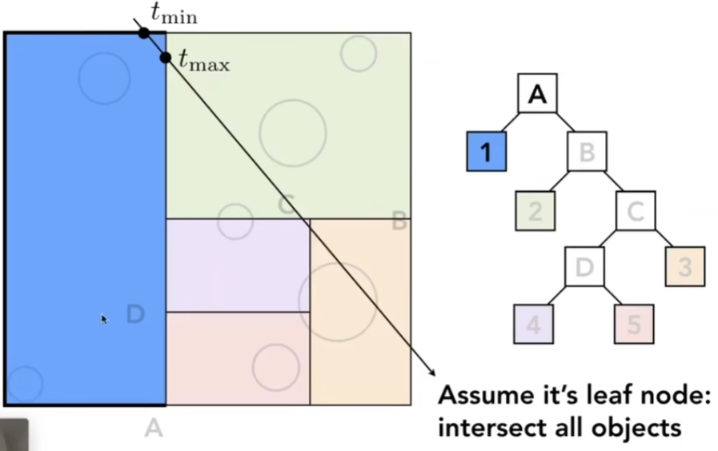

##### BSP-Tree

和 KD 类似，但是不选轴，每一次选一个方向去砍。

这会有问题，AABB 不友好（AABB 都是横平竖直的），不好计算。

##### 空间划分的问题

问题一：AABB 怎么知道它自己和物体相交，或者说 AABB 怎么知道它有哪些物体？这个是很难的，比如空间一个三角形，判断它是不是在 AABB 中，是不是只要有一个顶点在 AABB 中，就可以达成效果？并不是，因为 AABB 可以穿过这个三角形，虽然顶点不在其中，但是确实有交集， KDT 的方案确实有这种问题！三角形和 AABB 是否有交集，这个事情，很难。

问题二： 物体可能存在于多个盒子里，一个物体可以同时属于 N 个 AABB 包围盒。

#### 对象划分

Bounding Volume Hierarchy 解决了空间划分的两个问题。

把空间中的物体分组包围再分组包围（可以左右，再上下）。

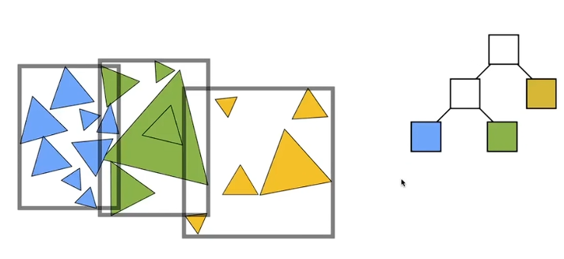

每次划分完成之后重新计算包围盒，这样一定可以保证一个物体只属于一个包围盒。引入的问题是包围盒有可能相交。

1. 找到包围盒
2. 按一定方法划分两堆物体，记录父子关系
3. 重新计算它们的包围盒
4. 重复直到满意
5. 存储物体到叶子节点

第二步划分时，先找到长轴，然后按照长轴按三角形重心排序来找到数量最中间的物体，以此来保证树的深度。

但是其实不需要排序，一堆三角形，使用排序找到中间大的三角形，一般来说是 nlog(n) 的复杂度。但是有一种不需要排序就可以找到第 i 大的数的算法，是 n 的复杂度，快速选择。（快速选择的核心是 分治：每一轮选择一个枢轴（pivot），将数组分成两部分，然后只递归进入包含目标元素的那一部分，从而避免了对另一半的排序。）

第四步可以假设包围盒里有 5 个物体，那就不继续划分了。

如果场景变化需要重新计算 BVH

### 第三个难点：Radiometry 辐射度量学

#### Radiant energy

能量，Q（J）

#### Radiant flux

单位时间的能量，φ（W 或者 lumen），d(Q)/d(t)

也就是定义所谓灯泡的亮度。

#### 三种光度测量

- Intensity  ：一个光源向四面八方辐射的单位立体角能量 power per unit solid angle
- Irradiance ：一个物体表面的单位表面接受到的光的能量 power per unit area
- Radiance   ：光线在传播过程中的能量

##### Intensity

对于一个圆，弧长除以半径就是角度。对应的整个圆周长除以半径，就是一个圆的角度，也就是 2π。

什么是单位立体角？

对于一个球，面积除以半径平方就是立体角。对应的整个球的面积除以半径的平方，就是一个球的立体角，也就是 4π。

在知道方向的情况下，单位立体角就是

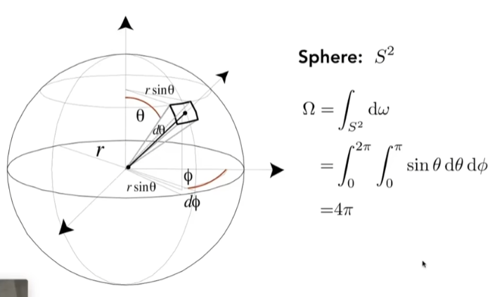

θ φ 这两个角度

所以一个灯泡的亮度需要除以 4π 才是单位的强度。

##### Irradiance

这个 unit area 是与光线垂直的面

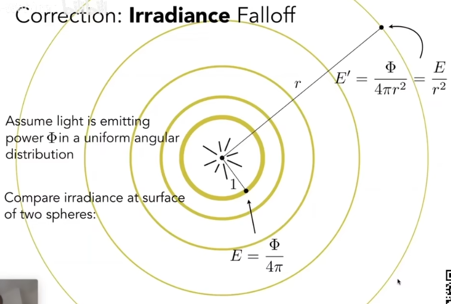

Intensity 并没有变弱，Irradiance 衰减变小

##### Radiance

单位立体角 + 单位投影面积  两个地方的微分

#### BRDF 反射方程

双向反射分布函数

已知所有入射光能量和角度，射到物体表面会向各个方向辐射，辐射出去的能量和角度是不一样的，表述了反射光线的角度和能量大小的分布关系，也就是定义了如何分配入射的 Irradiance

##### 递归问题

这个 BRDF 计算出来的光线还要作为入射光计算周围物体，所以对每一个物体来说都是递归问题

#### 渲染方程

描述物体发的光，其实就是 子发光 + 反射方程结果

##### 入射光

多个点光源、多个面光源、多个其他物体反射光源

##### 简写

L = E + KL

L = E + KE + K^2 E + ……

就是我看到最后一张图分解成，我直接看到光源会看到什么 加上 这个光源辐射出来的能量经过一次反射之后我会看到什么 再加上 光源辐射出的能量经过两次反射之后会看到什么 然后多次反射

这个后面的反射合体就是全局光照

光栅化，只有 E + KE，后面的想做就特别难

##### 多次弹射

一直照射，一定会收敛到一个亮度，不会过曝

如果相机的快门一直开着，就会越来越亮，过曝

#### 概率

连续的随机变量符合概率密度函数 PDF

曲线下方加起来就是 1

#### 蒙特卡洛积分

解决从一个数到另一个数的定积分

就是说你写不出这个解析式的话，怎么解出最后定积分这个数

随机采样方法，在 ab 之间选一个点，然后看它代入之后的数值是多少，然后用这个作为高度 ab 作为宽度，看这个长方形面积，这是采样了一次，我采样很多次，然后平均下求一下，最后得到的就是定积分结果

##### 黎曼积分

每一份都是一个微小的长方形，然后去求和求值

#### 路径追踪

Whitted-Style 光线追踪也是追踪他们有什么不同呢？

Whitted-Style 光线追踪：光滑物体反射折射，漫反射物体直接停住

然而实际上物体并非非此即彼，都是有一个度的，或者说所有的物体都会有反射折射漫反射，是一套东西

pass 解决问题，解渲染方程

##### 蒙特卡洛解渲染方程

对于这个点，先它来自四面八方的直接光照，不考虑多次反射

随机选择一个方向采样，按照某一种 pdf 选择采样就可以求了

如果是间接呢，多次反射怎么办，也就是说，正常来说直接光照是通过摄像机和点的连线找到了这个点的所有直接光源，得到一个光照计算，而多次反射相当于，通过摄像机和点的连线找到了这个点的所有间接物体，然后以这个点作为摄像机，与间接物体的交点作为下一个点，通过新摄像机和这下一个点的连线找到了这下一个点的所有直接光源，得到一个光照计算作为上一个点的反射光源，和之前的直接光照合起来。

- 间接反射计算量指数爆炸：如果对于一个点计算可视物体下一个点的间接反射，如果射出了 100 条，那么下一趟就会变成 100 * 100 ，这会指数爆炸，而如果每次都仅仅打出 1 条，那就没问题了。这个数值就是蒙特卡洛积分的所谓的采样数，N 大了 噪音下， N 小了 噪音大。而我们实际上就是使用的 N = 1，这才叫路径追踪。这样虽然非常偏激，但是只要我们使用了足够多的pass其实混合在一起也就会慢慢变好。这就把指数爆炸解决了
- 递归的终点在哪里：俄罗斯轮盘赌，增加一个动态概率随机让自己停下来

小问题：不够高效，会有很多光线浪费掉了，因为我们采样不够有针对性（重要性采样），对于大空间小有效率不够高效，即，如果挑选一个高效的 PDF

那是不是全都在有效物体上选择就 OK 了啊！而渲染方程说他是在半球的立体角上的积分，你现在直接在光源上积分光源单位表面积，那其实我们需要将这两个面积关系找到，就是找到真正的立体角面积。这部分不需要俄罗斯轮盘赌，这部分也不会反射。对了这个直接从光源到这个点这个事情，要考虑遮挡嗷！

但是非光源的部分其实还是要用原来的那种方式随缘去找，对了，这时候如果找到光源，就不要再计算了

对于路径追踪来说，点光源不好处理，因为路径追踪实际上还是一个面积的积分单位立体角那种的，之前我们在计算直接光照的时候也是默认面积光了，所以这个最好还是做成面积光

路径追踪几乎和现实一摸一样，照片级真实感

#####