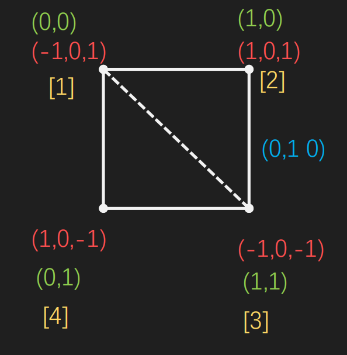
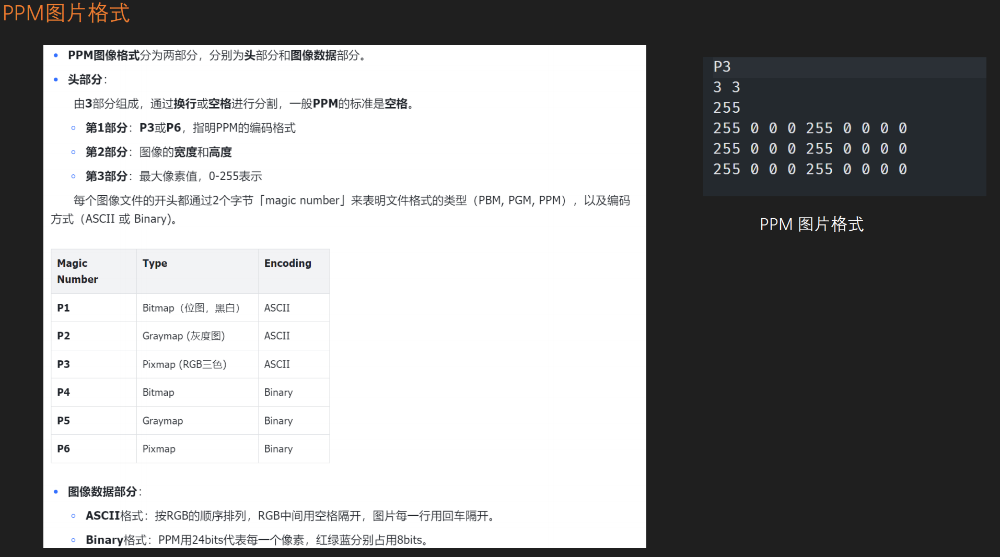
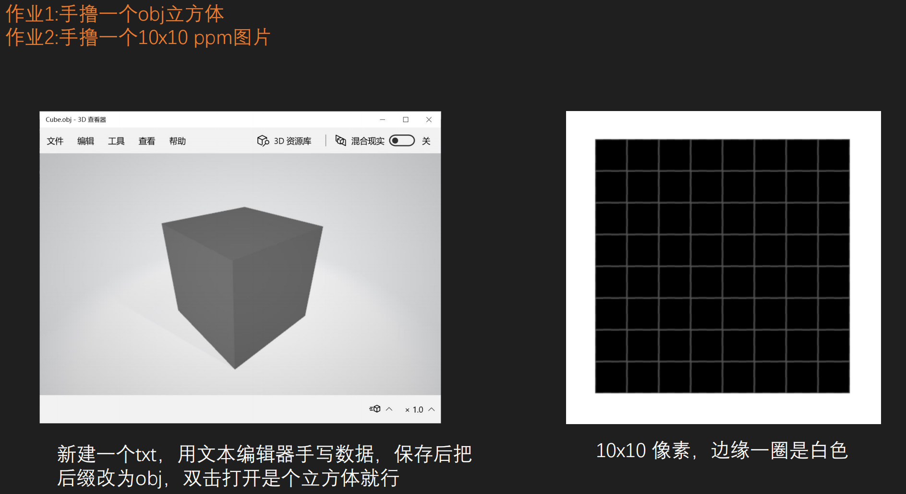
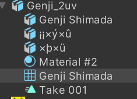
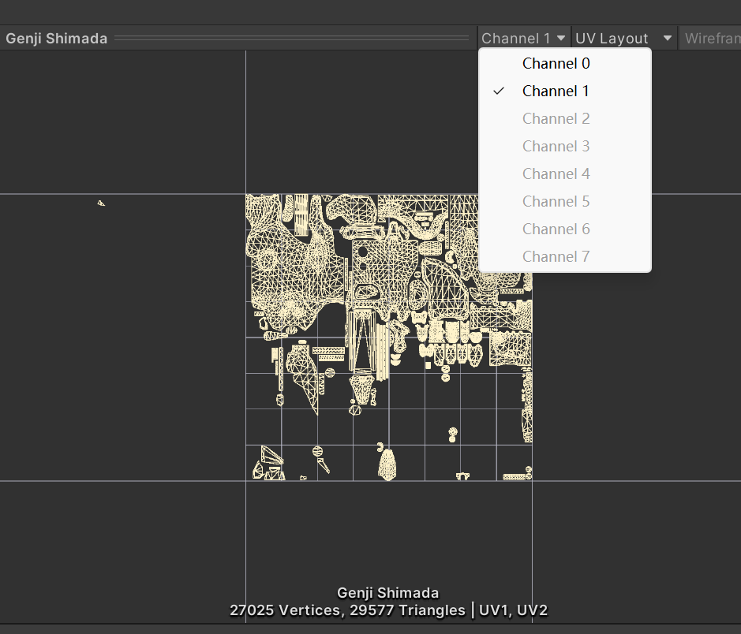
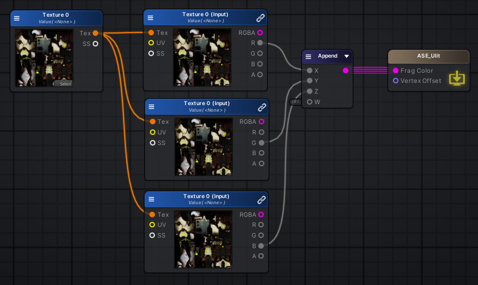

- [Obj](#obj)
- [贴图](#贴图)
  - [PPM](#ppm)
- [作业题](#作业题)
- [Unity新知识](#unity新知识)
  - [时间流动](#时间流动)
  - [看效果背景](#看效果背景)
  - [Linear](#linear)
- [UV 对应](#uv-对应)
- [贴图 RGB 拆分](#贴图-rgb-拆分)
- [Mips](#mips)
- [Unity 替换材质好处](#unity-替换材质好处)
- [Surface 有 Debug 节点](#surface-有-debug-节点)
- [语法](#语法)
  - [ShaderLab是啥](#shaderlab是啥)
  - [Swizzle](#swizzle)
  - [矩阵](#矩阵)
  - [函数](#函数)
  - [例子](#例子)
- [渲染队列](#渲染队列)

# Obj

blender 四边形 obj




# 贴图

贴图是颜色（像素）的合集。颜色一般是 8 位，也有 16 位。

## PPM

这里 3 * 3 其实就是 3 个像素 * 3 个像素的意思了啦。



没有正确对齐的就是 0

# 作业题



# Unity新知识

## 时间流动

可以在scene里进行时间流动查看效果

## 看效果背景

相机固定颜色 22，22，22 老师使用的。

## Linear

不知道为啥使用线性空间

# UV 对应

模型资源最多有 8 套 UV，可以通过这里切换查看，不同种 UV 有不同的用法





# 贴图 RGB 拆分




# Mips

图片勾选上之后，就会自动出现几层的mip

# Unity 替换材质好处

如果都叫 _MainTex 替换材质的时候，主贴图会自动赋予。

# Surface 有 Debug 节点 

可以覆盖正常输出

# 语法

## ShaderLab是啥

Unity 的标记语言

## Swizzle

自由分配

## 矩阵

```hlsl
float f0 = M._m00;
float f1 = M._12;
float f2 = M[0][1]；
float2 f3 = M._11_12;
```

## 函数 

1. 只能按值传参
2. 不支持递归
3. 只有内联函数
4. 支持 in out inout

## 例子

```hlsl
Shader "ASE_Unlit/11_ShaderText"
{
	// 各种参数 ShaderLab
	Properties
	{
		_MainTex("MainTex", 2D) = "White" {}
		_Color("Color", color) = (0, 1, 1, 0)
		[HDR]_HDRColor("HDR Color", color) = (-0.5, 0.5, 1, 0)
		_Value("Value", float) = 0.5
		_RangeValue("Range Value", Range(0, 1)) = 0.5
		_Vector("Vector", vector) = (1, 1, 1, 0)
	}
	
	SubShader
	{
		
		
		Tags { "RenderType"="Opaque" }
	LOD 100

		CGINCLUDE
		#pragma target 3.0
		ENDCG
		Blend Off
		AlphaToMask Off
		Cull Back
		ColorMask RGBA
		ZWrite On
		ZTest LEqual
		Offset 0 , 0
		
		
		// 一个 Pass 就是画一遍 多个就是画多遍 （比如日式卡通第一个画颜色第二个画描边）
		Pass
		{
			Name "Unlit"
			Tags { "LightMode"="ForwardBase" }
			CGPROGRAM

			

			#ifndef UNITY_SETUP_STEREO_EYE_INDEX_POST_VERTEX
			//only defining to not throw compilation error over Unity 5.5
			#define UNITY_SETUP_STEREO_EYE_INDEX_POST_VERTEX(input)
			#endif
			#pragma vertex vert // 对应下面 vert 方法
			#pragma fragment frag // 对应下面 frag 方法
			#pragma multi_compile_instancing
			#include "UnityCG.cginc" // unity 一些常用的东西放到这里来
			
			// Cpu 发送给 v 的数据（需要标记）
			struct MeshData
			{
				float4 vertex	: POSITION; // 这里代表占位符
				float4 color	: COLOR;
				float2 uv		: TEXCOORD0; // 这里代表着 第 1 套 UV (对于实例的模型来说，这一套是错误的)
				float2 uv2		: TEXCOORD1; // 这里代表着 第 1 套 UV
				float3 normalOS	: NORMAL;
				
				UNITY_VERTEX_INPUT_INSTANCE_ID
			};

			// v 发送给 p 的数据（需要标记）
			struct V2FData
			{
				float4 vertex	: SV_POSITION; // 这里代表经过坐标转换后的坐标
				float2 uv		: TEXCOORD1;
				float2 uv2		: TEXCOORD2;
				float3 posOS	: TEXCOORD3;
				float3 posWS	: TEXCOORD4;
				float3 normalOS : TEXCOORD5;
				float3 normalWS : TEXCOORD6;
				
				#ifdef ASE_NEEDS_FRAG_WORLD_POSITION
				float3 worldPos : TEXCOORD0; // 同为 TEXCOORD0 这里仅仅代表参数占位
				#endif
				
				UNITY_VERTEX_INPUT_INSTANCE_ID
				UNITY_VERTEX_OUTPUT_STEREO
			};

			// 对应 Properties 属于局部变量
			sampler2D _MainTex;
			
			
			
			V2FData vert ( MeshData v )
			{
				V2FData o;
				UNITY_SETUP_INSTANCE_ID(v);
				UNITY_INITIALIZE_VERTEX_OUTPUT_STEREO(o);
				UNITY_TRANSFER_INSTANCE_ID(v, o);

				
				float3 vertexValue = float3(0, 0, 0);
				#if ASE_ABSOLUTE_VERTEX_POS
				vertexValue = v.vertex.xyz;
				#endif
				vertexValue = vertexValue;
				#if ASE_ABSOLUTE_VERTEX_POS
				v.vertex.xyz = vertexValue;
				#else
				v.vertex.xyz += vertexValue;
				#endif
				o.vertex = UnityObjectToClipPos(v.vertex); // 局部坐标变换到裁剪坐标下
				o.uv = v.uv;
				o.uv2 = v.uv2;
				o.normalOS = v.normalOS;
				// TODO!
				// 处理非均匀变换
				o.normalWS = UnityObjectToWorldNormal(v.normalOS);
				// o.normalWS = normalize(mul(norm, (float3x3)unity_WorldToObject));

				// 没处理非均匀变换
				// o.normalWS = normalize(mul(unity_ObjectToWorld, v.normalOS));

				o.posOS = v.vertex;
				o.posWS = normalize(mul(unity_ObjectToWorld, v.vertex));
				
				#ifdef ASE_NEEDS_FRAG_WORLD_POSITION
				o.worldPos = mul(unity_ObjectToWorld, v.vertex).xyz;
				#endif
				return o;
			}
			
			fixed4 frag (V2FData i ) : SV_Target
			{
				// 测试 坐标
				return i.posOS.xyzz + 0.5;
				// 测试 法线输出
				return i.normalWS.xyzz;
				
				UNITY_SETUP_INSTANCE_ID(i);
				UNITY_SETUP_STEREO_EYE_INDEX_POST_VERTEX(i);
				fixed4 finalColor;
				#ifdef ASE_NEEDS_FRAG_WORLD_POSITION
				float3 WorldPosition = i.worldPos;
				#endif
				
				finalColor = tex2D(_MainTex, i.uv);
				// finalColor = fixed4(1,1,1,1);
				return finalColor;
			}
			ENDCG
		}
	}
	CustomEditor "ASEMaterialInspector"
}
```

# 渲染队列

1.Background (1000) 背景
2.Geometry (2000) 不透明物体
3.Alpha test (2450) 丢弃像素的不透明物体
4.Transparent (3000) 半透明物体
5.Overlay (4000) 混合 eg:UI

可以在 shader 中 标明，如若不标，默认 1000。标明需要在 tag 中添加

"Queue"="Geometry+100" 诸如此类