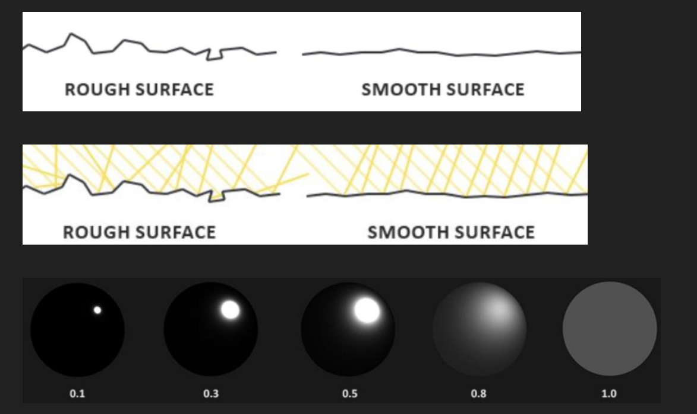
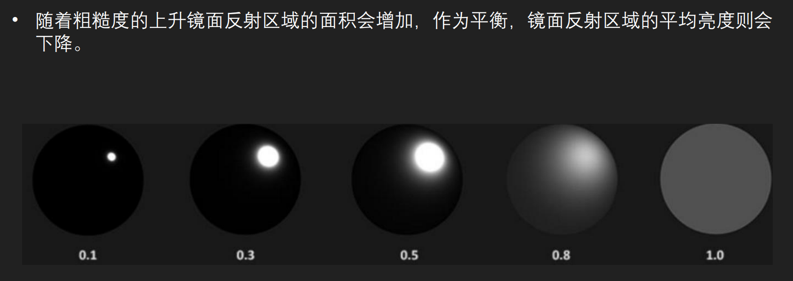
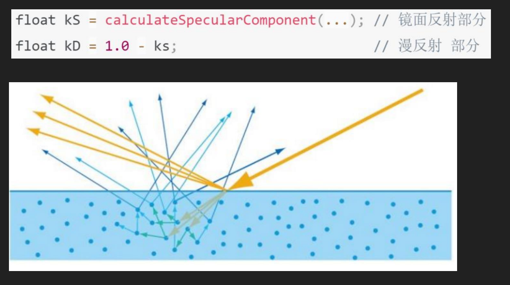
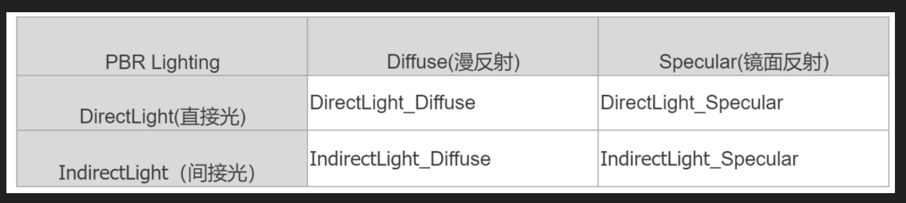
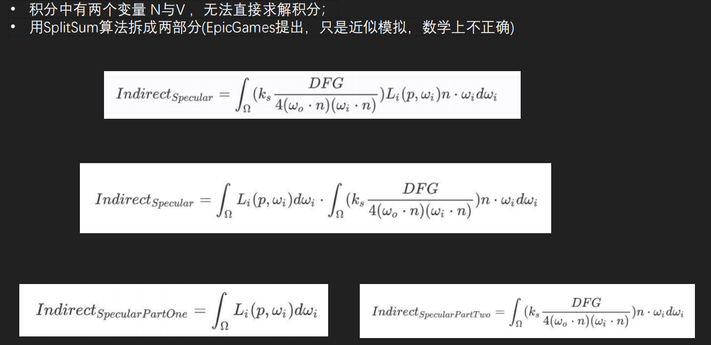
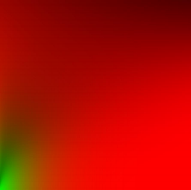
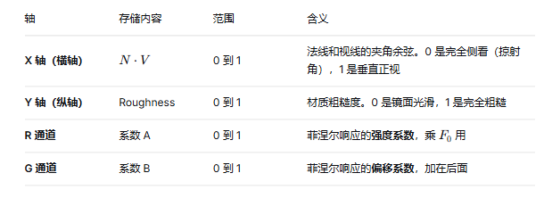
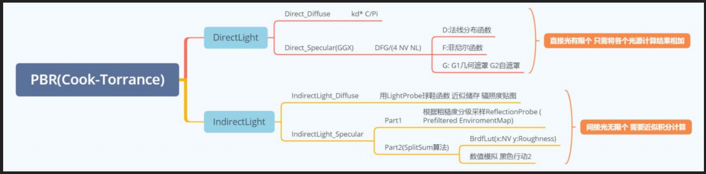

- [直接光](#直接光)
  - [漫反射部分：Lambert 模型](#漫反射部分lambert-模型)
  - [镜面反射部分：Cook-Torrance 模型](#镜面反射部分cook-torrance-模型)
    - [D —— 法线分布函数 —— 高光形状](#d--法线分布函数--高光形状)
    - [F —— 菲涅尔项 —— 高光强度](#f--菲涅尔项--高光强度)
    - [G —— 几何遮蔽项 —— 高光生死](#g--几何遮蔽项--高光生死)
  - [Kd 和 Ks](#kd-和-ks)
- [间接光](#间接光)
  - [漫反射](#漫反射)
  - [辐照度贴图](#辐照度贴图)
    - [计算过程](#计算过程)
    - [球谐函数简化](#球谐函数简化)
      - [原理](#原理)
      - [如何在 shader 中使用](#如何在-shader-中使用)
      - [网站](#网站)
  - [镜面反射](#镜面反射)
    - [第一部分：积分光线](#第一部分积分光线)
    - [第二部分：BrdfLut](#第二部分brdflut)
    - [第二部分：数值拟合](#第二部分数值拟合)
- [HDR LDR](#hdr-ldr)
  - [为什么 PBR 一定会产生 HDR 值？](#为什么-pbr-一定会产生-hdr-值)
  - [ToneMapping 的作用](#tonemapping-的作用)
  - [为什么用 ACES？](#为什么用-aces)
- [颜色空间](#颜色空间)
- [总结和扩展](#总结和扩展)

PBR，全称 Physically Based Rendering，即基于物理的渲染

- 微平面理论：现实中不存在绝对光滑的表面。微观上看，所有表面都由无数朝向各异的微小平面组成。表面越粗糙，这些微平面的朝向就越杂乱，导致反射光线向各个方向散开，形成模糊的反射

- 能量守恒：这是 PBR 最基础的法则。简单说，物体反射的光的亮度，绝不会超过它接收到的光的亮度。举个例子，越粗糙的表面，其高光点会越分散、越暗淡；而越光滑的表面，高光会越集中、越明亮，这保证了能量分配的真实感



- 基于物理的 BRDF 双向反射分布函数：菲涅尔效应：这个现象描述了反射率会随着观察角度的变化而变化。看一潭水时，低头看脚下，视线与水面接近垂直，你能轻易看清水底（反射弱）；但如果望向远方，视线与水面夹角很小，水面会像镜子一样强烈反射天空（反射强）

# 直接光

Fr = Kd * Fl + Ks * Fct

## 漫反射部分：Lambert 模型

Fl = c / π

- c 是表面的固有色（漫反射颜色），在金属/粗糙度工作流中通常就是 Base Color。
- π 是为了保证能量守恒，让整个半球积分的漫反射能量不超过接收到的能量。

## 镜面反射部分：Cook-Torrance 模型

Fct = DFG / 4(ωo⋅n)(ωi⋅n)

分母中的 4(ωo⋅n)(ωi⋅n) 是推导微平面模型时自然出现的修正因子，保证物理正确性。

### D —— 法线分布函数 —— 高光形状

- 描述微平面中有多少比例的法线正好朝向半角向量方向（能把光反射到眼睛）。注意是比率哦！
- 表面越粗糙，朝向分散，高光越模糊；越光滑，分布越集中，高光越清晰。

这个 D 有各种模型的，常用的是 GGXTR，输入就是 法线、半程向量、粗糙度


这个 D 就是高亮光圈效果，决定了高光的形状


### F —— 菲涅尔项 —— 高光强度

描述反射率随视角变化的规律：正对着看反射弱，斜着看反射强。决定多少光线被反射，剩下多少进入材质（可能发生漫反射）。决定了高光的强度

原始公式：物理上更精确（考虑了偏振、完整复折射率），但参数反直觉，计算昂贵。

Schlick F 近似：物理上做了简化，但在 RGB 渲染的上下文中，它的参数化方式（直接指定 F0）更稳定、更可控、计算快得多，对金属的匹配度甚至可能更高，自然成了行业标准。

F0 + (1 - F0) * (1 - cosθ)^5

对于非金属（电介质） F0 几乎永远是灰度值，而且普遍很低。常见的参考值是 0.04，也就是 4% 的反射率。这是基于自然界大多数非金属材质（塑料、木头、皮肤、布料等）的反射率都在 2%～5% 之间。具体：水：约 0.02；皮肤：约 0.028；塑料/玻璃：约 0.04；钻石：约 0.17（算是非金属里偏高的特例）。实时渲染引擎为了简化，通常就把所有非金属统一固定为 0.04。

对于金属（导体）
F0 不是灰度值，而是带颜色的 RGB，而且很高。金属没有漫反射，它的 F0 既要表达“反射强度”，又要表达“反射颜色”。所以在 PBR 工作流里，金属的 F0 直接就是材质的 Base Color（基础色）。典型 RGB 值：
金：(1.00, 0.71, 0.29)
铜：(0.95, 0.64, 0.54)
铁：(0.56, 0.57, 0.58)
铝：(0.91, 0.92, 0.92)
银：(0.95, 0.93, 0.88)

引擎里用金属度（Metallic）来统一控制 F0。实际 Shader 不做“if 金属 else 非金属”的分支，而是用一次线性插值搞定：
F0 = lerp(0.04, BaseColor, Metallic) 
Metallic = 0（非金属） → F0 = 0.04 
Metallic = 1（金属） → F0 = BaseColor
中间值（极少用，如生锈金属） → 在两者之间混合

这样，“F0 一般是啥”就有两个标准答案：
非金属的 F0：0.04
金属的 F0：等于 Base Color

如果再展开一点，也可以说部分引擎（如 UE）会提供 Specular 参数，允许微调非金属的 F0 值，但默认就是 0.04。


HV 是 物理正确的做法，NV 是 宏观概念的近似。

两者在金属度高的物体上差别不大，但是在粗糙的物体边缘表现上会有差别。

因为 NV 在物体边缘的情况下，非常小，这会导致 F 项快速增大！而实际情况是 HV 那种，小，但是不会非常小，所以 NV 下，粗糙物体边缘会过亮！


### G —— 几何遮蔽项 —— 高光生死

描述微平面之间的遮挡和吸收。越粗糙，微平面之间越容易互相遮挡，导致能量损失。


当视线或光线方向与表面法线夹角越大（也就是越掠射），或者表面越粗糙，这种互相遮挡就越严重。如果不处理，物理计算就会给这些本该是阴影的区域赋予过高的亮度，导致粗糙表面边缘像在“发光”。

G 项的作用，就是模拟这种由于微几何结构造成的光线衰减，输出一个 0 到 1 之间的系数，和 D、F 项相乘，把不合理的能量压暗。

常用：Smith 模型，一般与 D 配合使用。DG 一起描述的意思是高光不会出现在暗部！

- 算一下视线方向能看见多少微平面 → G_GGX(N·V)
- 算一下光线方向能照到多少微平面 → G_GGX(N·L)
- 把它们乘起来 → G = G1 × G2


你可能会发现，D 和 F 都是增大出射光的，只有 G 是拼命压暗的。

这是因为从微观物理讲，D 和 F 只描述了“恰好没被挡住的那些微平面”的光学行为。而 G 负责选出哪些微平面是有效的。所以，在很多对精度不那么严格的场合，大家也直接把 G 叫做“几何衰减”。


## Kd 和 Ks

对于电介质（Metal=0）：
- Kd = Albedo，最终着色时，最终颜色 = Kd * (1 - Ks) + 镜面反射项。

对于金属（Metal=1）：
- Kd 严格为 0。金属的颜色全部来自镜面反射（Ks）。此时镜面反射的颜色会被 Albedo 染色。

标准的金属/粗糙度工作流：
- Kd 的取值是：Kd = Albedo * (1 - Metal)，然后在最终混合时乘以能量守恒项：最终颜色 = Albedo * (1 - Metal) * (1 - Ks) + 镜面反射颜色

# 间接光

间接光的计算，本质上是在解一个更复杂的积分。和直接光不同，它的入射光 Li 本身也是未知的，来自场景中其他表面的反弹。所以一个符合物理的间接光一定是通过半球面的积分得来的。

## 漫反射

间接光漫反射的颜色由半球光线基础色、折射率和积分决定，其中基础色和折射率都是常数，不依赖于积分。现在积分只依赖于 光线方向了。

## 辐照度贴图

这个贴图采样环境中所有方向的积分光，也就是储存漫反射积分结果，在我们使用时，可以通过它直接获取任何方向的辐照度

总体来看，辐照度贴图就是模糊版的环境贴图，因为它就是在各个点上，把环境贴图给积分了

### 计算过程

本质上我们应该对所有方向的光线采样积分，但是实际上的算力不允许无限，我们要有选择地挑选足够多的方向进行积分近似求解

### 球谐函数简化

如果场景中有很多房间作为环境，每个环境单独弄一个辐照度贴图的话，会消耗大量内存，这里有一种代替方案，使用球谐函数代替辐照度贴图。

球谐函数通过 9 个 float 就可以大致模拟出辐照度贴图的效果，非常牛。

#### 原理

球谐函数是一组定义在球面上的正交基函数，可以用来存储三维信息，类似傅里叶变换在球面上的版本。

用这些基函数的加权和，可以近似表示任何在球面上缓慢变化的信号。

漫反射间接光正好是低频信号（变化很慢），所以用三阶 SH（9 个系数） 就足够精确。

#### 如何在 shader 中使用

先设置 Tags{ "LightMode"="ForwardBase" } 才能正确使用球谐函数

```HLSL
float3 irradianceSH = ShadeSH9(float4(N,1));
float3 Diffuse_Indirect = irradianceSH * BaseColor / PI * KD_IndirectLight;
FinalColor.rgb = Diffuse_Indirect;
```

#### 网站

https://hdrihaven.com/hdris/

## 镜面反射

分为两部分，一部分根据粗糙度积分光线，一部分计算积分光线的镜面反射



### 第一部分：积分光线

和漫反射不同，镜面反射不需要对半球面进行积分，因为影响此处颜色的光大部分来自于入射光的镜面反射，小部分来自漫反射，所以计算积分的时候，其卷积核的面积和粗糙度有关

可以根据不同的粗糙度，给出不同的辐照度贴图，那岂不是要很多？占用很大？

这里取巧，使用 LOD 思想，只取几种粗糙度，并为其生成贴图，且根据普通的粗糙贴图理论，比如将原图 4 个像素平均作为下一级粗糙度的贴图，其占用也会缩减，然后依次，这其实就是 LOD 思想，最后使用的时候根据粗糙度等级，直接选择对应 lod 的贴图就好。

- 对原始环境 Cubemap，逐级生成 Mipmap。
- 每一级 Mipmap 对应一个不同的粗糙度值（通常是线性映射）。
- 生成方法：用对应粗糙度的 GGX 分布做重要性采样，去卷积环境贴图。
- Mip 级别越高（贴图越小），代表越粗糙的反射。

Prefiltered Environment Map

### 第二部分：BrdfLut

假设每个方向的入射光都是白色的（L(p,x)=1.0 ），就可以在给定粗糙度、光线ωi 法线 n 夹角 n⋅ωi 的情况下，预计算 BRDF 的响应结果。以 X 轴为法线与入射光的夹角 (NL01)，以 Y 轴为粗糙度，将计算的结果存储在一张 2D 贴图上 (Lut)，该贴图称为 BRDF 积分贴图。积分的结果分别储存在贴图的 RG 通道中。使用的时候可以直接采样该贴图即可。





间接光代码中的菲涅尔系数计算和直接光的有两点不同

第一点是这里没有用于计算微片元朝向的 D 函数，计算菲涅尔系数使用的是真正的 NV 而不是 NH

直接光：知道干活的是 H 方向的微平面 → 用 H·V 算菲涅尔
间接光：所有朝向的微平面都在干活，没法指定一个特定的 日 → 只能从“宏观表面”的角度，用宏观法线 N 和视线 V 的夹角 NV 来做整体近似

第二点是考虑了粗糙度。在直接光里，H 基本由光源方向 L 决定，粗糙度主要影响分布 D（高光的宽窄），不直接影响“用哪个法线算菲涅尔”。

在间接光里，粗糙度决定了“哪些微平面对环境光的贡献更大”：
- 粗糙度低（光滑）：大部分贡献来自法线接近 N 的微平面，它们的行为更接近宏观表面，用 N⋅V 误差不大。
- 粗糙度高（毛糙）：大量歪歪扭扭的微平面都在反射环境光，掠射角观察时，N⋅V 对菲涅尔效应会夸大，所以需要在 BRDF LUT 里，用粗糙度去修正这个近似带来的误差。

这就是为什么 BRDF LUT 的 Y 轴是粗糙度，它的作用之一就是去补偿“用 NV 代替 HV 在粗糙表面的能量偏差”。

### 第二部分：数值拟合

BRDF LUT 是一张 2D 贴图，虽然不大（通常 128×128 就够），但在一些场景下依然有代价

于是有人对 BRDF LUT 的内容做了曲线拟合，用一个简单的数学公式直接算出近似结果，省掉这张贴图

目前业界最流行的是 Karris 在 Real Shading in Unreal Engine 4 中给出的拟合

- 粗糙度低 → 行为和普通 Schlick 菲涅尔几乎一样
- 粗糙度高 → 把菲涅尔的“最低值”从 F0 抬高，削弱掠射角的反射增强，模拟微平面遮蔽导致的能量损失

移动端首选拟合

# HDR LDR

在 PBR 中做光照运算时，最终输出的颜色值时常超过 1，而超过 1 的部分在显示器中显示就会“泛白过爆”，为了解决这个问题，将 HDR(High Dynamic Range) 的颜色值转换到 LDR(Low Dynamic Range) 的算法叫做 ToneMapping（色调映射）。在各种 ToneMapping 算法中 ACESTonemapping 效果与性能兼优。

## 为什么 PBR 一定会产生 HDR 值？

PBR 的核心是能量守恒+物理光源，这意味着：

- 真实物理光源的强度远超显示器范围。太阳的亮度可能是天空的几万倍，PBR 会用真实的物理单位（如 Lux 或 cd/m²）来定义光源。
- 能量守恒只保证“反射光不超过入射光”，但入射光本身就远大于 1.0。
- 金属的高反射率（F0 可达 0.9 以上）+ 强烈的直接光照，很容易产生 FinalColor.rgb = (2.0, 1.5, 0.8) 这样的 HDR 值。

所以 PBR 管线天然输出的是 HDR 数据，直接送给 LDR 显示器就会让超过 1.0 的部分被截断，表现为一片死白，丢失所有细节。

## ToneMapping 的作用

把 HDR 映射到 LDR。

它不是简单的线性缩放，而是要做一条 S 形曲线：
- 暗部保留对比度，不压死黑
- 中间调保持自然
- 亮部逐渐压缩到接近 1.0，保留高光细节而非直接截断
- 最终把所有值映射到 [0, 1] 的显示器范围内

## 为什么用 ACES？

- ACES 的映射曲线是专门为电影级 HDR 设计的，对高饱和亮色的处理极其自然
- 很多 ToneMapping 在亮部压缩时会导致色相偏移（比如蓝天变青，火焰偏黄），ACES 通过特殊的色空间变换，几乎完全避免了这个问题
- 它对肤色的还原尤其优秀，高光区的皮肤不会变成塑料感

- ACES 的拟合公式非常简单，就是几行多项式计算，不需要任何贴图采样
- 比 Filmic 等其他算法快，几乎零开销
- 代码量极少，业界有非常成熟的 Magic Code 可以直接用

```Cpp
float3 ACESToneMapping(float3 color)
{
    float a = 2.51f;
    float b = 0.03f;
    float c = 2.43f;
    float d = 0.59f;
    float e = 0.14f;
    return saturate((color * (a * color + b)) / (color * (c * color + d) + e));
}
```

# 颜色空间

- 人眼对 低亮度 的颜色变化 感知强，对 高亮度 的颜色变化 感知弱。
- 为了提高图片的显示辨识度，将自然界线性的颜色储存在非线性的空间 (Gamma) 
- 在渲染中先将图片转化为 线性空间 (Linear)，再进行颜色加减乘除操作才是正确的，最后再转为非线性 (Gamma)

在 Unity 中如果设置颜色空间为 Gamma，那么在进行 PBR 计算之前需要用代码手动转到 Linear, 并且最终输出到显示器的颜色时候需用代码手动转到 Gamma 空间

在 Unity 中如果设置颜色空间为 Linear，那么 Unity 会帮我们把图片自动转到 Linear 空间，并且最终输出到显示器的颜色时候自动转到 Gamma 空间

# 总结和扩展



论文扩展：https://blog.selfshadow.com/