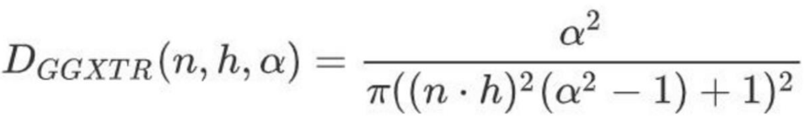
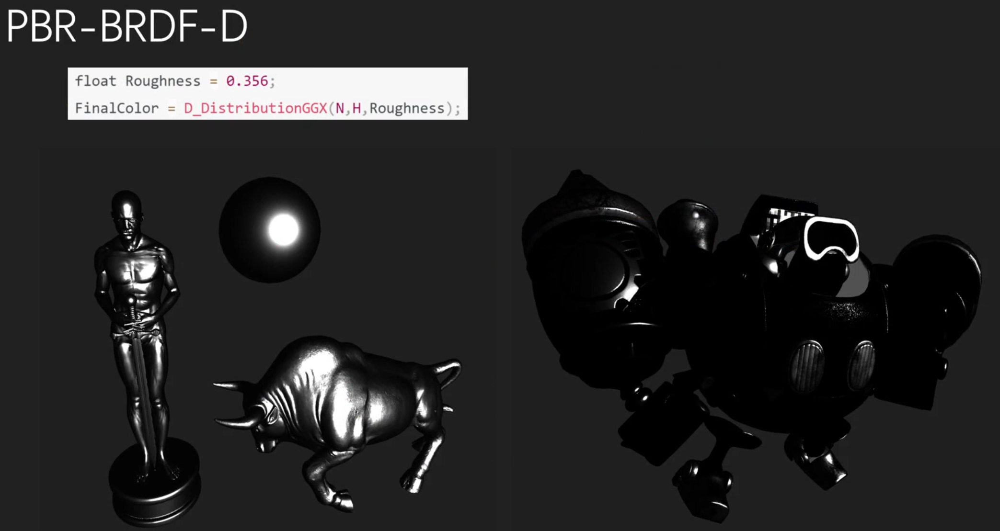
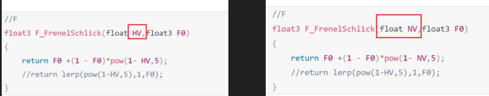
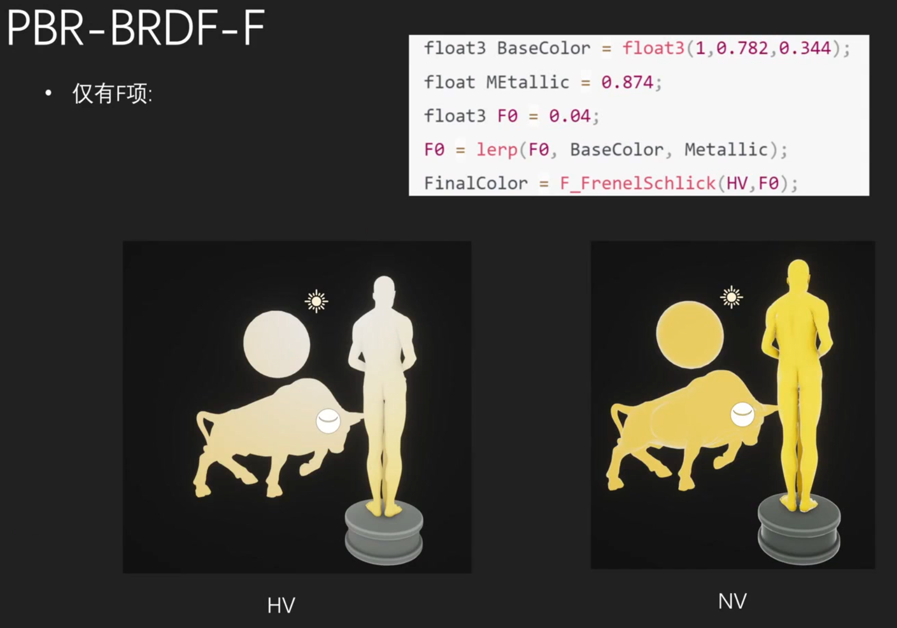
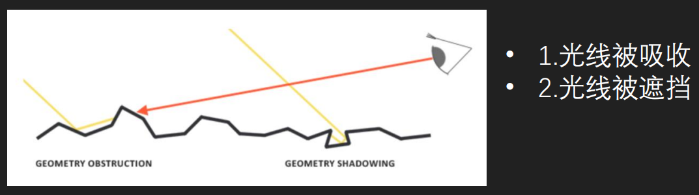
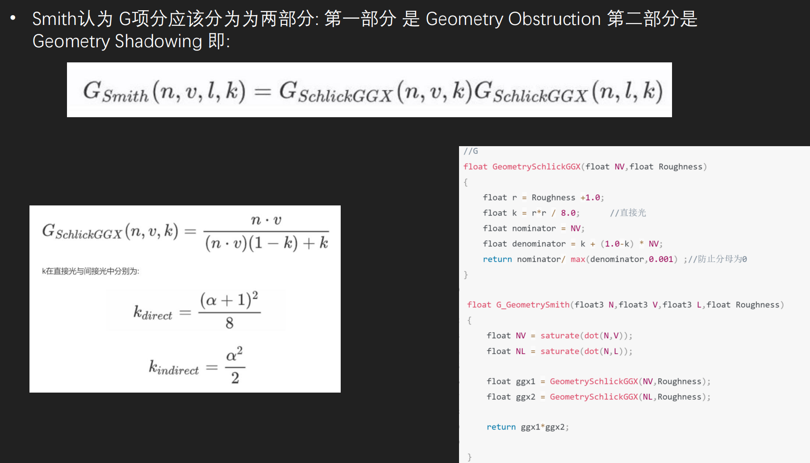
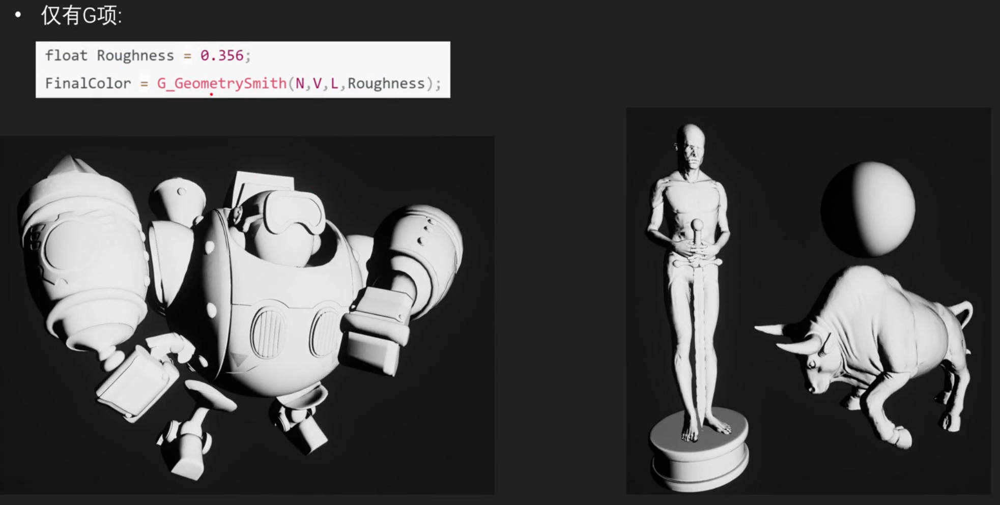

PBR，全称 Physically Based Rendering，即基于物理的渲染

- 微平面理论：现实中不存在绝对光滑的表面。微观上看，所有表面都由无数朝向各异的微小平面组成。表面越粗糙，这些微平面的朝向就越杂乱，导致反射光线向各个方向散开，形成模糊的反射

- 能量守恒：这是 PBR 最基础的法则。简单说，物体反射的光的亮度，绝不会超过它接收到的光的亮度。举个例子，越粗糙的表面，其高光点会越分散、越暗淡；而越光滑的表面，高光会越集中、越明亮，这保证了能量分配的真实感

- 基于物理的 BRDF 双向反射分布函数：菲涅尔效应：这个现象描述了反射率会随着观察角度的变化而变化。看一潭水时，低头看脚下，视线与水面接近垂直，你能轻易看清水底（反射弱）；但如果望向远方，视线与水面夹角很小，水面会像镜子一样强烈反射天空（反射强）

# 直接光

Fr = Kd * Fl + Ks * Fct

## 漫反射部分：Lambert 模型

Fl = c / π

- c 是表面的固有色（漫反射颜色），在金属/粗糙度工作流中通常就是 Base Color。
- π 是为了保证能量守恒，让整个半球积分的漫反射能量不超过接收到的能量。

## 镜面反射部分：Cook-Torrance 模型

Fct = DFG / 4(ωo⋅n)(ωi⋅n)

分母中的 4(ωo⋅n)(ωi⋅n) 是推导微平面模型时自然出现的修正因子，保证物理正确性。

### D —— 法线分布函数 —— 高光形状

- 描述微平面中有多少比例的法线正好朝向半角向量方向（能把光反射到眼睛）。注意是比率哦！
- 表面越粗糙，朝向分散，高光越模糊；越光滑，分布越集中，高光越清晰。

这个 D 有各种模型的，常用的是 GGXTR，输入就是 法线、半程向量、粗糙度

这个 D 就是高亮光圈效果，决定了高光的形状

### F —— 菲涅尔项 —— 高光强度

描述反射率随视角变化的规律：正对着看反射弱，斜着看反射强。决定多少光线被反射，剩下多少进入材质（可能发生漫反射）。决定了高光的强度

原始公式：物理上更精确（考虑了偏振、完整复折射率），但参数反直觉，计算昂贵。

Schlick F 近似：物理上做了简化，但在 RGB 渲染的上下文中，它的参数化方式（直接指定 F0）更稳定、更可控、计算快得多，对金属的匹配度甚至可能更高，自然成了行业标准。

F0 + (1 - F0) * (1 - cosθ)^5

对于非金属（电介质） F0 几乎永远是灰度值，而且普遍很低。常见的参考值是 0.04，也就是 4% 的反射率。这是基于自然界大多数非金属材质（塑料、木头、皮肤、布料等）的反射率都在 2%～5% 之间。具体：水：约 0.02；皮肤：约 0.028；塑料/玻璃：约 0.04；钻石：约 0.17（算是非金属里偏高的特例）。实时渲染引擎为了简化，通常就把所有非金属统一固定为 0.04。

对于金属（导体）
F0 不是灰度值，而是带颜色的 RGB，而且很高。金属没有漫反射，它的 F0 既要表达“反射强度”，又要表达“反射颜色”。所以在 PBR 工作流里，金属的 F0 直接就是材质的 Base Color（基础色）。典型 RGB 值：
金：(1.00, 0.71, 0.29)
铜：(0.95, 0.64, 0.54)
铁：(0.56, 0.57, 0.58)
铝：(0.91, 0.92, 0.92)
银：(0.95, 0.93, 0.88)

引擎里用金属度（Metallic）来统一控制 F0。实际 Shader 不做“if 金属 else 非金属”的分支，而是用一次线性插值搞定：
F0 = lerp(0.04, BaseColor, Metallic) 
Metallic = 0（非金属） → F0 = 0.04 
Metallic = 1（金属） → F0 = BaseColor
中间值（极少用，如生锈金属） → 在两者之间混合

这样，“F0 一般是啥”就有两个标准答案：
非金属的 F0：0.04
金属的 F0：等于 Base Color

如果再展开一点，也可以说部分引擎（如 UE）会提供 Specular 参数，允许微调非金属的 F0 值，但默认就是 0.04。

HV 是 物理正确的做法，NV 是 宏观概念的近似。

两者在金属度高的物体上差别不大，但是在粗糙的物体边缘表现上会有差别。

因为 NV 在物体边缘的情况下，非常小，这会导致 F 项快速增大！而实际情况是 HV 那种，小，但是不会非常小，所以 NV 下，粗糙物体边缘会过亮！

### G —— 几何遮蔽项 —— 高光生死

描述微平面之间的遮挡和吸收。越粗糙，微平面之间越容易互相遮挡，导致能量损失。

当视线或光线方向与表面法线夹角越大（也就是越掠射），或者表面越粗糙，这种互相遮挡就越严重。如果不处理，物理计算就会给这些本该是阴影的区域赋予过高的亮度，导致粗糙表面边缘像在“发光”。

G 项的作用，就是模拟这种由于微几何结构造成的光线衰减，输出一个 0 到 1 之间的系数，和 D、F 项相乘，把不合理的能量压暗。

常用：Smith 模型，一般与 D 配合使用。DG 一起描述的意思是高光不会出现在暗部！

- 算一下视线方向能看见多少微平面 → G_GGX(N·V)
- 算一下光线方向能照到多少微平面 → G_GGX(N·L)
- 把它们乘起来 → G = G1 × G2

你可能会发现，D 和 F 都是增大出射光的，只有 G 是拼命压暗的。

这是因为从微观物理讲，D 和 F 只描述了“恰好没被挡住的那些微平面”的光学行为。而 G 负责选出哪些微平面是有效的。所以，在很多对精度不那么严格的场合，大家也直接把 G 叫做“几何衰减”。

## Kd 和 Ks

Ks 是镜面反射所占百分比，Kd 是漫反射所占百分比 Kd = (1 - Ks)(1 - Metal)

# 间接光

间接光的计算，本质上是在解一个更复杂的积分。和直接光不同，它的入射光 Li 本身也是未知的，来自场景中其他表面的反弹。

## 