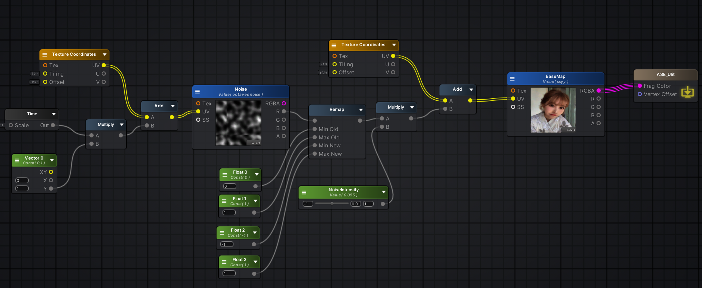
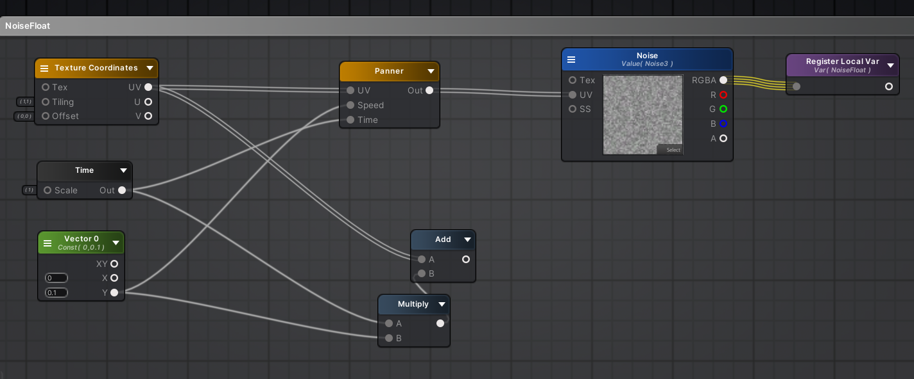
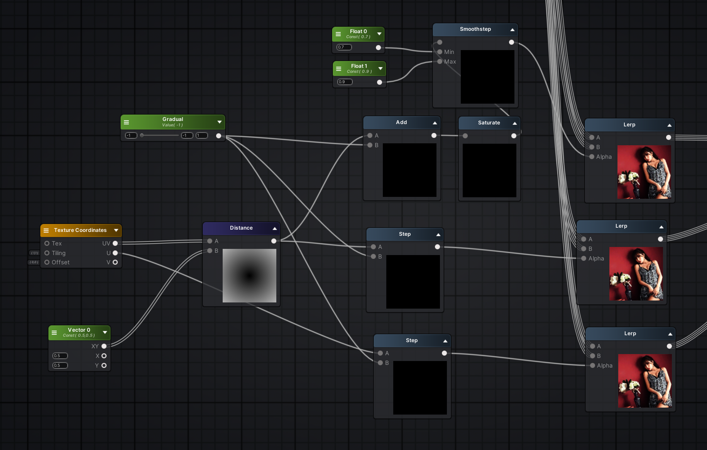
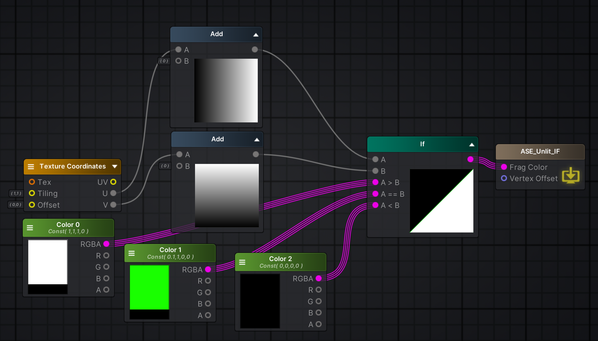
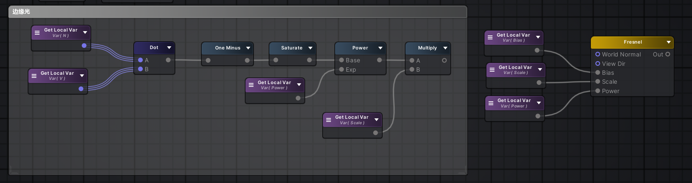

- [1\_贴图重复排列](#1_贴图重复排列)
- [2\_斑马线](#2_斑马线)
- [3\_无顶点的河流扰动](#3_无顶点的河流扰动)
- [4\_法线输出](#4_法线输出)
- [5\_POS](#5_pos)
- [6\_花式渐变](#6_花式渐变)
- [7\_IF 做三角形](#7_if-做三角形)
- [8\_Clip 丢弃](#8_clip-丢弃)
- [9\_随机位置](#9_随机位置)
- [10\_法视光之菲涅尔](#10_法视光之菲涅尔)

# 1_贴图重复排列

也可以利用贴图的边界设置（重复、拉伸、不填充），直接使用 tiling，详见 _ST。

# 2_斑马线

MultUV + Fract / Sin + Step

# 3_无顶点的河流扰动

河流扰动还可以用 panner 其实就是 uv + scale * time

# 4_法线输出

把 -1 到 1 的法线向量变成颜色输出了，首先负数那肯定就是黑色了。

以世界法线作为例子 
- 1,0,0 X 方向，那就是红色
- 0,1,0 Y 方向，那就是绿色
- 0,0,1 Z 方向，那就是蓝色

# 5_POS

位置也可以作为UV输出

# 6_花式渐变

翻书页：UV + Step

圆心硬渐变：DIS + Step

圆心软渐变：DIS + SmoothStep

# 7_IF 做三角形

利用 UV 大于小于制作

# 8_Clip 丢弃

# 9_随机位置

# 10_法视光之菲涅尔

ASE 里，World Normal 是法线，View Dir 是视线，Object Space Light Dir 是光线。这几项参数都设置为归一化。

法线和光线点乘，其结果就是光线直射的地方显示为白色，与光线成角度显示颜色越黑转动光线可以实时看到效果变化。

法线和视线点乘，其结果就是 cos 夹角，当摄像机视线重合于三角形法线，此时夹角为零，数值为一，得到的颜色是白色，而三角形法线垂直于摄像机视线的位置，夹角为九十度，数值为零，得到的颜色是黑色。将最终结果反转并保护，就会得到类似于菲涅尔的效果。

ASE 节点自带菲涅尔效果，注意这个节点也需要归一化和安全保护。

可以新建 ASE function，整理菲涅尔公式。

也可以使用自定义节点用代码的形式书写公式。

