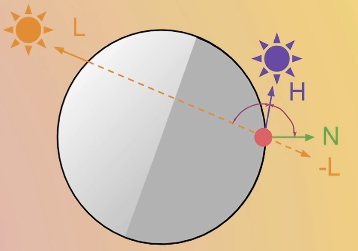
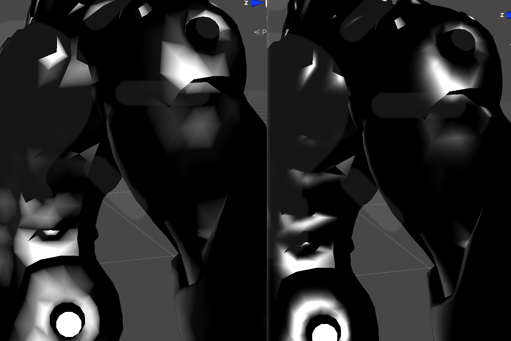
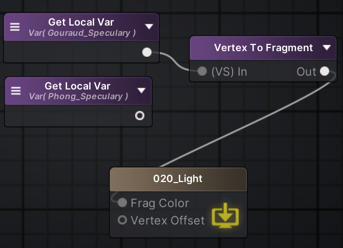

- [11\_Text\_顶点颜色 VertexColor](#11_text_顶点颜色-vertexcolor)
- [12\_Text\_顶点着色器顶点下移](#12_text_顶点着色器顶点下移)
- [13\_Text\_NVL\_Snow\_MipColR](#13_text_nvl_snow_mipcolr)
- [14\_Text\_溶解](#14_text_溶解)
- [15\_全息投影](#15_全息投影)
- [16\_Dither](#16_dither)
- [17\_PosProj](#17_posproj)
- [18\_组合全息投影和投影过程](#18_组合全息投影和投影过程)
- [19\_Glitch\_故障风格](#19_glitch_故障风格)
- [20\_LambertLight](#20_lambertlight)
	- [Lambert](#lambert)
	- [Half Lambert](#half-lambert)
	- [Half Lambert + Gradient + Gradient Sample](#half-lambert--gradient--gradient-sample)
	- [Wrap Lighting](#wrap-lighting)
	- [Banded Light](#banded-light)
	- [Cheap SSS Light](#cheap-sss-light)
		- [背光](#背光)
		- [扰动](#扰动)
		- [扩散](#扩散)
		- [厚度优化](#厚度优化)
	- [Phong 高光](#phong-高光)
	- [blinnphong 高光](#blinnphong-高光)
	- [Gouraud 高光 （Vertex Shader）](#gouraud-高光-vertex-shader)

# 11_Text_顶点颜色 VertexColor

此节点记录了顶点的颜色，有些模型其顶点自带颜色，无需额外的材质、shader 代码即可显示颜色，一般是手绘风。

不过有些颜色所处在的颜色空间可能有错，需要手动 power(2.2) 之类的操作

# 12_Text_顶点着色器顶点下移

```HLSL
V2FData vert ( MeshData v )
{
	V2FData o;
	o.worldPos = mul(unity_ObjectToWorld, v.vertex).xyz;
	float3 wp = o.worldPos;
	float4 col = tex2Dlod(_MainTex, float4(v.uv2, _Mip, _Mip));
	wp.y += col.r * (sin(_Time.y) - 1) * 0.2;
	// o.vertex = UnityObjectToClipPos(v.vertex);
	o.vertex = mul(UNITY_MATRIX_VP, float4(wp, 1));
	o.uv2 = v.uv2;
	return o;
}
```

# 13_Text_NVL_Snow_MipColR

```HLSL
float4 col = tex2Dlod(_MainTex, float4(i.uv2,_Mip, _Mip));
// float4 col1 = tex2Dlod(_MainTex1, float4(iuv2, _Mip, _Mip));
return lerp(col, float4(0.9,0.9,0.9,1), saturat(N.y));
```

# 14_Text_溶解

```HLSL

Shader "ASE_Unlit/14_ShaderText_Burn"
{
	Properties
	{
		_MainTex("MainTex", 2D) = "White" {}
		_NoiseTex("Noise", 2D) = "White" {}
		_NoiseScale("NoiseScale", float) = 0
		_Dissolve("Dissolve", range(-1, 1)) = 0
		_DissolveHDRWidth("DissolveHDRWidth", float) = 0
		_DissolveEmissionWidth("DissolveEmissionWidth", float) = 0
		[HDR]_DissolveHDRColor("DissolveHDRColor", color) = (1,1,1,1)
		_DissolveEmissionColor("DissolveEmissionColor", color) = (1,1,1,1)
		_DissolveCokePercent("DissolveCokePercent", float) = 0
		[HDR]_DissolveCokeColor("DissolveCokeColor", color) = (1,1,1,1)
	}
	
	SubShader
	{
		Tags { "RenderType"="Opaque" "Queue"="Geometry"}
		
		Pass
		{
			CGPROGRAM

			#pragma vertex vert
			#pragma fragment frag
			#pragma multi_compile_instancing
			#include "UnityCG.cginc"

			sampler2D _MainTex;
			sampler2D _NoiseTex;
			float _NoiseScale;
			float _Dissolve;
			float _DissolveHDRWidth;
			float _DissolveEmissionWidth;
			float4 _DissolveHDRColor;
			float4 _DissolveEmissionColor;
			float _DissolveCokePercent;
			float4 _DissolveCokeColor;


			struct MeshData
			{
				float4 vertex : POSITION;
				float4 color : COLOR;
				float2 uv : TEXCOORD0;
				float2 uv2: TEXCOORD1;
			};
			
			struct V2FData
			{
				float4 pos : SV_POSITION;
				float2 uv : TEXCOORD0;
				float2 uv2: TEXCOORD1;
				float3 worldPos : TEXCOORD2;
			};

			V2FData vert ( MeshData v )
			{
				V2FData o;
				o.uv = v.uv;
				o.uv2 = v.uv2;
				o.pos = UnityObjectToClipPos(v.vertex);
				o.worldPos = mul(unity_ObjectToWorld, v.vertex).xyz;
				return o;
			}
			
			float4 frag (V2FData i ) : SV_Target
			{
				float4 BaseMap = tex2D(_MainTex, i.uv2);
				
				float4 NoiseMap = tex2D(_NoiseTex, frac(i.uv2 * _NoiseScale));
				float test = i.uv.y - _Dissolve - NoiseMap.r;
				clip(test);

				if (test < _DissolveHDRWidth * saturate(_DissolveCokePercent))
				{
					return BaseMap * _DissolveCokeColor;
				}
				
				if (test < _DissolveHDRWidth)
				{
					return _DissolveHDRColor;
				}

				if (test < _DissolveEmissionWidth)
				{
					float lerpValue = smoothstep(_DissolveEmissionWidth, 0, test);
					return lerp(BaseMap, _DissolveEmissionColor, lerpValue);
				}

				return BaseMap;
			}
			ENDCG
		}
	}
	CustomEditor "ASEMaterialInspector"
}

```

UV_Y，从下到上，从 0 到 1，减去溶解进度（-1，1），减去噪音浮动（0，1），得到一个沿着 Y 轴进行的值。这个值小于零的部分被丢弃，一部分是燃烧的灰烬，一部分是燃烧的高光，一部分是燃烧的预热，剩余部分是原色。

# 15_全息投影

1. 透明材质
2. 菲涅尔边缘光
3. HSV 彩虹色自定义控制
4. Y 阶梯流光
5. 噪点散布
6. X 阶梯横移

# 16_Dither

制作不透明物体的透明效果，常用 8x8 算法。其原理是先对某一个点进行取模，除法得出 0 - 1 的图，然后配合 clip 丢弃阈值以下的像素。

优点：效率高于普通点的透明渲染（因为还是以普通不透明物体渲染的）
缺点：对应的深度图也被丢弃，会导致一些问题
用途：以绅士视角查看角色时进行不透明丢弃

# 17_PosProj

制作一个物体的投影过程效果，直接偏移到目标地点就可以

# 18_组合全息投影和投影过程

使用 smooth step 连贯动画显示

重点在于最后的裁剪，计算出缩到最小的距离，然后随着时间流动到 1，让距离减去 1.1 倍 时间 的距离，这样就会在临近缩到最小的时候被裁剪的越来越多。

# 19_Glitch_故障风格

# 20_LambertLight

N : world normal
L : world space light dir

注意这些向量需要归一化

## Lambert

计算两者点乘，结果可能为负数，saturate 一下。

## Half Lambert

Half-Lambert 半兰伯特 是对传统 Lambert 漫反射的一个 “改良版”。

主要目的是：让背光面不要完全变黑，看起来更柔和一点

在 Lambert 基础上，乘以 0.5 再加上 0.5。

## Half Lambert + Gradient + Gradient Sample

其实就是一个可控颜色带，可以自定义从 0 - 1 之间颜色的变化。

搭配上光照就可以制作不同光照角度下的颜色变化。可以用在各种颜色随着进度变化的效果上。

## Wrap Lighting

saturate((NL + Wrap)/(1 + Wrap))

Wrap Lighting（包裹光 / Wrap Light）其实就是在 Lambert 的基础上再“往背面多照一点”的一种改法，思路和 Half-Lambert 有点像，但更可控。

这里注意一点，这个公式其实都是经验模型，可以自己更改作为自己特色的光照模型的。

这里提一个小故事，在 PBR 光照渲染下想达成一个效果，但是收 PBR 下的光照模型计算影响，没法调得很好，可以直接将模型法线贴图替换为光照贴图，这样原本的光照模型就会失效，然后再将模型法线贴图作为参数自己计算光照。

其实这个 wrap 就像是 Lambert 和 Half Lambert 之间的调和剂，不过也可以超过1就是了。

## Banded Light

Banded Light（分段光 / 阶梯光）本质就是：把连续的光照（比如 Lambert）“量化成几档”。

动画的感觉有了

## Cheap SSS Light

Cheap SSS Light（廉价次表面散射光）就是一种 “假装有次表面散射” 的光照技巧，专门用来做：皮肤、耳朵、叶子那种 “透光发亮” 的感觉，让背光区域泛出一圈柔和的亮光，模拟光穿过物体。

但不做真正复杂的 SSS 计算（因为太贵，光线追踪）。真实的 SSS（Subsurface Scattering）是：光进入物体内部，在里面散射，再从别的地方出来。很贵（计算复杂），所以游戏里常用 “cheap fake”。

光打到物体后，往哪些方向“反射/透射/散射”。

- BRDF（双向反射分布函数 Bidirectional Reflectance Distribution Function）：光打到表面后，被“反射”到各个方向的分布。直觉理解：镜子、高光、粗糙表面的反光，都属于 BRDF。
-  BTDF（双向透射分布函数 Bidirectional Transmittance Distribution Function）：光穿过表面后，从另一侧出去的分布。也就是 “透射” 而不是反射。从下方穿出（折射、透光）。玻璃、透明塑料、水。
- BSSRDF（双向次表面散射分布函数 Bidirectional Subsurface Reflectance Distribution Function）：光进入物体内部，在里面“散射一段距离”，再从别的位置出来。皮肤，蜡烛，牛奶，玉石。看起来 “柔软、半透明、发光感” 的材质。
- BSDF（双向散射分布函数 Bidirectional Scattering Distribution Function）：BRDF + BTDF

- 次表面散射不是简单的半透明，因为它的透明位置不固定，会根据光线的变化而变化
- 次表面散射不是简单的透射，因为他除了直直的透射外，在出表面时还会改变方向产生类似于漫反射的透射。
- 游戏中的次表面散射不会使用光线追踪，这是为了性能的考量。

SSS = 背光 + 扰动 + 扩散

### 背光

相比于普通漫反射的 	N * L ， 背光的 N * -L 仅仅相当于从背面进行漫反射，这里我们进行 HACK，使用 V * -L 使得中间偏暗。

### 扰动

然而我们需要的 SSS 效果，需要根据物体不同位置的 N 的不同做出区别。



V * -（L + b * N）= V * -H

### 扩散

$saturate(V * -(L + b * N))^p * s$

类似高光的效果，集中度

### 厚度优化

美术烘焙一张厚度图，数值大的部分说明比较薄，也就是最后要乘上上面公式的数值比较大

$saturate(V * -(L + b * N))^p * s * thickness$

## Phong 高光

$(VR)^s*scale$

## blinnphong 高光

$(NH)^s*scale$

## Gouraud 高光 （Vertex Shader）



三角形感觉非常明显

