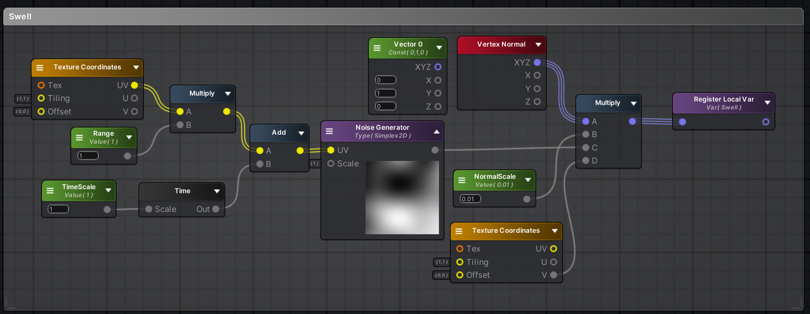
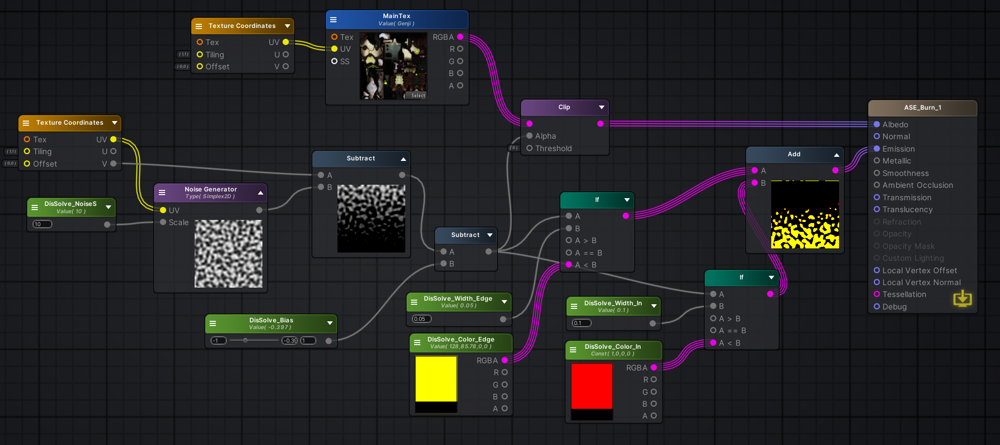
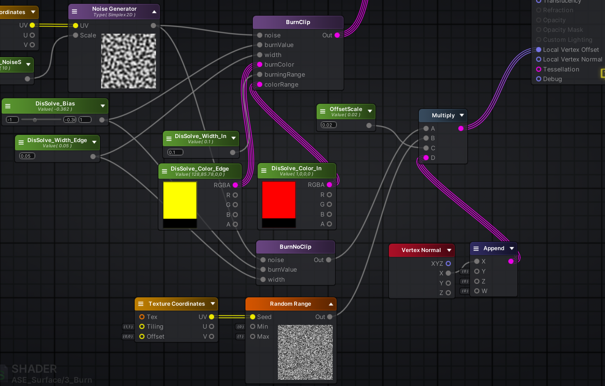

- [1\_Swell 风和膨胀](#1_swell-风和膨胀)
- [2\_DisSolve 消融](#2_dissolve-消融)
- [3\_Vertex Offset Burn](#3_vertex-offset-burn)

# 1_Swell 风和膨胀

使用 Vertex Normal 的话是沿着各个法线方向拉伸，算是膨胀或者收缩

使用 Vector Y = 1 的话，是沿着物体本地坐标的 Y 方向

# 2_DisSolve 消融

使用 Clip 和 噪声 丢弃低于一定数值的点

再配合上大下小的 UV 中的 V 和可滑动的数值达到从下到上的溶解

能生效还是因为这套 UV 就是对应着人的，如果你想使用 V 达到从里到外的效果，可以重新生成 UV，把心脏放到最下面，然后四周放在上面

# 3_Vertex Offset Burn

对本地法线量 X 进行噪音偏移，注意噪音 UV 使用对应的通道

不足之处是中间会有空洞