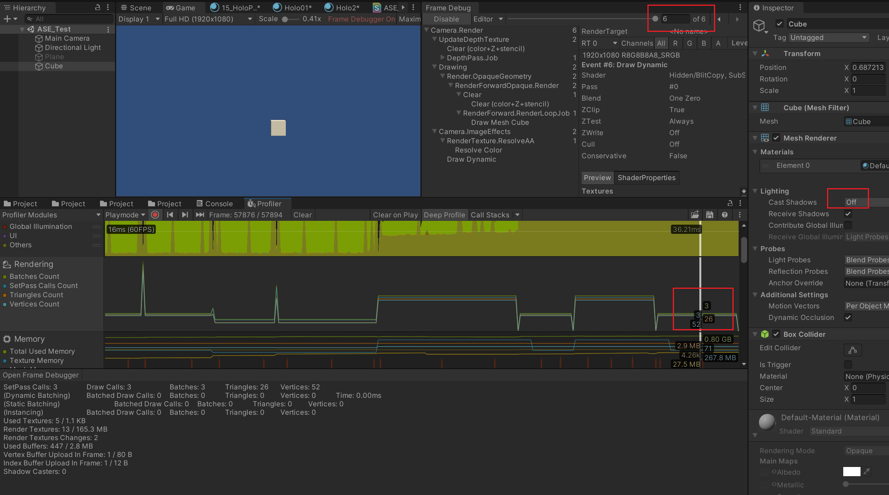
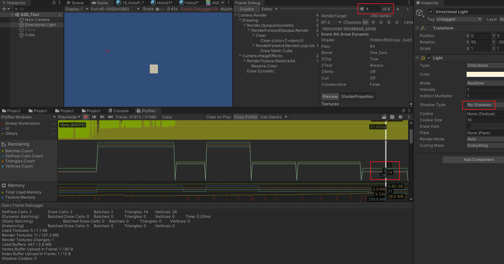
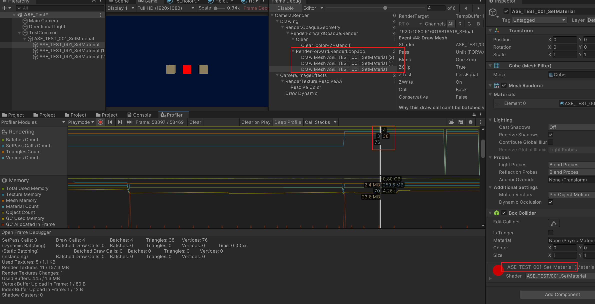

相机设置为固定颜色

加入一个 Cube 放在 0，0，0

发现渲染的三角形顶点都很多，这是因为阴影，让我们关闭一下 Cube 的投射阴影功能。（接受阴影设置不影响）

结果还是不尽如人意，发现是直射光投射软阴影依然会增加渲染步骤。

这下算是正常了，之后也可以多关注下光照影响之类的，现在分配一个不同的材质

发现 SetPass Calls 加了 1 个。两个都放上去当然也还是一样。

