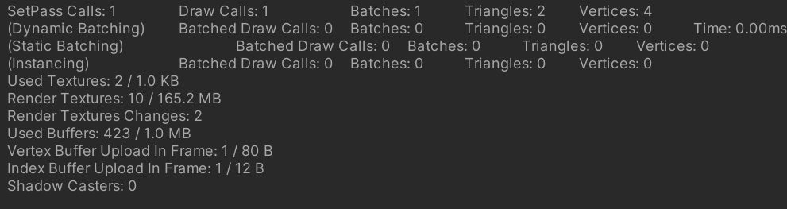
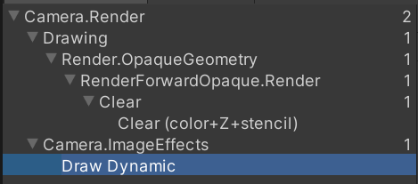
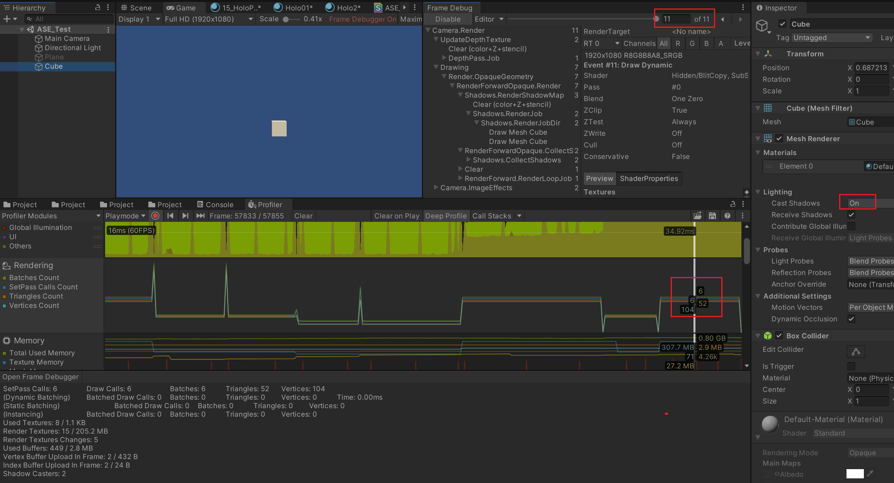
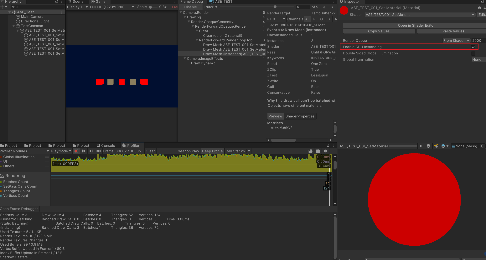
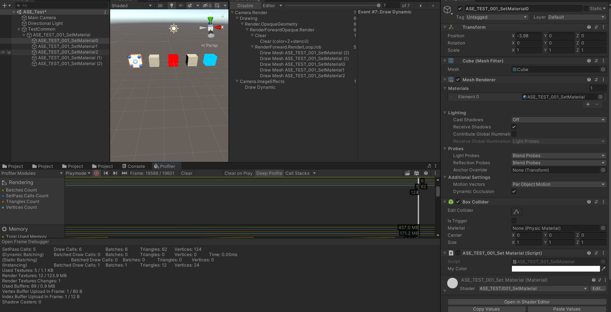
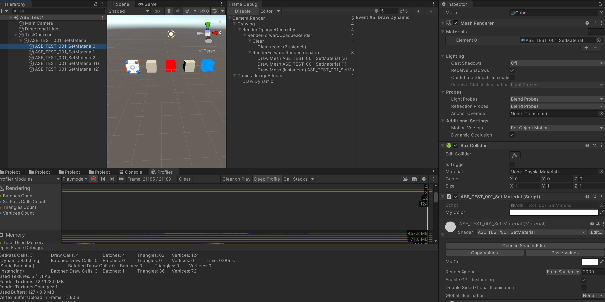

- [空场景](#空场景)
- [单个 Cube](#单个-cube)
- [增加一个材质](#增加一个材质)
- [三种材质或者单材质三表现](#三种材质或者单材质三表现)


# 空场景

相机设置为固定颜色，这里的两个三角形为全屏三角形。感觉是最后后处理 ImageEffect 那里使用的 Quad。因为这个 clear 看起来并没有 copy





# 单个 Cube

加入一个 Cube 放在 0，0，0



发现渲染的三角形顶点都很多，这是因为阴影，让我们关闭一下 Cube 的投射阴影功能。（接受阴影设置不影响）


结果还是不尽如人意，发现是直射光投射软阴影依然会增加渲染步骤。


这下算是正常了，多了 12 个三角形，24 个顶点。之后也可以多关注下光照影响之类的，现在分配一个不同的材质

# 增加一个材质


发现 SetPass Calls 加了 1 个。两个都放上去当然也还是一样。

开启材质的 GPU instancing 这样可以节省 drawcall 让三个物体只花费一个 drawcall。



注意哦，这和 shader 代码里到底怎么写是有关的。不然可能会出现好多物体共享一个位置的情况。

# 三种材质或者单材质三表现



需要显示三种不同颜色，使用了不同材质导致增加了 SP 和 DC，需要注意，即使这三个材质使用相同的颜色，因为材质已经不同了，所以 SP DC 还是会变多的。



而更改 shader 使用 mpb 分配，可以达到同样的批处理效果

```Cpp
using UnityEngine;

[ExecuteInEditMode]
public class ASE_TEST_001_SetMaterial : MonoBehaviour
{
    public Color MyColor;
    private MaterialPropertyBlock _mpb;

    private void Awake()
    {
        _mpb = new MaterialPropertyBlock();
    }

    void Start()
    {
        Renderer myRenderer = GetComponent<Renderer>();
        // myRenderer.material.SetColor("_MulCol", MyColor); 单纯这样更改还是会生成实例的，还是会增加 SP DC
        myRenderer.GetPropertyBlock(_mpb);
        _mpb.SetColor("_MulCol", MyColor);
        myRenderer.SetPropertyBlock(_mpb);
    }
}
```

```HLSL
Shader "ASE_TEST/001_SetMaterial"
{
    Properties
    {
        _MulCol("MulCol", color) = (1,1,1,1)
    }

    SubShader
    {
        Tags
        {
            "RenderType"="Opaque"
        }
        LOD 100

        CGINCLUDE
        #pragma target 3.0
        ENDCG
        Blend Off
        AlphaToMask Off
        Cull Back
        ColorMask RGBA
        ZWrite On
        ZTest LEqual
        Offset 0 , 0

        Pass
        {
            Name "Unlit"
            Tags
            {
                "LightMode"="ForwardBase"
            }
            CGPROGRAM
            #pragma vertex vert
            #pragma fragment frag
            #pragma multi_compile_instancing
            #include "UnityCG.cginc"

            UNITY_INSTANCING_BUFFER_START(InstancedProps)
            UNITY_DEFINE_INSTANCED_PROP(float4, _MulCol)
            UNITY_INSTANCING_BUFFER_END(InstancedProps)

            struct MeshData
            {
                float4 vertex : POSITION;
                float4 color : COLOR;
                float4 uv : TEXCOORD0;
                UNITY_VERTEX_INPUT_INSTANCE_ID
            };

            struct V2FData
            {
                float4 vertex : SV_POSITION;
                UNITY_VERTEX_INPUT_INSTANCE_ID
                UNITY_VERTEX_OUTPUT_STEREO
            };

            V2FData vert(MeshData v)
            {
                V2FData o;
                UNITY_SETUP_INSTANCE_ID(v);
                UNITY_INITIALIZE_VERTEX_OUTPUT_STEREO(o);
                UNITY_TRANSFER_INSTANCE_ID(v, o);

                o.vertex = UnityObjectToClipPos(v.vertex);
                return o;
            }

            float4 frag(V2FData i) : SV_Target
            {
                UNITY_SETUP_INSTANCE_ID(i);
                return UNITY_ACCESS_INSTANCED_PROP(InstancedProps, _MulCol);
            }
            ENDCG
        }
    }
    CustomEditor "ASEMaterialInspector"
}
```


