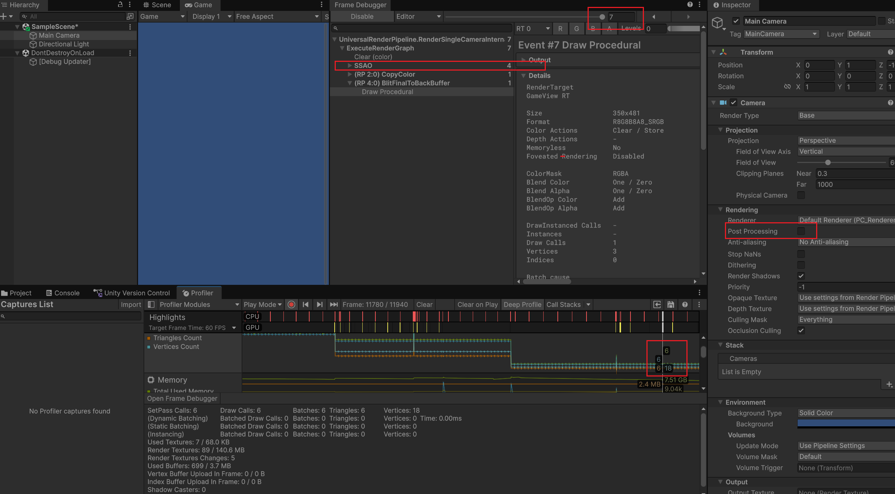
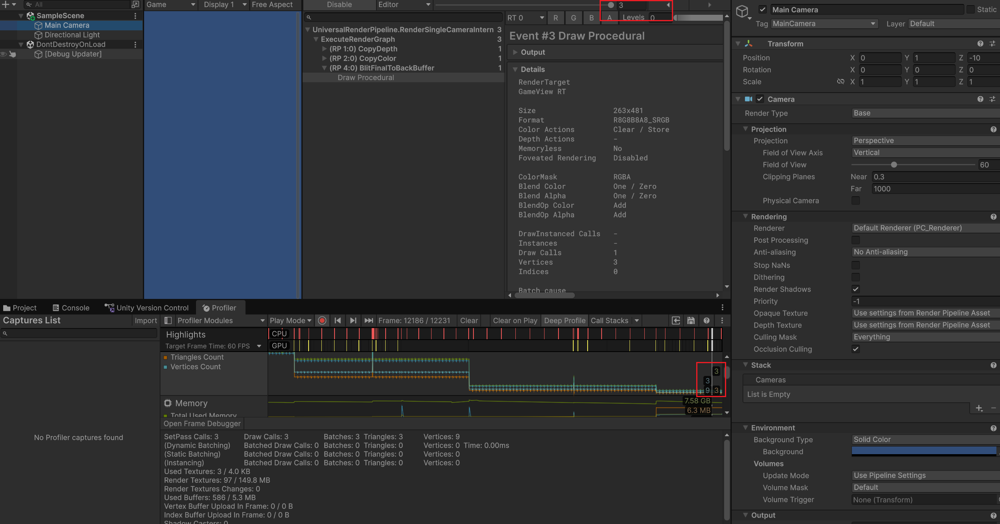
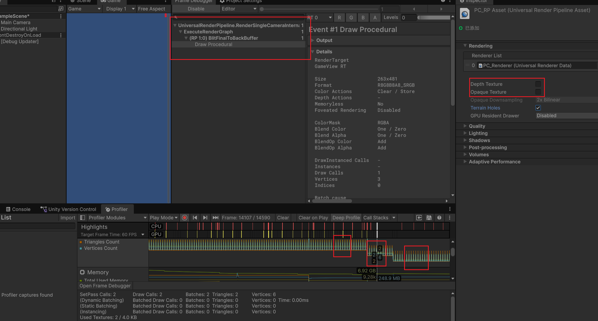
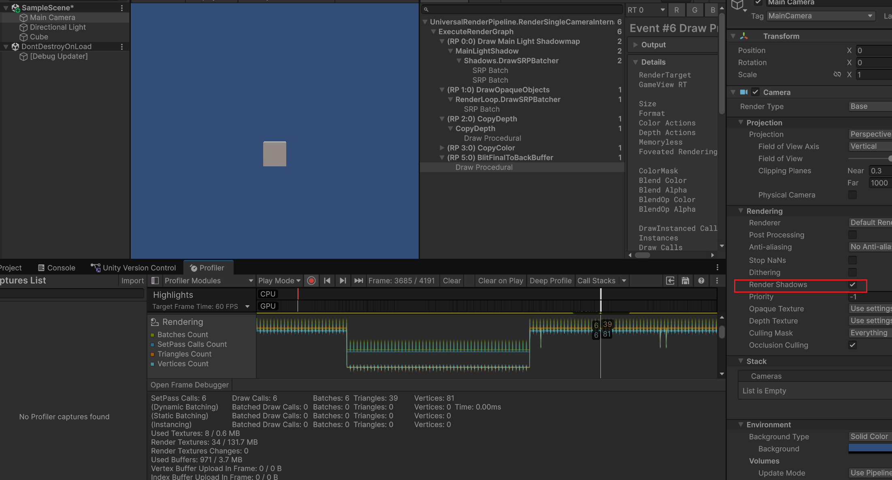
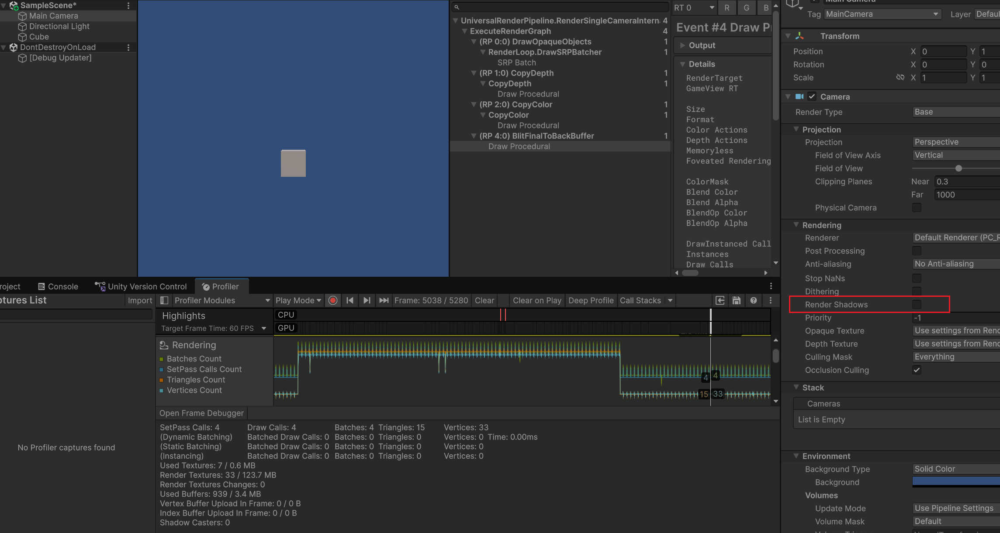

默认开启后处理，并且场景中有后处理 GO，将它们关闭后，DC 为 6，SetPass 为 6，三角形为 6，顶点数 18。

找到 ProjectSetting -> Graphic -> Asset （这里是 PC_Renderer） 关闭掉 SSAO Feature。DC 3，T 3，V 9。

可以知道的是 最后的 Blit 是会复制纹理的，顺便可以做一些 shader 对输出的图像做最后的改（本质上是用一个全屏三角形（或 quad）把纹理画到目标上）

但是会跳变，DC 4 T 4 V 13 看起来是时不时会多一个 quad

可以关掉 深度图 和 颜色图 这样这两个 copy 确实不见了

增加一个 cube 之后

关闭阴影之后，相比于空场景，多了一次 SP DC ，多了 12 个三角形，24 个顶点。

