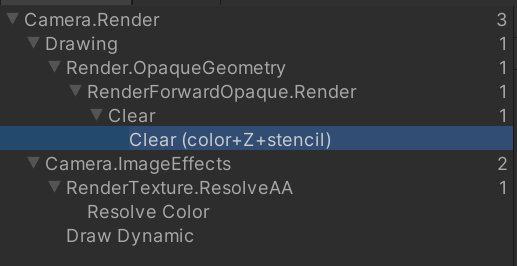
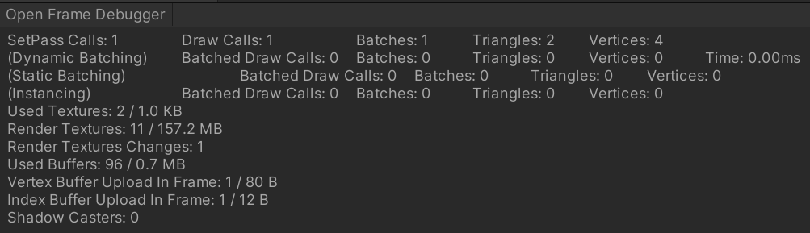

这是关闭了大多数后处理，阴影，Graph 设置为空的情况下的渲染流程。

- Clear 清除了 颜色、深度、模板 三个缓冲区（花费一个 Draw Call）
- Camera.ImageEffects 相机的后处理阶段
  - RenderTexture.ResolveAA（处理抗锯齿（MSAA resolve））如果相机设置关闭了这个就不会有这条
- Draw Dynamic 绘制**动态批处理**的物体

