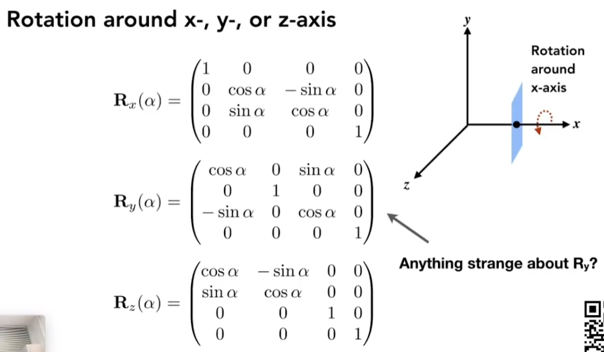
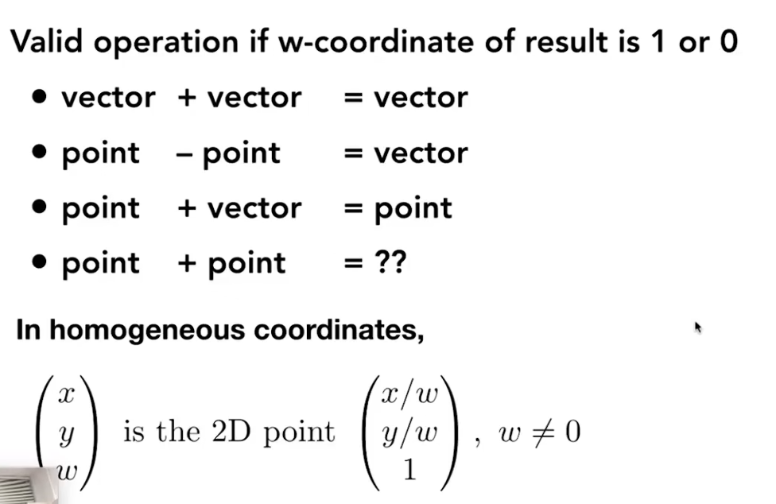
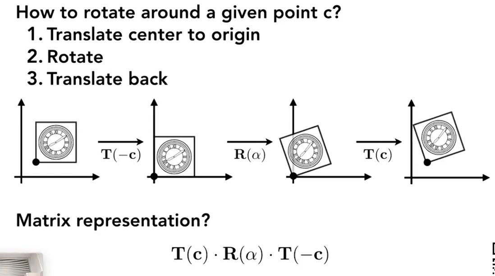
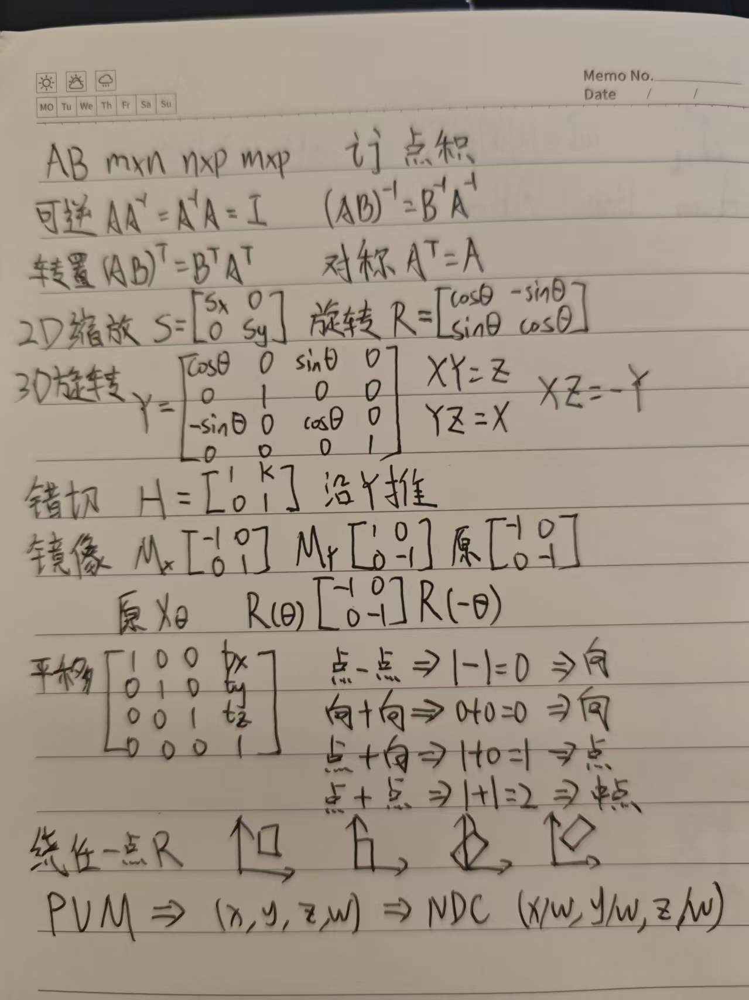

- [一、矩阵相乘（Matrix Multiplication）](#一矩阵相乘matrix-multiplication)
  - [1) 维度规则](#1-维度规则)
  - [2) 计算公式](#2-计算公式)
  - [3) 直观理解（线性变换的复合）](#3-直观理解线性变换的复合)
  - [4) 小例子](#4-小例子)
- [二、矩阵的常见性质（重点）](#二矩阵的常见性质重点)
  - [1) 乘法相关](#1-乘法相关)
  - [2) 可逆与逆矩阵](#2-可逆与逆矩阵)
  - [3) 转置与对称](#3-转置与对称)
  - [4) 行列式与秩（常用判断）](#4-行列式与秩常用判断)
  - [5) 特征值/特征向量（图形学也常见）](#5-特征值特征向量图形学也常见)
- [三、矩阵的图形学应用（核心场景）](#三矩阵的图形学应用核心场景)
  - [1) 2D/3D 变换：旋转、缩放、错切、镜像](#1-2d3d-变换旋转缩放错切镜像)
  - [2) 平移：齐次坐标（Homogeneous Coordinates）：用 4×4 一把梭](#2-平移齐次坐标homogeneous-coordinates用-44-一把梭)
    - [向量相加得到向量](#向量相加得到向量)
    - [点相减得到向量](#点相减得到向量)
    - [点加向量等于点](#点加向量等于点)
    - [点加点等于中点](#点加点等于中点)
  - [其他变换](#其他变换)
  - [3) 变换的顺序](#3-变换的顺序)
    - [变换的拆解妙用](#变换的拆解妙用)
    - [渲染管线变换链](#渲染管线变换链)
  - [4) 法线变换（Normal Matrix）](#4-法线变换normal-matrix)
  - [5) 骨骼动画（Skinning）](#5-骨骼动画skinning)
  - [6) 纹理映射与 UV 变换](#6-纹理映射与-uv-变换)
  - [7) 相机与姿态表示](#7-相机与姿态表示)
- [四、点乘叉乘的矩阵形式表达](#四点乘叉乘的矩阵形式表达)
  - [点乘（dot product）](#点乘dot-product)
  - [叉乘（cross product，3D）](#叉乘cross-product3d)
    - [(1) 反对称矩阵（“叉乘矩阵”）表示](#1-反对称矩阵叉乘矩阵表示)
    - [(2) 行列式形式（等价写法）](#2-行列式形式等价写法)
- [思维路线图](#思维路线图)

# 一、矩阵相乘（Matrix Multiplication）

## 1) 维度规则

若 \(A\in\mathbb{R}^{m\times n}\)，\(B\in\mathbb{R}^{n\times p}\)，则
\[
AB\in\mathbb{R}^{m\times p}
\]
中间维度必须相同：\(n\) 对 \(n\)。

## 2) 计算公式

\[
(AB)_{ij}=\sum_{k=1}^{n}A_{ik}B_{kj}
\]
含义：**第 \(i\) 行**与**第 \(j\) 列**做点积。

## 3) 直观理解（线性变换的复合）

把矩阵看成线性变换：先做 \(B\)，再做 \(A\)：
\[
ABx = A(Bx)
\]
所以矩阵乘法的顺序对应“变换执行顺序”，**从右往左应用**。

## 4) 小例子

\[
A=\begin{bmatrix}1&2\\3&4\end{bmatrix},\;
B=\begin{bmatrix}5&6\\7&8\end{bmatrix}
\Rightarrow
AB=\begin{bmatrix}
1\cdot5+2\cdot7 & 1\cdot6+2\cdot8\\
3\cdot5+4\cdot7 & 3\cdot6+4\cdot8
\end{bmatrix}
=\begin{bmatrix}19&22\\43&50\end{bmatrix}
\]

---

# 二、矩阵的常见性质（重点）

## 1) 乘法相关

- **一般不交换**：\(AB\neq BA\)
- **结合律成立**：\((AB)C=A(BC)\)
- **分配律成立**：\(A(B+C)=AB+AC\)
- **单位矩阵**：\(AI=IA=A\)
- **零矩阵**：\(A0=0\)，但 \(AB=0\) 不必然推出 \(A=0\) 或 \(B=0\)

## 2) 可逆与逆矩阵

- 若存在 \(A^{-1}\) 使 \(AA^{-1}=A^{-1}A=I\)，则 \(A\) **可逆**
- \((AB)^{-1}=B^{-1}A^{-1}\)（顺序反过来）

## 3) 转置与对称

- \((AB)^T=B^TA^T\)
- \(A^T=A\)：对称矩阵（常见于二次型、协方差、惯性张量等）

## 4) 行列式与秩（常用判断）

- \(\det(AB)=\det(A)\det(B)\)
- \(\det(A)\neq 0 \iff A\) 可逆（方阵情形）
- \(\mathrm{rank}(AB)\le \min(\mathrm{rank}(A),\mathrm{rank}(B))\)

## 5) 特征值/特征向量（图形学也常见）

\[
Av=\lambda v
\]
- 表示 \(v\) 方向被拉伸 \(\lambda\) 倍（或翻转）
- PCA、形变分析、惯性主轴、曲率相关处理中会用到

---

# 三、矩阵的图形学应用（核心场景）

## 1) 2D/3D 变换：旋转、缩放、错切、镜像

- **缩放**（2D）：

\[
S=\begin{bmatrix}s_x&0\\0&s_y\end{bmatrix}
\]
- **旋转**（2D）：

\[
R(\theta)=\begin{bmatrix}\cos\theta&-\sin\theta\\\sin\theta&\cos\theta\end{bmatrix}
\]

- **反过来旋转**（2D）：

\[
R(-\theta)=\begin{bmatrix}\cos\theta&\sin\theta\\-\sin\theta&\cos\theta\end{bmatrix}
\]

这两个矩阵互为转置矩阵，并且！其实正旋转和反旋转其实就是矩阵求逆！所以这个矩阵的转置和矩阵的逆相同，它是正交矩阵！

- **三维绕轴旋转**

以 xyz 三个轴来说

\[
X  Y = Z      \\       
Y  Z = X      \\     
X  Z = -Y     \\
\]

所以绕 Y 轴旋转的矩阵表现出来是转置的状态

- **三维任意旋转** 

罗德里格斯旋转公式就是总结了绕任意过原点的轴旋转的公式

题外话：旋转矩阵相加的平均并不代表旋转的平均，矩阵做不到这件事情，四元数可以做到。

- **错切**（2D）：

\[
H=\begin{bmatrix}1&k\\0&1\end{bmatrix}
\]

- **镜像 / 反射**（2D）：

  - 关于 **x 轴** 镜像（上下翻转）：
\[
M_x=\begin{bmatrix}1&0\\0&-1\end{bmatrix}
\]
  - 关于 **y 轴** 镜像（左右翻转）：
\[
M_y=\begin{bmatrix}-1&0\\0&1\end{bmatrix}
\]
  - 关于 **原点** 镜像（等价于旋转 \(\pi\)）：
\[
M_o=\begin{bmatrix}-1&0\\0&-1\end{bmatrix}
\]
  - 关于过原点、与 x 轴夹角为 \(\theta\) 的直线镜像：
\[
M(\theta)=R(\theta)\begin{bmatrix}1&0\\0&-1\end{bmatrix}R(-\theta)
\]

- **镜像 / 反射**（3D，示例）：

  - 关于 **YZ 平面** 镜像（x 取反）：
\[
M_{yz}=\begin{bmatrix}-1&0&0\\0&1&0\\0&0&1\end{bmatrix}
\]
  - 关于 **XZ 平面** 镜像（y 取反）：
\[
M_{xz}=\begin{bmatrix}1&0&0\\0&-1&0\\0&0&1\end{bmatrix}
\]
  - 关于 **XY 平面** 镜像（z 取反）：
\[
M_{xy}=\begin{bmatrix}1&0&0\\0&1&0\\0&0&-1\end{bmatrix}
\]

## 2) 平移：齐次坐标（Homogeneous Coordinates）：用 4×4 一把梭

图形学里需要“线性变换 + 平移”。平移不是纯线性，ax + by 无法满足平移需求（平移是在后面加了一个常量）

所以引入齐次坐标：
- 3D 点 \((x,y,z)\) 写成 \((x,y,z,1)\)
- 方向/向量写成 \((x,y,z,0)\)（不受平移影响）

**平移矩阵**：
\[
T=\begin{bmatrix}
1&0&0&t_x\\
0&1&0&t_y\\
0&0&1&t_z\\
0&0&0&1
\end{bmatrix}
\]

这种变换叫做仿射变换。

齐次坐标居然还是有意义的

### 向量相加得到向量

在空间里面，不管是二维还是三维啊，一个向量加上另一个向量，三角形法则，首尾相接得到一个新的向量。

比如 A 向量 x1 y1 0，B 向量 x2 y2 0，那么加起来之后就是 x1 + x2，然后 y1 加 y2， 0 + 0 = 0，也就是说它还是一个向量，成立

### 点相减得到向量

，A 点，减去空间中 B 点，相减之后正好会出现 x1 - x2，y1 - y2，最后一个维度 1 - 1 = 0，点减点是等于一个向量a

### 点加向量等于点

一个点加上一个向量，即一个点沿着一个向量移动移动到了一个新的点上，最后一位 1 + 0 = 1

### 点加点等于中点

点加一个点没什么意义，但人们也扩充了它的定义：我们在描述一个二维的点时，使用 XYW，但只有 xy 是有意义的，这个 w 是我们加上的一个东西，那么如果我们认为任何的 x y w 作为一个二维的点，它表示的点其实都是什么呢，其实都是 x 除以 w ，y 除以 w，然后一除，那这样的话就等于是对于任何的w，只要w不是零对吧，w如果是零，那这个x y w就是一个向量了，就不再是这样，那x y w在w不等于零的情况下，可以把 x y w 都除以 w，那么这样的话第三个维度就自然而然变成 1 了，于是现在表示的就是一个点了，那表示什么点呢，就是 x y w 表示的点就是 x 除以 w 和y 除以 w 这么一个二维的点，也就是 xy 中点。

## 其他变换

逆变换：其实就是矩阵求逆。

## 3) 变换的顺序

从右到左，矩阵是不满足交换律的。（这里其实要注意变换是绕着原点的）

### 变换的拆解妙用

如果我们要围绕着一个点进行旋转，怎么办？

先把要旋转的图像，跟这旋转点移动到此旋转点和原点重合，其实就是平移操作。

然后围绕这个点的旋转其实就是围绕原点的旋转了，此时就可以进行旋转操作了

结束旋转之后，在平移回去。

### 渲染管线变换链

渲染管线核心就是矩阵连乘：
\[
p_{\text{clip}} = P\,V\,M\,p_{\text{model}}
\]
- \(M\)：模型变换（物体摆放：缩放/旋转/平移）
- \(V\)：视图变换（相机坐标系）
- \(P\)：投影变换（透视/正交）
- 再做齐次除法得到 NDC：\((x,y,z,w)\mapsto (x/w,y/w,z/w)\)

## 4) 法线变换（Normal Matrix）

当模型有**非等比缩放**时，法线不能直接用 \(M\) 乘：
\[
n' \propto (M^{-1})^{T}n
\]
实际常用其 3×3 部分：\(N=(M_{3\times3}^{-1})^T\)。

## 5) 骨骼动画（Skinning）

顶点受多根骨骼影响，常见线性混合：
\[
v'=\sum_i w_i (B_i\,v)
\]
其中 \(B_i\) 是骨骼矩阵（包含姿态、绑定姿势逆等），\(w_i\) 权重和为 1。

## 6) 纹理映射与 UV 变换

纹理滚动、缩放、旋转常用 3×3（2D 齐次）矩阵作用于 \((u,v,1)\)。

## 7) 相机与姿态表示

- 用旋转矩阵 \(R\) 表示朝向：\(R\in SO(3)\)，满足 \(R^TR=I\)，\(\det(R)=1\)
- 与四元数常互转；渲染最终仍常落到矩阵乘法

# 四、点乘叉乘的矩阵形式表达

## 点乘（dot product）

设 \(a,b\in\mathbb{R}^n\) 为列向量：
\[
a=\begin{bmatrix}a_1\\ \vdots\\ a_n\end{bmatrix},\quad
b=\begin{bmatrix}b_1\\ \vdots\\ b_n\end{bmatrix}
\]

**矩阵形式：**
\[
a\cdot b = a^\mathsf{T} b \quad (= b^\mathsf{T}a)
\]

也常写成用单位阵表示的双线性形式：
\[
a\cdot b = a^\mathsf{T} I b
\]

---

## 叉乘（cross product，3D）

设 \(a,b\in\mathbb{R}^3\)，
\[
a=\begin{bmatrix}a_1\\a_2\\a_3\end{bmatrix},\quad
b=\begin{bmatrix}b_1\\b_2\\b_3\end{bmatrix}
\]

### (1) 反对称矩阵（“叉乘矩阵”）表示

定义 \(a\) 的叉乘矩阵（也记作 \([a]_\times\) 或 \(\hat a\)）：
\[
[a]_\times=
\begin{bmatrix}
0&-a_3&a_2\\
a_3&0&-a_1\\
-a_2&a_1&0
\end{bmatrix}
\]

则有**矩阵形式：**
\[
a\times b = [a]_\times\, b
\]
同理也可以写成
\[
a\times b = -[b]_\times\, a
\]

### (2) 行列式形式（等价写法）

\[
a\times b=
\begin{vmatrix}
\mathbf{i}&\mathbf{j}&\mathbf{k}\\
a_1&a_2&a_3\\
b_1&b_2&b_3
\end{vmatrix}
\]

# 思维路线图

- 矩阵是什么，计算规则
- 矩阵转置运算，矩阵逆运算
- 矩阵的图形转换 缩放 旋转 切变 线性变换
- 发现平移不是线性变换，因为懒，引入齐次坐标
- 齐次坐标居然是符合空间意义的
- 变换的顺序很重要，发散思路逆向拆解，可以实现绕任意点旋转
- 逆变换，旋转是正交矩阵！

