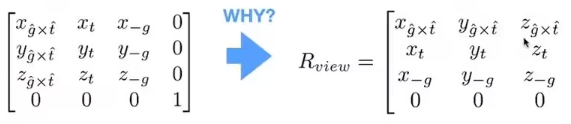
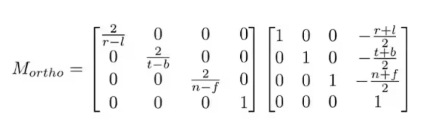
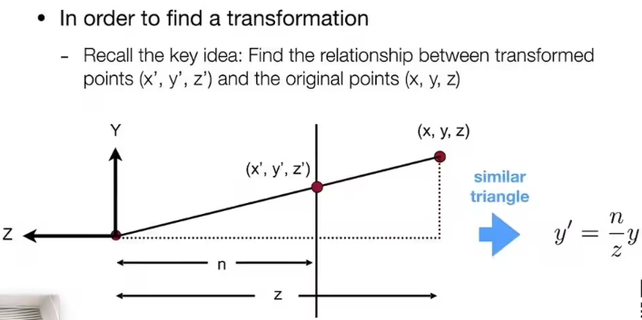
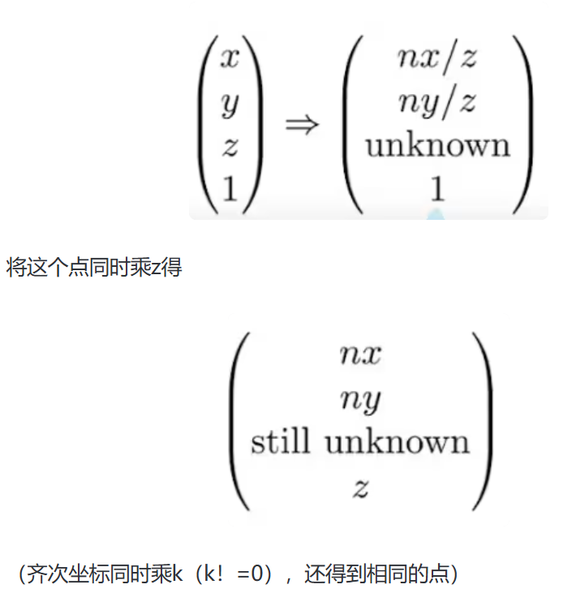
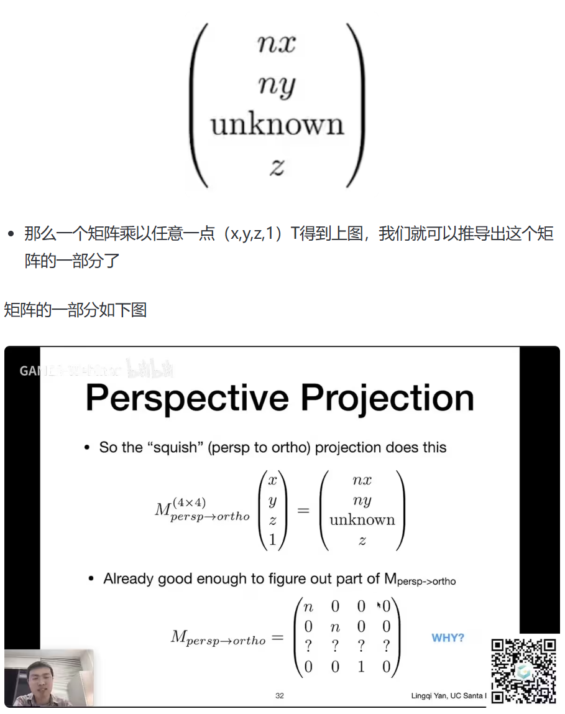

# MVP 变换

整体分三步：把模型摆好，把相机摆好，拍照。

Model transformation

View transformation

Projection transformation

# View 摆放

- 决定相机的位置
- 决定相机看向的方向
- 决定相机头朝上的方向

规定相机永远在（0，0，0），Y 是向上，往 -Z 方向看，简化流程。

变化的永远是其他物体

## 怎么做到？

- 平移摄像机至（0，0，0）
- 将相机lookat的方向旋转到-z
- 旋转相机头朝上的方向到Y

## 对应的矩阵变换

- 平移好说：Tview

- 旋转各个轴（对应上面 2 和 3 步）：将相机的三个向量旋转到轴上，比较难写，所以我们先求将 XYZ 轴旋转到任意向量的矩阵，之后将该矩阵求逆，即可得到任意向量旋转到轴的矩阵 Rview

Rview x Tview = Mview

Mview 即为视图变换，将 Mview 应用到相机，相机归零，同时也需要将 Mview 应用到其他所有物体，让物体和相机的相对位置保持不变，所以这两个也经常放在一起。

# 投影类型

投影分为正交投影和透视投影。

# 正交投影

## 简单操作

将模型的 Z 轴舍弃，得到物体在 xy 上的投影。把得到的图像平移并且缩放到 -1 1 中，方便之后的计算

## 标准操作

对于正交投影来说，视口是个 [l,r] [b,t] [f,n]的长方体,想让他变成 [-1,1]³ 中的话只需要

先将立方体的中心平移到原点；在将立方体缩放到 [-1,1]³ 中

- 找到中点

- 将边长缩放到长度 2 （此时物体肯定会被拉伸，在之后的视口操作中会恢复拉伸）

总体投影矩阵如下

# 透视投影

先将 Frustum 远平面及远平面到近平面之间的所有平面挤压到近平面大小

变成 Cuboid 的样子，然后做一次正交投影

- 近平面的点不会发生变化

An+B=n²
- 远平面的点 z 的值不会发生变化：选一远平面上的点 x=0，y=0，即中间点（0，0，f,1）T，经矩阵变化后还是中间点（0,0,f,1）T，同时乘f后得（0，0，f²，f）T。即（0，0，A，B）(0，0，f,1）T=（0，0，f²，f）T
Af+B=f²

对于中间的点，它的 z 经过挤压之后，他会动，会向远平面移动

# 结果

所有物体都已经在 -1 1 的 3 次方里面。