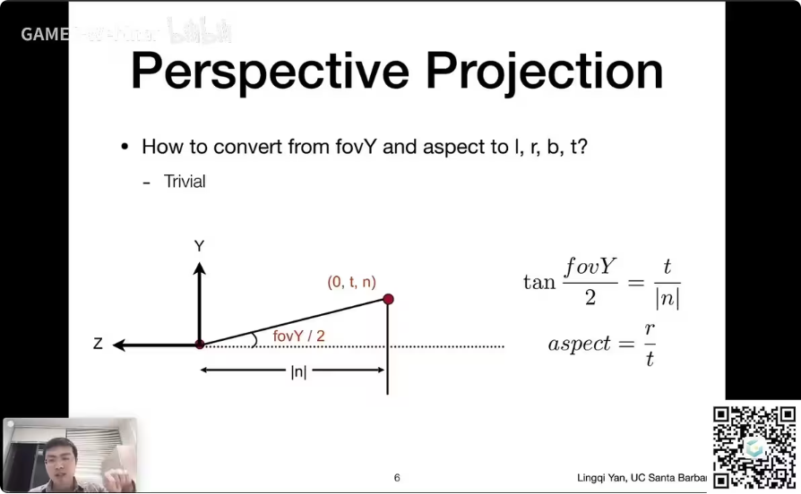
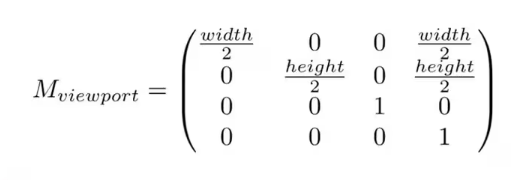
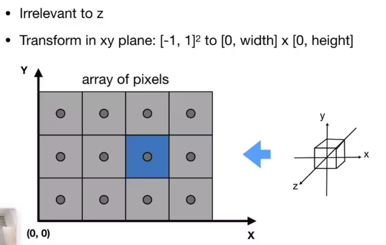
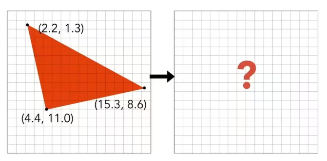
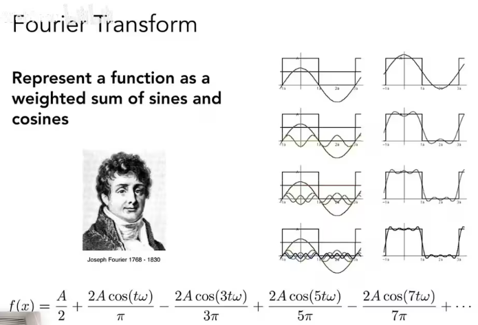
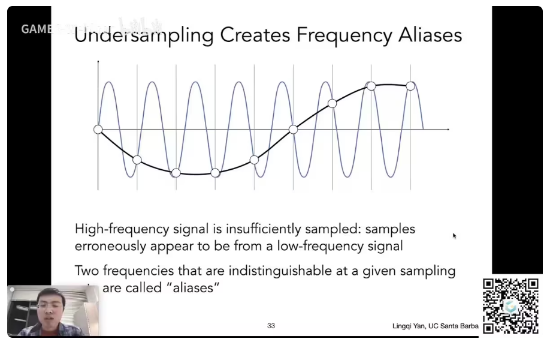
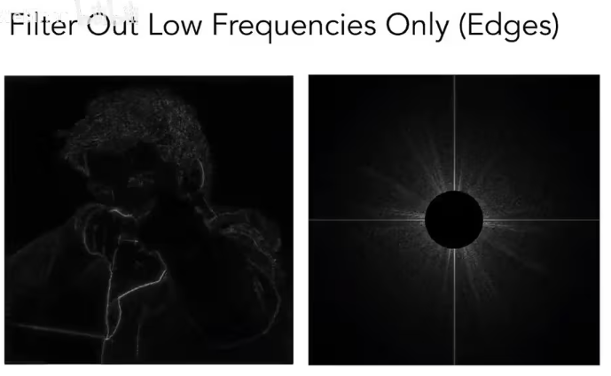
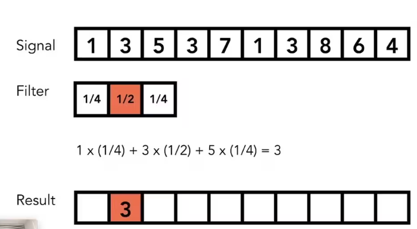

- [光栅化在干嘛](#光栅化在干嘛)
- [定义视锥](#定义视锥)
- [名词释义](#名词释义)
- [视口变换](#视口变换)
- [隔行扫描](#隔行扫描)
- [如何将三角形转化为一个一个的像素？（显示还是不显示，插值多少？）](#如何将三角形转化为一个一个的像素显示还是不显示插值多少)
  - [每行检测](#每行检测)
- [采样产生的问题](#采样产生的问题)
- [反走样处理方法：采样前模糊](#反走样处理方法采样前模糊)
- [傅里叶级数展开](#傅里叶级数展开)
- [走样](#走样)
- [滤波](#滤波)
  - [高通滤波](#高通滤波)
  - [低通滤波](#低通滤波)
  - [去除高频和低频，只留一部分](#去除高频和低频只留一部分)
- [卷积](#卷积)
  - [卷积的一些定理](#卷积的一些定理)
  - [卷积图大小和结果的频率关系](#卷积图大小和结果的频率关系)
- [采样和走样](#采样和走样)
- [反走样](#反走样)

# 光栅化在干嘛

所有物体都处在了[-1，1]³的立方体之后，接下来就要把他画在屏幕上，这一步就叫做光栅化。

# 定义视锥

宽高比 Aspect ratio

可视角度 FOV （垂直角度和水平角度可以互相转换）

# 名词释义

什么是屏幕：微观上是一个数组像素，宏观上是一个光栅成像设备。

数组的大小：分辨率

Raster：德语中的屏幕的意思

Rasterive：在屏幕上画

像素：picture element 的缩写。像素是最小单位，每个像素由RBG构成（其实是不对的，但是抽象这么理解，可以的）

# 视口变换

如何将[-1,1]³中的东西显示到屏幕上呢？

暂时忽略z

如果只将[-1,1]²中的东西显示到[0,width] x [0,height]，那么就很简单了

做个缩放并平移就可以，这个变换就被称为视口变换

# 隔行扫描

以前的显示设备要成像，都是在屏幕上画很多线，画满整个屏幕就形成了一帧画面

隔行扫描就是说

在第一帧只画1、3、5等奇数线

在第二帧只画2、4、6等偶数线

利用人眼的视觉残留特性，这样人们即发现不了画面的异常，还能使机器工作量减半

如今还有某些视频压缩技术采用了这个思想

（但是隔行扫描会造成严重的画面撕裂，特别是对高速运动的画面来说）

# 如何将三角形转化为一个一个的像素？（显示还是不显示，插值多少？）

给定一个连续的函数f（x），当x等于1时得到的f（1）就是1的采样

所以采样就是把一个函数离散化的过程

我们要采样的东西就是：给定一个三角形，在像素的中心进行采样，来判断中心是否落在三角形内，逐像素遍历，判断该像素中心是否在三角形内部，输出到屏幕显示

但是遍历所有像素开销太大，如下图中白色那一列的像素根本没有碰到三角形，所以只要遍历蓝色区域就可以了。我们知道三角形三个顶点的坐标，有了Xmin，Ymin，Xmax，Ymax就可以得到蓝色的区域。蓝色区域就叫做包围盒（轴向包围盒/BoundingBox/AABB）

## 每行检测

相比于简单的 AABB 每行检测会耗费更多资源，但是对于细长三角形，这部分消耗会变的值得。

# 采样产生的问题

- 走样
- 摩尔纹
- 车轮效应

原因就是信号的变化太快了，以至于采样的速度跟不上

# 反走样处理方法：采样前模糊

不能先采样再模糊！只能先模糊在采样

# 傅里叶级数展开

任何一个周期性的函数都可以变成一系列正弦/余弦的线性组合和一个常数项

采样的频率跟不上信号变化的频率

# 走样

我们对蓝色函数进行采样，得到黑色的函数

但假如原本就有这样一个黑色的函数

我们同时对蓝色和黑色进行采样，两个截然不同的函数，得到的采样结果完全相同

这就被称为走样（Aliases）

# 滤波

滤波就是抹掉一些特定的频率，对应的信号如何发生变化，傅里叶变换可以把一个函数从时域变到频域

右边的图像就是左边的照片通过傅里叶变换得到的，右边图像表示的就是有多少信息，中间部分是低频信息，越往外越高频

十字线意味着图片边界循环突变频率，一般的图像边界循环时都会表现地突变，所以会有白色的十字线。

## 高通滤波

在频域空间内完全抹掉低频信号，将结果还原成图像，形成左图。高频的东西在图像上表示的就是图像的边界

为什么高频信息代表着边界？

当某一图像的周围突然发生发生了变化，我们就认为他是边界。比如图中人物的衣服和背景就是由黑色突然变成了灰色。相当于颜色信号突然从黑色变成了灰色，就是出现了高频的变化，即边界。

## 低通滤波

## 去除高频和低频，只留一部分

# 卷积

移动窗口（Filter），将窗口中三个数和覆盖信号的三个数做点乘，填到结果中

其实就是信号在任意一个地方，在他的周围做了个平均操作

## 卷积的一些定理

时域的卷积 == 频域的乘积

可以拿到一幅图直接用一个卷积滤波器进行卷积操作

也可以

1. 先傅里叶变换这幅图，将这幅图变到频域
2. 将卷积滤波器变到频域上
3. 将两者相乘，乘完后得到的频域的结果，将其逆傅里叶变换，变到域上

## 卷积图大小和结果的频率关系

比如咱们用一个超级大的box, 用一个比这个比这个图像还要大的这个box, 那得出来结果, 那各处基本都一样, 因为因为把这个所有的这个图像上的这个像素都给加起来了

或者说我们再想一个极端, 如果我用一个超级小的box, 如果这个这个box比一个像素还小, 那不等于是这个完全没有做滤波吗, 对吧, 那也就意味着说, 如果用一个超级小的这个box, 那么它对应的频率上面的范围就会超级大, 他把所有的频率都留了下来.

所以我用一个大的这个box, 我就只能留下更低的频率, 也就是说让, 结果变得更模糊。

# 采样和走样

左边一列是时域，右边一列是频域。

对a图像进行c的采样，得到e。对应的操作在频域中就是bdf

时域的采样在频域中就就体现为频域信号的复制

（这里老师说左边时域进行乘积=右边频域的卷积，和前文说的不一致，我去查了一下，好像两种说法是相互的，都可以，这里不太懂，但是不影响整体的理解）

为什么会产生走样呢？

采样不同的间隔，会引起频谱不同间隔进行复制，所相交的部分就是走样

# 反走样

